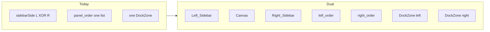
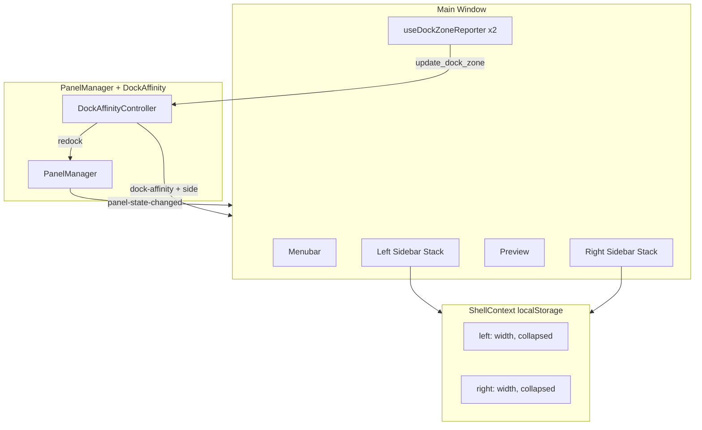
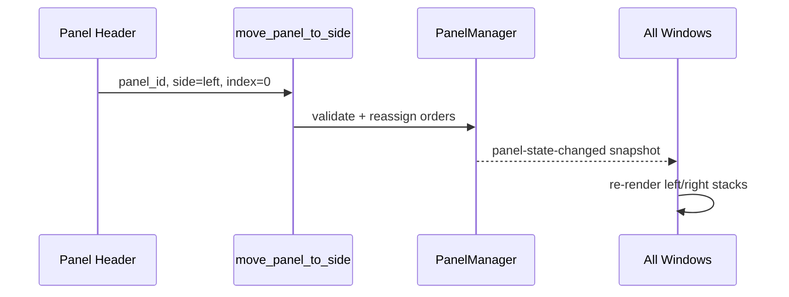
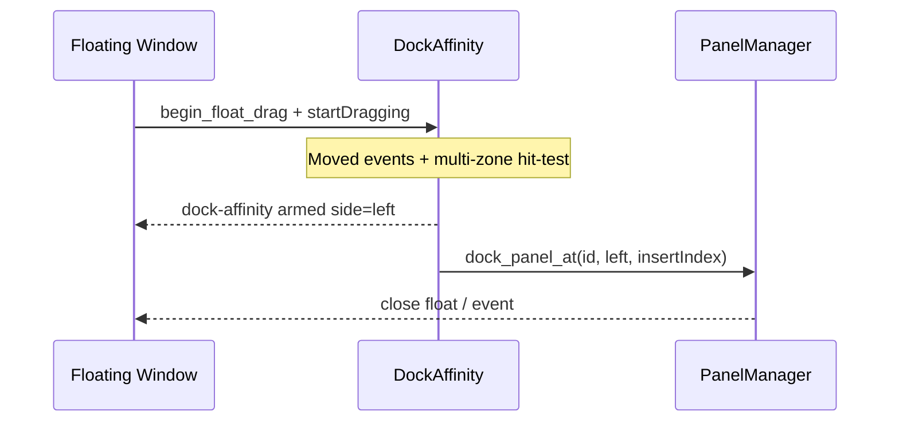

# Design: Dual Sidebars

## Overview

Расширяем single exclusive sidebar (`sidebarSide: left | right`) до **двух независимых dock-колонок**. Rust `PanelManager` остаётся SoT для принадлежности панелей к стороне и порядка; ShellContext хранит только геометрию UI (ширина / collapsed) на каждую сторону. Dock affinity получает две зоны.

Ключевой принцип: **сторона — свойство панели (и side-order), не глобальный layout switch**. Кнопка «кинуть все панели на другую сторону» уходит.

---

## Goals / Non-Goals

| Goals | Non-Goals |
|-------|-----------|
| Left + right одновременно | Top/bottom docks, canvas docking |
| **Single-stack:** все dockable панели в одном sidebar (L или R) | Обязательный dual layout |
| Per-panel `dock_side` + `left_order` / `right_order` | Named workspaces |
| Dual width/collapse в Shell | Перенос shell prefs в Rust |
| Dual Dock_Zone affinity | Отказ от `startDragging()` |
| Persist v2 + миграция v1 / shell | Переписывание floating WebViews |
| Bulk “Move all to left/right” | — |

---

## Current → Target



Default first-run (no legacy):

| Panel | dock_side |
|-------|-----------|
| layers | left |
| effect | right |
| colorlab | right |

Legacy single-sidebar: все docked панели → сторона из старого `sidebarSide`, порядок сохраняется; вторая сторона пустая.

---

## Architecture



### Ownership split (unchanged philosophy)

| Concern | Owner |
|---------|--------|
| docked / visible / bounds / dock_side / side orders | Rust PanelManager |
| left/right width & collapsed | ShellContext |
| floating WebView lifecycle | panel_commands + Tauri |
| affinity hit-test session | dock_affinity.rs |

---

## Data Model

### PanelInfo (Rust + TS)

```rust
pub struct PanelInfo {
    pub id: PanelId,
    pub docked: bool,
    pub visible: bool,
    pub window_label: Option<String>,
    pub saved_bounds: Option<SavedBounds>,
    pub dock_side: Option<DockSide>, // Some(Left|Right) iff docked && !floating_only
}

pub enum DockSide { Left, Right }
```

Invariants:
- `docked == false` ⇒ `dock_side == None`
- `docked == true` && not floating-only ⇒ `dock_side == Some(_)`
- floating-only ⇒ never in side orders; `dock_side` always `None`

### PanelManager

```rust
pub struct PanelManager {
    panels: HashMap<PanelId, PanelInfo>,
    left_order: Vec<String>,   // dockable IDs on left (subset)
    right_order: Vec<String>,  // dockable IDs on right (subset)
}
```

Validation on every mutation:
- `left_order` ∩ `right_order` = ∅
- either order **may be empty** (all docked panels on one side = single-stack; valid)
- every id in orders is known dockable and has matching `dock_side`
- every docked+dockable panel appears in exactly one order
- floating / hidden-but-docked: **keep** id in its side order (hide does not remove from order — matches Req 10.5)

> Hidden docked panels stay in side order so show restores place; UI filters `visible` when rendering.

### Snapshot event

```ts
interface PanelStateSnapshot {
  panels: PanelInfo[];       // includes dock_side
  left_order: PanelId[];
  right_order: PanelId[];
}
```

Deprecate `panel_order`. During one transitional commit, emitters may also send `panel_order: [...left, ...right]` if any stray listener remains — remove before merge if greppable.

### Shell prefs

```ts
interface PersistedShellPrefs {
  version?: 2;
  leftSidebar: { width: number; collapsed: boolean };
  rightSidebar: { width: number; collapsed: boolean };
  effectPanelRatio: number; // keep; per-side ratios later if needed
  autoExtractPalettes: boolean;
  // removed: sidebarSide, sidebarWidth, sidebarCollapsed
}
```

Migration from v1 shell:
```
side = old.sidebarSide ?? 'right'
prefs[side] = { width: old.sidebarWidth, collapsed: old.sidebarCollapsed }
prefs[other] = { width: 332, collapsed: false }
```

---

## IPC

| Command | Change |
|---------|--------|
| `get_panels_state` | Return full snapshot `{ panels, left_order, right_order }` (breaking but all callers in-repo) |
| `dock_panel` | Dock to `panel.last_dock_side` or default `right` at end |
| `dock_panel_at` | → `dock_panel_at { panel_id, side, insert_index }` |
| `move_panel_to_side` | **New** — docked→docked side change |
| `move_all_panels_to_side` | **New** — bulk single-stack: all currently docked dockable panels → one side (stable order); floating unchanged |
| `reorder_panels` | → `reorder_sidebar { side, order }` (only IDs on that side, permutation of that side’s dockable set including hidden-docked) |
| `undock_*` / `hide` / `show` | Clear/set side per invariants; hide keeps side+order |
| `update_dock_zone` | Accept `side` + geometry/slots **or** replace with `update_dock_zones(Vec<DockZone>)` |
| `begin_float_drag` / `cancel_float_drag` | Unchanged session API; hit-test multi-zone |

### Affinity event

```ts
{ panelId: string; armed: boolean; insertIndex: number; side: 'left' | 'right' }
```

---

## Persistence

### `panel_state.json` v2

```json
{
  "version": 2,
  "panels": [
    {
      "id": "layers",
      "docked": true,
      "visible": true,
      "window_label": null,
      "saved_bounds": null,
      "dock_side": "left"
    }
  ],
  "left_order": ["layers"],
  "right_order": ["effect", "colorlab"]
}
```

Load path:
1. Parse JSON; if version == 1 → migrate panels (assign all docked to shell’s migrated side or `right`), build one side order from old in-memory default order / panel array order; other side empty; missing `dock_side` filled.
2. If version == 2 → validate orders + sides; on failure → default dual layout.
3. Always ensure known panels exist.

Also fix latent bug: **persist orders** (v1 never wrote `panel_order`).

---

## Frontend layout

### Grid

```
menubar | menubar | menubar
left    | canvas  | right
```

`gridTemplateColumns`:
- both open: `${leftW}px 1fr ${rightW}px`
- only left: `${leftW}px 1fr`
- only right: `1fr ${rightW}px`
- none: `1fr`

Where `effectiveW(side) = empty ? 0 : collapsed ? 40 : width`.

### Components

Prefer extracting presentational `DockedSidebar` used twice:

```tsx
<DockedSidebar
  side="left"
  panelIds={leftVisibleOrdered}
  width={...}
  collapsed={...}
  sidebarRef={leftRef}
  onResize={...}
  affinity={affinity?.side === 'left' ? affinity : null}
/>
```

`AppLayout` owns dual refs, dual reporters, dual resize handlers, maps `DockedPanelContent` by id.

### Panel header

Add overflow / button: **Move to left sidebar** / **Move to right sidebar** (disabled if already on that side). Calls `move_panel_to_side`.

### Toolbar / Preferences

- Replace exclusive side-toggle with **Move all panels to left / right** (restores the old “everything on one side” workflow as an intentional single-stack action, not a global `sidebarSide` flag).
- Preferences: drop “Panels side” select; optional same bulk actions + “Reset sidebar widths”.

### Bulk move order algorithm

```
target = chosen side
keep = current target_order (including hidden docked)
append = opposite_order (stable)
new_target_order = keep ++ append
opposite_order = []
for each id in new_target_order: dock_side = target
```

Floating panels are not touched.

### Drag reorder / undock

`usePanelDrag(sidebarRef, side)`:
- reorder updates only that side’s order via `reorder_sidebar`
- undock threshold: cursor outside **that** sidebar’s outer edge (left sidebar → past left; right → past right) **or** past inner edge toward canvas by existing px threshold — keep current “leave the stack” feel, scoped per ref

Cross-sidebar drag (docked left → right without float): **MVP+**. Spec allows; implement after basic move command if time. Design hook: when drag mode would undock toward canvas and cursor enters opposite Dock_Zone, call `move_panel_to_side` instead of float — only if pointer never left main window. Defer if risky with current mouse capture.

---

## Dock affinity

```rust
pub struct DockZone {
    pub side: DockSide,
    pub x: f64, pub y: f64,
    pub width: f64, pub height: f64,
    pub scale_factor: f64,
    pub slots: Vec<DockSlot>, // mid_y for insert index
}

// Controller holds HashMap<DockSide, DockZone> or Vec<DockZone>
```

Empty side: Main window still reports a **edge strip** (~24–40px) along that screen edge of the canvas area (or window) so first redock works. UI may show thin highlight when armed.

Hit-test: if cursor in multiple zones (shouldn’t happen), prefer higher overlap area; hysteresis from current armed side.

Redock path reuses `dock_panel_at(side, insert_index)` then close float window.

---

## Sequence: move between sides



## Sequence: float redock to left



---

## Testing strategy

**Rust unit**
- invariants: dock/undock/move/reorder/hide
- migration v1 → v2
- `move_to_dock_insert_index` per side
- affinity: arm correct side among two zones

**Frontend**
- AppLayout columns for L-only / R-only / both / none
- shell prefs migration
- panelsSlice snapshot apply
- DockedSidebar move action calls IPC

**Manual**
- Layers left + Effect/ColorLab right
- collapse one side only
- redock float to empty left edge
- restart restores sides + widths

---

## Risks / Open questions

| Risk | Mitigation |
|------|------------|
| Breaking `get_panels_state` shape | Update all in-repo callers in same PR |
| `effectPanelRatio` still unused / single | Keep global for now; per-side later |
| Cross-sidebar drag vs undock ambiguity | Ship explicit Move first; drag cross-side as MVP+ |
| Empty-side affinity zone vs resize chrome | Use dedicated edge strip, not 0-width column hit area |
| Two collapsed strips eat canvas | Accept 40+40; or auto-hide strip when empty (already width 0) |

**Product default:** Layers left / inspectors right — matches pro image editors; document in release notes.

---

## File touch list (expected)

| Area | Files |
|------|--------|
| Rust model | `panel_manager.rs`, `panel_persistence.rs`, `panel_commands.rs`, `dock_affinity.rs`, `main.rs` |
| TS types / IPC | `types/panels.ts`, `shared/ipc/panels.ts`, `events.ts` |
| State | `panelsSlice.ts`, `ShellContext.tsx` |
| UI | `AppLayout.tsx`, new `DockedSidebar.tsx`, panel headers, `PreferencesPanel.tsx`, drag/zone hooks |
| Tests | Rust unit + frontend layout/slice tests |
