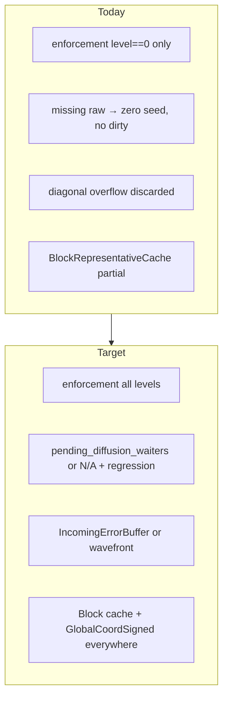
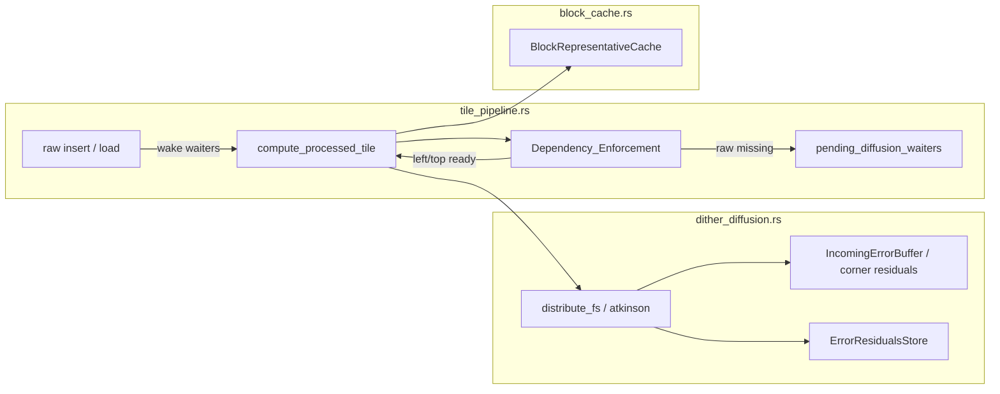
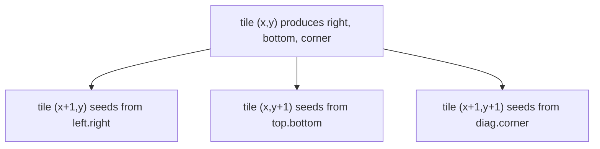

# Design: Track A — Correctness Debt

## Overview

Доводим DitherV2 error diffusion и `pixel_size` blocking до контракта «бесшовно на всех levels / всех ps», опираясь на уже существующие примитивы. Три подпроблемы A1 независимы по механизму, но делят acceptance matrix; A2 параллелен A1 по файлам (`block_cache` / ordered) vs (`tile_pipeline` / `distribute_*`).

Источник приоритета: [tech-debit.md](../tech-debit.md) трек A; детали silent-skip — [TASK_global_coords.md](../../TASK_global_coords.md).

---

## Goals / Non-Goals

| Goals | Non-Goals |
|-------|-----------|
| Закрыть silent-skip или N/A+тест | Phase 1 filters (C) |
| Enforcement на всех pyramid levels | GPU / WGSL (D) |
| Диагональная ошибка не теряется | PaletteLut3D (B1) |
| Полная seam matrix Bayer×FS×ps | Integer zoom (B2) |
| Block reps без halo-clamp | UI redesign |

---

## Current → Target



| Area | Today (code) | Target |
|------|----------------|--------|
| Enforcement | `has_error_diffusion && level == 0` | all levels |
| Missing raw | skip recursion silently | waiters → dirty, or N/A |
| `distribute_fs` corner | drop | capture + seed diagonal neighbor |
| Block reps | struct + populate exists | wire + matrix green for all ps |
| FS coords | mostly `GlobalCoordSigned` | no residual manual HALO math for blocks |

---

## Architecture



### Ownership

| Concern | Owner |
|---------|--------|
| left/top order, waiters, level gate | `src-tauri/src/tile_pipeline.rs` + AppState |
| right/bottom/diagonal residuals | `dither_residuals.rs` + `dither_diffusion.rs` |
| block raw/dithered samples | `engine-tiles` `block_cache.rs` |
| global coords | `engine-tiles` `coords.rs` (consume only) |

---

## A1.1 Diagnosis protocol

Before coding waiters:

1. Add `AtomicU64` (or tracing counter) next to both `get_entry(left_raw_key).is_some()` / top branches when the `else` path is taken.
2. Manual matrix:
   - **Full load then dither**: open doc, wait 1:1 settle, toggle DitherV2 FS → note seam + counter.
   - **Pan under dither**: pan across unloaded region → note counter growth + whether seam clears after settle.
3. Decision:
   - counter > 0 and sticky seam → implement Req 2.
   - counter == 0 always, seam remains → diagonal (A1.3) is primary; close waiters as N/A with contract test.
   - Prior diagnosis already suggested level-0 raw rarely evicts — re-confirm; do not skip Step 1.

---

## A1.2 Pending waiters

```rust
// AppState / pipeline state alongside ErrorResidualsStore
pending_diffusion_waiters: DashMap<TileKey /* missing raw */, Vec<TileKey /* processed waiters */>>,
```

**Register** (else branch of raw-present check):

```text
waiters.entry(missing_raw_key).or_default().push(current_processed_key);
// continue with zero seed this pass
```

**Wake** (after successful raw insert into tile_cache — same site that today completes Raw stage):

```text
if let Some(list) = waiters.remove(&loaded_raw_key) {
  for processed_key in list {
    mark_dirty(processed_key); // existing invalidate path
    schedule if in viewport
  }
}
```

**Idempotency:** duplicate register OK; wake may recompute while other neighbor still missing — second wake fixes. Prefer reusing `invalidate` / dirty flags over a bespoke “partial seed” state machine.

**N/A path:** extract `register_waiter` / `wake_waiters` as pure helpers + unit tests; production call sites omitted or behind `debug_assert` until counter proves need — document in PR.

---

## A1.3 All pyramid levels

Change:

```rust
// before
if has_error_diffusion && key.coord.level == 0 {

// after
if has_error_diffusion {
```

`TileCoord` already carries `level`; `ErrorResidualsStore` already keys by full coord. Verify:

- left/top coords copy `level` (already true in pipeline snippet);
- pyramid raw existence checks use same level;
- no code assumes residuals only for level 0.

Update `TILE_PIPELINE.md` §4.2 accordingly.

---

## A1.4 Diagonal error — chosen model: IncomingErrorBuffer

**Why not only wavefront:** workers already dequeue by viewport priority; a global diagonal scheduler fights Immediate/Center buckets. On-demand left/top recursion already approximates row-major. The remaining hole is **geometric**: FS weight `(+1,+1)` at the bottom-right pixel of tile `(tx,ty)` lands outside both `right` (needs `ny < SIZE`) and `bottom` (needs `nx < SIZE`) → dropped.

**Model:**

Extend residuals (names indicative):

```rust
pub struct ErrorResiduals {
    pub right: Vec<f32>,   // existing: TILE_SIZE × 2 × 3
    pub bottom: Vec<f32>,  // existing: 2 × TILE_SIZE × 3
    /// Error that belongs to the top-left corner region of tile (tx+1, ty+1).
    /// Size: small fixed patch, e.g. 2×2×3 (FS) or enough for Atkinson reach.
    pub corner: Vec<f32>,
}
```

**Produce** in `distribute_fs` / `distribute_atkinson` when `nx >= SIZE && ny >= SIZE` (and Atkinson equivalents for `dx,dy` that land past both edges): accumulate into `corner` with correct local offsets into the neighbor’s core.

**Consume** when seeding tile `(tx,ty)`:

1. `get_left` → seed left columns (existing).
2. `get_top` → seed top rows (existing).
3. `get_diag` from `(tx-1, ty-1)` → add `corner` into the top-left of `error_buf`.



**Dependency:** on-demand recursion today ensures left and top. For diagonal seed correctness, `(tx-1,ty-1)` must have been processed before `(tx,ty)` when corner matters. Options:

1. **Also recurse diagonal neighbor** when `x>0 && y>0` (cheap; mirrors left/top).
2. Rely on left→which recurses its top, etc. — fragile under partial cache.

**Prefer (1):** extend enforcement to ensure processed `(x-1,y-1)` when diffusion is on (and raw exists / waiters). This is a light wavefront without global reordering.

**Alternative (full wavefront):** if IncomingErrorBuffer proves awkward for Atkinson’s longer kernel, fall back to scheduling constraint `priority_key = (x+y, y, x)` inside diffusion layers only — document as Plan B in implementation notes; do not implement both.

**Atkinson:** same corner buffer sized for max kernel reach past both edges (up to 2 px) — generalize `corner` to `max_dx × max_dy` patch or widen right/bottom strips and define overlap policy; design default: dedicated corner patch ≥ 2×2.

**Tests:** full-image FS vs tiled 2×2 on gradient; seam matrix; luminance mean on boundary column vs interior.

---

## A2. Block representatives

### Already present

- `BlockRepresentativeCache` in `engine-tiles/src/block_cache.rs`
- Wired in AppState / `tile_pipeline` lazy `ensure_populated_from_tiles`
- Diffusion/ordered already take `&BlockRepresentativeCache`

### Gaps to close

1. **Seam matrix green for all ps** — fix remaining FS/Bayer failures (non–power-of-two, straddle blocks).
2. **FS coord hygiene** — any remaining `tile_x + HALO` for block origin → `GlobalCoordSigned::…aligned(ps)`.
3. **Dithered side-channel** — when representative is outside current core, copy from `get_dithered` / ensure producer `insert_dithered`.
4. **Invalidation** — filter change: `clear_dithered` + residuals clear; image change: `invalidate_all` with decompose.

### Population contract

```text
pixel_size > 1:
  ensure_populated(layer, ps) before first apply in that session
  raw[BlockCoord] = document pixel at (block_x*ps, block_y*ps)
  never sample via clamped local halo for the representative color
```

---

## File touch list

| Area | Files |
|------|--------|
| Diagnosis / waiters / levels | `src-tauri/src/tile_pipeline.rs`, AppState in `commands.rs` / `main.rs` |
| Residuals + diagonal | `crates/engine-project/src/filters/dither_residuals.rs`, `dither_diffusion.rs` |
| Blocks / coords | `crates/engine-tiles/src/block_cache.rs`, `coords.rs` (consume), `dither_ordered.rs` |
| Apply wiring | `filters/apply.rs` |
| Tests | `dither_seam_matrix.rs`, new waiter/diag tests, level>0 seam, full-vs-tiled diffusion |
| Docs | `TILE_PIPELINE.md`, optionally `ARCHITECTURE.md`, mark A in `tech-debit.md` when done |

---

## Testing strategy

| Layer | What |
|-------|------|
| Diagnosis | Counter + written repro notes |
| Unit | waiters register/wake; corner seed math; `GlobalCoordSigned` block align |
| Matrix | `dither_seam_matrix` all ps × Bayer/FS |
| Level | FS/Atkinson seam at `level >= 1` |
| Reference | small canvas single-buffer FS vs 2×2 tiles |
| Props | existing determinism / palette / alpha / validation stay green |
| Manual | 1:1 seam after full load; zoom out seams; pan sticky seam |

---

## Risks

| Risk | Mitigation |
|------|------------|
| Waiters unreachable → wasted code | Req 1 gate; N/A + contract test |
| Corner buffer size wrong for Atkinson | Size from max kernel; property test energy conservation on tile corner |
| Diagonal recurse increases latency | Only when `requires_full_row`; cache hits short-circuit |
| Extending `ErrorResiduals` breaks serde/tests | Struct is runtime-only DashMap value — update constructors/tests |
| Float tolerance flaky on gradient | Keep `1e-4`; document if reference needs slightly looser bound |
| Parallel A1/A2 merge conflicts in apply.rs | Land A2 coord/block first or keep diffs separated by file |

---

## Parallelism

```text
A1.1 diagnosis          ──┐
A2 block/matrix         ──┼── can overlap (different owners)
A1.3 all levels         ──┤  (small, do early)
A1.2 waiters (if needed)──┤  after A1.1
A1.4 diagonal buffer    ──┘  largest; after or beside A1.3
Acceptance A1+A2        ── final green matrix + docs
```
