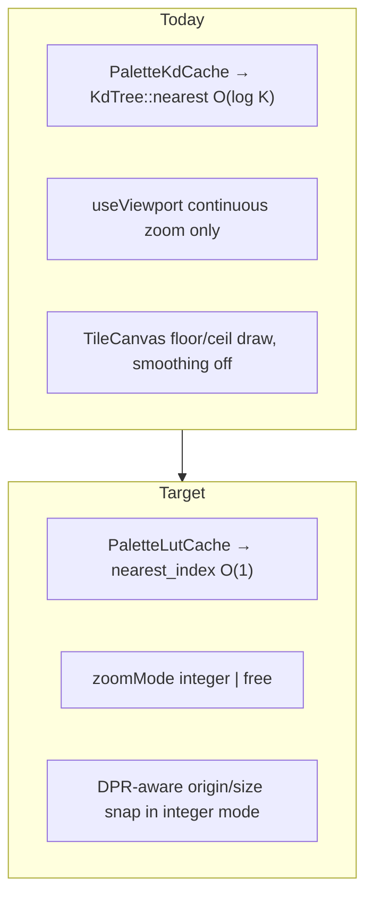
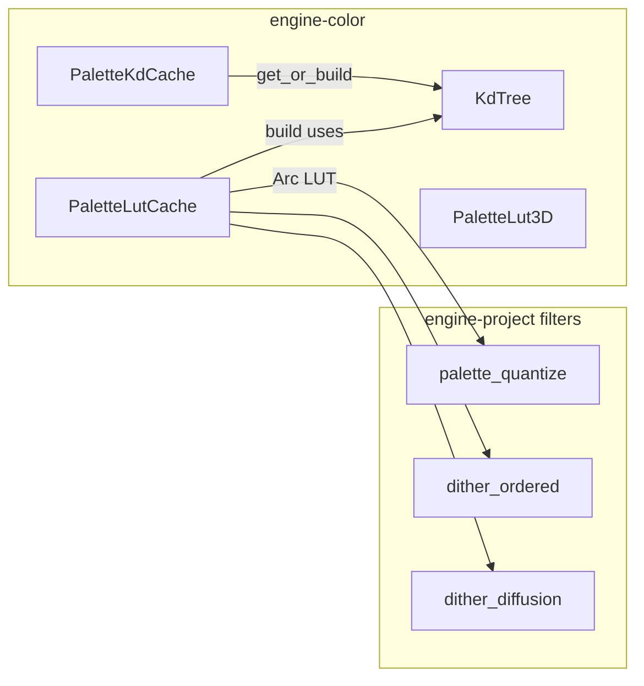
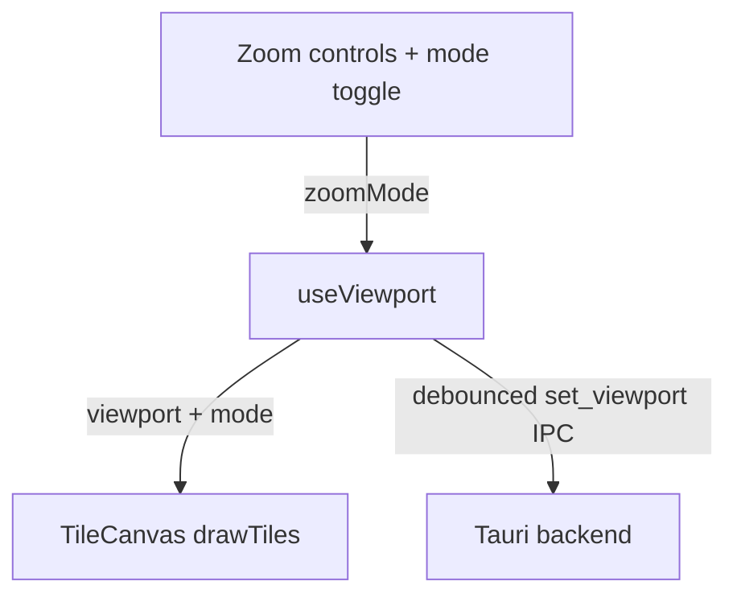

# Design: Track B — Independent Infrastructure

## Overview

Два независимых deliverable из [tech-debit.md](../tech-debit.md):

1. **B1 — PaletteLut3D**: precompute nearest-palette index on a regular Oklab grid; hot path becomes array index math.
2. **B2 — Integer zoom & snap**: frontend-only viewport mode + DPR-aware Canvas2D placement.

Они не шарят код и могут идти разными людьми параллельно с треком A.

---

## Goals / Non-Goals

| Goals | Non-Goals |
|-------|-----------|
| O(1) LUT nearest in palette hot paths | Delete KdTree |
| Same revision invalidation as KD cache | GPU / WGSL LUT |
| Measured 32³ vs 64³ default | Pyramid level re-enable |
| Integer snap on gesture end + UI toggle | Visual CI harness |
| DPR snap on Canvas2D | WebGL renderer |

---

## Current → Target



| Area | Today | Target |
|------|--------|--------|
| Nearest color | KD every pixel | LUT every pixel; KD at build |
| Cache | `PaletteKdCache` only | + `PaletteLutCache` (same revision key) |
| Zoom | free exponential | free + optional integer snap |
| Draw | `imageSmoothingEnabled = false`, `floor`/`ceil` | + DPR formula in integer mode |
| Render API | Canvas2D | unchanged |

---

## B1 Architecture



### PaletteLut3D

```rust
pub struct PaletteLut3D {
    grid: Vec<u16>, // length size^3, row-major L,a,b
    size: u32,
    l_range: (f32, f32), // default (0.0, 1.0)
    a_range: (f32, f32), // default (-0.4, 0.4)
    b_range: (f32, f32), // default (-0.4, 0.4)
}

impl PaletteLut3D {
    pub fn build(palette: &Palette, size: u32, kdtree: &KdTree) -> Self { /* ... */ }

    #[inline]
    pub fn nearest_index(&self, lab: Oklab) -> u16 {
        // normalize each axis to [0, size-1], clamp, flat index
    }
}
```

**Indexing:** for axis value `v` in `[lo, hi]`:

```text
t = (v - lo) / (hi - lo)
i = clamp(floor(t * size), 0, size - 1)   // or round-to-nearest-cell-center policy
// Prefer: map using cell centers consistent with build
```

**Build:** for each `(i,j,k)`, evaluate cell **center** in Oklab, `kdtree.nearest(center)`, store `u16` index. Palette length MUST be ≤ `u16::MAX`; today’s palettes are far smaller — `debug_assert` / error if overflow.

**Ranges:** start with L∈[0,1], a/b∈[-0.4,0.4] (matches typical Oklab gamut used in-engine). If out-of-range samples appear in hot path, clamp into range (same as grid edges). If benches show clipped real colors, widen ranges once and rebuild.

### PaletteLutCache

Mirror `PaletteKdCache`:

```rust
pub struct PaletteLutCache {
    entries: DashMap<PaletteId, (u64, Arc<PaletteLut3D>)>,
}

impl PaletteLutCache {
    pub fn get_or_build(
        &self,
        palette: &Palette,
        kd_cache: &PaletteKdCache,
        size: u32,
    ) -> Result<Arc<PaletteLut3D>, PaletteError> { /* revision check → build */ }

    pub fn evict(&self, id: PaletteId) { /* ... */ }
}
```

**Wiring options (pick one in implementation, prefer A):**

| Option | Idea |
|--------|------|
| **A (prefer)** | Separate `PaletteLutCache` next to `PaletteKdCache` in AppState; apply gets both refs |
| B | Façade `PaletteLookupCache` that owns both and exposes `nearest(palette, lab) -> usize` |

Option A minimizes churn and keeps KD tests untouched.

### Hot-path swap

Today (pattern in diffusion/ordered/quantize):

```rust
let tree = palette_cache.get_or_build(palette)?;
let nearest_idx = tree.nearest(oklab);
```

Target:

```rust
let lut = lut_cache.get_or_build(palette, palette_cache, LUT_SIZE)?;
let nearest_idx = lut.nearest_index(oklab) as usize;
```

Resolve LUT **once per tile/apply** (outside pixel loop), same as today’s tree handle.

### Fallback policy

| Condition | Behavior |
|-----------|----------|
| `K <= 4` (optional) | MAY keep KD in hot path — micro-palettes; only if bench shows LUT build dominates. Default: **always LUT** for simplicity. |
| Empty palette | `Err(Empty)` — no LUT |
| Debug / test oracle | Tests may still call `KdTree::nearest` directly |

### Size decision (32 vs 64)

| size | Memory (`u16`) | Build cost |
|------|----------------|------------|
| 32 | 32³ × 2 ≈ 64 KiB | ~32k KD queries |
| 64 | 64³ × 2 ≈ 512 KiB | ~262k KD queries |

**Process:** run Req 5 bench on (a) small preset palette, (b) dense “close colors” palette. Prefer **32** if disagreement on random samples stays within bound and throughput win is clear; escalate to **64** (or adaptive `K`-based) only if close-color palette shows visible banding / high disagreement rate away from boundaries.

Default recommendation to implement first: **size = 32**, adaptive later only if needed.

### Files (B1)

| Area | Files |
|------|--------|
| LUT + cache | `crates/engine-color/src/palette_lut.rs` (new), `palette_cache.rs` or sibling, `lib.rs` exports |
| Apply | `palette_quantize.rs`, `dither_ordered.rs`, `dither_diffusion.rs`, `filters/apply.rs` |
| Pipeline | `src-tauri/src/tile_pipeline.rs` (construct cache), test helpers |
| Tests / bench | unit in `palette_lut.rs`; props may need lut cache; new `benches/` target under `engine-color` or `engine-project` |
| Docs | `ARCHITECTURE.md` / `COLOR_AND_COLOR_LAB.md`, `tech-debit.md` link |

---

## B2 Architecture



### State

Extend viewport (either inside `ViewportState` or parallel state in the hook):

```ts
type ZoomMode = 'integer' | 'free';

// ViewportState today: zoom, panX, panY, canvasWidth, canvasHeight
// Add: zoomMode?: ZoomMode  — or keep mode only in useViewport and pass to canvas
```

**IPC:** backend `set_viewport` today needs zoom/pan/size for tile scheduling. Integer vs free does **not** need a Rust change unless pyramid coupling is added later. Do not expand IPC for mode unless a consumer appears.

### Snap rules

```ts
function snapIntegerZoom(zoom: number, max = 64): number {
  if (zoom >= 1) return clamp(Math.round(zoom), 1, max);
  // Sub-1 policy (chosen): snap to 1/round(1/zoom) reciprocals, clamp to zoomMin
  const inv = Math.round(1 / zoom);
  return clamp(1 / Math.max(inv, 1), ZOOM_MIN, 1);
}
```

**Gesture end detection for wheel:**

- Keep continuous updates on `wheel`.
- Debounce ~100–150ms after last `wheel` event → apply `snapIntegerZoom` once.
- Do **not** snap on every tick.

**Presets:** when mode is integer, next/prev step through `1,2,3,…` (and reciprocal ladder below 1) rather than the sparse percent preset list — or filter existing presets to integer percents (`100,200,300,…`). Prefer integer ladder for clarity.

**fitToView:** compute fit zoom, then `snapIntegerZoom` **down** (floor to integer ≤ fit when zoom≥1) so the document still fits; document this in UI if zoom percent looks “not maxed”.

### DPR draw snap

Current draw uses:

```ts
const dx = Math.floor(screenPos.x);
const dy = Math.floor(screenPos.y);
const dw = Math.ceil(screenPos.x + drawSize) - dx;
```

Target helper (integer mode):

```ts
function snapCssPx(v: number, dpr: number): number {
  return Math.round(v * dpr) / dpr;
}
// origin: snapCssPx(screenPos.x, dpr), etc.
// size: prefer snap of end − snap of start to avoid 1px gaps
```

`dpr = window.devicePixelRatio` (or the ratio used when sizing the canvas backing store). **Audit:** today canvas width/height are set to CSS pixel integers (`viewport.canvasWidth`), not necessarily `css * dpr`. If backing store is 1:1 with CSS pixels, DPR snap still helps when CSS pixels are fractional after zoom math; if HiDPI backing is added later, use the same `dpr` that sizes the buffer.

**Free mode:** keep current floor/ceil path (or shared helper without judder). Pan CSS-transform fast path must remain valid when only pan changes.

### UI

Place toggle next to zoom percent / in-out in `PreviewFeature` (or the small zoom control component it already renders). Labels: “Free” / “Integer” or a single switch “Integer zoom”.

### Files (B2)

| Area | Files |
|------|--------|
| State / gestures | `frontend/src/hooks/useViewport.ts` |
| Draw | `frontend/src/features/preview/TileCanvas.tsx` (+ module CSS if `image-rendering`) |
| UI | `frontend/src/features/preview/PreviewFeature.tsx` (+ zoom control child if split) |
| Types | `ViewportState` in TileCanvas or shared types |
| Tests | unit tests for `snapIntegerZoom` / DPR helper (pure functions); manual QA for visuals |

---

## Testing strategy

| Layer | B1 | B2 |
|-------|----|----|
| Unit | build centers == KD; empty palette; revision rebuild | snap math; reciprocal ladder |
| Property | random Oklab disagreement bound | — |
| Bench | LUT vs KD throughput; 32 vs 64 mem | — |
| Integration | palette props / dither with lut cache wired | — |
| Manual | — | integer 2×/3× crisp; free trackpad; toggle; Retina DPR |

---

## Risks

| Risk | Mitigation |
|------|------------|
| LUT banding on dense palettes | Bench + optional 64³; visual check in Color Lab |
| Apply signature churn breaks many tests | Helper `fn nearest_palette_index(...)`; update test `make_caches` once |
| Double memory KD+LUT | Acceptable at 32³; document; evict both on palette remove |
| Wheel snap feels sticky | Snap only on debounce end; allow free mode default |
| fitToView + integer crops edges | Floor-to-fit policy; user can switch to free |
| Canvas not HiDPI-backed → DPR formula confusing | Audit backing store; align snap with actual buffer pixels |

---

## Parallelism

```text
B1.1 PaletteLut3D + tests     ──┐
B1.2 PaletteLutCache          ──┤  sequential within B1
B1.3 Wire apply paths         ──┤
B1.4 Bench → freeze size      ──┘
B2.1 zoomMode + snap helpers  ──┐
B2.2 TileCanvas DPR snap      ──┼── fully parallel with B1 / Track A
B2.3 UI toggle + manual QA    ──┘
```
