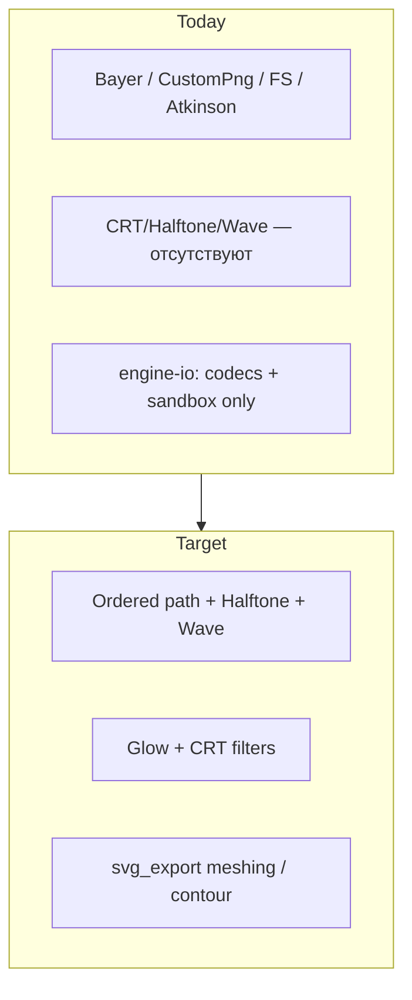
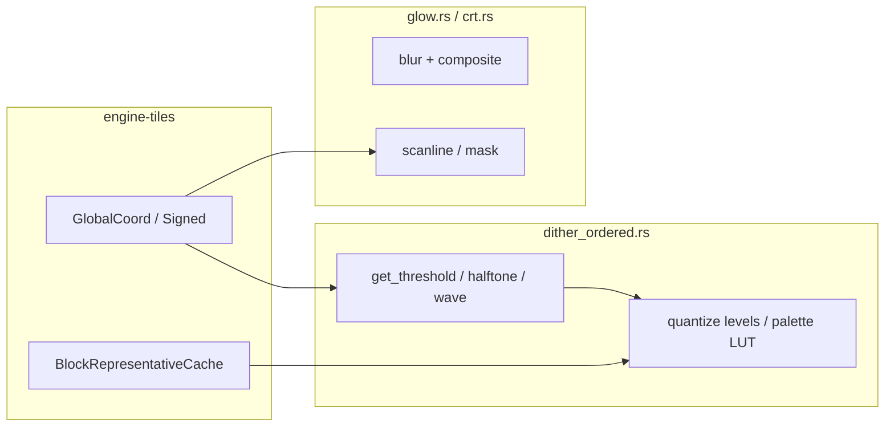
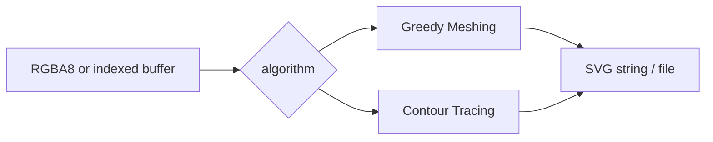

# Design: Track C — Phase 1 Filters

## Overview

После закрытия трека A добавляем CPU Phase 1 фильтры из [tech-debit.md](../tech-debit.md):

| ID | Deliverable | Primary files |
|----|-------------|---------------|
| **C1** | CMYK Halftone | extend `dither_ordered.rs` + `DitherModeV2` |
| **C2** | Wave / Line Modulation | same ordered path |
| **C3** | Glow + CRT | new `glow.rs`, `crt.rs` |
| **C4** | SVG Export | new `engine-io/src/svg_export.rs` |

C1–C3 делят контракт координат; C4 независим. Трек D позже сверит WGSL с CPU Halftone/CRT (и Bayer).

---

## Goals / Non-Goals

| Goals | Non-Goals |
|-------|-----------|
| Бесшовные pattern filters на `GlobalCoord` | GPU |
| Modes в DitherV2 + отдельные Glow/CRT kinds | Физически точный CMYK print pipeline |
| SVG meshing/contour export | Полный design-tool SVG editor |
| Минимальный UI для params | Visual regression CI infra |

---

## Current → Target



| Area | Today | Target |
|------|--------|--------|
| `DitherModeV2` | Bayer×3, CustomPng, FS, Atkinson | + `CmykHalftone`, `Wave` |
| `FilterKind` | Curves, Levels, Dither, PaletteQuantize, Glitch | + `Glow`, `Crt` |
| Coords | used by Bayer/ED | mandatory for C1–C3 patterns |
| Export | raster codecs | + SVG vectorize |

---

## Shared architecture (C1–C3)



### Ownership

| Concern | Owner |
|---------|--------|
| Mode enum, DitherParamsV2 extras | `filter.rs` |
| Halftone / Wave threshold | `dither_ordered.rs` (helpers OK in submodule) |
| Glow / CRT apply | `filters/glow.rs`, `filters/crt.rs` + `apply.rs` |
| LUT nearest | existing `PaletteLutCache` (B1) |
| SVG | `engine-io` + thin Tauri command |
| UI | `DitherV2Params` / effect editors + chooser |

### Hard rules (from Track A lessons)

1. No `tile.x * TILE_SIZE + local` outside `coords.rs`.
2. `pixel_size > 1` → `aligned` + BRC; do not reimplement block reps.
3. Pattern filters: `requires_full_row = false`.
4. Prefer `rem_euclid` for periodic indices.

---

## C1 — CMYK Halftone

### Model

Extend ordered dither: after (optional) RGB→CMYK, each channel gets an independent **screen**.

**Default screen angles** (degrees, classic offset-ish):

| Channel | Angle |
|---------|-------|
| C | 15 |
| M | 75 |
| Y | 0 |
| K | 45 |

**Cell size** `s` (px, default e.g. 6–8): period of the screen lattice in document space (after `aligned(pixel_size)` if ps>1 — apply alignment to the *sample coordinate* used for tone, and to pattern coords consistently with Bayer).

### Geometry

For global `(X_g, Y_g)` and angle `θ`:

```text
xr =  X_g * cosθ + Y_g * sinθ
yr = -X_g * sinθ + Y_g * cosθ
cx = rem_euclid(xr, s) - s/2
cy = rem_euclid(yr, s) - s/2
dist = sqrt(cx² + cy²)
```

Tone `t ∈ [0,1]` (channel amount) → max radius `r_max ≈ (s/2) * √(t)` (or `s/2 * t` — pick one; prefer **area-proportional** `√t` so midtones match perceived coverage). Pixel is “ink” if `dist <= r_max * threshold_scale_adjust` (fold `threshold_scale` as a radius multiplier).

**RGB reconstruction (display path):** convert CMYK dots back with a simple `RGB = 1 - min(1, C+K) …` style undercolor (document exact formulas in code comments). Not a ICC CMYK proof — artistic filter.

### Params surface

Prefer nesting under mode or parallel fields on `DitherParamsV2`:

```rust
// Illustrative — exact serde shape chosen at impl time
DitherModeV2::CmykHalftone,
// + optional:
// halftone_cell_size: u8,
// angles override: Option<[f32; 4]>,
```

Until dedicated fields exist, mode-only with constants is acceptable for first PR; second PR can expose cell size / angles in UI.

### Palette

If `palette_id` is set: after RGB reconstruct (or on ink/paper binary composite), run existing LUT quantize like Bayer.

---

## C2 — Wave / Line Modulation

### Threshold

```text
T(X_g, Y_g) = 0.5 + 0.5 * sin(
    2π * (X_g * cosφ + Y_g * sinφ) / wavelength
    + phase
) * amplitude
```

Clamp `T` to `[0,1)` before comparing to normalized channel value (same as Bayer path).

| Param | Default | Range (validate) |
|-------|---------|------------------|
| wavelength | 8 px | 2–256 |
| amplitude | 1.0 | 0–1 |
| phase | 0 | any rad or turns |
| angle φ | 0 (vertical bands) | degrees |

Reuse `levels`, `threshold_scale`, `pixel_size`, `color_mode`, `palette_id`.

### Implementation sketch

```rust
fn wave_threshold(gx: i32, gy: i32, p: &WaveParams) -> f32 {
    let u = gx as f32 * p.cos_phi + gy as f32 * p.sin_phi;
    let t = 0.5 + 0.5 * (std::f32::consts::TAU * u / p.wavelength + p.phase).sin() * p.amplitude;
    t.clamp(0.0, 0.999_999)
}
```

Wire in `get_threshold` match arm (or sibling) for `DitherModeV2::Wave { .. }`.

---

## C3 — Glow

### Algorithm (CPU)

1. Optional luminance threshold → extract bright mask.
2. Separable Gaussian or N× box blur with radius `r` (halo ≥ `ceil(r)` or multi-tile gather if radius exceeds HALO — **v1:** clamp radius to `HALO` or extend read from neighbor raw/processed via existing halo only; document max radius).
3. `out = src + intensity * blurred` (or screen blend); preserve alpha policy: blur RGB, keep A from src unless param says otherwise.

### Params

```rust
FilterParams::Glow {
    radius: f32,      // 0.5 .. 16 (v1 max tied to HALO)
    intensity: f32,   // 0 .. 4
    threshold: f32,   // 0 .. 1, default 0
}
```

`FilterKind::Glow`. No `requires_full_row`.

### Seam note

Large radius vs HALO=2 is the main risk. v1: `radius <= HALO` enforced in validate; later optional neighbor fetch is Track C stretch / tech-debit follow-up — do not block CRT/Halftone.

---

## C3 — CRT

### Scanlines

```text
Y_g = GlobalCoord::from_local(...).y   // or Signed if iterating halo
line = rem_euclid(Y_g, period)
gain = if line < dark_rows { 1 - strength } else { 1 }
rgb *= gain
```

Optional **RGB mask**: modulate by `rem_euclid(X_g, 3)` triad (R/G/B subpixel columns) with `mask_strength`.

### Params

```rust
FilterParams::Crt {
    period: u8,           // 2 .. 8
    strength: f32,        // 0 .. 1
    mask_strength: f32,   // 0 .. 1, default 0
}
```

### Forbidden pattern

```rust
// BAD — do not
let y_g = tile.y * 256 + local_y;
```

---

## C4 — SVG Export



### Greedy Meshing

Standard mesh: for each unset pixel, grow maximal width then height while color matches → emit rect, mark visited. Colors compared in u8 sRGB (or quantized bucket).

### Contour Tracing

Moore neighborhood or similar: emit outer path per component; holes **out of scope for v1** unless cheap — document “external only”.

### API sketch

```rust
pub struct SvgExportOptions {
    pub algorithm: SvgAlgorithm, // GreedyMeshing | ContourTracing
    pub tolerance: u8,           // channel delta merge, default 0
}

pub fn raster_to_svg(
    width: u32,
    height: u32,
    rgba: &[u8], // len = w*h*4
    opts: &SvgExportOptions,
) -> Result<String, IoError>;
```

Write path: validate via `sandbox`, then `std::fs::write`.

### UI

Export dialog / menu: format SVG → invoke command with active document composite at 1:1 (level 0). Downscaled export out of scope.

---

## Frontend wiring

| Surface | Change |
|---------|--------|
| `types` `DitherModeV2` | add `cmyk_halftone`, `wave` (+ param fields if any) |
| `DitherV2Params` / `DitherSettings` | options + wave/halftone sliders |
| Effect chooser | Glow, CRT entries |
| editors | `GlowSettings`, `CrtSettings` (thin) |
| Export | SVG in format list |

Keep existing Figma-ish controls; no layout redesign.

---

## Testing strategy

| Layer | What |
|-------|------|
| Unit | `rotated_cell_dist`, `wave_threshold`, `scanline_gain` tables |
| Seam | 2×2 tiles: Halftone, Wave, CRT edge continuity (max abs diff on shared edge ≤ eps) |
| Glow | flat field identical across tile edge; bright spot on boundary no dark seam if radius≤HALO |
| Serde | new enums/params |
| SVG | checkerboard → N rects; solid → 1 rect; sandbox reject outside root |
| Manual | screenshots in PR for Halftone/Wave/CRT on gradient |

Reuse patterns from `coords.rs` tests and `dither_seam_matrix` style — new file e.g. `phase1_pattern_seam.rs` is fine.

---

## Risks

| Risk | Mitigation |
|------|------------|
| CMYK→RGB looks muddy | Tune defaults; keep artistic, not proofing |
| Glow radius > HALO seams | Validate max radius = HALO in v1 |
| Wave float phase drift | Use f32 consistently; seam test locks continuity |
| SVG huge for noisy dither | Document: export after flat posterize / low levels; optional tolerance |
| UI param sprawl | Mode-first; advanced angles later |
| Starting before A green | Req 1 gate |

---

## Parallelism

```text
Gate: Track A closed ─────────────────────────────┐
                                                   │
C4 SVG (anytime in track) ─────────────────────────┤ parallel
                                                   │
C1 Halftone ──┐                                    │
C2 Wave     ──┼── share dither_ordered / types ────┤
              │                                    │
C3 Glow     ──┼── independent modules ─────────────┤
C3 CRT      ──┘                                    │
                                                   ▼
            Docs + DoD → enables Track D (Bayer+Halftone+CRT)
```

C1 and C2 should land sequentially or carefully conflict-manage the same files; Glow/CRT/SVG can be other people.
