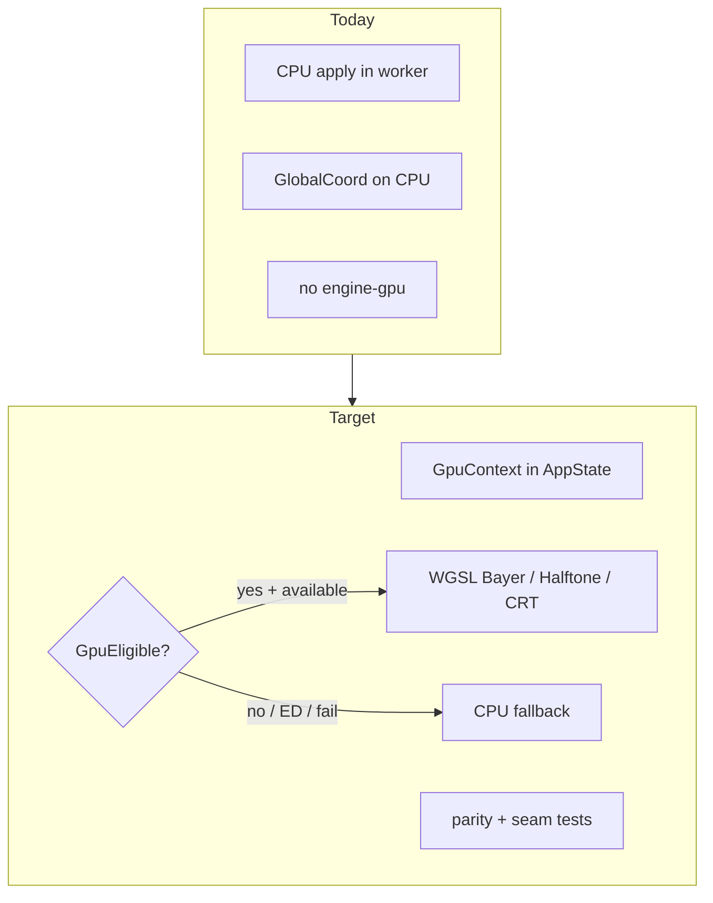
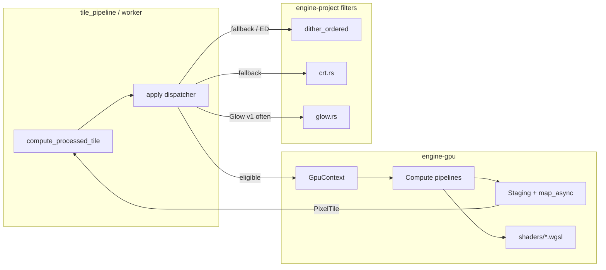

# Design: Track D — GPU Pipeline

## Overview

После закрытия треков A и C (минимум Bayer + CMYK Halftone + CRT на CPU) добавляем **опциональный** GPU compute path для per-tile pattern filters.

| ID | Deliverable | Notes |
|----|-------------|--------|
| **D0** | `engine-gpu` + `GpuContext` in `AppState` | adapter init, fallback |
| **D1** | Bayer WGSL pilot | proves staging / map_async / parity harness |
| **D2** | CMYK Halftone WGSL | float screens + `tile_offset` |
| **D3** | CRT WGSL (+ optional Glow) | global Y/X; Glow may stay CPU |

Источник приоритета: [tech-debit.md](../tech-debit.md) трек D. CPU refs: [track-c-phase1-filters/](../track-c-phase1-filters/).

---

## Precondition gate (перед D0)

Не начинать D0 по отметкам в markdown — **прогнать** CPU-референсы. Чеклист (записать вывод в [tasks.md](./tasks.md) §0.1):

| # | Check | How |
|---|--------|-----|
| 1 | Track A DoD closed | Confirm [track-a-correctness/tasks.md](../track-a-correctness/tasks.md) DoD; `dither_seam_matrix` green if still in tree |
| 2 | Bayer CPU seam | Run existing ordered/Bayer seamless + seam-matrix Bayer cases |
| 3 | CMYK Halftone CPU seam | `cargo test -p engine-project cmyk_halftone_2x2` (or full `phase1_pattern_seam`) |
| 4 | CRT CPU seam | `cargo test -p engine-project crt_seamless` (or module test named in C §6.3) |
| 5 | Record | Date + pass/fail in tasks §0.1; **Gate decision: proceed** only if 1–4 pass |

IF any check fails → fix CPU first (or waiver in `tech-debit.md`). Infrastructure-only skeleton without apply hook MAY be sketched, but **no** GpuEligible dispatch and **no** D1 parity claims until gate is green.

---

## Goals / Non-Goals

| Goals | Non-Goals |
|-------|-----------|
| Бесшовные WGSL pattern filters via `tile_offset` | GPU Error Diffusion |
| Shared upload/dispatch/download infra | Replace Canvas2D preview with WebGPU |
| Parity vs CPU within documented tolerance | Full GPU filter stack (Curves, Levels, compositor) |
| Graceful no-adapter / force-CPU | Guaranteed GPU in all CI runners |

---

## Current → Target



| Area | Today | Target |
|------|--------|--------|
| Crates | no GPU crate | `crates/engine-gpu` |
| AppState | CPU caches only | + `Option`/`Arc` `GpuContext` |
| Bayer / Halftone / CRT | CPU only | CPU + optional GPU |
| FS / Atkinson | CPU | CPU only (unchanged) |
| Coords | `GlobalCoord` | WGSL `tile_offset + local` |

---

## Architecture



### Ownership

| Concern | Owner |
|---------|--------|
| Device / queue / pipelines | `engine-gpu` |
| WGSL sources | `engine-gpu/src/shaders/` (or `include_str!`) |
| Eligibility + fallback | `engine-project` apply / thin façade calling gpu |
| AppState hold context | `src-tauri` `AppState` |
| Parity tests | `engine-gpu` and/or `engine-project` tests |
| Docs | `TILE_PIPELINE.md`, `ARCHITECTURE.md`, this folder |

### Hard rules (from Track A/C)

1. **Never** index patterns with local-only coords in WGSL — always `global = tile_offset + vec2(local_x, local_y)`.
2. Modulo for Bayer/period MUST match CPU `rem_euclid` on the integer domain used by CPU.
3. ED / `requires_full_row` → never GpuEligible.
4. **D1-before-D2/D3:** do not start Halftone/CRT/Glow GPU ports until **all five D1 exit criteria** below are green (shared buffer/sync proven once — do not re-implement staging per filter).

---

## Locked decisions (v1)

Три решения зафиксированы явно — не «выбрать на имплементации»:

### 1. Buffer format = RGBA32 float

**Decision:** storage buffers for GPU tile I/O are **RGBA32 float** (`f32` × 4 per pixel), matching `PixelTile` linear core — **not** RGBA8 unorm.

**Why now:** an RGBA8 round-trip adds quantization error on top of any GPU/CPU float drift. When a parity test fails, you cannot tell shader bug (`tile_offset`, `rem_euclid`, wrong threshold) from expected u8 loss. Removing that variable is cheaper than debugging mixed error sources later.

All D1–D3 shaders share this layout. Bandwidth cost (4× vs u8) is accepted for v1 correctness.

### 2. Parity tolerance — numeric, per filter

| Filter | Tolerance | Rationale |
|--------|-----------|-----------|
| **Bayer** | **Exact** — bit-identical `f32` bits **or** exact equal after documented CPU/GPU path (no ε). Prefer `assert_eq!` on raw channels / packed compare with zero slack. | Integer Bayer threshold, no `sin`/`cos`. Any mismatch is a bug (`tile_offset`, modulo, levels) — must not be waved away as “GPU noise”. |
| **CMYK Halftone** | **max ‖Δ‖∞ ≤ 1/255** per channel (linear f32), vs CPU on same tile | Screen math uses trig / √t |
| **CRT** | **max ‖Δ‖∞ ≤ 1/255** per channel, vs CPU | Scanline / mask float |

Tests MUST hard-code these numbers (constants in test module), not “reasonable” comments. Lowering Bayer to a soft ε requires an explicit design amendment — default is exact.

### 3. map_async timeout observability

Same pattern as Track A `diffusion_skip_counter` for silent branches:

- On map/read timeout or map error: **CPU fallback** for that tile (never hang the worker).
- Increment a process-visible counter (e.g. `GpuContext::map_timeout_counter` / `AtomicU64` on `AppState`).
- Log at warn on first N events; counter readable in tests / debug command so “timeout → fallback” cannot stay silent forever.

---

## D0 — Crate and context

### Workspace

```toml
# crates/engine-gpu/Cargo.toml (sketch)
[package]
name = "engine-gpu"
# ...
[dependencies]
wgpu = { version = "…", default-features = true }
bytemuck = { version = "1", features = ["derive"] }
# optional: pollster / futures for map_async in tests
```

Add to root workspace `members`. `src-tauri` and optionally `engine-project` depend on `engine-gpu`.

### GpuContext sketch

```rust
pub struct GpuContext {
    pub device: wgpu::Device,
    pub queue: wgpu::Queue,
    /// Silent-path observability (Track A diffusion_skip_counter pattern).
    pub map_timeout_counter: std::sync::atomic::AtomicU64,
    // cached pipelines: bayer, halftone, crt, …
    // bind group layouts, sampler if any
}

impl GpuContext {
    pub async fn try_new() -> Option<Self> { /* request adapter → device */ }
    pub fn is_available(&self) -> bool { true }
    pub fn map_timeouts(&self) -> u64 {
        self.map_timeout_counter.load(std::sync::atomic::Ordering::Relaxed)
    }
}
```

**Init:** at Tauri setup, `pollster::block_on(GpuContext::try_new())` (or async runtime already used). Store `Option<Arc<GpuContext>>` or `Mutex<Option<…>>`.

**Concurrency:** wgpu `Queue` is typically synchronized by the implementation, but pipeline creation and staging buffer maps need a clear policy:

- v1 recommendation: **one GPU submit mutex** per `GpuContext` for worker threads (simple, correct).
- Later: per-thread encode + shared queue if profiling shows contention.

**CI / headless:** unit tests that need a device are `#[ignore]` or feature `gpu-tests`. Compile + shader module parse tests can run without adapter where possible.

---

## Buffer and dispatch contract

### Pixel format (locked)

**RGBA32 float** only — see [Locked decisions](#locked-decisions-v1). No RGBA8 path in v1.

Layout: tightly packed `width * height * 4` floats, row-major, core `256×256` (no halo in v1 GPU path). Upload from / download into the same plane the CPU `PixelTile` core uses (or an explicit convert helper that is bit-preserving for f32).

### Uniforms

```wgsl
struct TileUniforms {
    tile_offset: vec2<u32>, // (tile.x * 256, tile.y * 256)
    size: vec2<u32>,        // (256, 256) core
    // filter-specific params packed after or in a second uniform struct
};
```

`tile_offset` MUST equal CPU:

```text
GlobalCoord::from_local(tile_coord, 0, 0) → (x, y)
```

### Workgroups

- `@compute @workgroup_size(16, 16)`
- `dispatch(256/16, 256/16, 1)` = `(16, 16, 1)` for full tile

Halo: v1 GPU path processes **core only** (matches writing Processed core). Filters needing halo (Glow > 0 with blur) either stay CPU or use multi-pass / neighbor upload (out of D1–D2 scope).

### Sync path (pilot-critical)

```text
1. Write input buffer (queue.write_buffer or staging upload) — RGBA32 float
2. Compute pass encode + submit
3. Copy output → MAP_READ staging
4. device.poll until map_async complete (with timeout)
5. On timeout/error: inc map_timeout_counter; unmap/cleanup; return Err → CPU fallback
6. On success: read mapped f32 slice → PixelTile core; unmap
```

No “fire and forget” without completing map before cache insert. Timeout counter is mandatory (locked decision #3).

---

## D1 — Bayer pilot

### Scope of parity

Port the **integer Bayer matrix** threshold path:

- Modes: Bayer2 / Bayer4 / Bayer8 (whatever CPU exposes as ordered Bayer family)
- Params: `levels`, `threshold_scale`, `color_mode`, `pixel_size` (if `pixel_size > 1`, either implement `aligned` in WGSL or **fallback CPU** for ps≠1 in v1 — prefer fallback to shrink pilot)

**Palette path:** v1 MAY run GPU Bayer without palette, then CPU `PaletteLut3D` post-pass; or skip GpuEligible when `palette_id` is set until LUT texture exists.

**Parity:** exact match vs CPU (locked decision #2) on fixtures with `pixel_size == 1` and no palette (or after identical CPU post-pass).

### WGSL sketch

```wgsl
@compute @workgroup_size(16, 16)
fn main(@builtin(global_invocation_id) gid: vec3<u32>) {
    if (gid.x >= uniforms.size.x || gid.y >= uniforms.size.y) { return; }
    let gx = uniforms.tile_offset.x + gid.x;
    let gy = uniforms.tile_offset.y + gid.y;
    let t = bayer_threshold(gx, gy); // rem_euclid-equivalent
    // … quantize like CPU …
}
```

### Default routing

Until D1 exit criteria are all green: **default CPU**, GPU behind `DITHER_GPU=1` or settings flag `preferGpuFilters`.

After green: default MAY flip to GPU-when-available for Bayer only; document in tasks result.

### D1 exit criteria (all five required before D2/D3)

Do **not** open Halftone/CRT/Glow GPU implementation PRs until every item is green and recorded in [tasks.md](./tasks.md) §2:

| # | Criterion | Evidence |
|---|-----------|----------|
| 1 | Shared RGBA32 float upload/dispatch/download helpers exist and are the only path Bayer uses | code review + no duplicate staging |
| 2 | `map_async` timeout → CPU fallback + **counter increments** under a forced-timeout test or fault injection | unit/integration |
| 3 | Bayer **exact** parity fixtures green (solid, gradient, at least one multi-tile) | `gpu_parity` / feature tests |
| 4 | Bayer **seam** with `tile_offset` green (2×2 or edge vs CPU) | seam test |
| 5 | Bench or timed note recorded (GPU vs CPU Bayer) | tasks §2.5 |

Rationale: buffer/sync infra must be proven **once**. Starting D2/D3 early invites a second copy of staging bugs under float-heavy shaders.

---

## D2 — CMYK Halftone

Port CPU formulas from Track C design (angles C/M/Y/K, cell size, `√t` radius, CMYK↔RGB reconstruct).

**Parity:** max abs per channel ≤ **1/255** vs CPU (locked). Constant in test, e.g. `const HALFTONE_PARITY_EPS: f32 = 1.0 / 255.0`.

`tile_offset` mandatory; seam test mandatory.

Palette: same as Bayer (CPU post-pass acceptable).

**Gate:** D1 exit criteria 1–5 all green.

---

## D3 — CRT and Glow

### CRT

Scanline gain from `gy = tile_offset.y + gid.y` (and `gx` for triad mask). Params mirror CPU `Crt` filter.

**Parity:** max abs per channel ≤ **1/255** vs CPU (locked).

**Gate:** D1 exit criteria 1–5 all green (may run in parallel with D2 after that).

### Glow

| Strategy | When |
|----------|------|
| Stay CPU | radius uses halo ≤ HALO already on CPU; low urgency |
| GPU separable blur | only if single-tile halo enough OR neighbor tiles uploaded |

Do not claim Glow GpuEligible until seam policy is explicit. Glow also waits on D1 exit criteria if attempted.

---

## Eligibility matrix

| Filter / mode | GpuEligible v1 | Notes |
|---------------|----------------|--------|
| Bayer×N | yes (pilot) | ps>1 / palette may force CPU initially |
| CustomPng threshold | no / later | needs texture upload of map |
| Wave | optional later | same as ordered; not in tech-debit minimum |
| CMYK Halftone | yes **after D1 exit** | |
| FS / Atkinson | **never** | ED |
| CRT | yes **after D1 exit** | |
| Glow | optional after D1 | |
| Curves / Levels | out of scope | |

---

## Frontend / settings

Minimal:

- Optional checkbox or menu: “Prefer GPU filters” (default off until stable).
- No requirement to show adapter name in UI for DoD (log at info is enough).

Preview remains Canvas2D consuming Composite tiles — GPU is **backend apply**, not display API.

---

## Testing strategy

| Layer | What |
|-------|------|
| Precondition | Run C/A seam commands; record in tasks §0.1 before D0 apply work |
| No-adapter | `GpuContext::try_new` → None; app boots; force CPU |
| Parity Bayer | **exact** vs CPU |
| Parity Halftone/CRT | **≤ 1/255** per channel vs CPU |
| Seam | 2×2 GPU tiles OR GPU vs CPU edge continuity with `tile_offset` |
| map_async | timeout path increments counter + CPU fallback |
| Fallback | break device / disable flag → CPU path, visually same |
| Bench | Bayer large N; note in tasks.md |
| Manual | pan Halftone/CRT across tile grid with GPU on |

Reuse fixture ideas from `phase1_pattern_seam` / ordered seamless tests — add `gpu_parity_*.rs` gated by feature.

---

## Risks

| Risk | Mitigation |
|------|------------|
| Silent seams from forgetting `tile_offset` | Req + seam tests; Bayer exact parity catches offset bugs early |
| Soft ε hiding Bayer bugs | Locked: Bayer exact; Halftone/CRT only get 1/255 |
| RGBA8 masking shader bugs | Locked: RGBA32 float only |
| map_async hangs / silent timeout | timeout → CPU + **counter** (Track A pattern) |
| Worker contention on Queue | submit mutex v1 |
| CI without GPU | default tests CPU; gpu-tests optional |
| Starting before C gate | Precondition checklist with **real test runs**, not file existence |
| D2/D3 before staging proven | Hard gate: five D1 exit criteria |
| Scope creep (ED, compositor) | Non-goals; reject in review |

---

## Parallelism / order

```text
Precondition checklist (run C/A tests) ──────────┐
                                                 │
D0 crate + AppState + timeout counter ───────────┤
                                                 │
D1 Bayer pilot ──────────────────────────────────┤
  exit: helpers + timeout counter test +         │
        exact parity + seam + bench note         │
                                                 │
          ▼ all five D1 criteria green ▼         │
                                                 │
D2 Halftone ──┬── may parallel ── D3 CRT         │
D3 Glow (optional) ──────────────────────────────┘
```

D2 and D3 MUST NOT start until D1’s five exit criteria are green. After that they may parallelize; they **reuse** D1 buffer/sync helpers — no second staging stack.
