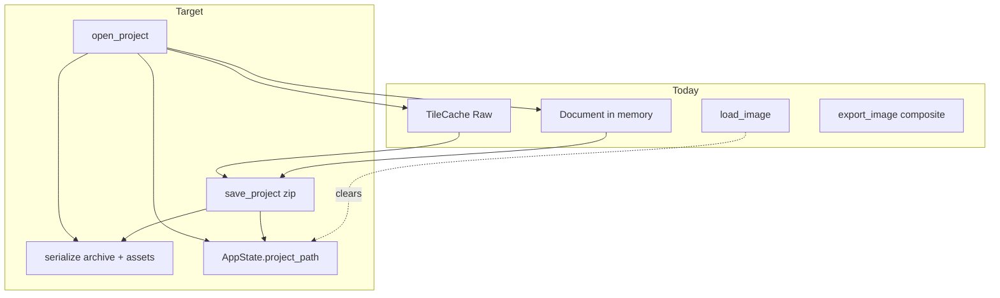
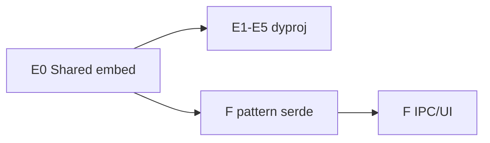

# Design: Track E — `.dyproj` Project Persistence

## Overview

| ID | Deliverable | Notes |
|----|-------------|--------|
| **E0** | Shared zip + threshold-map embedding | **Required by Track F** |
| **E1** | Document serde DTOs + Id_Remap + migrations | `format_version = 1` |
| **E2** | Assemble Raw tiles → PNG / open → decompose | Round-trip pixels |
| **E3** | Tauri `save_project` / `save_project_as` / `open_project` + `project_path` | Single-doc replace |
| **E4** | Frontend File menu + dialogs | `.dyproj` filter |
| **E5** | Round-trip tests + optional OS association | Late: file associations |

Источник: [BRIEF_dyproj_dyuki.md](../BRIEF_dyproj_dyuki.md). Параллельный трек: [track-f-dyuki](../track-f-dyuki/) (после E0).

---

## Goals / Non-Goals

| Goals | Non-Goals |
|-------|-----------|
| Lossless project round-trip | Multi-doc, autosave |
| One embedding stack for E+F | Panel/viewport inside `.dyproj` |
| Fresh IDs on every open | Trusting `requires_full_row` from disk |

---

## Locked decisions (from BRIEF + code check)

| Topic | Decision |
|-------|----------|
| Container | Zip (`zip` crate), not custom binary / base64 JSON |
| Shared embed | **E0 in `engine-project::serialize`** (submodules `archive`, `assets`, `migrate`); F imports same module — **no new crate for MVP** unless Cargo cycles force `engine-io` split later |
| PNG encode/decode | Use `image` crate (already in Tauri/`load_image` path); call from serialize helpers or thin `engine-io` wrappers — prefer one helper used by E2 and commands |
| User vs internal paths | User `.dyproj` path → sandbox; Synthetic_Asset_Path → **no** sandbox |
| Threshold cache key | Unchanged API `(path, mtime)`; synthetic path under **content-addressed** `asset-cache/threshold-maps/{content_hash}.png` (no project/import uuid) |
| IDs on open | Always regenerate + remap |
| Masks | **`MaskStorage::External(LayerId)` remap**; **no** `{id}.mask.png` in v1 (BRIEF speculative file was wrong for current model). `EmbeddedVector` serializes as-is if present |
| Single document | `open_project` ≡ replace handle like `load_image`; `doc_id = 1` |
| Soft size warn | Warn UI if sum of layer PNG uncompressed estimates > **256 MB** (tunable const); still allow save |
| `project_path` | `AppState.project_path: Mutex<Option<PathBuf>>` (or `RwLock`); clear when `load_image` replaces doc |
| Content hash | **BLAKE3** over PNG file bytes; filename = first **16 bytes** hex-encoded (32 hex chars) → `{hash16}.png`. Same algorithm for E and F embeds |
| CustomPng in JSON | Stored form: **`{content_hash}.png` only** (basename). Zip entry path is always `assets/threshold_maps/{content_hash}.png`. Do not store full archive-relative paths in `document.json` |
| Migrations | **Separate chains per `kind`**: `migrate_dyproj` and `migrate_dyuki` each own their `format_version` counter. Shared module may host both; never one shared version that advances when only one format changes |
| Layer PNG bit depth | Encode/decode as **PNG8 RGBA** matching today’s `load_image` → f32 → tile path. Round-trip is lossless **under the assumption that Raw tiles came from 8-bit sources** (current importer). Document this at the encode site so a future 16-bit import cannot silently become lossy |

---

## MaskRef resolution (BRIEF §4.5)

`crates/engine-project/src/mask.rs`:

```rust
pub enum MaskStorage {
    External(LayerId),
    EmbeddedVector(Vec<String>), // placeholder
}
```

There is **no** inline raster mask blob on `Layer`. Therefore archive layout from BRIEF §2.2 is adjusted:

```
project.dyproj (zip)
├── manifest.json
├── document.json
├── layers/
│   └── {file_layer_id}.png   # Raster layers only (including layers used as External masks)
└── assets/
    └── threshold_maps/
        └── {content_hash}.png
```

External mask = remap LayerId after load so it still points at the remapped mask layer.

---

## Current → Target



| Area | Today | Target |
|------|--------|--------|
| Persist document | No | `.dyproj` |
| Layer pixels | Only TileCache | PNG in zip + TileCache on open |
| CustomPng path | User disk path | content_hash embed + synthetic path |
| Pattern share | — | Track F on E0 |

---

## Architecture

### Module layout

```
crates/engine-project/src/serialize/
  mod.rs           # pub API
  archive.rs       # zip create/open, entry R/W
  assets.rs        # hash PNG, embed/extract threshold maps, synthetic paths
  document_dto.rs  # DocumentFile / LayerFile shapes (+ raw_asset)
  id_remap.rs      # old → new maps, rewrite palette_id / External masks / filter ids
  migrate.rs       # per-kind format_version chains (dyproj + dyuki stubs)
  project.rs       # save_project_to_bytes / open_project_from_path helpers
  pattern.rs       # stub re-exports / hooks for Track F (or F adds file in same module)
```

Track F adds `pattern.rs` fully; E0 must land `archive` + `assets` (+ shared manifest helpers, hash, per-kind version check) first.

### Content hash (locked)

```text
content_hash(png_bytes) =
  hex(BLAKE3(png_bytes)[0..16])   # 32 lowercase hex chars
zip entry =
  assets/threshold_maps/{content_hash}.png
```

- Hash the **encoded PNG bytes** that are written into the archive (not raw f32 buffers).
- Dedup: same bytes → same entry; multiple filters may reference one hash.
- Synthetic materialize path is **content-addressed only** (shared by E and F):
  `asset-cache/threshold-maps/{content_hash}.png` under app-data. **No**
  `project_uuid` / `import_uuid` directory — uuid scoping defeated hash dedup and
  leaked folders on every open/import. Write-if-absent = natural cross-document
  deduplication; `ThresholdMapCache` keeps stable `(path, mtime)` keys.

### Manifest (v1)

```json
{
  "format_version": 1,
  "kind": "dyproj",
  "app_version": "0.x.y",
  "created_at": "ISO-8601",
  "modified_at": "ISO-8601",
  "width": 1920,
  "height": 1080
}
```

`kind` distinguishes archives if the same zip tooling is reused (`.dyuki` uses `"dyuki"`).

### Migrations (locked)

| `kind` | Module / entry | Version counter |
|--------|----------------|-----------------|
| `"dyproj"` | `migrate::dyproj` | Own `SUPPORTED_DYPROJ_VERSION` (start 1) |
| `"dyuki"` | `migrate::dyuki` | Own `SUPPORTED_DYUKI_VERSION` (start 1) |

- Dispatch: read `manifest.kind` + `format_version` → run **that kind’s** ordered `migrate_vN_to_vN+1` chain only.
- Do **not** share one integer across both formats: dyuki schema can bump while dyproj stays at 1 (and vice versa) without forcing phantom migrations on the other.
- Shared helpers (zip open, JSON rewrite utils) are fine; version ladders are not shared.
- MVP: both kinds support only v1 (identity / no-op chain); future-version → `UnsupportedVersion { kind, found, supported }`.

### document.json notes

- Serialize tree with **file-local ids** (stable within the file for human unzip debugging).
- Omit `generations` / live `revision` semantics; on load set palette revisions to 1 and recreate `GenerationTracker`.
- Omit `requires_full_row` or ignore on load; recompute via existing filter-kind rules.
- CustomPng: store **`{content_hash}.png`** basename only in JSON params; on open, materialize then rewrite to Synthetic_Asset_Path.
- Do **not** persist original user path.

### Pixel assemble (E2)

1. For each raster `LayerId` in tree order:
2. Read all level-0 Raw tiles for that layer from `TileCache`.
3. Blit into `width×height` RGBA8 (f32→u8, standard 0..1 → 0..255) using layer offset + doc dims (document canvas size; pixels outside layer bounds = transparent).
4. Encode **8-bit RGBA PNG**; write zip entry named by **file** layer id string used in `document.json`.

Open: decode PNG → same f32 path as `load_image` → `decompose_image_to_tiles` with **remapped** runtime LayerId.

**PNG8 / “lossless” caveat (locked for impl docs):** today’s pipeline is lossless for project round-trip because `load_image` sources are 8-bit. That is an **importer assumption**, not an architecture guarantee. At the encode helper, leave an explicit `//` / doc-comment that quantizing Raw f32 → u8 is only bit-preserving when tiles originated as 8-bit; a future 16-bit (or higher) import path must either store a wider container or warn — never quietly ship lossy round-trip as “lossless”.

**Incomplete Raw:** if any tile covering the layer’s `bounds_l0` is missing, fail save with `ProjectError::IncompleteRaw { layer_id }`.

**Testing IncompleteRaw:** TileCache budget eviction is **not** exercised on the current runtime path (no natural miss of Raw tiles after a successful load). Unit/integration tests MUST force the error by **directly removing / omitting** required Raw entries from the cache (or assembling against a deliberately sparse cache), not by waiting for LRU eviction under memory pressure.

### Id remap algorithm

1. Parse file ids from `document.json`.
2. Allocate new LayerIds for every layer/group node; map old→new.
3. Allocate new PaletteIds for each palette; map old→new.
4. For each filter: new FilterInstanceId; rewrite `palette_id`; rewrite CustomPng path to synthetic path after extract; set `requires_full_row` from kind.
5. Rewrite `MaskStorage::External(old)` → `External(new)`.
6. Rebuild `Document` with remapped tree + palettes; `revision = 1` / empty generations.

### AppState / IPC

```text
save_project(path: Option<String>)
  - if None: use project_path; if also None → error "Save As required"
  - sandbox resolve path
  - serialize + write zip
  - set project_path

save_project_as(path: String) → same as save with path, always set project_path

open_project(path: String)
  - sandbox resolve
  - open zip, migrate, remap, decompose
  - replace document_handle (doc_id=1)
  - invalidate caches (mirror load_image)
  - set project_path
```

`load_image`: clear `project_path` to `None` (document is no longer that project file).

### Frontend

- MenuBar File: Open Project…, Save Project, Save Project As… (alongside existing Open Image / Export).
- Dialogs: `*.dyproj`.
- Wire IPC in `frontend/src/shared/ipc/document.ts` (or sibling `project.ts`).

### Errors

| Case | Behavior |
|------|----------|
| `format_version` too new | `ProjectError::UnsupportedVersion { found, supported }` → user message |
| Corrupt zip / missing manifest | Explicit error; do not partially replace document (validate fully then swap, or swap only after successful build of new Document + tiles in a staging approach) |
| Incomplete raw on save | Error; document unchanged on disk |

**Atomic open preference:** build new Document + populate tiles; only then swap `document_handle` and drop old cache entries — avoid leaving half-open state if decode fails mid-way (clear staging tiles on failure).

---

## Testing strategy

| Test | What |
|------|------|
| Unit: hash embed/extract | BLAKE3/16-byte hex stable; same bytes → same name **and same materialize path**; ThresholdMapCache loads it |
| Unit: hash↔basename | Open rejects zip entry whose PNG hash ≠ JSON `{hash}.png` stem |
| Unit: id_remap | External mask + palette_id rewritten |
| Unit: migrate | Per-kind: dyproj v1 no-op; dyuki stub; wrong/future version errors; bumping one kind’s supported version does not affect the other |
| Unit: IncompleteRaw | Save fails after **manually** dropping a required Raw tile from TileCache (do not rely on runtime eviction) |
| Integration: save/open | Structure + Raw PNG identity (or composite export compare) |
| Integration: CustomPng | Project with CustomPng survives without original user path on disk |

---

## Parallelism with Track F



F MAY start UI sketches before E0 merges, but must not duplicate zip/asset code.

---

## Future

- Autosave / crash recovery
- OS associations (tasks late item)
- Hard size limit
- Multi-document
