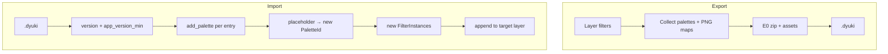

# Design: Track F — `.dyuki` Sharable Patterns

## Overview

| ID | Deliverable | Notes |
|----|-------------|--------|
| **F0** | Pattern serde on top of E0 | `filters.json` / `palettes.json` / placeholders |
| **F1** | `export_pattern` / `import_pattern` IPC | Append-only import; always-new ids |
| **F2** | UI Export / Import | EffectSettingsPanel + dialogs |
| **F3** | Cross-machine + double-import tests | BRIEF §5.3–5.5 |
| **F4** | Optional OS association | With Track E |

Depends on: [track-e-dyproj](../track-e-dyproj/) **E0** only. Source: [BRIEF_dyproj_dyuki.md](../BRIEF_dyproj_dyuki.md) §3.

---

## Goals / Non-Goals

| Goals | Non-Goals |
|-------|-----------|
| Portable filter recipes | Layer pixels / layer chrome |
| Hard fail on old app | Silent filter drop |
| Append + new ids | Id matching / merge by name |

---

## Locked decisions

| Topic | Decision |
|-------|----------|
| Container | Same zip + E0 `assets::` as `.dyproj` |
| Import ids | Always new palettes + filters (Color Lab precedent) |
| Import stack op | **Append** only for MVP |
| Placeholder_Key | Stable string per embedded palette, e.g. `p0`, `p1` in export order (or `palette_{n}`); documented in file |
| `filter_instance_ids` | `None` → all filters; `Some(ids)` → subset in **layer stack order** (not selection order); missing id → error |
| `app_version_min` | On export: `max(baseline, requirements of included kinds)`. MVP table in code: map each `FilterKind` / `DitherModeV2` variant → semver req; default baseline = version that first shipped that variant, or **current app version** if table incomplete (safe/strict). Never omit filters on import |
| `format_version` | **Own** `migrate_dyuki` ladder (start 1); shared zip/hash helpers with E0 — **not** a shared version counter with dyproj ([track-e design](../track-e-dyproj/design.md)) |
| Content hash | Same as E0: BLAKE3, first 16 bytes hex → `{hash}.png` |
| Synthetic asset path | **Shared E0 content-addressed cache only**: `asset-cache/threshold-maps/{content_hash}.png`. **No** `pattern-assets/{import_uuid}/…` and **no** project-uuid scoping (defeats hash dedup; leaks folders on re-open/re-import) |
| UI placement | Primary: EffectSettingsPanel overflow / context (“Export as pattern…”, “Import pattern…”) + File→Import Pattern; subset export UI can lag behind IPC |
| Unknown filter kinds | `app_version_min` is the fast UX path; **serde** on file DTOs is the hard safety net — unknown `FilterKind` / `DitherModeV2` MUST error (no panic, no silent skip/default). Test both paths |
| `target_layer_id` | Must resolve to a **leaf** `Layer`, not a `LayerGroup` — clear error otherwise |
| `enabled` | Always present in `filters.json` (`FilterInstance.enabled: bool`) |

---

## Archive layout

```
pattern.dyuki (zip)
├── manifest.json
├── filters.json      # [ { kind, params, enabled, ... } ] — no id / no requires_full_row
├── palettes.json     # { "p0": { "name": "...", "colors": [...] }, ... }
└── assets/
    └── threshold_maps/
        └── {content_hash}.png
```

### manifest.json (v1)

```json
{
  "format_version": 1,
  "kind": "dyuki",
  "app_version_min": "0.x.y",
  "name": "My Look",
  "description": optional,
  "author": optional,
  "created_at": "ISO-8601"
}
```

### filters.json shape

Mirror `FilterInstance` serializable fields needed to reconstruct params:

- `kind`, `params` (with `palette_id` replaced by placeholder string field — see below), **`enabled` (always)**, order = array order.
- Do **not** store `id` or `requires_full_row`.

**Unknown variants (safety net):** file DTOs deserialize into the same (or isomorphic) enums as runtime. An unknown `FilterKind` / mode variant MUST fail serde with a clear error suitable for surfacing as “update the app” — not panic, not `#[serde(other)]` swallow, not skip the filter. `app_version_min` covers the typical old-app case; this path covers a mis-set / bypassed min version with a newer payload.

**Palette placeholder encoding:** rather than overloading a numeric `PaletteId`, file params use a tagged form, e.g. inside JSON params:

```json
"palette_ref": "p0"
```

or replace the `palette_id` value with a string in a **file-only** DTO (`FilterInstanceFile`) distinct from runtime `FilterInstance`. Prefer **separate file DTO** so runtime types stay clean.

CustomPng in file DTO: `"path": "{content_hash}.png"` meaning embed name under `assets/threshold_maps/`.

---

## Flows



### Export algorithm

1. Resolve layer; select filter list (all or subset in stack order).
2. Walk params: record palette ids → assign Placeholder_Keys; record CustomPng paths → read PNG bytes (from path / cache) → hash → embed.
3. Build `FilterInstanceFile` list with placeholders + hash names.
4. Build `palettes.json` from document palette snapshots (name + colors).
5. Write zip via E0; set `app_version_min` from kind table.

### Import algorithm

1. Open zip; check `kind == dyuki`; migrate `format_version`; check `app_version_min`.
2. Resolve `target_layer_id`: MUST be a leaf `Layer` (not `LayerGroup`). If it is a group or missing → error (`cannot apply pattern to a group, select a layer` / not found) — do not touch the document.
3. For each palette entry: `doc.add_palette(name, colors)` → map placeholder → new id.
4. Materialize each threshold PNG via E0 **content-addressed** helper only:
   `materialize_threshold_map(bytes)` → `asset-cache/threshold-maps/{hash}.png`
   (shared with `.dyproj`; write-if-absent; **no** per-import uuid directory).
5. For each filter file entry: deserialize (unknown enum → hard error) → new `FilterInstanceId`, map palette_ref → PaletteId, map hash basename → Synthetic_Asset_Path, set `enabled` from file, `requires_full_row = f(kind)`, validate params.
6. Append to target layer; bump generations / invalidate tiles like `add_filter`.

**Double import:** step 3–6 again → second set of palettes+filters (intentional duplication; matches Color Lab “always new”). Same threshold PNG bytes reuse the same cache file on disk.
---

## IPC

| Command | Args | Notes |
|---------|------|-------|
| `export_pattern` | `layer_id`, `filter_instance_ids: Option<Vec<String>>`, `path`, optional `name`/`description` | Sandbox path |
| `import_pattern` | `path`, `target_layer_id` | Append; target must be leaf layer; returns new filter ids / palette ids for UI refresh |

Frontend: `shared/ipc/pattern.ts` (or under document); EffectSettingsPanel actions; selected layer from existing selection state.

---

## Testing

| Test | Assert |
|------|--------|
| Placeholder round-trip | Export→import remaps palette colors correctly |
| No user paths in zip | Grep unzipped JSON for absolute paths → none |
| Double import | Two subsequences; distinct ids; both runnable; threshold file not duplicated on disk for same hash |
| Old app | Fixture with high `app_version_min` → error, stack unchanged |
| Unknown enum (serde safety) | Fixture with **valid/low** `app_version_min` but unknown `FilterKind`/`DitherModeV2` in `filters.json` → clear deserialize error, stack unchanged (no panic) |
| Import onto group | `target_layer_id` = group → clear error; document unchanged |
| Cross-machine sim | Delete original threshold file before import; ordered dither still matches |
| `requires_full_row` | Equals fresh `add_filter` |

---

## Coordination with Track E

- Do not fork zip code; if E0 API gaps appear, extend E0 in track E (or small PR on serialize module) rather than local copies in F.
- File associations for `.dyuki` can land in the same Tauri config task as `.dyproj`.

---

## Future

- Explicit “replace stack” import
- Pattern library / presets folder
- Richer metadata / thumbnails
