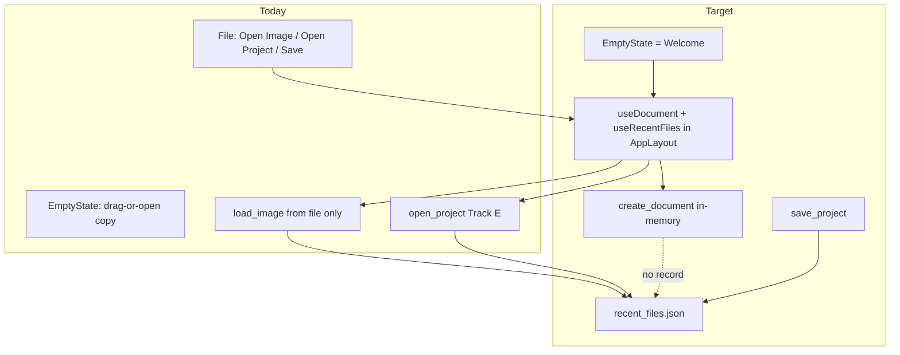

# Design: Track G — Welcome Screen

> **Status (2026-08-13):** implemented. As-built: [ARCHITECTURE.md](../../ARCHITECTURE.md) §3.9;
> checklist: [tasks.md](./tasks.md).

## Overview

| ID | Deliverable | Notes |
|----|-------------|-------|
| **G1** | Recent Files JSON + `get_recent_files` + record call sites | Same app-data-dir as panels |
| **G2** | `create_document` | In-memory buffer → existing decompose/replace |
| **G3** | Welcome in `EmptyState` + `NewProjectDialog` + `useRecentFiles` | One empty slot, one Recent source |
| **G4** | MenuBar File: New Project… + Open Recent | Reuse Track E Open Project |
| **G5** | Tests | Backend unit + frontend RTL |

Источник: [TASK_welcome_screen.md](../TASK_welcome_screen.md). Зависит от Track E IPC (`open_project` / `save_project` / `project_path`) — уже в дереве.

---

## Goals / Non-Goals

| Goals | Non-Goals |
|-------|-----------|
| Welcome + Recent + blank doc | Second empty-state component |
| Record after successful file ops | Record blank `create_document` |
| Shared open/create paths | New persistence stack |

---

## Locked decisions (from TASK + code check)

| Topic | Decision |
|-------|----------|
| Empty slot | **`EmptyState.tsx`**, rendered from **`PreviewFeature`** when `!hasDocument`. Brief’s “App.tsx” is stale. Also replace the `fill` branch (“No document open”) with the same Welcome |
| Persistence | `{app_data_dir}/recent_files.json`; helpers take `&Path` for tests; commands resolve dir via `AppHandle` like `panel_state_path` |
| `MAX_RECENT` | **10** |
| Dedup key | Exact `path` string as recorded (the path that succeeded: `load_image` argument; sandbox-resolved path for project open/save) |
| Record call sites | After **success** of `load_image` (Image), `open_project` (Project), `save_project` / `save_project_as` (Project). Not on failure. **Not** on `create_document` |
| Why save records | TASK says blank docs enter Recent only after Track E save; without recording save, New Project → Save never appears until a later Open |
| Dead files | Prune on **read** (`get_recent_files`); rewrite cleaned list; read still succeeds if rewrite fails |
| Corrupt/missing JSON | Empty list, not an IPC error |
| Dimension limit | Extract `MAX_DOCUMENT_DIMENSION: u32 = 8192` next to `load_image` / `create_document`; both use it. Min **1** (same as `load_image` zero-reject) |
| Blank pixels | f32 RGBA, same space as `load_image` (`u8 as f32 / 255.0`). Transparent = `0,0,0,0`. White = `1,1,1,1`. No extra linearize/profile step |
| Decompose | **Only** `decompose_image_to_tiles` — no parallel tile-init |
| Replace path | Same as `load_image`: mutate handle, `project_path = None`, `invalidate_after_document_replace`, `schedule_dirty_viewport_tiles`, `emit_document_changed` |
| `create_document` response | Same shape as `LoadImageResponse` `{ doc_id, width, height, tile_count }` so the RTK thunk can mirror `openImage` |
| Dialog defaults | **1920×1080**, background **Transparent** |
| Relative time | Format on frontend from ISO-8601 (`Intl.RelativeTimeFormat` or a tiny helper). **No new dependency** |
| Shared Recent | **One** `useRecentFiles()` in `AppLayout`; props down to `MenuBar` and `EmptyState` |
| Dialog owner | **One** `NewProjectDialog` mounted in `AppLayout`; Welcome + File both call `onNewProject` |
| Path-parameterized open | `useDocument.openImageAt(path)` / `openProjectAt(path)` (or equivalent) wrapping existing thunks; dialog variants stay |
| File menu | Add **New Project…** (top) and **Open Recent**. Do **not** duplicate Open Image / Open Project (already Track E) |
| Empty Open Recent | Hide the item (or hide submenu) when `entries.length === 0` — same as Welcome |
| New Project vs hasDocument | Always enabled; replaces current doc (single-document model) |
| Layer id | Raster leaf `LayerId::new(1)` like `load_image` |

---

## Current → Target



| Area | Today | Target |
|------|--------|--------|
| No document | Placeholder copy / “No document open” | Welcome + optional Recent |
| New canvas | Only by opening an image | `create_document` |
| Recent | None | JSON ≤10, pruned on read |
| File menu | Open/Save image+project | + New Project… + Open Recent |

---

## Architecture

### G1 — `recent_files.rs`

```rust
#[derive(Serialize, Deserialize, Clone)]
pub struct RecentFileEntry {
    pub path: String,
    pub kind: RecentFileKind,
    pub display_name: String,
    pub opened_at: String, // ISO-8601 UTC
}

#[derive(Serialize, Deserialize, Clone, Copy, PartialEq)]
#[serde(rename_all = "lowercase")]
pub enum RecentFileKind { Image, Project }

const MAX_RECENT: usize = 10;
```

Testable API (injected path):

```text
recent_files_path(app) -> {app_data_dir}/recent_files.json
load_recent_files(file: &Path) -> Vec<RecentFileEntry>
record_recent_file(file: &Path, path: &str, kind: RecentFileKind)
prune_missing(entries) -> (kept, dropped_any)
```

`display_name` = `Path::new(path).file_name()` (lossy string); fallback to full path if none.

`opened_at` = UTC now, RFC 3339 / ISO-8601.

Commands:

```text
get_recent_files(app) -> Vec<RecentFileEntry>
  load → filter exists() → if dropped, try save → return kept
```

Register in `main.rs` next to other document commands.

**Call sites** (after the success path, before `Ok(...)`):

| Command | Kind | Path stored |
|---------|------|-------------|
| `load_image` | Image | `path` argument that decoded |
| `open_project` | Project | sandbox-resolved path |
| `save_project` / `save_project_as` | Project | resolved save path |

Need `AppHandle` (or precomputed `PathBuf` on `AppState`) at those sites. `load_image` / `open_project` already have `AppHandle`. Save commands today do not — add `AppHandle` or store `recent_files_path` on `AppState` at startup. Prefer **pass `AppHandle`** into save commands (consistent with other mutating commands) rather than a new AppState field.

### G2 — `create_document`

```text
create_document(width, height, background: Transparent|White)
  validate 1..=MAX_DOCUMENT_DIMENSION
  spawn_blocking: fill Vec<f32>, then (on async side) decompose_image_to_tiles
  Document::new(id=1, w, h) + Layer::new(id=1, Raster, w, h)
  project_path = None
  invalidate + schedule + emit_document_changed("document_created" or "image_loaded")
  do not record_recent_file
```

`BlankBackground` serde `rename_all = "lowercase"`.

Extract the magic `8192` from `load_image` into a shared const used by both validators.

Heavy buffer fill MAY run in `spawn_blocking` (8192²×4×4 bytes ≈ 1 GiB worst case — same class of work as decode).

### G3 — Frontend

**IPC:** `frontend/src/shared/ipc/recent.ts` (or sibling of `project.ts`) + `createDocument` next to `loadImage` in `document.ts`.

**Hook:**

```ts
export function useRecentFiles() {
  const [entries, setEntries] = useState<RecentFileEntry[]>([]);
  const refresh = useCallback(async () => {
    setEntries(await invoke('get_recent_files'));
  }, []);
  useEffect(() => { void refresh(); }, [refresh]);
  return { entries, refresh };
}
```

Called **once** in `AppLayout`. Pass `entries` + `onOpenRecent(entry)` + `onNewProject` into `MenuBar` and `PreviewSlot` → `PreviewFeature` → `EmptyState`.

After fulfilled open/create/save in `useDocument`, call `refresh()` (AppLayout wraps the hook callbacks, or `useDocument` accepts an optional `onDocumentOpened` — prefer wrapping in AppLayout to avoid hook cycles).

**EmptyState structure:**

```
Welcome (EmptyState)
├── Logo / app name
├── Primary: New Project | Open Image… | Open Project…
└── Recent (omitted if empty)
    └── row: icon, display_name, truncated path, relative time
```

**NewProjectDialog:** follow `EffectChooserDialog` modal patterns (open flag, Escape/close, focus). Fields: number inputs + radio. Create → `dispatch(createDocument({ width, height, background }))` then `refreshLayers` / `refreshFilters` like `openImage`.

**Relative time:** compute at render from `opened_at`; stale “2 hours ago” is fine until next `refresh` (Welcome remount / menu open / explicit refresh). Do not persist the phrase.

### G4 — MenuBar

File dropdown order (locked):

1. New Project…
2. Open Image
3. Open Project…
4. Open Recent → submenu or sibling items (implementation-owned; nested submenu preferred, flat items under a separator acceptable if current CSS has no nested menu)
5. Save Project / Save Project As… / Save/Export (unchanged)

Open Recent hidden when `entries.length === 0`.

`MenuBar` tests: extend existing `MenuBar.test.tsx` with the new items and empty-Recent behavior.

---

## Errors

| Case | Behavior |
|------|----------|
| `create_document` size invalid | Error string; document unchanged |
| Recent JSON corrupt | Treat as empty; next successful record recreates file |
| Recent click, file vanished since last `get` | Existing open error path (`openImage`/`openProject` reject); next `refresh` prunes |
| `record_recent_file` write fail | Log; do not fail the open/save command (open already succeeded) |

---

## Testing strategy

| Test | Assert |
|------|--------|
| Unit: dedup | Same path twice → one entry, front, new `opened_at` |
| Unit: cap | 11th insert drops oldest |
| Unit: prune | Missing path dropped; file rewritten |
| Unit: create size | 0 / 8193 → error; 1 and 8192 ok (may skip full 8192 decompose in unit if too heavy — then test validation separately and a small 8×8 success) |
| Unit: create shape | 8×8 white/transparent: one leaf, `project_path` None, tiles present |
| Unit: create vs Recent | After `create_document`, `get_recent_files` unchanged |
| RTL: EmptyState | No Recent region when `entries=[]` |
| RTL: click kind | Image row → `openImageAt`; Project row → `openProjectAt` |
| RTL: dialog | 0 / negative / 9000 → no invoke |
| RTL: MenuBar | New Project present; Open Recent absent when empty |

Prefer injecting a temp `recent_files.json` path in Rust tests (do not hit real app-data-dir).

---

## Future

- Frontend size presets calling the same command
- Background color picker
- Recent thumbnails / remove entry
- Close Document → Welcome
