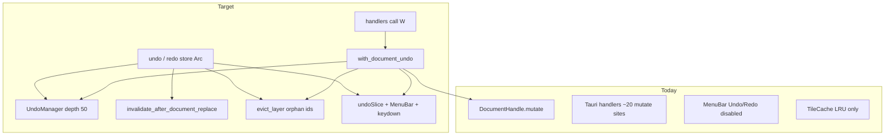

# Design: Track N — Undo / Redo (Snapshot History)

> **Status:** spec only. Source: [TASK_track_n_undo_redo.md](../TASK_track_n_undo_redo.md).
> Checklist: [tasks.md](./tasks.md).

## Overview

| ID | Deliverable | Notes |
|----|-------------|-------|
| **N1** | `UndoManager` + History_Wrapper + `undo`/`redo` IPC | `src-tauri/src/undo.rs`; `AppState.undo_manager` |
| **N2** | Migrate all document-mutating commands onto the wrapper; replace-ops clear stacks | Inventory in N0 |
| **N3** | `evict_layer` + Orphan_GC on overflow, undo/redo, redo-clear, replace | First production per-layer eviction |
| **N4** | Frontend: `undoSlice` from event, MenuBar, window keydown | No polling; no second debounce |
| **N5** | Tests + Track A diagnostic note | Req 7–8 |

**Gate:** Track K closed (100ms IPC debounce in `useEffectLayer`). No H–M gate.

---

## Goals / Non-Goals

| Goals | Non-Goals |
|-------|-----------|
| Snapshot `Arc<Document>` history | Command/diff inverses |
| One wrapper; replace clears stacks | Undo UI chrome / selection / viewport |
| Orphan layer GC | Paint/brush pixel diffs |
| Shortcuts even in NumberInput | Native Tauri Menu rebuild |

---

## Why snapshot, not command/diff

`DocumentHandle::mutate` already clones the `Document` (persistent-style: unchanged
`Arc` subtrees stay shared; only the path to the edit is new). Pushing
`snapshot()` (an `Arc` clone) onto the undo stack is the same cost the write
path already pays. Inverse-ops would double the mutation surface for little
memory win.

**Applicability boundary:** pixels are not in `Document`; they live in
`TileCache` by `LayerId`. Undo of structure is complete for today’s model
(import once + deterministic filters). Paint/brush would need a different
mechanism — out of scope, recorded as a boundary, not a TODO.

TASK sketch used `load_full`/`store`/`AppError`. As-built API:

| TASK sketch | Code |
|-------------|------|
| `document_handle.load_full()` | `DocumentHandle::snapshot()` → `Arc<Document>` |
| `document_handle.store(arc)` | `ArcSwap::store` via handle (add a thin `store(Arc<Document>)` **or** `mutate(\|d\| *d = (*arc).clone())` — prefer **`store` on the handle** so undo does not deep-clone) |
| `FnOnce(&Document) -> Document` | Keep existing `FnOnce(&mut Document)` / `engine_commands::*`; wrapper captures before-Arc then runs them |
| `AppError::NothingToUndo` | `Result<T, String>`: `"nothing to undo"` / `"nothing to redo"` |

`DocumentHandle` today has `snapshot` + `mutate` only. Add:

```rust
pub fn store(&self, doc: Arc<Document>) {
    self.current.store(doc);
}
```

Undo/redo must `store` the Arc, not `mutate(|d| *d = (*prev).clone())` —
the latter would deep-clone and break identity with the stacked snapshot.

---

## Locked decisions

| Topic | Decision |
|-------|----------|
| History model | Snapshot `Arc<Document>`, not command/diff |
| `max_depth` | **50** |
| Module | `src-tauri/src/undo.rs`; `Mutex<UndoManager>` on `AppState` (`std::sync::Mutex`, same as other AppState fields) |
| Wrapper shape | Capture `before = snapshot()`, run `FnOnce() -> Result<T, String>`, on `Ok` record `before`, on `Err` no-op |
| `engine_commands` | Unchanged internals; Tauri handlers wrap the call |
| Replace | `install_raster_document`, `open_project`, `create_document`, `new_document` → `clear_history` + Orphan_GC vs new doc. **Not** an undo step |
| `save_project*` / exports / reads / selection / panels / viewport | Not wrapped |
| Palettes | In `Document` → wrapped. After undo/redo/replace: evict `palette_cache` / `palette_lut_cache` for ids **not** in the live document (lazy rebuild on next use) |
| Invalidation on undo/redo | **Exactly** `invalidate_after_document_replace` + `schedule_dirty_viewport_tiles` + `emit_document_changed`. Plus Orphan_GC + palette-cache sync |
| `document-changed` kind | `document_undone` / `document_redone`. Extend `listeners.ts` so these kinds refresh document **and** layers **and** filters (today only some kinds refresh layers/filters) |
| In-flight tasks | Worker compares `task.generation != live document_gen` → discard. After `store(prev)`, **bump `document_gen` on the live snapshot** so in-flight tasks from the other side cannot match. Atomcs live on that Arc only after it is current (popped from the stack). Then invalidate + reschedule viewport |
| Scheduler | Do **not** add a new `clear_all` policy beyond what replace already does; bumping gen + dirty marks is the same class of safety as slider changes |
| UndoStateDto to UI | Event `undo-state-changed` `{ can_undo, can_redo }` from wrapper / undo / redo / clear. Commands `undo`/`redo` also **return** the DTO. Do not change other command return types |
| Debounce | Backend = 1 snapshot per wrapper call. Coalesce = existing `useEffectLayer` 100ms (`updateParams` and `updateBlend`). No undo timer |
| Menu / shortcuts | Custom `MenuBar`; **no** new native Tauri Menu. Window `keydown` in `AppLayout` (or a tiny `useUndoShortcuts` hook). macOS: ⌘Z / ⌘⇧Z; else Ctrl+Z / Ctrl+Shift+Z. Steal from focused inputs (`preventDefault`). No Ctrl+Y in MVP |
| Empty stacks | String errors; menu disabled; shortcut no-op when `!can_*` or `!hasDocument` |
| GC helpers to add | `TileCache::evict_layer`; `ErrorResidualsStore::evict_layer`; `BlockRepresentativeCache::evict_layer` (retain keys whose `.layer != id`) |
| `GenerationTracker` | `Clone` copies atomics/DashMap by value — stacked Arcs do **not** share gens. Do not increment gens on an Arc that is still sitting in a stack |

---

## Current → Target



| Area | Today | Target |
|------|--------|--------|
| History | `revision` counter only | Bounded snapshot stacks |
| Mutate sites | Direct `mutate` / `engine_commands` | All go through wrapper or `clear_history` |
| Edit menu | Always disabled | `can_undo` / `can_redo` |
| Shortcuts | None | Window keydown, works in NumberInput |
| Layer tile GC | Never by layer | Orphan_GC |

---

## Architecture

### N1 — `UndoManager`

```rust
pub struct UndoManager {
    undo_stack: VecDeque<Arc<Document>>,
    redo_stack: Vec<Arc<Document>>,
    max_depth: usize, // 50
}

pub struct UndoStateDto {
    pub can_undo: bool,
    pub can_redo: bool,
}
```

```text
with_document_undo(state, app, f) -> Result<T, String>
  before = document_handle.snapshot()
  result = f()?                          // existing mutate inside
  record_mutation(state, before)         // push, trim, clear redo, GC
  emit undo-state-changed
  Ok(result)

record_mutation(state, before)
  push_back before
  if len > 50: dropped = pop_front; gc(dropped)
  redo_stack.clear(); gc_after_redo_clear
  // live doc is whatever f() stored

undo / redo
  pop / push as TASK
  document_handle.store(restored)
  restored.generations.increment_document_gen()
  gc vs live + stacks
  sync_palette_caches
  invalidate_after_document_replace
  schedule_dirty_viewport_tiles
  emit document-changed + undo-state-changed
  Ok(state_dto)

clear_history(state, app)               // Document_Replace
  take both stacks, clear
  gc vs live doc (all ids only in dropped snapshots)
  sync_palette_caches
  emit undo-state-changed {false, false}
```

`gc_orphaned_layers`: union of `LayerId` in live doc + both stacks;
evict ids that appear in the dropped set (or, on undo/redo, ids that were
in the outgoing live doc / abandoned redo entries) and are not in that union.

On overflow the TASK sketch only diffs the dropped front snapshot — keep that
plus a full “ids in outgoing live vs still referenced” pass on undo/redo/clear
so abandoning redo cannot leak.

Collect layer ids by walking `Document.root` (`LayerNode::Leaf` / `Group`).

### N2 — Call-site inventory (N0 fills exact list)

**Wrapper (record undo):** every handler that today calls
`document_handle.mutate` or `engine_commands::{add,remove,set,reorder}_layer`
except Document_Replace.

Expected set (confirm in N0):

- layers: `add_layer`, `remove_layer`, `set_layer_props`, `reorder_layer`
- filters: `add_filter`, `remove_filter`, `reorder_filter`, `update_filter`
- pattern: `import_pattern`
- palettes that write `Document.palettes`: `import_builtin_palette`,
  `import_palette`, `add_palette`, `generate_palette`, `remove_palette`,
  `rename_palette`, `create_palette`, `add_color_to_palette`,
  `update_palette_color`, `remove_palette_color`, `reorder_palette_color`,
  `delete_palette`

**`clear_history`:** `install_raster_document` (covers `load_image` +
`create_document`), `open_project`, `new_document`.

**Not wrapped:** `save_project` / `save_project_as`, exports, getters,
`set_selection`, panel/viewport commands, Color Lab draft IPC,
`generate_ramp_palette` / `generate_harmony_palette` if they only return
computed colors without writing the document (confirm in N0).

Do **not** wrap from inside `DocumentHandle::mutate` — workers and tests
use it; undo is a Tauri/`AppState` concern.

### N3 — `evict_layer`

`TileKey.layer: LayerId` (`u32`). Implement:

```text
TileCache::evict_layer(layer)
  retain entries where key.layer != layer
  (best-effort: also drop matching keys from the LRU SegQueue on pop,
   same as existing eviction — stale queue entries already ignored)

ErrorResidualsStore::evict_layer(layer)
  entries.retain(|(l, _), _| l.0 != layer)  // key is (LayerId, TileCoord)

BlockRepresentativeCache::evict_layer(layer)
  raw/dithered/populated retain k.layer != layer
```

Palette caches: `sync_palette_caches(state, live_doc)` — `evict` every
`PaletteId` present in `palette_cache` / `lut` that is not in
`live_doc.palettes`. Call after undo/redo/clear. Mutation handlers that
already evict on delete MAY keep doing so; sync is the undo/redo safety net.

### N4 — Frontend

**IPC:** `frontend/src/shared/ipc/undo.ts` — `undo()`, `redo()`, type
`UndoStateDto`. Listen `undo-state-changed` next to `onDocumentChanged`.

**RTK:** small `undoSlice` `{ canUndo, canRedo }` updated by the event
listener in `listeners.ts`. `undo`/`redo` thunks invoke IPC; fulfilled
payload can also write the DTO (event is enough if invoke also emits).

**MenuBar:** props `canUndo` / `canRedo` / `onUndo` / `onRedo` (or read the
slice). Items disabled from those flags. Click → thunk.

**Shortcuts:** `useUndoShortcuts` in `AppLayout`:

- `metaKey|ctrlKey` + `z` without shift → undo
- `metaKey|ctrlKey` + `z` with shift → redo
- `preventDefault` / `stopPropagation` always when `hasDocument`
- ignore when target is not our concern? **No** — TASK requires stealing
  from inputs. Only skip if `!hasDocument` or the matching `can_*` is false
  (still `preventDefault` when we would have handled it, so the browser does
  not undo text while `can_undo` is true; when `!can_undo`, let the input
  keep native text undo)

Lock the last row: **if `can_undo`, steal; if not, do not preventDefault**
so an empty document history still allows text-field undo. When `can_undo`
and focus is NumberInput, document wins (acceptance test 6).

---

## Errors

| Case | Behavior |
|------|----------|
| `undo` empty stack | `"nothing to undo"`; document unchanged |
| `redo` empty stack | `"nothing to redo"`; document unchanged |
| Inner mutation `Err` | No stack push, no redo clear |
| `evict_layer` missing keys | No-op, not an error |
| Shortcut while `!hasDocument` | Ignore |

---

## Testing strategy

| Test | Assert |
|------|--------|
| Unit: wrapper | Successful mutate → `can_undo`; fail → stacks unchanged |
| Unit: redo break | undo then mutate → redo errors |
| Unit: depth | 55 mutates, 50 undos, 51st undo errors |
| Unit: GC | Layer tiles present while id in a stack; gone when orphaned |
| Unit: replace | `clear_history` → both flags false |
| Unit: `evict_layer` | All stages for that layer removed; other layers kept |
| RTL: MenuBar | enabled/disabled from props (replace today’s always-disabled test) |
| RTL: keydown | focused NumberInput + meta/ctrl+Z → undo invoke |
| Hook: debounce | existing 100ms `updateParams` still one IPC |
| Backend: N `update_filter` | N undo steps |
| Post-merge | Re-read `diffusion_skip_counter` / skip-branch note (Req 8) |

Prefer a test `AppState` / injected `UndoManager` + `TileCache` (commands.rs
already has a test module near the bottom). Do not hit a real window.

Composite identity: document tree equality is the default. Reuse a pipeline
hash helper only if one is already easy to call from the same test crate.

---

## Future

- Persistent / named history
- Ctrl+Y redo
- Native Menu accelerators
- Paint-aware undo
- Tune `max_depth` from memory profiles
