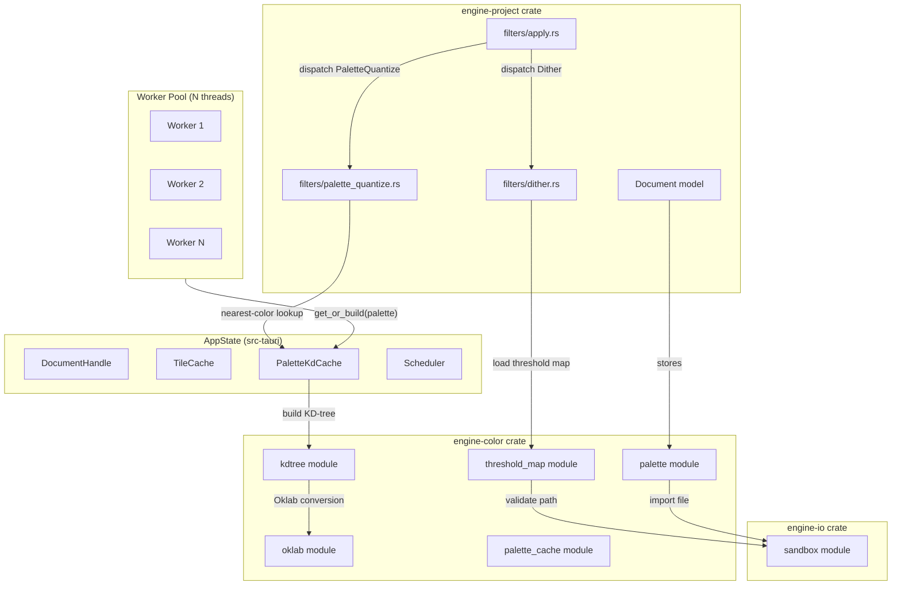
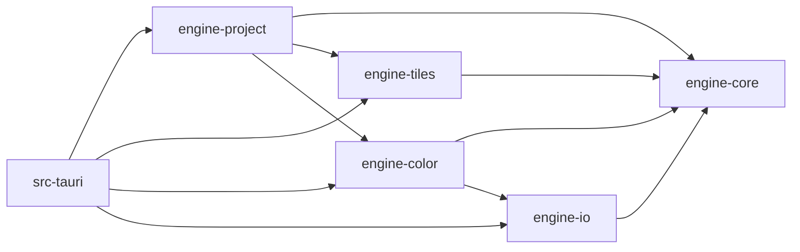

# Design Document: Color and Palette Engine

## Overview

This design covers the implementation of the `engine-color` crate and palette-aware filter pipeline for the Dither Yuki 2 image-processing engine. The system introduces:

1. **Oklab color space conversions** operating on already-linearized RGB data from `PixelTile`
2. **Document-level Palette entities** with import/export/generation capabilities
3. **A global DashMap-based KD-tree cache** (`PaletteKdCache`) for concurrent nearest-color lookups across worker threads
4. **Two distinct filter kinds**: `Dither` (palette-free channel quantization) and `PaletteQuantize` (Oklab-based palette quantization)
5. **Custom PNG threshold maps** with sandbox path validation
6. **A shared `resolve_user_path` utility** in `engine-io` for consistent security enforcement

The critical architectural constraint: `PixelTile` already stores **linear RGB f32** data — no sRGB linearization step is needed before Oklab conversion. The LMS matrix multiplication applies directly to the linear RGB values from the tile.

## Architecture

### System Context



### Dependency Graph (Crate Level)



Key constraints:
- `engine-color` depends on `engine-io` (for sandbox validation) and `engine-core` only
- `engine-color` does NOT depend on `engine-project` or `engine-tiles` (leaf crate)
- `engine-io` depends only on `engine-core` (independent utility)

### Concurrency Model

The KD-tree cache uses a **last-writer-wins** strategy with `DashMap`:
- Multiple workers can concurrently read the same `Arc<KdTree>` without contention
- If a palette revision changes, concurrent builds may race — the last insert wins
- No blocking on reads; the `DashMap` shard lock is held only during insert (nanoseconds)
- This matches the existing `TileCache`/`GenerationTracker` patterns in the codebase

## Components and Interfaces

### 1. Oklab Module (`engine-color::oklab`)

```rust
/// Linear RGB color (f32, channels in [0.0, 1.0]).
/// Matches the internal representation of PixelTile.
#[derive(Debug, Clone, Copy, PartialEq)]
pub struct LinRgb {
    pub r: f32,
    pub g: f32,
    pub b: f32,
}

/// Oklab color (perceptually uniform).
#[derive(Debug, Clone, Copy, PartialEq)]
pub struct Oklab {
    pub l: f32, // Lightness [0, 1]
    pub a: f32, // Green-red axis [-0.5, 0.5] approx
    pub b: f32, // Blue-yellow axis [-0.5, 0.5] approx
}

/// Convert linear RGB to Oklab.
/// Assumes sRGB/Rec.709 primaries. Input channels are clamped to [0, 1].
/// NaN/Inf values are replaced with 0.0 before conversion.
///
/// NOTE: The LMS matrix assumes sRGB/Rec.709 primaries.
/// Inputs from non-sRGB working spaces require prior ICC-based
/// conversion to linear sRGB before calling this function.
pub fn linear_to_oklab(rgb: LinRgb) -> Oklab { /* ... */ }

/// Convert Oklab back to linear RGB.
/// Result channels are clamped to [0.0, 1.0].
/// NaN/Inf values are replaced with 0.0 before conversion.
pub fn oklab_to_linear(lab: Oklab) -> LinRgb { /* ... */ }

/// Squared Euclidean distance in Oklab space (avoids sqrt for comparisons).
pub fn oklab_dist_sq(a: Oklab, b: Oklab) -> f32 { /* ... */ }
```

**Algorithm (linear RGB → Oklab):**
1. Sanitize inputs: replace NaN/Inf with 0.0, clamp to [0, 1]
2. Linear RGB → LMS via Björn Ottosson matrix multiplication (no linearization — input is already linear)
3. LMS → L'M'S' via cube root: `l' = l.cbrt()` (or `l.powf(1.0/3.0)`)
4. L'M'S' → Oklab via second matrix multiplication

**Algorithm (Oklab → linear RGB):**
1. Sanitize inputs: replace NaN/Inf with 0.0
2. Oklab → L'M'S' via inverse matrix
3. L'M'S' → LMS via cube: `l = l' * l' * l'`
4. LMS → linear RGB via inverse LMS matrix
5. Clamp result to [0.0, 1.0]

### 2. KD-Tree Module (`engine-color::kdtree`)

```rust
/// A 3-dimensional KD-tree for nearest-neighbor search in Oklab space.
pub struct KdTree {
    nodes: Vec<KdNode>,
    points: Vec<Oklab>,   // Original palette colors in Oklab
    indices: Vec<usize>,  // Maps tree leaf → palette index
}

enum KdNode {
    Leaf { point_idx: usize },
    Split { axis: u8, threshold: f32, left: usize, right: usize },
}

impl KdTree {
    /// Build a KD-tree from palette colors (already in Oklab space).
    /// Returns None if colors is empty.
    pub fn build(colors: &[Oklab]) -> Option<Self> { /* ... */ }

    /// Find the nearest palette color index for a query point.
    /// Uses Euclidean (L2) distance. Ties broken by lowest index.
    pub fn nearest(&self, query: Oklab) -> usize { /* ... */ }
}
```

**Build algorithm:**
- Recursive median split along the axis with greatest variance
- Leaf nodes for single points
- O(n log n) construction, O(log n) average query

**Nearest-neighbor search:**
- Standard KD-tree pruning with backtracking
- Tie-breaking: if `dist == best_dist`, prefer the lower palette index

### 3. Palette Module (`engine-color::palette`)

```rust
/// A single color in linear RGB (matching PixelTile representation).
#[derive(Debug, Clone, Copy, PartialEq, Serialize, Deserialize)]
pub struct LinearColor {
    pub r: f32,
    pub g: f32,
    pub b: f32,
}

/// A named, ordered palette stored in the Document.
#[derive(Debug, Clone, Serialize, Deserialize)]
pub struct Palette {
    pub id: PaletteId,
    pub name: String,           // 1–255 chars
    pub colors: Vec<LinearColor>, // 1–65536 entries
    pub revision: u64,          // Incremented on any color modification
}

/// Supported palette file formats.
#[derive(Debug, Clone, Copy, PartialEq, Eq)]
pub enum PaletteFormat {
    Ase,  // Adobe Swatch Exchange
    Aco,  // Adobe Color
    Gpl,  // GIMP Palette
    Pal,  // Microsoft RIFF Palette
    Csv,  // Comma-separated values
    Json, // JSON array of {r, g, b}
}

/// Parse a palette file into sRGB u8 triples, then convert to linear RGB.
pub fn import_palette(
    path: &std::path::Path,
    format: PaletteFormat,
) -> Result<Vec<LinearColor>, PaletteError> { /* ... */ }

/// Export a palette to the given format as bytes.
pub fn export_palette(
    palette: &Palette,
    format: PaletteFormat,
) -> Result<Vec<u8>, PaletteError> { /* ... */ }

/// sRGB gamma decoding: u8 → linear f32
pub fn srgb_to_linear(value: u8) -> f32 { /* ... */ }

/// sRGB gamma encoding: linear f32 → u8 (clamps input to [0, 1])
pub fn linear_to_srgb(value: f32) -> u8 { /* ... */ }

/// Palette generation methods.
#[derive(Debug, Clone, Copy)]
pub enum PaletteGenMethod {
    MedianCut,
    KMeans,
}

/// Generate a palette from an iterator of linear RGB pixels.
/// Skips fully transparent pixels.
pub fn generate_palette(
    pixels: impl Iterator<Item = LinearColor>,
    target_count: u16,  // 2–256
    method: PaletteGenMethod,
) -> Result<Vec<LinearColor>, PaletteError> { /* ... */ }
```

**File format parsers** (in `engine-color::palette::formats`):

| Module | Format | Notes |
|--------|--------|-------|
| `ase.rs` | Adobe Swatch Exchange | Binary, big-endian header + color blocks |
| `aco.rs` | Adobe Color | Binary, version 1/2 with u16 CMYK/RGB/HSB |
| `gpl.rs` | GIMP Palette | Text-based, `GIMP Palette` header + `R G B` lines |
| `pal.rs` | Microsoft RIFF | Binary RIFF container with `data` chunk |
| `csv_json.rs` | CSV and JSON | Text-based, trivial parsing |

Each parser:
- Returns `Vec<(u8, u8, u8)>` (sRGB)
- Returns descriptive error with byte offset or line number on failure
- Validates 1–65536 entry count

Each pretty-printer:
- Takes `&[LinearColor]` → converts to sRGB u8 → formats to file bytes
- Round-trip: `parse(export(palette))` ≈ `palette` (±1 per channel for u8 quantization)

**Palette generation:**

- **MedianCut**: Recursively split the color bounding box along the longest axis at the median until target_count bins are reached. Return the mean color of each bin.
- **KMeans**: Initialize via k-means++ (distance-weighted random selection), iterate until max centroid movement < 1e-4 or 50 iterations reached.

### 4. PaletteKdCache Module (`engine-color::palette_cache`)

```rust
use dashmap::DashMap;
use std::sync::Arc;

/// Global concurrent cache mapping PaletteId → (revision, KD-tree).
pub struct PaletteKdCache {
    entries: DashMap<PaletteId, (u64, Arc<KdTree>)>,
}

impl PaletteKdCache {
    pub fn new() -> Self { /* ... */ }

    /// Get or build a KD-tree for the given palette.
    /// Returns Arc<KdTree> for lock-free sharing across threads.
    /// If palette has 0 colors, returns Err.
    pub fn get_or_build(&self, palette: &Palette) -> Result<Arc<KdTree>, PaletteError> {
        // 1. Check cache: if entry exists with matching revision, return Arc clone
        // 2. Otherwise: convert palette colors to Oklab, build KdTree
        // 3. Insert (palette.id, (palette.revision, Arc::new(tree)))
        // 4. Return the new Arc
        // Race condition: concurrent builds → last-writer-wins (DashMap insert)
    }

    /// Evict entry for a removed palette.
    pub fn evict(&self, palette_id: PaletteId) {
        self.entries.remove(&palette_id);
    }
}
```

### 5. Threshold Map Module (`engine-color::threshold_map`)

```rust
use dashmap::DashMap;
use std::path::PathBuf;
use std::sync::Arc;
use std::time::SystemTime;

/// A loaded threshold map: normalized f32 values [0.0, 1.0].
pub struct ThresholdMap {
    pub data: Vec<f32>,
    pub width: u32,
    pub height: u32,
}

impl ThresholdMap {
    /// Sample the map at global pixel coordinates (wraps via modulo).
    pub fn sample(&self, global_x: u32, global_y: u32) -> f32 {
        let x = global_x % self.width;
        let y = global_y % self.height;
        self.data[(y * self.width + x) as usize]
    }
}

/// Cache key: canonical path + modification time.
type ThresholdCacheKey = (PathBuf, SystemTime);

/// Global cache for loaded threshold maps (max 64 entries, LRU eviction).
pub struct ThresholdMapCache {
    entries: DashMap<ThresholdCacheKey, Arc<ThresholdMap>>,
    // LRU tracking (access order for eviction at 64 capacity)
}

impl ThresholdMapCache {
    /// Load or retrieve a cached threshold map.
    /// Validates: sandbox path, grayscale PNG, dimensions ≤ 4096×4096.
    pub fn get_or_load(
        &self,
        path: &std::path::Path,
    ) -> Result<Arc<ThresholdMap>, ThresholdMapError> { /* ... */ }
}
```

**Loading pipeline:**
1. Call `engine_io::sandbox::resolve_user_path(path, &["png"])` → canonical path
2. Get file mtime via `fs::metadata`
3. Check cache: if `(canonical_path, mtime)` exists → return cached `Arc`
4. Read PNG, validate grayscale (1-bit or 8-bit), validate dimensions ≤ 4096×4096
5. Normalize pixel values to [0.0, 1.0]
6. If cache has 64 entries, evict LRU
7. Insert and return

### 6. Sandbox Module (`engine-io::sandbox`)

```rust
use std::path::{Path, PathBuf};
use thiserror::Error;

#[derive(Debug, Error)]
pub enum SandboxError {
    #[error("file extension not in allowed list")]
    BadExtension,
    #[error("resolved path is outside user's home directory")]
    OutsideHome,
    #[error("file not found or permission denied")]
    NotFound,
    #[error("cannot determine user's home directory")]
    NoHome,
}

/// Validate an external file path against allowed extensions
/// and ensure it resolves within the user's home directory.
///
/// Steps:
/// 1. Check file extension (case-insensitive ASCII) against allowed_ext
/// 2. Canonicalize path (resolves symlinks and `..` components)
/// 3. Verify canonicalized path starts with user's home directory
pub fn resolve_user_path(
    raw: &str,
    allowed_ext: &[&str],
) -> Result<PathBuf, SandboxError> { /* ... */ }
```

### 7. Document Model Extensions (`engine-project`)

The `Document` struct gains a full `Vec<Palette>` (replacing the current `Vec<PaletteId>` placeholder):

```rust
pub struct Document {
    // ... existing fields ...
    pub palettes: Vec<Palette>,  // Full palette entities (was Vec<PaletteId>)
    // ... remaining fields ...
}
```

**Palette management methods on Document:**

```rust
impl Document {
    /// Add a palette, assign next available PaletteId, set revision=1.
    pub fn add_palette(&mut self, name: String, colors: Vec<LinearColor>) -> PaletteId { /* ... */ }

    /// Modify palette colors, increment revision.
    pub fn modify_palette(&mut self, id: PaletteId, colors: Vec<LinearColor>) -> Result<(), EngineError> { /* ... */ }

    /// Remove palette — fails if any FilterInstance references it.
    pub fn remove_palette(&mut self, id: PaletteId) -> Result<(), EngineError> { /* ... */ }

    /// Find palette by ID.
    pub fn get_palette(&self, id: PaletteId) -> Option<&Palette> { /* ... */ }
}
```

### 8. Filter Kind Separation (`engine-project::filter`)

```rust
#[derive(Debug, Clone, Copy, PartialEq, Eq, Serialize, Deserialize)]
pub enum FilterKind {
    Curves,
    Levels,
    Dither,
    PaletteQuantize,  // NEW
    Glitch,
    Placeholder,
}

/// Dither modes (expanded from current DitherAlgorithm).
#[derive(Debug, Clone, Serialize, Deserialize)]
pub enum DitherMode {
    Bayer { matrix_size: u8 },          // 2, 4, or 8
    ThresholdMap { path: String },       // Custom PNG path
    ErrorDiffusion { kernel: DiffusionKernel },
}

#[derive(Debug, Clone, Copy, Serialize, Deserialize)]
pub enum DiffusionKernel {
    FloydSteinberg,
    Atkinson,
    JarvisJudiceNinke,
    Stucki,
}

#[derive(Debug, Clone, Serialize, Deserialize)]
pub enum FilterParams {
    Curves { curve: Vec<(f32, f32)>, channel: CurveChannel },
    Levels { input_black: f32, input_white: f32, gamma: f32, output_black: f32, output_white: f32 },
    Dither {
        mode: DitherMode,
        color_depth: u8,  // 1–8 bits per channel
    },
    PaletteQuantize {
        palette_id: PaletteId,
        diffusion: Option<DiffusionKernel>,  // None = nearest-only
    },
    Glitch { glitch_type: GlitchType, intensity: f32, seed: u64 },
    Placeholder(String),
}
```

### 9. Dither Filter (`engine-project::filters::dither`)

Expanded implementation covering all four modes:

```rust
pub struct DitherFilter;

impl DitherFilter {
    /// Apply dither to a tile. Uses global pixel coords for seamless tiling.
    pub fn apply(
        tile: &PixelTile,
        coord: TileCoord,
        mode: &DitherMode,
        color_depth: u8,
        threshold_cache: &ThresholdMapCache,
    ) -> Result<PixelTile, EngineError> { /* ... */ }
}
```

**Bayer mode:**
- Precomputed 2×2, 4×4, 8×8 normalized matrices
- Global coords: `gx = coord.x * TILE_SIZE + local_x`, `gy = coord.y * TILE_SIZE + local_y`
- Threshold lookup: `bayer[gy % N][gx % N]`
- Quantize: `floor(pixel * levels + threshold) / levels`

**ThresholdMap mode:**
- Load map via `ThresholdMapCache::get_or_load`
- Sample: `threshold_map.sample(global_x, global_y)`
- Same quantization as Bayer but with custom pattern

**ErrorDiffusion mode:**
- Process left-to-right, top-to-bottom within tile (260×260 including halo)
- Quantize each pixel to N levels
- Distribute error via kernel weights
- Truncate at tile boundaries (no cross-tile transfer)
- Kernels: Floyd-Steinberg (7/16, 3/16, 5/16, 1/16), Atkinson (1/8 × 6 neighbors), JJN (48-weight), Stucki (42-weight)

**All modes:**
- Alpha preserved unmodified
- Deterministic: same input + coords = same output
- `requires_full_row = false`

### 10. PaletteQuantize Filter (`engine-project::filters::palette_quantize`)

```rust
pub struct PaletteQuantizeFilter;

impl PaletteQuantizeFilter {
    /// Apply palette quantization to a tile.
    pub fn apply(
        tile: &PixelTile,
        coord: TileCoord,
        palette: &Palette,
        kdtree: &KdTree,
        diffusion: Option<DiffusionKernel>,
    ) -> Result<PixelTile, EngineError> { /* ... */ }
}
```

**Algorithm (nearest-color only, diffusion=None):**
1. For each pixel (x, y) in tile:
   - Read linear RGB from tile
   - Convert to Oklab via `linear_to_oklab`
   - Find nearest palette index via `kdtree.nearest(oklab)`
   - Write `palette.colors[index]` (linear RGB) to output tile
   - Copy alpha unchanged

**Algorithm (with error diffusion):**
1. Allocate Oklab error buffer (260×260×3)
2. For each pixel left-to-right, top-to-bottom:
   - Convert pixel to Oklab
   - Add accumulated error from buffer
   - Clamp: L∈[0,1], a∈[-0.5, 0.5], b∈[-0.5, 0.5]
   - Find nearest via KD-tree
   - Compute error = adjusted_oklab - nearest_oklab
   - Distribute error to neighbors via kernel (truncate at boundaries)
   - Write nearest palette color (linear RGB) to output
3. Alpha preserved unmodified

**Invariant:** Every output pixel RGB exactly matches a palette entry.

### 11. Filter Dispatcher Update (`engine-project::filters::apply`)

```rust
pub fn apply_filter_to_tile(
    tile: &PixelTile,
    layer: &Layer,
    coord: TileCoord,
    palette_cache: &PaletteKdCache,
    threshold_cache: &ThresholdMapCache,
    document: &Document,
) -> Result<PixelTile, EngineError> {
    let mut result = tile.clone();
    for filter in &layer.filters {
        if !filter.enabled { continue; }
        result = match &filter.params {
            FilterParams::Dither { mode, color_depth } => {
                DitherFilter::apply(&result, coord, mode, *color_depth, threshold_cache)?
            }
            FilterParams::PaletteQuantize { palette_id, diffusion } => {
                let palette = document.get_palette(*palette_id)
                    .ok_or(EngineError::palette_not_found(*palette_id))?;
                let tree = palette_cache.get_or_build(palette)?;
                PaletteQuantizeFilter::apply(&result, coord, palette, &tree, *diffusion)?
            }
            FilterParams::Curves { .. } => { /* existing */ }
            FilterParams::Levels { .. } => { /* existing */ }
            FilterParams::Glitch { .. } => { /* existing */ }
            FilterParams::Placeholder(_) => result,
        };
    }
    Ok(result)
}
```

## Data Models

### Palette Entity

```rust
Palette {
    id: PaletteId(u32),        // Unique within Document
    name: String,               // 1–255 chars
    colors: Vec<LinearColor>,   // 1–65,536 entries, linear RGB f32
    revision: u64,              // Starts at 1, incremented on each modification
}
```

**Serialization:** Included in Document JSON with all fields. Round-trip lossless (f32 precision).

### KD-Tree Node Layout

```rust
// Compact node representation for cache-friendly traversal
enum KdNode {
    Leaf { point_idx: usize },
    Split {
        axis: u8,          // 0=L, 1=a, 2=b
        threshold: f32,    // Split plane value
        left: usize,       // Index into nodes vec
        right: usize,      // Index into nodes vec
    },
}
```

### Threshold Map

```rust
ThresholdMap {
    data: Vec<f32>,    // Row-major, normalized [0.0, 1.0]
    width: u32,        // 2–4096
    height: u32,       // 2–4096
}
```

### Error Types

```rust
// engine-color errors
#[derive(Debug, Error)]
pub enum PaletteError {
    #[error("palette is empty (0 colors)")]
    Empty,
    #[error("palette exceeds maximum size (65536 colors)")]
    TooLarge,
    #[error("parse error in {format} at {location}: {reason}")]
    ParseError { format: String, location: String, reason: String },
    #[error("unsupported format: {0}")]
    UnsupportedFormat(String),
    #[error("sandbox error: {0}")]
    Sandbox(#[from] SandboxError),
    #[error("palette not found: {0}")]
    NotFound(PaletteId),
    #[error("generation failed: {0}")]
    GenerationFailed(String),
}

#[derive(Debug, Error)]
pub enum ThresholdMapError {
    #[error("not grayscale: found {actual} color type, expected 1-bit or 8-bit grayscale")]
    NotGrayscale { actual: String },
    #[error("dimensions {w}×{h} exceed maximum 4096×4096")]
    TooLarge { w: u32, h: u32 },
    #[error("I/O error: {0}")]
    Io(String),
    #[error("PNG decode error: {0}")]
    Decode(String),
    #[error("sandbox error: {0}")]
    Sandbox(#[from] SandboxError),
}
```

### Crate Module Structure

```
crates/engine-color/
├── Cargo.toml
└── src/
    ├── lib.rs              # pub mod declarations
    ├── oklab.rs            # LinRgb, Oklab, conversions
    ├── kdtree.rs           # KdTree, KdNode, nearest-neighbor
    ├── palette/
    │   ├── mod.rs          # Palette, LinearColor, PaletteFormat, import/export API
    │   ├── formats/
    │   │   ├── mod.rs      # Format dispatcher
    │   │   ├── ase.rs      # Adobe Swatch Exchange parser/writer
    │   │   ├── aco.rs      # Adobe Color parser/writer
    │   │   ├── gpl.rs      # GIMP Palette parser/writer
    │   │   ├── pal.rs      # Microsoft RIFF Palette parser/writer
    │   │   └── csv_json.rs # CSV and JSON parser/writer
    │   └── generate.rs     # MedianCut, KMeans palette generation
    ├── palette_cache.rs    # PaletteKdCache (DashMap-based)
    └── threshold_map.rs    # ThresholdMap, ThresholdMapCache

crates/engine-io/
├── Cargo.toml
└── src/
    ├── lib.rs              # pub mod declarations
    └── sandbox.rs          # resolve_user_path, SandboxError

crates/engine-project/src/filters/
├── mod.rs                  # Updated re-exports
├── apply.rs                # Updated dispatcher
├── dither.rs               # Expanded: Bayer, ThresholdMap, ErrorDiffusion
├── palette_quantize.rs     # NEW: Oklab quantization with KD-tree
├── curves.rs               # Unchanged
├── glitch.rs               # Unchanged
└── levels.rs               # Unchanged
```


## Correctness Properties

*A property is a characteristic or behavior that should hold true across all valid executions of a system — essentially, a formal statement about what the system should do. Properties serve as the bridge between human-readable specifications and machine-verifiable correctness guarantees.*

### Property 1: Oklab Round-Trip

*For any* linear RGB triplet where each channel is in [0.0, 1.0], converting to Oklab via `linear_to_oklab` and back to linear RGB via `oklab_to_linear` SHALL produce values within 1e-5 absolute tolerance per channel of the original input.

**Validates: Requirements 1.1, 1.2, 1.3**

### Property 2: Palette ID Uniqueness

*For any* sequence of palette additions to a Document, all assigned PaletteIds SHALL be unique, and each newly added palette SHALL have revision equal to 1.

**Validates: Requirements 2.2**

### Property 3: Palette Revision Monotonicity

*For any* palette in a Document, after any modification to its color list (add, remove, reorder, or change), the revision counter SHALL be strictly greater than the revision before the modification.

**Validates: Requirements 2.3**

### Property 4: Palette Removal Referential Integrity

*For any* Document containing palettes and filters, a palette removal SHALL succeed if and only if no FilterInstance in the Document references that PaletteId. If any reference exists, removal SHALL fail with an error.

**Validates: Requirements 2.4, 2.5**

### Property 5: Document Palette Serialization Round-Trip

*For any* Document containing a non-empty palette collection, serializing the Document to JSON and deserializing it back SHALL produce a palette collection with identical PaletteId, name, color values, and revision for every palette.

**Validates: Requirements 2.6**

### Property 6: Palette Format Export/Import Round-Trip

*For any* valid Palette (1–65536 colors, each channel in [0.0, 1.0]) and any supported format (GPL, JSON, ASE, ACO, PAL, CSV), exporting the palette to that format and re-importing the resulting bytes SHALL produce a color list where each channel differs by at most 1 (in u8 sRGB space) from the original.

**Validates: Requirements 3.1, 3.3, 3.7, 3.8, 4.1**

### Property 7: Export Clamping Produces Valid sRGB

*For any* linear RGB color (including values outside [0.0, 1.0]), the sRGB export conversion SHALL produce u8 values in [0, 255] without panic or overflow.

**Validates: Requirements 4.2**

### Property 8: Palette Generation Count Bound

*For any* set of non-transparent pixels and target color count (2–256), palette generation (MedianCut or KMeans) SHALL produce a palette with at most min(target_count, unique_colors_in_input) distinct colors and at least 1 color.

**Validates: Requirements 5.1, 5.7**

### Property 9: KD-Tree Nearest Matches Brute-Force

*For any* set of palette colors (1–1000 in Oklab space) and any query point, the KD-tree nearest-neighbor search SHALL return the same index as a brute-force linear scan using Euclidean distance, with ties broken by lowest index.

**Validates: Requirements 6.5, 6.6**

### Property 10: PaletteKdCache Revision Consistency

*For any* palette, the cache SHALL return a KD-tree built from the palette's current colors when the cached revision matches the palette's revision; when the revision differs, the cache SHALL return a freshly-built tree reflecting the updated colors.

**Validates: Requirements 6.2, 6.3**

### Property 11: Dither Seamless Tiling

*For any* two horizontally or vertically adjacent tiles with the same dither parameters (Bayer or ThresholdMap mode), the dither pattern at the shared boundary SHALL be continuous — the threshold value at the last column/row of one tile equals the threshold value at the first column/row of the adjacent tile when using global coordinates.

**Validates: Requirements 7.2, 7.9**

### Property 12: Dither Output Level Membership

*For any* tile processed by the Dither_Filter with color_depth N (1–8), every output pixel's R, G, and B channel value SHALL be a member of the set {k / (2^N - 1) | k ∈ 0..2^N} (the valid quantization levels for that depth).

**Validates: Requirements 7.4**

### Property 13: Alpha Preservation

*For any* tile processed by either the Dither_Filter or the PaletteQuantize_Filter, the alpha channel of every output pixel SHALL be identical to the alpha channel of the corresponding input pixel.

**Validates: Requirements 7.5, 8.7**

### Property 14: Dither Determinism

*For any* tile, tile coordinates, and dither parameters, applying the Dither_Filter twice with identical inputs SHALL produce bitwise-identical output tiles.

**Validates: Requirements 7.6**

### Property 15: PaletteQuantize Output Membership

*For any* tile processed by the PaletteQuantize_Filter (with or without error diffusion), every output pixel's RGB value SHALL exactly match one of the colors in the referenced Palette's color list.

**Validates: Requirements 8.2, 8.3, 8.8**

### Property 16: Threshold Map Sampling Correctness

*For any* loaded ThresholdMap of dimensions (W, H) and any global pixel coordinate (x, y), the sample value SHALL equal `data[(y % H) * W + (x % W)]`, ensuring seamless modulo-based tiling.

**Validates: Requirements 9.3**

### Property 17: Sandbox Validation Correctness

*For any* file path, if `resolve_user_path` returns `Ok(path)`, then: (a) the path's extension is in the allowed list, and (b) the canonical path starts with the user's home directory. If the extension is not allowed, it SHALL return `BadExtension`. If the canonical path escapes home, it SHALL return `OutsideHome`.

**Validates: Requirements 10.2, 10.4, 10.5**


## Error Handling

### Error Propagation Strategy

All errors propagate via `Result<T, E>` — no panics in library code. Each crate defines its own error enum using `thiserror` for ergonomic display/source chaining.

### Error Hierarchy

```
EngineError (engine-project)
├── PaletteNotFound { id: PaletteId }
├── PaletteInUse { id: PaletteId, references: Vec<FilterInstanceId> }
├── InvalidFilterParams { reason: String }
├── ColorError(PaletteError)      // From engine-color
└── IoError(SandboxError)          // From engine-io

PaletteError (engine-color)
├── Empty
├── TooLarge
├── ParseError { format, location, reason }
├── UnsupportedFormat(String)
├── Sandbox(SandboxError)
├── NotFound(PaletteId)
└── GenerationFailed(String)

ThresholdMapError (engine-color)
├── NotGrayscale { actual: String }
├── TooLarge { w, h }
├── Io(String)
├── Decode(String)
└── Sandbox(SandboxError)

SandboxError (engine-io)
├── BadExtension
├── OutsideHome
├── NotFound
└── NoHome
```

### Error Recovery Patterns

| Scenario | Behavior |
|----------|----------|
| Palette not found during filter apply | Return error, tile unchanged |
| Sandbox violation on file load | Return SandboxError immediately, no file I/O attempted |
| Corrupt palette file | Return ParseError with format name and byte offset/line number |
| NaN/Inf in Oklab input | Replace with 0.0, continue (graceful degradation) |
| KD-tree build for empty palette | Return Empty error from cache |
| ThresholdMap load failure | Return specific ThresholdMapError variant |
| Palette removal with references | Return PaletteInUse with list of referencing FilterInstanceIds |
| color_depth out of range (0 or >8) | Return InvalidFilterParams at filter construction time |

### Worker Thread Error Handling

When a worker encounters an error during `compute_processed_tile`:
1. The error is logged (not silently swallowed)
2. The tile is NOT inserted into TileCache (remains dirty)
3. The tile-ready event is NOT emitted
4. Frontend shows the tile as "pending" until the error condition is resolved

This ensures errors are visible to the user (via missing tiles) without crashing worker threads.


## Testing Strategy

### Dual Testing Approach

This feature uses both **property-based tests** (via `proptest`) and **example-based unit tests** for comprehensive coverage.

### Property-Based Testing (proptest)

**Library:** `proptest` (already in workspace dev-dependencies)
**Configuration:** Minimum 100 iterations per property test (via `proptest! { #![proptest_config(ProptestConfig::with_cases(100))] ... }`)

Each property test references its design document property via tag comment:
```rust
// Feature: color-and-palette-engine, Property 1: Oklab round-trip
```

**Properties to implement:**

| # | Property | Crate | Generator Strategy |
|---|----------|-------|--------------------|
| 1 | Oklab round-trip | engine-color | Random f32 triplets in [0.0, 1.0] |
| 2 | Palette ID uniqueness | engine-project | Random sequences of add_palette calls |
| 3 | Palette revision monotonicity | engine-project | Random palette + random modification |
| 4 | Palette removal integrity | engine-project | Random document with palettes + filters |
| 5 | Document palette serialization | engine-project | Random documents with palettes |
| 6 | Format export/import round-trip | engine-color | Random palettes × 6 formats |
| 7 | Export clamping valid sRGB | engine-color | Random f32 including out-of-range |
| 8 | Generation count bound | engine-color | Random pixel sets, random target counts |
| 9 | KD-tree nearest vs brute-force | engine-color | Random palette (2–100 colors), random query |
| 10 | Cache revision consistency | engine-color | Palette with changing revisions |
| 11 | Dither seamless tiling | engine-project | Random adjacent tile pairs + dither params |
| 12 | Dither output level membership | engine-project | Random tiles + color_depth 1–8 |
| 13 | Alpha preservation | engine-project | Random tiles with varying alpha |
| 14 | Dither determinism | engine-project | Random tiles applied twice |
| 15 | PaletteQuantize output membership | engine-project | Random tiles + random palettes |
| 16 | Threshold map sampling | engine-color | Random maps + random coordinates |
| 17 | Sandbox validation | engine-io | Random paths (valid/invalid) |

### Unit Tests (Example-Based)

Focused on specific scenarios, edge cases, and error conditions:

**engine-color:**
- Oklab: known reference conversions (pure red, green, blue, white, black, mid-gray)
- Oklab: NaN/Inf sanitization
- Oklab: out-of-range clamping
- KD-tree: empty palette returns None
- KD-tree: single-color palette always returns index 0
- KD-tree: equidistant tie-breaking (lowest index wins)
- Palette parsers: one known-good file per format
- Palette parsers: corrupted/truncated files produce descriptive errors
- Palette parsers: empty file produces Empty error
- MedianCut: 2 colors from red+blue pixels → {red, blue}
- KMeans: convergence within 50 iterations on known data
- ThresholdMap: non-grayscale PNG rejected
- ThresholdMap: oversized PNG rejected

**engine-io:**
- Sandbox: path within home → Ok
- Sandbox: path with `..` escaping home → OutsideHome
- Sandbox: wrong extension → BadExtension
- Sandbox: non-existent file → NotFound

**engine-project:**
- Document: add/remove palette lifecycle
- Document: remove palette with reference → PaletteInUse error
- Filter dispatch: Dither kind → no palette lookup
- Filter dispatch: PaletteQuantize kind → palette lookup + KD-tree
- Filter dispatch: missing palette → error + tile unchanged
- Dither: color_depth 0 and 9 rejected
- PaletteQuantize: empty palette → error

### Integration Tests

- Full pipeline: load image → add palette → apply PaletteQuantize → verify output
- Multi-threaded: N workers using same PaletteKdCache concurrently (no panics)
- Invalidation: modify palette → verify cache rebuilds tree on next access
- Export workflow: generate palette from layer → export to GPL → re-import → compare

### Benchmark Tests (criterion)

Located in `crates/engine-project/benches/`:
- `filter_bench.rs`: Dither (all modes) and PaletteQuantize throughput on 260×260 tile
- KD-tree nearest-neighbor: varying palette sizes (8, 64, 256, 4096 colors)
- Oklab conversion: throughput for full tile (67,600 pixels)

### Test Organization

```
crates/engine-color/src/
    oklab.rs            # #[cfg(test)] mod tests — unit + proptest
    kdtree.rs           # #[cfg(test)] mod tests — unit + proptest
    palette/mod.rs      # #[cfg(test)] mod tests — unit + proptest
    palette_cache.rs    # #[cfg(test)] mod tests — unit + proptest
    threshold_map.rs    # #[cfg(test)] mod tests — unit

crates/engine-io/src/
    sandbox.rs          # #[cfg(test)] mod tests — unit + proptest

crates/engine-project/
    src/filters/dither.rs           # #[cfg(test)] mod tests
    src/filters/palette_quantize.rs # #[cfg(test)] mod tests
    tests/palette_integration.rs    # Integration tests
```

