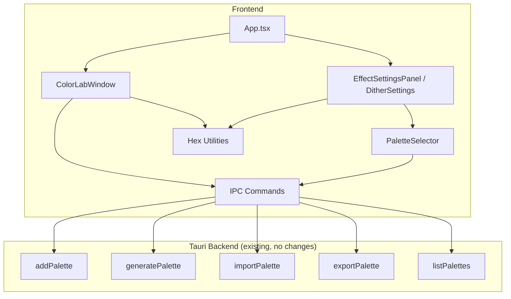
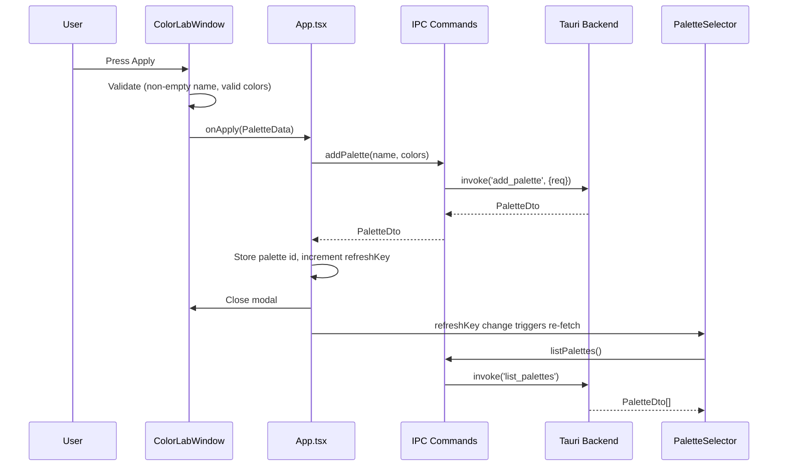
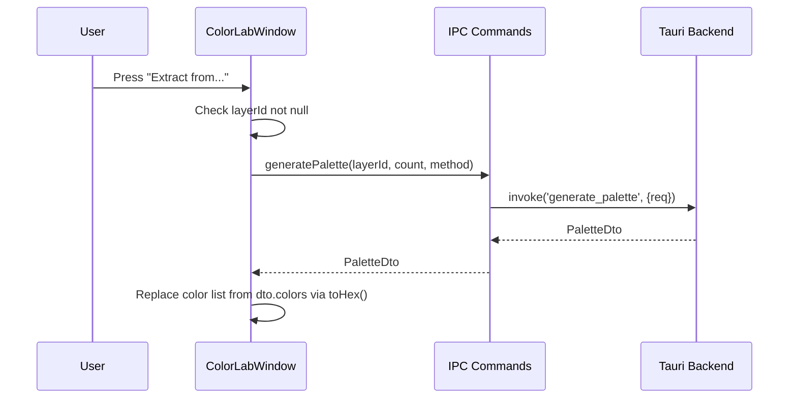
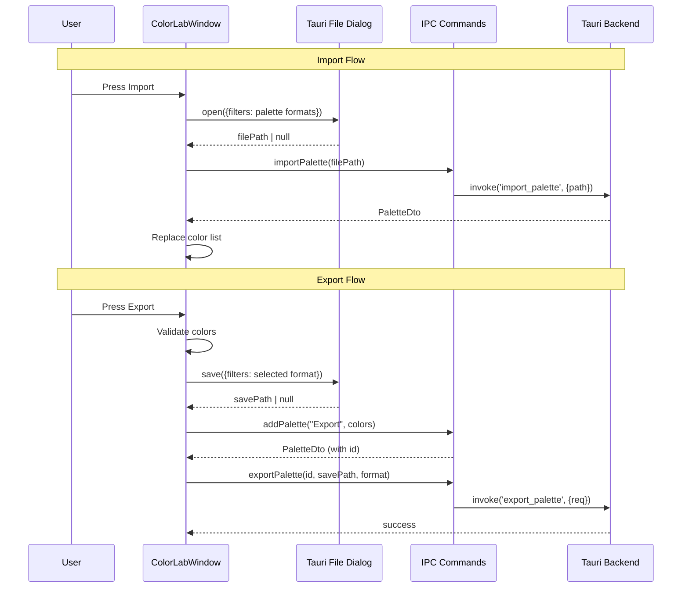

# Design Document: Color Frontend-Backend Integration

## Overview

This feature wires the existing frontend Color Lab modal and Effect Settings Panel to the already-implemented Tauri backend palette IPC commands. No new backend commands are needed — all work is in the React frontend.

The integration involves four main changes:
1. Replace TODO stubs in `ColorLabWindow` with real IPC calls (apply, extract, import, export)
2. Replace hardcoded swatches in `DitherSettings` with live palette data from the backend
3. Add hex format conversion utilities bridging the frontend `#rrggbb` format and the backend `RRGGBB` uppercase format
4. Ensure `PaletteSelector` refreshes its list after Color Lab creates a new palette

## Architecture

The architecture is a straightforward frontend integration layer. No new services or backend components are introduced.



### Data Flow: Apply Palette



### Data Flow: Extract Palette



### Data Flow: Import / Export



## Components and Interfaces

### 1. Hex Conversion Utilities

**File:** `frontend/src/utils/hexConvert.ts` (new file)

```typescript
/**
 * Convert frontend display hex (#rrggbb or #RRGGBB) to backend format (RRGGBB uppercase, no prefix).
 * Throws if input is not a valid 7-char hex string with "#" prefix.
 */
export function hexToBackend(displayHex: string): string;

/**
 * Convert backend hex (6-char, with or without "#") to frontend display format (#rrggbb lowercase).
 * Throws if input is not a valid 6-char hex string (optionally prefixed with "#").
 */
export function hexToDisplay(backendHex: string): string;
```

**Design rationale:** Separate utility file keeps conversion logic pure and testable independent of React components. The existing `toHex`/`parseHex` in `effects.ts` handle RGB↔hex conversion for individual channels; these new functions handle the format bridge between frontend and backend string representations.

### 2. ColorLabWindow Changes

**File:** `frontend/src/components/ColorLabWindow.tsx`

Changes:
- **Props addition:** Add optional `onPaletteCreated?: (dto: PaletteDto) => void` callback or handle via `onApply` returning a Promise
- **handleApply:** Add validation for empty name (trim + check), then call `onApply` which now delegates to App.tsx for the actual IPC call. Alternatively, move IPC into ColorLabWindow directly.
- **handleExtractFromRow / handleExtractFromActual:** Replace `console.log` TODO with `generatePalette(layerId!, extractCount, extractMethod)` IPC call. On success, map `dto.colors` through `toHex(r,g,b)` into `ColorEntry[]` and replace state. Check `layerId !== null` before calling (already partially done).
- **handleImport:** Replace TODO with Tauri file dialog open + `importPalette(path)` IPC call. On success, replace color list.
- **handleExport:** Replace TODO with validation → Tauri file dialog save → `addPalette("Export", colors)` → `exportPalette(id, path, format)`.

**New imports needed:**
```typescript
import { open, save } from '@tauri-apps/plugin-dialog';
import { addPalette, generatePalette, importPalette, exportPalette } from '../ipc/commands';
import type { PaletteDto } from '../ipc/commands';
```

### 3. App.tsx Changes

**File:** `frontend/src/App.tsx`

Changes:
- **New state:** `paletteRefreshKey: number` — incremented after successful palette creation to trigger PaletteSelector refresh.
- **New state:** `lastCreatedPaletteId: number | null` — stores the id from the most recent addPalette response.
- **handlePaletteApply:** Replace the TODO stub with:
  1. Validate: if `palette.colors.length === 0`, show error (though ColorLabWindow should prevent this)
  2. Validate: if `palette.name.trim() === ''`, show error
  3. Call `addPalette(palette.name, palette.colors)`
  4. On success: store returned `dto.id` in `lastCreatedPaletteId`, increment `paletteRefreshKey`, close modal
  5. On error: propagate error to ColorLabWindow (via state or callback)
- **Pass `paletteRefreshKey`** as prop to EffectSettingsPanel or directly to PaletteSelector instances.

### 4. PaletteSelector Changes

**File:** `frontend/src/components/PaletteSelector.tsx`

Changes:
- **New prop:** `refreshKey?: number` — when this value changes, re-fetch palettes.
- **useEffect dependency:** Add `refreshKey` to the dependency array of the `listPalettes()` useEffect so it re-fetches when a new palette is created.

```typescript
export interface PaletteSelectorProps {
  selectedPaletteId: number | null;
  allowNone: boolean;
  onChange: (paletteId: number | null) => void;
  label?: string;
  refreshKey?: number; // NEW
}
```

### 5. DitherSettings (in EffectSettingsPanel) Changes

**File:** `frontend/src/components/EffectSettingsPanel.tsx`

Changes:
- **Remove `defaultSwatches`** hardcoded array.
- **Add state/effect to fetch palette data:** When `paletteId` is not null, call `listPalettes()` or use a cached lookup to find the selected palette's `hex_colors`.
- **Render swatch row from real data:** Map `hex_colors` (prepend "#" for CSS since backend returns without prefix) to swatch divs. If more than 12 colors, show first 12 + `"+N"` indicator.
- **When no palette selected:** Show placeholder text "No palette selected" instead of swatches.
- **New prop:** Accept `paletteRefreshKey` to bust the cache when new palettes are created.

### 6. Interface Summary

| Component | New Props | New Imports |
|-----------|-----------|-------------|
| `ColorLabWindow` | (none — uses IPC directly) | `open`, `save` from dialog plugin; IPC commands |
| `App.tsx` | — | — |
| `PaletteSelector` | `refreshKey?: number` | — |
| `EffectSettingsPanel` | `paletteRefreshKey?: number` | `listPalettes` from IPC |

## Data Models

### Existing (no changes)

```typescript
// From ipc/commands.ts
interface PaletteDto {
  id: number;
  name: string;
  colors: [number, number, number][];  // sRGB u8 triplets
  hex_colors: string[];                 // 6-char uppercase hex (no "#")
  color_count: number;
}

// From ColorLabWindow.tsx
interface PaletteData {
  name: string;
  colors: [number, number, number][];
}

// From ColorLabWindow.tsx (internal)
interface ColorEntry {
  hex: string;    // "#rrggbb" format
  valid: boolean;
  r: number;
  g: number;
  b: number;
}
```

### New State in App.tsx

```typescript
// Added to App component state
const [paletteRefreshKey, setPaletteRefreshKey] = useState(0);
const [lastCreatedPaletteId, setLastCreatedPaletteId] = useState<number | null>(null);
```

### Hex Conversion — Input/Output Mapping

| Function | Input | Output | Example |
|----------|-------|--------|---------|
| `hexToBackend` | `"#ff00ab"` | `"FF00AB"` | frontend → backend |
| `hexToBackend` | `"#FF00AB"` | `"FF00AB"` | already uppercase |
| `hexToDisplay` | `"FF00AB"` | `"#ff00ab"` | backend → frontend |
| `hexToDisplay` | `"#FF00AB"` | `"#ff00ab"` | tolerates prefix |

## Correctness Properties

*A property is a characteristic or behavior that should hold true across all valid executions of a system — essentially, a formal statement about what the system should do. Properties serve as the bridge between human-readable specifications and machine-verifiable correctness guarantees.*

### Property 1: Hex format conversion invariants

*For any* randomly generated valid 6-character hexadecimal string (characters 0-9, A-F), `hexToBackend(hexToDisplay(s))` SHALL produce a 6-character uppercase string equal to the input uppercased, and `hexToDisplay(s)` SHALL produce a 7-character string starting with "#" in all-lowercase hex.

**Validates: Requirements 6.1, 6.2**

### Property 2: Hex round-trip preservation

*For any* valid 6-character uppercase hex string (no prefix), converting to display format via `hexToDisplay` and back to backend format via `hexToBackend` SHALL produce the original string.

**Validates: Requirements 6.3**

### Property 3: Invalid hex rejection

*For any* string that does not match the pattern of a valid hex color (neither `#XXXXXX` 7-char nor `XXXXXX` 6-char where X is a hex digit), passing it to `hexToBackend` or `hexToDisplay` SHALL throw an error.

**Validates: Requirements 6.4**

### Property 4: Swatch rendering order preservation

*For any* `PaletteDto` with 1 to 12 `hex_colors`, the DitherSettings swatch row SHALL render exactly `hex_colors.length` swatch elements, each with a background color matching the corresponding entry (with "#" prefix) in the same order.

**Validates: Requirements 5.1**

### Property 5: Swatch overflow indicator correctness

*For any* `PaletteDto` with N > 12 `hex_colors`, the DitherSettings swatch row SHALL render exactly 12 swatch elements (matching the first 12 hex_colors in order) followed by a text element displaying `"+{N-12}"`.

**Validates: Requirements 5.4**

## Error Handling

| Scenario | Component | Behavior |
|----------|-----------|----------|
| Empty color list on Apply | ColorLabWindow | Show "No valid colors to save." error in modal |
| Empty/whitespace palette name on Apply | ColorLabWindow (or App.tsx) | Show "Palette name cannot be empty." error in modal |
| `addPalette` IPC failure | App.tsx → ColorLabWindow | Show backend error message in modal, keep modal open |
| `generatePalette` with null layerId | ColorLabWindow | Show "No image loaded — cannot extract palette." |
| `generatePalette` IPC failure | ColorLabWindow | Show error message, preserve existing color list |
| `importPalette` IPC failure | ColorLabWindow | Show error message, preserve existing color list |
| `exportPalette` IPC failure | ColorLabWindow | Show error message, preserve color list for retry |
| Invalid hex string to converter | hexConvert utility | Throw `Error` with descriptive message |
| File dialog cancelled | ColorLabWindow | No-op, remain in current state |
| `listPalettes` failure in DitherSettings | DitherSettings | Show empty swatch row, no crash |

**Error propagation pattern for Apply:**
Since `handlePaletteApply` lives in App.tsx but the error needs to display inside ColorLabWindow, the design uses one of two approaches:
1. **Preferred:** Move IPC call into ColorLabWindow — `onApply` becomes async, ColorLabWindow calls `addPalette` directly, catches errors internally, and only calls a simpler `onPaletteCreated(dto)` callback on success.
2. **Alternative:** App.tsx sets an error state that's passed back to ColorLabWindow as a prop.

Approach 1 is cleaner because it keeps error display co-located with the UI that shows errors.

## Testing Strategy

### Unit Tests (Vitest)

| Test | What it verifies |
|------|-----------------|
| `hexToBackend` with valid inputs | Correct uppercase output without prefix |
| `hexToDisplay` with valid inputs | Correct lowercase output with "#" prefix |
| `hexToBackend` / `hexToDisplay` with invalid input | Throws descriptive error |
| DitherSettings renders swatches for selected palette | Swatch count and colors match palette |
| DitherSettings shows placeholder when no palette | "No palette selected" text shown |
| DitherSettings shows "+N" for palettes > 12 colors | Overflow indicator present and correct |
| ColorLabWindow validates empty name | Error displayed, no IPC call |
| ColorLabWindow validates empty color list | Error displayed, no IPC call |
| PaletteSelector re-fetches when refreshKey changes | listPalettes called again |

### Property-Based Tests (Vitest + fast-check)

- **Library:** `fast-check` (already installed in devDependencies)
- **Minimum iterations:** 100 per property
- **Tag format:** `Feature: color-frontend-backend-integration, Property N: <title>`

| Property | Generator | Assertion |
|----------|-----------|-----------|
| Property 1: Hex format invariants | Random 6-char hex strings [0-9A-F] | Output format matches spec |
| Property 2: Hex round-trip | Random 6-char uppercase hex | `hexToBackend(hexToDisplay(x)) === x` |
| Property 3: Invalid hex rejection | Random strings NOT matching hex pattern | Both functions throw |
| Property 4: Swatch order | Random PaletteDto with 1-12 hex_colors | Rendered swatches match in order |
| Property 5: Swatch overflow | Random PaletteDto with 13-256 hex_colors | 12 swatches + correct "+N" label |

### Integration Tests

| Test | What it verifies |
|------|-----------------|
| Apply flow end-to-end (mocked IPC) | ColorLab → App → addPalette → close modal → PaletteSelector refreshes |
| Extract flow (mocked IPC) | Button click → generatePalette → color list populated |
| Import flow (mocked dialog + IPC) | Dialog → importPalette → color list populated |
| Export flow (mocked dialog + IPC) | Validate → dialog → addPalette → exportPalette → success |
