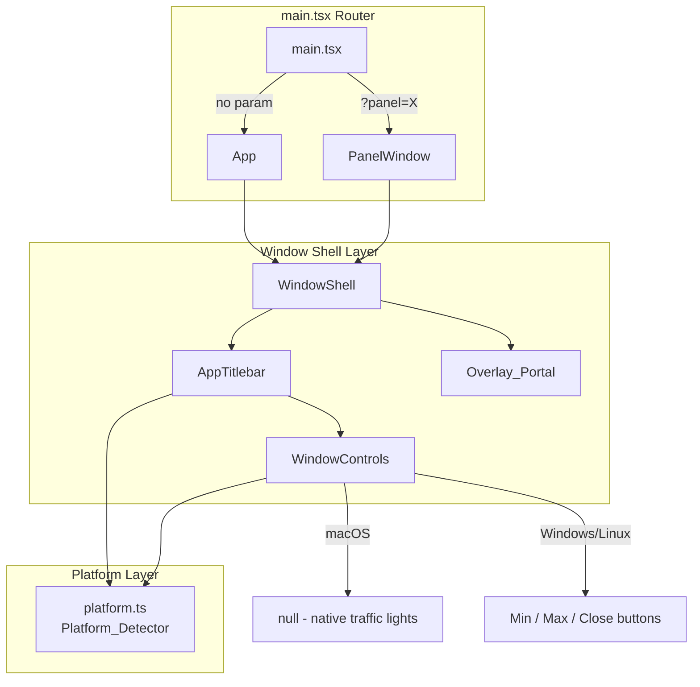
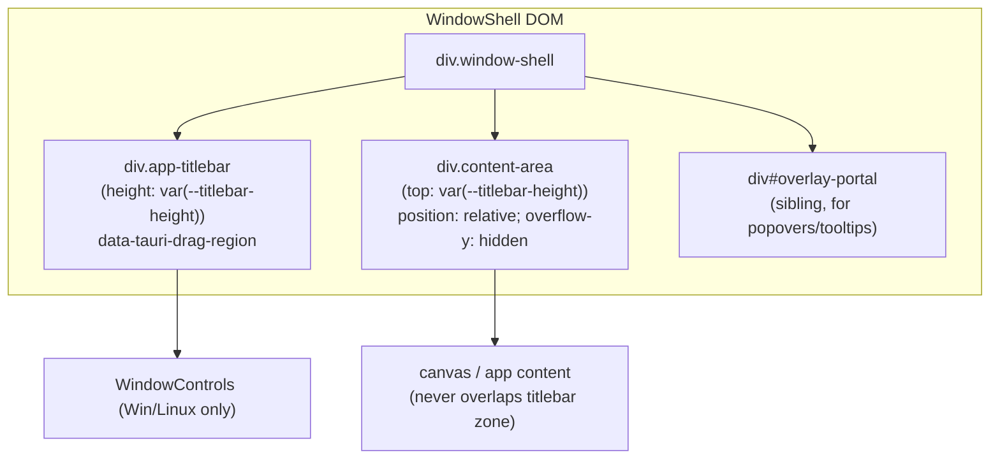
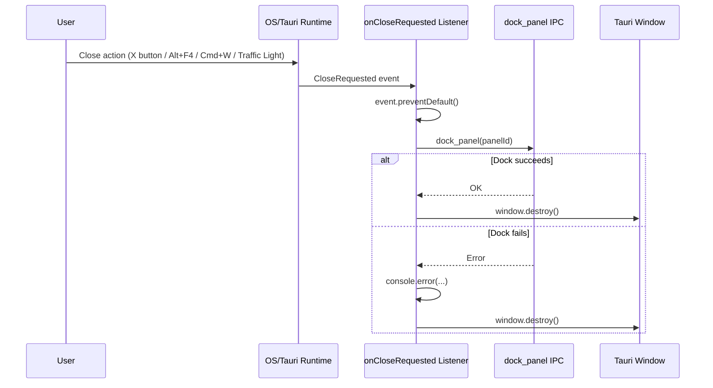

# Design Document: Cross-Platform Titlebar

## Overview

This design implements a cross-platform custom titlebar architecture for the Dither Tauri v2 application targeting macOS, Windows, and Linux. The core problem being solved is that on macOS, the `data-tauri-drag-region` attribute fails when a canvas element with `willChange: 'transform'` creates a hardware-accelerated CALayer that blocks hit-testing in WKWebView.

The solution employs **geometric separation** — the titlebar zone physically never contains canvas or GPU-accelerated layers beneath it on any platform. This eliminates the root cause rather than fighting platform-specific symptoms. A unified component architecture (`WindowShell` → `AppTitlebar` → `WindowControls`) enforces this constraint for all application windows (main window and floating panel windows alike).

### Design Decisions

1. **Geometric separation over z-index tricks**: Instead of relying on z-index/pointer-events workarounds, the layout structurally prevents canvas from occupying titlebar space. This is more robust across WebKit compositor updates.
2. **Platform detection at startup**: Platform is resolved once before React renders, exposed as a synchronous value. This avoids conditional rendering flicker and simplifies component logic.
3. **`-webkit-app-region: drag` on macOS**: This native CSS hint is processed by WebKit/AppKit at the hit-testing level, bypassing the JS event pipeline entirely. It works even when a CALayer exists in the compositing tree (provided geometric separation holds).
4. **`data-tauri-drag-region` on Windows/Linux**: Tauri's `WM_NCLBUTTONDOWN` mechanism is reliable on Chromium-based WebView2/WebKitGTK when the DOM element is geometrically above the canvas.
5. **`onCloseRequested` for floating panels**: A unified close path ensures that all close actions (close button, Alt+F4, Cmd+W, traffic lights) dock the panel rather than destroying it.
6. **No Snap Layout in MVP**: Windows 11 Snap Layout requires native window controls or `tauri-plugin-decorum`. This is explicitly deferred.

## Architecture



### Window DOM Structure



### Data Flow for Close



## Components and Interfaces

### 1. Platform Detector (`src/lib/platform.ts`)

```typescript
// src/lib/platform.ts
import { platform } from '@tauri-apps/plugin-os';

export type PlatformValue = 'macos' | 'windows' | 'linux' | 'unknown';

let resolvedPlatform: PlatformValue = 'unknown';

/**
 * Initialize platform detection. Must be called (and awaited) before
 * the React root renders. Resolves within 500ms or falls back to 'unknown'.
 */
export async function initPlatform(): Promise<void> {
  try {
    const result = await Promise.race([
      platform(),
      new Promise<string>((_, reject) =>
        setTimeout(() => reject(new Error('timeout')), 500)
      ),
    ]);
    if (result === 'macos' || result === 'windows' || result === 'linux') {
      resolvedPlatform = result;
    } else {
      resolvedPlatform = 'unknown';
    }
  } catch {
    resolvedPlatform = 'unknown';
  }
}

/**
 * Returns the current platform synchronously. Must be called after initPlatform().
 */
export function getPlatform(): PlatformValue {
  return resolvedPlatform;
}

/** Convenience checks */
export function isMacOS(): boolean { return resolvedPlatform === 'macos'; }
export function isWindows(): boolean { return resolvedPlatform === 'windows'; }
export function isLinux(): boolean { return resolvedPlatform === 'linux'; }
```

### 2. WindowShell (`src/components/WindowShell.tsx`)

```typescript
// src/components/WindowShell.tsx
import React from 'react';
import { AppTitlebar } from './AppTitlebar';

interface WindowShellProps {
  children: React.ReactNode;
  /** Optional title displayed in the titlebar (for panel windows) */
  title?: string;
  /** Optional: additional titlebar content (e.g., menu bar) */
  titlebarContent?: React.ReactNode;
}

export function WindowShell({ children, title, titlebarContent }: WindowShellProps) {
  return (
    <div className="window-shell">
      <AppTitlebar title={title}>
        {titlebarContent}
      </AppTitlebar>
      <div className="content-area">
        {children}
      </div>
      <div id="overlay-portal" />
    </div>
  );
}
```

### 3. AppTitlebar (`src/components/AppTitlebar.tsx`)

```typescript
// src/components/AppTitlebar.tsx
import React, { useCallback } from 'react';
import { getCurrentWindow } from '@tauri-apps/api/window';
import { WindowControls } from './WindowControls';
import { isMacOS, isWindows, isLinux } from '../lib/platform';

interface AppTitlebarProps {
  children?: React.ReactNode;
  title?: string;
}

export function AppTitlebar({ children, title }: AppTitlebarProps) {
  // Double-click maximize/restore — only on Windows/Linux
  const handleDoubleClick = useCallback(async (e: React.MouseEvent) => {
    if (isMacOS()) return; // macOS handles this natively via -webkit-app-region
    // Ensure we're clicking the drag region, not a button
    const target = e.target as HTMLElement;
    if (target.closest('button, input, [data-tauri-drag-region="false"]')) return;

    const win = getCurrentWindow();
    const maximized = await win.isMaximized();
    if (maximized) {
      await win.unmaximize();
    } else {
      await win.maximize();
    }
  }, []);

  const style: React.CSSProperties = {
    height: 'var(--titlebar-height)',
    ...(isMacOS() ? { WebkitAppRegion: 'drag' as any } : {}),
  };

  return (
    <div
      className="app-titlebar"
      data-tauri-drag-region
      style={style}
      onDoubleClick={handleDoubleClick}
    >
      {title && <span className="app-titlebar-title" data-tauri-drag-region>{title}</span>}
      {children}
      <WindowControls />
    </div>
  );
}
```

### 4. WindowControls (`src/components/WindowControls.tsx`)

```typescript
// src/components/WindowControls.tsx
import React, { useCallback } from 'react';
import { getCurrentWindow } from '@tauri-apps/api/window';
import { isMacOS } from '../lib/platform';

export function WindowControls() {
  // On macOS, native traffic lights handle window controls
  if (isMacOS()) return null;

  const handleMinimize = useCallback(async () => {
    try {
      await getCurrentWindow().minimize();
    } catch (err) {
      console.error('[WindowControls] minimize failed:', err);
    }
  }, []);

  const handleMaximize = useCallback(async () => {
    try {
      const win = getCurrentWindow();
      const maximized = await win.isMaximized();
      if (maximized) {
        await win.unmaximize();
      } else {
        await win.maximize();
      }
    } catch (err) {
      console.error('[WindowControls] maximize toggle failed:', err);
    }
  }, []);

  const handleClose = useCallback(async () => {
    try {
      await getCurrentWindow().close();
    } catch (err) {
      console.error('[WindowControls] close failed:', err);
    }
  }, []);

  return (
    <div
      className="window-controls"
      data-tauri-drag-region="false"
      style={{ WebkitAppRegion: 'no-drag' } as React.CSSProperties}
    >
      <button
        className="window-control-btn window-control-minimize"
        onClick={handleMinimize}
        title="Minimize"
        data-tauri-drag-region="false"
      >
        ─
      </button>
      <button
        className="window-control-btn window-control-maximize"
        onClick={handleMaximize}
        title="Maximize"
        data-tauri-drag-region="false"
      >
        □
      </button>
      <button
        className="window-control-btn window-control-close"
        onClick={handleClose}
        title="Close"
        data-tauri-drag-region="false"
      >
        ×
      </button>
    </div>
  );
}
```

### 5. Overlay Portal Usage

Components needing to render popovers/tooltips outside the content area's overflow constraints use React Portal targeting `#overlay-portal`:

```typescript
import { createPortal } from 'react-dom';

function Popover({ children }: { children: React.ReactNode }) {
  const portalTarget = document.getElementById('overlay-portal');
  if (!portalTarget) return null;
  return createPortal(children, portalTarget);
}
```

### 6. onCloseRequested Hook for Floating Panels

```typescript
// src/hooks/useCloseRequested.ts
import { useEffect } from 'react';
import { getCurrentWindow } from '@tauri-apps/api/window';
import { dockPanel } from '../ipc/panelCommands';

/**
 * Registers an onCloseRequested listener that intercepts window close,
 * docks the panel, then destroys the window.
 */
export function useCloseRequested(panelId: string) {
  useEffect(() => {
    let cancelled = false;
    const win = getCurrentWindow();

    const setupListener = async () => {
      const unlisten = await win.onCloseRequested(async (event) => {
        if (cancelled) return;
        event.preventDefault();

        try {
          await dockPanel(panelId);
        } catch (err) {
          console.error(`[useCloseRequested] dock_panel failed for "${panelId}":`, err);
        }

        // Destroy the window regardless of dock success
        await win.destroy();
      });

      return unlisten;
    };

    let unlistenFn: (() => void) | null = null;
    setupListener().then((fn) => {
      if (cancelled) { fn(); } else { unlistenFn = fn; }
    });

    return () => {
      cancelled = true;
      if (unlistenFn) unlistenFn();
    };
  }, [panelId]);
}
```

### 7. CSS Architecture

```css
/* src/styles/titlebar.css */

:root {
  --titlebar-height: 32px; /* logical CSS pixels — NOT device pixels */
}

/* ─── WindowShell ─────────────────────────────────────────────────────────── */

.window-shell {
  display: flex;
  flex-direction: column;
  width: 100%;
  height: 100%;
  overflow: hidden;
}

.content-area {
  flex: 1;
  position: relative;
  overflow-y: hidden;
  overflow-x: hidden;
  min-height: 0;
}

/* ─── AppTitlebar ─────────────────────────────────────────────────────────── */

.app-titlebar {
  height: var(--titlebar-height);
  min-height: var(--titlebar-height);
  max-height: var(--titlebar-height);
  display: flex;
  align-items: center;
  padding: 0 8px;
  background: #c0c0c0;
  border-bottom: 1px solid #808080;
  user-select: none;
  z-index: 9999;
  pointer-events: auto;
}

/* macOS: native drag hint (applied inline via style prop for platform specificity) */
/* -webkit-app-region: drag is set inline on macOS only */

/* No-drag zones inside the titlebar */
.app-titlebar button,
.app-titlebar input,
.app-titlebar select,
.app-titlebar [data-tauri-drag-region="false"] {
  -webkit-app-region: no-drag;
}

.app-titlebar-title {
  font-size: 12px;
  font-family: var(--font-family, 'ChicagoFLF', monospace);
  flex: 1;
  text-align: center;
  pointer-events: none;
}

/* ─── WindowControls (Windows/Linux) ──────────────────────────────────────── */

.window-controls {
  display: flex;
  align-items: center;
  gap: 0;
  margin-left: auto;
  height: 100%;
}

.window-control-btn {
  width: 46px;
  height: 100%;
  border: none;
  background: transparent;
  font-size: 14px;
  cursor: pointer;
  display: flex;
  align-items: center;
  justify-content: center;
  color: #333;
  transition: background 0.1s;
}

.window-control-btn:hover {
  background: rgba(0, 0, 0, 0.08);
}

.window-control-close:hover {
  background: #e81123;
  color: #fff;
}

/* ─── Overlay Portal ──────────────────────────────────────────────────────── */

#overlay-portal {
  position: fixed;
  top: 0;
  left: 0;
  width: 0;
  height: 0;
  z-index: 99999;
  pointer-events: none;
}

#overlay-portal > * {
  pointer-events: auto;
}
```

### 8. Integration Points

**main.tsx changes**: Call `initPlatform()` before `ReactDOM.createRoot`:

```typescript
import { initPlatform } from './lib/platform';

await initPlatform();

ReactDOM.createRoot(document.getElementById('root')!).render(
  <React.StrictMode>
    {isPanel ? <PanelWindow panelId={panelId!} /> : <App />}
  </React.StrictMode>,
);
```

**App.tsx changes**: Wrap the existing `app-layout` div inside `<WindowShell>`. The MenuBar can be passed as `titlebarContent` or rendered within the content area depending on design preference (given the existing 27px menu bar row).

**PanelWindow.tsx changes**: Wrap panel content in `<WindowShell title={displayName}>`, replacing the existing custom `panel-window-titlebar` div. Use `useCloseRequested(panelId)` hook instead of the manual close/dock logic.

**tauri.conf.json changes**:
```json
{
  "app": {
    "windows": [{
      "label": "main",
      "title": "Dither Engine",
      "width": 1200,
      "height": 800,
      "resizable": true,
      "fullscreen": false,
      "decorations": false,
      "titleBarStyle": "Overlay"
    }]
  }
}
```

Runtime window creation (floating panels) must also pass `decorations: false` and `titleBarStyle: "Overlay"`.

## Data Models

### Platform State

```typescript
type PlatformValue = 'macos' | 'windows' | 'linux' | 'unknown';
```

Module-level singleton — no React state needed. Resolved once at app boot, immutable thereafter.

### Component Props

```typescript
// WindowShell
interface WindowShellProps {
  children: React.ReactNode;
  title?: string;
  titlebarContent?: React.ReactNode;
}

// AppTitlebar
interface AppTitlebarProps {
  children?: React.ReactNode;
  title?: string;
}

// WindowControls — no props (reads platform from module)
```

### CSS Custom Properties

| Variable | Value | Purpose |
|----------|-------|---------|
| `--titlebar-height` | `32px` | Height of titlebar zone in logical CSS pixels |

### Tauri Window Configuration Schema

```typescript
interface TauriWindowConfig {
  label: string;
  title: string;
  width: number;
  height: number;
  decorations: false;       // Always false for custom titlebar
  titleBarStyle: 'Overlay'; // For macOS traffic lights
  resizable?: boolean;
}
```


## Correctness Properties

This feature does not use property-based testing. The implementation consists of UI layout components, platform-conditional CSS, and Tauri API integration (side-effect-only operations). There are no pure functions with meaningful input spaces, no parsers, no serializers, and no data transformations where universal quantification over random inputs would discover more bugs than concrete examples.

The following invariants are verified through example-based unit tests instead:

- Geometric separation: content area never overlaps titlebar zone (Req 1.1, 1.2)
- Platform detection maps to exactly one of macos, windows, linux, or unknown (Req 2.1)
- macOS: `-webkit-app-region: drag` applied to titlebar element (Req 1.3)
- Windows/Linux: `data-tauri-drag-region` present, `-webkit-app-region` absent (Req 1.3)
- macOS: WindowControls renders null — native traffic lights used (Req 3.1)
- Windows/Linux: WindowControls renders exactly 3 buttons (min/max/close) (Req 3.2)
- All interactive elements inside titlebar have no-drag annotation (Req 1.4)
- Close interception: onCloseRequested prevents default, calls dock before destroy (Req 4.1)
- Close resilience: window destroyed even when dock IPC fails (Req 4.2)

## Error Handling

### Platform Detection Failures

| Scenario | Behavior |
|----------|----------|
| `platform()` throws an error | `initPlatform()` catches the error, sets platform to `'unknown'` |
| `platform()` returns unrecognized value | Platform set to `'unknown'` |
| `platform()` takes longer than 500ms | Promise.race timeout fires, platform set to `'unknown'` |
| Platform is `'unknown'` | WindowControls renders nothing (no custom buttons, no native traffic lights). `data-tauri-drag-region` still functions as fallback drag. |

### Tauri Window API Failures

All Tauri window API calls (`minimize()`, `maximize()`, `unmaximize()`, `close()`, `destroy()`, `isMaximized()`) are wrapped in try/catch:

- **WindowControls button clicks**: Errors are logged to console. The UI remains responsive — no crash, no thrown exceptions to React.
- **Double-click maximize toggle**: If `isMaximized()` or `maximize()`/`unmaximize()` fails, the error is logged. No state corruption.
- **onCloseRequested dock failure**: If `dock_panel` IPC fails, the error is logged and the window is destroyed regardless (user should not be stuck with an unresponsive window).

### DOM/CSS Edge Cases

| Scenario | Mitigation |
|----------|------------|
| `#overlay-portal` not found | `createPortal` returns `null` — popovers simply don't render. No crash. |
| CSS variable `--titlebar-height` missing | Declared in `:root` in titlebar.css — if somehow missing, browsers default computed value to 0, which would collapse the titlebar. This is prevented by importing titlebar.css before app renders. |
| Non-integer DPI scale factor | All dimensions use logical CSS pixels. The browser's sub-pixel rendering handles the physical pixel mapping. No canvas coordinate math involved in titlebar layout. |

## Testing Strategy

### Why Property-Based Testing Does Not Apply

This feature consists of:
1. **UI layout components** (WindowShell, AppTitlebar) — declarative JSX producing DOM structure
2. **Platform-conditional CSS** — static style application based on a module-level string
3. **Tauri API integration** (window controls, close/dock flow) — side-effect-only operations calling external APIs
4. **CSS architecture** — declarative styling with no transformation logic

None of these involve pure functions with large input spaces where universal properties would hold. The platform detector maps a single string → enum (3 valid values + 1 fallback). There are no parsers, serializers, algorithms, or data transformations where running 100+ randomized iterations would find more bugs than a handful of concrete examples.

**Appropriate testing strategies for this feature:**

### Unit Tests (Vitest + React Testing Library)

| Test | What it verifies |
|------|-----------------|
| `WindowShell` renders titlebar + content area | DOM structure correctness |
| `WindowShell` content area has `position: relative` and `overflow-y: hidden` | Geometric separation enforcement |
| `AppTitlebar` applies `data-tauri-drag-region` attribute | Drag region markup |
| `AppTitlebar` applies `-webkit-app-region: drag` when platform is macOS | Platform-conditional style |
| `AppTitlebar` does NOT apply `-webkit-app-region` when platform is Windows | Platform-conditional style |
| `WindowControls` returns null on macOS | Platform branching |
| `WindowControls` renders 3 buttons on Windows | Platform branching |
| `WindowControls` renders 3 buttons on Linux | Linux = Windows behavior |
| `WindowControls` buttons have `data-tauri-drag-region="false"` | No-drag zones |
| `initPlatform()` returns `'macos'` for `platform()` → `'macos'` | Platform mapping |
| `initPlatform()` returns `'unknown'` for unrecognized values | Fallback behavior |
| `initPlatform()` returns `'unknown'` on timeout | Timeout handling |
| `useCloseRequested` calls `event.preventDefault()` on close | Close interception |
| `useCloseRequested` calls `dockPanel` then `destroy` | Dock-then-close flow |
| `useCloseRequested` destroys window even if dock fails | Error recovery |
| Double-click handler calls `maximize()` when not maximized (Windows) | Toggle behavior |
| Double-click handler calls `unmaximize()` when maximized (Windows) | Toggle behavior |
| Double-click handler does NOT fire on macOS | Platform guard |
| Double-click handler does NOT fire when target is a button | Interactive element guard |

### Integration / Manual Tests

| Test | Platform | What it verifies |
|------|----------|-----------------|
| Drag titlebar with active GPU-composited canvas | macOS | Geometric separation solves the WKWebView CALayer issue |
| Drag titlebar on unfocused window | macOS | First-click drag behavior |
| Traffic lights visible and functional | macOS | `titleBarStyle: "Overlay"` config |
| Custom close/minimize/maximize work | Windows | WindowControls integration with Tauri API |
| Double-click titlebar → maximize/restore | Windows | Handler + Tauri API |
| DPI 125%/150% — no gap between titlebar and content | Windows | Logical CSS pixel sizing |
| Floating panel close (any method) → docks panel | Both | onCloseRequested unified path |
| New floating window gets working drag automatically | Both | WindowShell architectural guarantee |
| Window resize preserves titlebar/content alignment | Both | CSS flex layout integrity |

### Test Configuration

- **Framework**: Vitest (already configured in project)
- **DOM environment**: jsdom (already a devDependency)
- **Component testing**: @testing-library/react (already a devDependency)
- **Mocking**: Vitest `vi.mock()` for `@tauri-apps/plugin-os` and `@tauri-apps/api/window`
- **No property-based tests** for this feature (fast-check not needed here)
