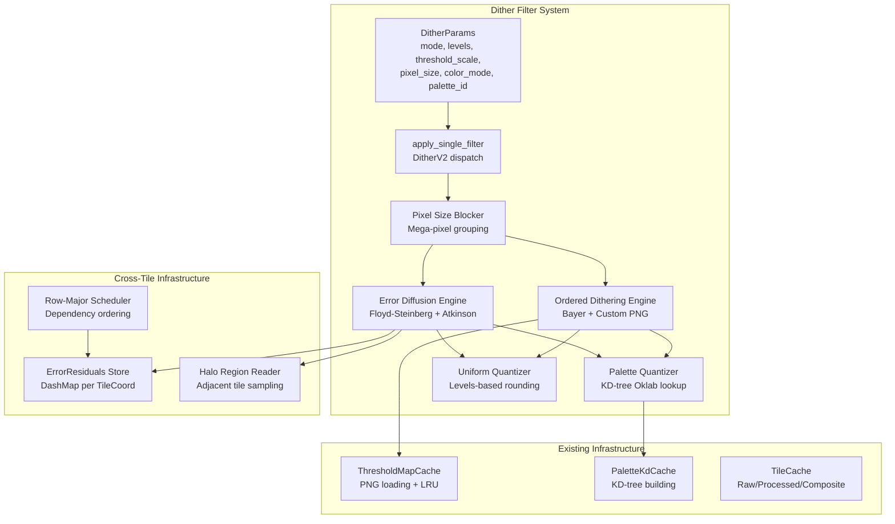
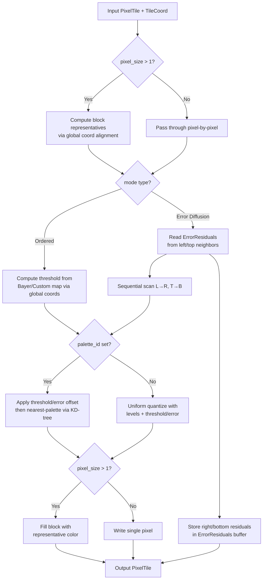

# Design Document: Dither Redesign

## Overview

This design specifies the complete redesign of the dithering system in Dither Yuki 2. The existing `DitherFilter` uses a limited `color_depth` (1–8 bits) parameter model. The redesign replaces it with a rich parameter set (`mode`, `levels`, `threshold_scale`, `pixel_size`, `color_mode`, `palette_id`, `custom_path`) that enables the full artistic range described in the project's dithering specification.

The key architectural change is the introduction of cross-tile error propagation via `ErrorResiduals` buffers, enabling pixel-perfect error diffusion across tile boundaries. Ordered dithering remains embarrassingly parallel via global coordinate addressing.

**Key Design Decisions:**
- New `DitherParams` enum variant replaces legacy `FilterParams::Dither`
- `ErrorResiduals` stored in a `DashMap` keyed by `TileCoord` for lock-free concurrent access
- Pixel-size blocking uses global coordinate alignment (integer division) for cross-tile consistency
- Palette quantization reuses existing `PaletteKdCache` and `KdTree` infrastructure from `engine-color`
- Legacy parameters auto-migrate on deserialization via a `From` impl

## Architecture

### High-Level Component Interaction



### Processing Flow



## Components and Interfaces

### 1. New Parameter Model (`crates/engine-project/src/filter.rs`)

```rust
/// Redesigned dither mode with full parameter set.
#[derive(Debug, Clone, Serialize, Deserialize)]
pub enum DitherModeV2 {
    Bayer2x2,
    Bayer4x4,
    Bayer8x8,
    CustomPng { path: String },
    FloydSteinberg,
    Atkinson,
}

/// Color processing mode for dithering.
#[derive(Debug, Clone, Copy, PartialEq, Eq, Serialize, Deserialize)]
pub enum DitherColorMode {
    Rgb,
    Grayscale,
}

/// Full dither filter parameters (V2 redesign).
#[derive(Debug, Clone, Serialize, Deserialize)]
pub struct DitherParamsV2 {
    pub mode: DitherModeV2,
    pub levels: u16,               // 2–256
    pub threshold_scale: f32,      // 0.1–4.0, default 1.0
    pub pixel_size: u8,            // 1–32, default 1
    pub color_mode: DitherColorMode,
    pub palette_id: Option<PaletteId>,
}

impl DitherParamsV2 {
    pub fn validate(&self) -> Result<(), EngineError> {
        if !(2..=256).contains(&self.levels) {
            return Err(EngineError::invalid_filter_params(
                "levels must be in range [2, 256]"));
        }
        if !(0.1..=4.0).contains(&self.threshold_scale) {
            return Err(EngineError::invalid_filter_params(
                "threshold_scale must be in range [0.1, 4.0]"));
        }
        if !(1..=32).contains(&self.pixel_size) {
            return Err(EngineError::invalid_filter_params(
                "pixel_size must be in range [1, 32]"));
        }
        if let DitherModeV2::CustomPng { ref path } = self.mode {
            if path.is_empty() {
                return Err(EngineError::invalid_filter_params(
                    "custom_path must not be empty for CustomPng mode"));
            }
        }
        Ok(())
    }
}
```

### 2. FilterParams Integration

```rust
// In FilterParams enum, add new variant:
pub enum FilterParams {
    // ... existing variants ...
    
    /// Redesigned dither with full artistic parameters
    DitherV2(DitherParamsV2),
    
    // Legacy Dither variant kept for deserialization compatibility
    Dither {
        mode: DitherMode,
        color_depth: u8,
    },
}
```

### 3. Error Residuals Buffer (`crates/engine-project/src/filters/dither_residuals.rs`)

```rust
use dashmap::DashMap;
use engine_tiles::TileCoord;

/// Quantization error residuals for cross-tile error diffusion.
/// Stores right-edge (2 columns × TILE_SIZE rows × 3 channels)
/// and bottom-edge (TILE_SIZE columns × 2 rows × 3 channels).
#[derive(Debug, Clone)]
pub struct ErrorResiduals {
    /// Right edge: 2 columns of residual error [row][col][channel]
    pub right: Vec<f32>,   // TILE_SIZE * 2 * 3
    /// Bottom edge: 2 rows of residual error [row][col][channel]
    pub bottom: Vec<f32>,  // 2 * TILE_SIZE * 3
}

impl ErrorResiduals {
    pub fn new() -> Self {
        Self {
            right: vec![0.0; 256 * 2 * 3],
            bottom: vec![0.0; 2 * 256 * 3],
        }
    }
}

/// Concurrent store for error residuals, keyed by (layer_id, tile_coord).
pub struct ErrorResidualsStore {
    entries: DashMap<(u32, TileCoord), ErrorResiduals>,
}

impl ErrorResidualsStore {
    pub fn new() -> Self {
        Self { entries: DashMap::new() }
    }

    /// Get residuals from the left neighbor tile.
    pub fn get_left(&self, layer_id: u32, coord: TileCoord) -> Option<ErrorResiduals> {
        if coord.x == 0 { return None; }
        let left_coord = TileCoord { level: coord.level, x: coord.x - 1, y: coord.y };
        self.entries.get(&(layer_id, left_coord)).map(|r| r.clone())
    }

    /// Get residuals from the top neighbor tile.
    pub fn get_top(&self, layer_id: u32, coord: TileCoord) -> Option<ErrorResiduals> {
        if coord.y == 0 { return None; }
        let top_coord = TileCoord { level: coord.level, x: coord.x, y: coord.y - 1 };
        self.entries.get(&(layer_id, top_coord)).map(|r| r.clone())
    }

    /// Store residuals after processing a tile.
    pub fn store(&self, layer_id: u32, coord: TileCoord, residuals: ErrorResiduals) {
        self.entries.insert((layer_id, coord), residuals);
    }

    /// Clear all residuals (on document change or invalidation).
    pub fn clear(&self) {
        self.entries.clear();
    }
}
```

### 4. Ordered Dithering Engine (`crates/engine-project/src/filters/dither_ordered.rs`)

```rust
use engine_tiles::{PixelTile, TileCoord, TILE_SIZE, HALO};
use engine_color::threshold_map::ThresholdMapCache;

const FULL_SIZE: u32 = TILE_SIZE + 2 * HALO; // 260

pub fn apply_ordered(
    tile: &PixelTile,
    coord: TileCoord,
    params: &DitherParamsV2,
    threshold_cache: &ThresholdMapCache,
    palette_cache: &PaletteKdCache,
    document: &Document,
) -> Result<PixelTile, EngineError> {
    let mut result = PixelTile::new();
    let levels = params.levels as f32;
    let ps = params.pixel_size as u32;

    for y in 0..FULL_SIZE {
        for x in 0..FULL_SIZE {
            // Global coordinates for seamless tiling
            let gx = coord.x * TILE_SIZE + x;
            let gy = coord.y * TILE_SIZE + y;

            // Pixel-size blocking: snap to block representative
            let block_gx = (gx / ps) * ps;
            let block_gy = (gy / ps) * ps;

            // Threshold from Bayer matrix or custom map
            let threshold = get_threshold(&params.mode, block_gx, block_gy, threshold_cache)?;
            let offset = (threshold - 0.5) * params.threshold_scale;

            // Quantize based on color_mode and palette
            let color = read_pixel(tile, x, y, params.color_mode);
            let quantized = quantize_with_offset(
                color, offset, params, palette_cache, document)?;

            write_pixel(&mut result, x, y, quantized, params.color_mode);
            result.set(x, y, 3, tile.at(x, y, 3)); // preserve alpha
        }
    }
    Ok(result)
}

fn get_threshold(
    mode: &DitherModeV2,
    gx: u32, gy: u32,
    cache: &ThresholdMapCache,
) -> Result<f32, EngineError> {
    match mode {
        DitherModeV2::Bayer2x2 => Ok(BAYER_2X2[(gy % 2) as usize][(gx % 2) as usize]),
        DitherModeV2::Bayer4x4 => Ok(BAYER_4X4[(gy % 4) as usize][(gx % 4) as usize]),
        DitherModeV2::Bayer8x8 => Ok(BAYER_8X8[(gy % 8) as usize][(gx % 8) as usize]),
        DitherModeV2::CustomPng { path } => {
            let map = cache.get_or_load(Path::new(path))?;
            Ok(map.sample(gx, gy))
        }
        _ => unreachable!("ordered engine called with diffusion mode"),
    }
}
```

### 5. Error Diffusion Engine (`crates/engine-project/src/filters/dither_diffusion.rs`)

```rust
pub fn apply_error_diffusion(
    tile: &PixelTile,
    coord: TileCoord,
    params: &DitherParamsV2,
    residuals_store: &ErrorResidualsStore,
    layer_id: u32,
    palette_cache: &PaletteKdCache,
    document: &Document,
) -> Result<PixelTile, EngineError> {
    let mut result = PixelTile::new();
    let size = FULL_SIZE as usize;
    let ps = params.pixel_size as u32;

    // Initialize error buffer (3 channels per pixel)
    let mut error_buf = vec![0.0f32; size * size * 3];

    // Seed boundary errors from neighbors
    if let Some(left_residuals) = residuals_store.get_left(layer_id, coord) {
        seed_left_boundary(&mut error_buf, &left_residuals, size);
    }
    if let Some(top_residuals) = residuals_store.get_top(layer_id, coord) {
        seed_top_boundary(&mut error_buf, &top_residuals, size);
    }

    // Sequential scan
    for y in 0..size {
        for x in 0..size {
            let gx = coord.x * TILE_SIZE + x as u32;
            let gy = coord.y * TILE_SIZE + y as u32;

            // Pixel-size blocking
            let block_gx = (gx / ps) * ps;
            let block_gy = (gy / ps) * ps;
            let is_representative = (gx == block_gx) && (gy == block_gy);

            if !is_representative && ps > 1 {
                // Copy color from block representative
                // (already computed in a previous iteration)
                copy_block_color(&mut result, x, y, block_gx, block_gy, coord);
                continue;
            }

            // Read pixel + accumulated error
            let color = read_pixel_with_error(tile, x, y, &error_buf, size, params.color_mode);

            // Quantize (palette or uniform)
            let quantized = quantize_pixel(color, params, palette_cache, document)?;

            // Compute and distribute error
            let error = compute_error(color, quantized);
            distribute_error_kernel(&mut error_buf, x, y, size, error, &params.mode);

            write_pixel(&mut result, x as u32, y as u32, quantized, params.color_mode);
            result.set(x as u32, y as u32, 3, tile.at(x as u32, y as u32, 3));
        }
    }

    // Extract and store right/bottom edge residuals
    let residuals = extract_residuals(&error_buf, size);
    residuals_store.store(layer_id, coord, residuals);

    Ok(result)
}
```

### 6. Quantization Helpers

```rust
/// Uniform quantization: round to nearest level.
fn quantize_uniform(value: f32, levels: f32, offset: f32) -> f32 {
    let adjusted = value + offset;
    let quantized = (adjusted * (levels - 1.0)).round().clamp(0.0, levels - 1.0) / (levels - 1.0);
    quantized
}

/// Palette quantization: find nearest color in Oklab space.
fn quantize_palette(
    r: f32, g: f32, b: f32,
    offset: f32,
    palette_cache: &PaletteKdCache,
    palette: &Palette,
) -> (f32, f32, f32) {
    let adjusted_r = (r + offset).clamp(0.0, 1.0);
    let adjusted_g = (g + offset).clamp(0.0, 1.0);
    let adjusted_b = (b + offset).clamp(0.0, 1.0);
    let oklab = linear_to_oklab(LinRgb { r: adjusted_r, g: adjusted_g, b: adjusted_b });
    let tree = palette_cache.get_or_build(palette).unwrap();
    let idx = tree.nearest(oklab);
    let c = &palette.colors[idx];
    (c.r, c.g, c.b)
}

/// Grayscale luminance conversion.
fn to_luminance(r: f32, g: f32, b: f32) -> f32 {
    0.2126 * r + 0.7152 * g + 0.0722 * b
}
```

### 7. Legacy Migration (`crates/engine-project/src/filters/dither_compat.rs`)

```rust
impl From<(DitherMode, u8)> for DitherParamsV2 {
    fn from((mode, color_depth): (DitherMode, u8)) -> Self {
        let levels = 1u16 << color_depth; // 2^color_depth
        let new_mode = match mode {
            DitherMode::Bayer { matrix_size: 2 } => DitherModeV2::Bayer2x2,
            DitherMode::Bayer { matrix_size: 4 } => DitherModeV2::Bayer4x4,
            DitherMode::Bayer { matrix_size: 8 } => DitherModeV2::Bayer8x8,
            DitherMode::Bayer { matrix_size: _ } => DitherModeV2::Bayer4x4, // fallback
            DitherMode::ThresholdMap { path } => DitherModeV2::CustomPng { path },
            DitherMode::ErrorDiffusion { kernel } => match kernel {
                DiffusionKernel::FloydSteinberg => DitherModeV2::FloydSteinberg,
                DiffusionKernel::Atkinson => DitherModeV2::Atkinson,
                _ => DitherModeV2::FloydSteinberg, // fallback for JJN/Stucki
            },
        };
        DitherParamsV2 {
            mode: new_mode,
            levels,
            threshold_scale: 1.0,
            pixel_size: 1,
            color_mode: DitherColorMode::Rgb,
            palette_id: None,
        }
    }
}
```

### 8. Filter Dispatcher Update (`crates/engine-project/src/filters/apply.rs`)

```rust
fn apply_single_filter(...) -> Result<PixelTile, EngineError> {
    match &filter.params {
        // ... existing cases ...

        FilterParams::DitherV2(params) => {
            match &params.mode {
                DitherModeV2::Bayer2x2 | DitherModeV2::Bayer4x4 |
                DitherModeV2::Bayer8x8 | DitherModeV2::CustomPng { .. } => {
                    apply_ordered(tile, coord, params, threshold_cache, palette_cache, document)
                }
                DitherModeV2::FloydSteinberg | DitherModeV2::Atkinson => {
                    apply_error_diffusion(
                        tile, coord, params, residuals_store, layer_id,
                        palette_cache, document)
                }
            }
        }

        // Legacy variant: auto-migrate and apply
        FilterParams::Dither { mode, color_depth } => {
            let params_v2 = DitherParamsV2::from((mode.clone(), *color_depth));
            // Dispatch as V2
            apply_single_filter_with_params(tile, &params_v2, coord, ...)
        }
    }
}
```

## Data Models

### DitherParamsV2 Serialization Format

```json
{
  "mode": "bayer_4x4",
  "levels": 8,
  "threshold_scale": 1.2,
  "pixel_size": 2,
  "color_mode": "rgb",
  "palette_id": null
}
```

With palette:
```json
{
  "mode": "floyd_steinberg",
  "levels": 2,
  "threshold_scale": 1.0,
  "pixel_size": 1,
  "color_mode": "rgb",
  "palette_id": 3
}
```

With custom PNG:
```json
{
  "mode": { "custom_png": { "path": "/Users/artist/patterns/halftone.png" } },
  "levels": 4,
  "threshold_scale": 0.8,
  "pixel_size": 1,
  "color_mode": "grayscale",
  "palette_id": null
}
```

### ErrorResiduals Memory Layout

| Field | Size | Description |
|-------|------|-------------|
| `right` | 256 × 2 × 3 × 4 bytes = 6,144 bytes | Right-edge error (2 cols, 256 rows, 3 channels, f32) |
| `bottom` | 2 × 256 × 3 × 4 bytes = 6,144 bytes | Bottom-edge error (2 rows, 256 cols, 3 channels, f32) |
| **Total** | **12,288 bytes** per tile | Negligible memory overhead |

### Integration into AppState

```rust
pub struct AppState {
    pub document_handle: DocumentHandle,
    pub tile_cache: TileCache,
    pub scheduler: Scheduler,
    pub viewport: Mutex<ViewportState>,
    pub worker_wake: WorkerWake,
    pub error_residuals: ErrorResidualsStore,  // NEW
}
```

## Correctness Properties

### Property 1: Parameter Validation Completeness

*For any* `DitherParamsV2` instance where `levels` is in [2, 256], `threshold_scale` is in [0.1, 4.0], `pixel_size` is in [1, 32], and mode is a valid variant, `validate()` SHALL return `Ok(())`. *For any* instance where any parameter is outside its valid range, `validate()` SHALL return `Err`.

**Validates: Requirements 1.1, 1.2, 1.3, 1.4, 1.5, 1.6, 1.7, 1.8, 1.9, 1.10, 1.11**

### Property 2: Ordered Dithering Seamless Tiling

*For any* uniform-color tile processed with ordered dithering, the output pixel at global coordinate (gx, gy) SHALL be identical regardless of which tile boundary placement contains that coordinate. Specifically: processing a 512×512 image as 4 tiles (2×2 grid) SHALL produce pixel-identical output to processing it as a single 512×512 block.

**Validates: Requirements 2.1, 2.2, 2.3**

### Property 3: Threshold Scale Linearity

*For any* ordered dithering with `threshold_scale = s`, the applied offset at each pixel SHALL equal `(threshold_value - 0.5) * s`. When `s = 0.1` (minimum), the effect approaches no dithering. When `s = 4.0` (maximum), the effect is maximally aggressive.

**Validates: Requirements 2.5, 2.6**

### Property 4: Error Diffusion Full-Image Equivalence

*For any* image processed via error diffusion in row-major tile order with ErrorResiduals propagation, the output SHALL be pixel-identical to processing the entire image as a single block without tiling.

**Validates: Requirements 3.5**

### Property 5: Pixel Block Uniformity

*For any* `pixel_size > 1` and any input tile, all pixels within a `pixel_size × pixel_size` block (aligned to global coordinates) SHALL have identical RGB values in the output.

**Validates: Requirements 4.1, 4.2, 4.3**

### Property 6: Block Alignment Across Tiles

*For any* block that spans a tile boundary (e.g., pixel_size=4 and block starts at global x=254), the pixels of that block in both tiles SHALL have the same color value.

**Validates: Requirements 4.4**

### Property 7: Alpha Preservation Invariant

*For any* input tile and any valid DitherParamsV2 configuration, the alpha channel of every pixel in the output SHALL be bitwise identical to the alpha channel in the input.

**Validates: Requirements 5.3**

### Property 8: Grayscale Output Uniformity

*For any* input tile processed with `color_mode = Grayscale`, every output pixel SHALL have R = G = B (ignoring alpha).

**Validates: Requirements 5.2**

### Property 9: Palette Membership Invariant

*For any* input tile processed with a non-null `palette_id`, every output pixel's RGB SHALL exactly match one of the palette's color entries.

**Validates: Requirements 6.1, 6.2, 6.3, 6.4**

### Property 10: Uniform Quantization Level Validity

*For any* input tile processed with `palette_id = null` and `levels = L`, every output pixel channel value SHALL be a member of the set `{k / (L-1) : k ∈ {0, 1, ..., L-1}}`.

**Validates: Requirements 7.1, 7.2, 7.3, 7.4**

### Property 11: Serialization Round-Trip

*For any* valid `DitherParamsV2` instance, serializing to JSON and deserializing back SHALL produce a value equal to the original.

**Validates: Requirements 11.1, 11.2**

### Property 12: Legacy Migration Correctness

*For any* legacy `(DitherMode, color_depth)` pair where color_depth is in [1, 8], converting via `DitherParamsV2::from()` SHALL produce a valid `DitherParamsV2` where `levels = 2^color_depth` and the mode maps to the correct V2 variant.

**Validates: Requirements 12.1, 12.2, 12.3, 12.4**

### Property 13: Determinism

*For any* valid input tile, TileCoord, and DitherParamsV2, applying the dither filter twice with the same inputs SHALL produce byte-identical output tiles.

**Validates: Requirements 9.5**

## Error Handling

### Validation Errors

All parameter validation is performed upfront in `DitherParamsV2::validate()`. This is called:
- On `add_filter` / `update_filter` IPC commands
- On deserialization (after construction)
- Before applying the filter (defense in depth)

Invalid parameters produce `EngineError::InvalidFilterParams` with a descriptive message.

### Runtime Errors

| Scenario | Error Type | Recovery |
|----------|-----------|----------|
| `palette_id` references nonexistent palette | `EngineError::PaletteNotFound` | Filter skipped, tile unchanged |
| `custom_path` file not found | `EngineError::IoError` | Filter returns error, tile not processed |
| `custom_path` fails sandbox check | `EngineError::IoError` (from `SandboxError`) | Filter returns error |
| Custom PNG is not grayscale | `ThresholdMapError::NotGrayscale` | Converted to `EngineError::IoError` |
| Custom PNG exceeds 4096×4096 | `ThresholdMapError::TooLarge` | Converted to `EngineError::IoError` |

### ErrorResiduals Unavailability

If error residuals from a neighbor tile are unavailable (first tile in row, or tile not yet processed), the error buffer starts with zeros. This is correct for:
- First column (x=0): no left neighbor exists
- First row (y=0): no top neighbor exists
- Out-of-order processing: graceful degradation (minor visual artifact at boundary)

### Invalidation

When dither filter parameters change:
1. `ErrorResidualsStore::clear()` is called for the affected layer
2. All Processed tiles for the layer are marked dirty
3. Re-processing follows row-major order for error diffusion modes

## Testing Strategy

### Property-Based Tests (proptest)

| Property | Test File | Generator |
|----------|-----------|-----------|
| P1: Validation | `tests/dither_validation_props.rs` | Arbitrary DitherParamsV2 |
| P2: Seamless tiling | `tests/dither_ordered_props.rs` | Random tiles + tile coord pairs |
| P5: Block uniformity | `tests/dither_pixel_size_props.rs` | Random tiles, pixel_size 2–32 |
| P7: Alpha preservation | `tests/dither_alpha_props.rs` | Random tiles + all param combos |
| P8: Grayscale R=G=B | `tests/dither_color_mode_props.rs` | Random tiles, grayscale mode |
| P9: Palette membership | `tests/dither_palette_props.rs` | Random tiles + random palettes |
| P10: Level validity | `tests/dither_levels_props.rs` | Random tiles, levels 2–256 |
| P11: Serde round-trip | `tests/dither_serde_props.rs` | Arbitrary valid DitherParamsV2 |
| P12: Legacy migration | `tests/dither_compat_props.rs` | All legacy DitherMode × color_depth |
| P13: Determinism | `tests/dither_determinism_props.rs` | Random tiles + random params |

### Integration Tests

| Test | Description |
|------|-------------|
| Error diffusion cross-tile | 2×2 tile grid, verify seam-free output |
| Pixel-size cross-tile | Block spanning tile boundary, verify uniformity |
| Palette + ordered dithering | Full pipeline with palette from document |
| Legacy migration e2e | Load legacy filter JSON, verify identical output |
| Custom PNG threshold map | Load real PNG, verify output matches manual calculation |

### Model-Based Tests

| Test | Model | Optimized |
|------|-------|-----------|
| P4: Full-image equivalence | Process full image without tiles | Process as tiles with residuals |
| P9: Palette nearest | Brute-force nearest in Oklab | KD-tree nearest |

### Benchmark Suite

Located in `crates/engine-project/benches/dither_bench.rs`:
- `ordered_bayer4x4_levels8` — baseline ordered dithering
- `floyd_steinberg_levels4` — error diffusion
- `ordered_palette_16colors` — ordered + palette quantization
- `pixel_size_4_bayer8x8` — block dithering overhead
- `error_diffusion_2x2_grid` — cross-tile residual propagation
