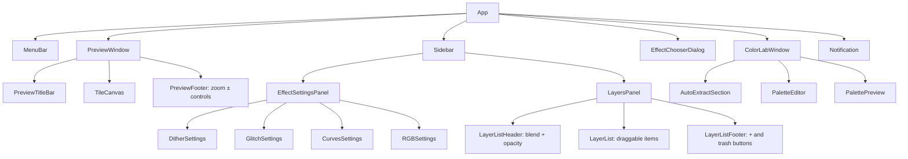
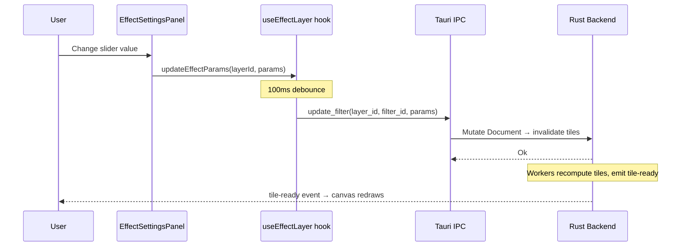
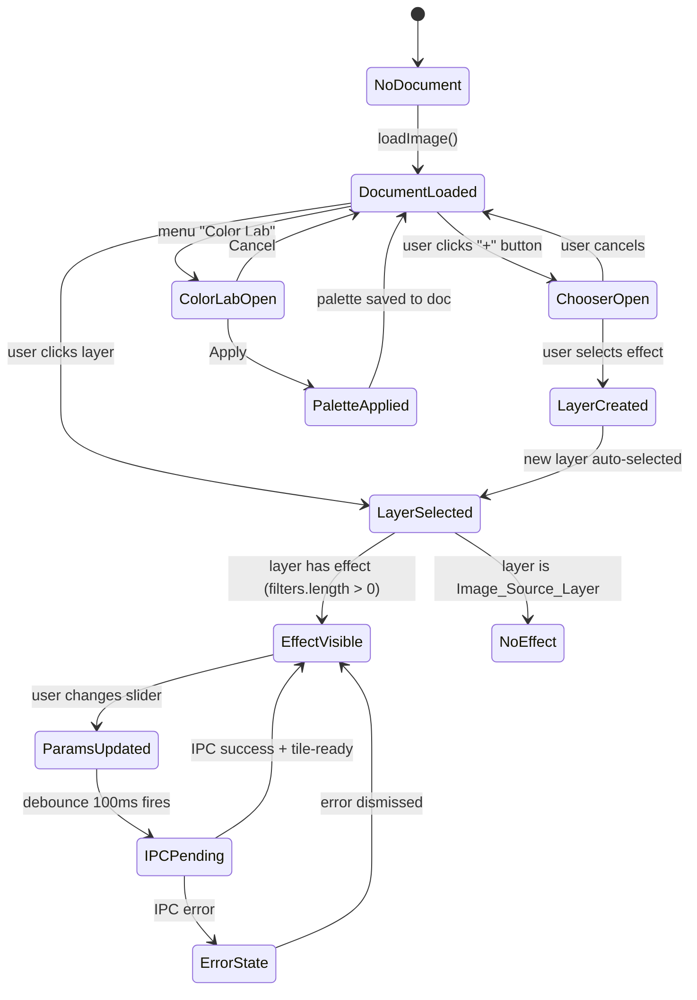

# Design Document: Figma UI Redesign

## Overview

This redesign replaces the current "filter-list per layer" UI model with a "one layer = one effect" model, matching the new Figma design. The transformation involves:

1. **Layout restructuring** — New 3-zone layout: Menu Bar (27px) + Preview Window (fluid) + Sidebar (332px fixed)
2. **Sidebar reorganization** — Top: Effect Settings Panel (params of selected layer's single effect), Bottom: Layers Panel (layer list with blend/opacity controls)
3. **Filter → Effect migration** — Remove `FilterList`/`FilterPanel` components; each Layer now carries exactly one `FilterInstance` treated as its intrinsic "effect"
4. **New components** — Effect Chooser Dialog (modal for selecting effect type), Color Lab Window (modal for palette editing), redesigned ZoomControls in Preview footer
5. **Menu Bar update** — Five items: File, Edit, Presets, Color Lab, Help

The backend API remains largely unchanged — the frontend enforces the "one effect per layer" constraint by always creating a layer with a single filter and never exposing add/remove filter controls.

## Architecture

### High-Level Component Hierarchy



### Data Flow



### Key Architectural Decisions

| Decision | Rationale |
|----------|-----------|
| Keep existing IPC API (`add_filter`, `update_filter`, `remove_filter`) | No backend changes required; frontend enforces "one effect" constraint |
| New `add_layer` call includes `effect_type` + initial params | Single atomic operation creates layer + its effect |
| Effect Settings Panel is a controlled component driven by selected layer state | Single source of truth from `useLayers` hook |
| Color Lab is a modal with local state, commits on "Apply" | Prevents partial palette edits from affecting renders |
| Zoom controls move from toolbar to preview footer | Matches Figma design; keeps toolbar clean |

## Components and Interfaces

### New Components

#### `MenuBar`
Replaces current `Toolbar`. Horizontal bar with 5 menu items, dropdown behavior.

```typescript
interface MenuBarProps {
  hasDocument: boolean;
  onOpenImage: () => void;
  onSaveImage: () => void;
  onOpenColorLab: () => void;
}
```

#### `PreviewWindow`
Wraps TileCanvas with retro title bar and footer zoom controls.

```typescript
interface PreviewWindowProps {
  docId: number;
  docWidth: number;
  docHeight: number;
  viewport: ViewportState;
  zoom: number;
  onZoomIn: () => void;
  onZoomOut: () => void;
  onWheel: (e: WheelEvent) => void;
  onPanDrag: (dx: number, dy: number) => void;
}
```

#### `EffectSettingsPanel`
Displays parameter controls for the selected layer's single effect.

```typescript
interface EffectSettingsPanelProps {
  selectedLayer: LayerNodeDto | null;
  onUpdateParams: (layerId: number, filterId: string, params: Record<string, unknown>) => void;
}
```

Internally renders one of: `DitherSettings`, `GlitchSettings`, `CurvesSettings`, `RGBSettings` based on the layer's filter kind.

#### `LayersPanel`
Bottom sidebar section. Layer list with header controls and footer actions.

```typescript
interface LayersPanelProps {
  layers: LayerNodeDto[];
  selectedLayerId: number | null;
  onSelect: (id: number) => void;
  onAddLayer: () => void;
  onRemoveLayer: (id: number) => void;
  onToggleVisibility: (id: number) => void;
  onReorder: (layerId: number, newParent: number | null, newIndex: number) => void;
  onBlendModeChange: (layerId: number, mode: string) => void;
  onOpacityChange: (layerId: number, opacity: number) => void;
}
```

#### `EffectChooserDialog`
Modal (364×468px) for selecting effect type when creating a new layer.

```typescript
interface EffectChooserDialogProps {
  isOpen: boolean;
  onSelect: (effectType: EffectType) => void;
  onClose: () => void;
}

type EffectType = 'Dithering' | 'Glitching' | 'Curves' | 'RGBChannels';
```

#### `ColorLabWindow`
Modal (692×648px) for palette management.

```typescript
interface ColorLabWindowProps {
  isOpen: boolean;
  hasDocument: boolean;
  layerId: number | null;
  onApply: (palette: PaletteData) => void;
  onCancel: () => void;
}

interface PaletteData {
  name: string;
  colors: [number, number, number][];
}
```

### Modified Components

#### `ZoomControls` → removed from toolbar
Zoom functionality moves into `PreviewFooter` sub-component within `PreviewWindow`. New API: simple +/− buttons with preset sequence.

### Removed Components

- `FilterList` — replaced by "one effect per layer" model
- `FilterPanel` — replaced by `EffectSettingsPanel`
- `PalettePanel` (inline sidebar) — palette editing moves to `ColorLabWindow` modal
- `Toolbar` — replaced by `MenuBar`

### Hooks Changes

#### `useEffectLayer` (new hook, replaces `useFilters`)

```typescript
interface UseEffectLayerReturn {
  effectType: EffectType | null;
  effectParams: FilterParams | null;
  filterId: string | null;
  updateParams: (params: Record<string, unknown>) => void;
  error: string | null;
}

function useEffectLayer(layerId: number | null): UseEffectLayerReturn;
```

This hook reads the single `FilterInstance` from the selected layer's DTO and provides a debounced update function. Replaces `useFilters` which managed a list of filters.

#### `useLayers` (modified)

Extended to support:
- `removeLayer(layerId: number)` — IPC call to `remove_layer`
- `addLayerWithEffect(effectType: EffectType, position: number)` — calls `add_layer` + `add_filter` atomically
- Layer DTO now expected to always have exactly one filter (validated on fetch)

#### `useViewport` (modified)

Zoom presets change from the old set to: `[25, 50, 100, 200, 400]` with 2× extension above 400% and 0.5× below 25%.

New methods:
- `zoomToNextPreset()` — step up through preset sequence
- `zoomToPrevPreset()` — step down through preset sequence

## Data Models

### Frontend Types

```typescript
/** Effect types available in the new design */
type EffectType = 'Dithering' | 'Glitching' | 'Curves' | 'RGBChannels';

/** Maps EffectType to the corresponding FilterKind used in IPC */
const EFFECT_TO_FILTER_KIND: Record<EffectType, FilterKind> = {
  Dithering: 'DitherV2',
  Glitching: 'Glitch',
  Curves: 'Curves',
  RGBChannels: 'Levels',  // RGB channels uses Levels filter with per-channel control
};

/** Default params for each effect type on creation */
const EFFECT_DEFAULTS: Record<EffectType, Record<string, unknown>> = {
  Dithering: {
    mode: 'floyd_steinberg',
    levels: 4,
    threshold_scale: 1.0,
    pixel_size: 1,
    color_mode: 'rgb',
    palette_id: null,
  },
  Glitching: {
    glitch_type: 'RGBShift',
    intensity: 0.5,
    seed: 0,
  },
  Curves: {
    curve: [[0, 0], [1, 1]],
    channel: 'All',
  },
  RGBChannels: {
    input_black: 0.0,
    input_white: 1.0,
    gamma: 1.0,
    output_black: 0.0,
    output_white: 1.0,
  },
};
```

### LayerNodeDto (enriched for new UI)

The existing `LayerNodeDto` from the backend already includes a `filters` array. The frontend will:
1. Read `filters[0]` as the layer's single effect
2. Derive the effect icon from `filters[0].kind`
3. Identify `Image_Source_Layer` as any raster layer with `filters.length === 0`

```typescript
/** Extended layer info for UI display */
interface LayerDisplayInfo {
  id: number;
  name: string;
  effectType: EffectType | null;  // null for Image_Source_Layer
  effectIcon: string;             // emoji/icon for the effect type
  visible: boolean;
  isImageSource: boolean;         // true if filters.length === 0
}
```

### Color Lab State (local to modal)

```typescript
interface ColorLabState {
  colors: ColorEntry[];
  name: string;
  extractMethod: 'MedianCut' | 'KMeans';
  extractCount: number;  // 2–256
  isDirty: boolean;
}

interface ColorEntry {
  hex: string;       // "#RRGGBB"
  valid: boolean;    // false if hex is malformed
  r: number;
  g: number;
  b: number;
}
```

### Zoom Presets Model

```typescript
const ZOOM_PRESETS = [25, 50, 100, 200, 400] as const;
const ZOOM_MIN = 1;    // 1%
const ZOOM_MAX = 6400; // 6400%

function nextZoomPreset(current: number): number {
  // Find next preset above current, or multiply by 2 if above max preset
  const next = ZOOM_PRESETS.find(p => p > current);
  if (next) return next;
  return Math.min(current * 2, ZOOM_MAX);
}

function prevZoomPreset(current: number): number {
  // Find previous preset below current, or divide by 2 if below min preset
  const prev = [...ZOOM_PRESETS].reverse().find(p => p < current);
  if (prev) return prev;
  return Math.max(current / 2, ZOOM_MIN);
}
```

### State Flow Diagram



## Correctness Properties

*A property is a characteristic or behavior that should hold true across all valid executions of a system — essentially, a formal statement about what the system should do. Properties serve as the bridge between human-readable specifications and machine-verifiable correctness guarantees.*

### Property 1: Zoom preset navigation is monotonic and bounded

*For any* zoom value `z` in the valid range [1, 6400], `nextZoomPreset(z)` SHALL return a value strictly greater than `z` (unless `z >= 6400`, then it returns 6400), and `prevZoomPreset(z)` SHALL return a value strictly less than `z` (unless `z <= 1`, then it returns 1). Both functions always return a value within [1, 6400].

**Validates: Requirements 1.6, 8.3, 8.4**

### Property 2: Parameter validation always clamps to valid range

*For any* effect parameter type with declared bounds [min, max] and *for any* numeric input value (including negative numbers, zero, and very large values), the `clampParam(value, min, max)` function SHALL return a value `v` such that `min <= v <= max`.

**Validates: Requirements 3.6**

### Property 3: Effect type to filter kind mapping produces valid configurations

*For any* `EffectType` in {Dithering, Glitching, Curves, RGBChannels}, the mapping function SHALL produce a valid `FilterKind` and a set of default parameters that conform to the backend's expected schema (all required fields present, all values within declared ranges). The mapping is injective — distinct effect types map to distinct filter kinds.

**Validates: Requirements 2.3, 7.2**

### Property 4: Image source layer position invariant

*For any* layer tree and *for any* sequence of reorder operations applied to it, the Image_Source_Layer (identified by `filters.length === 0`) SHALL remain at index 0 (bottom of the stack). No reorder operation can move the Image_Source_Layer or place another layer below it.

**Validates: Requirements 4.3, 4.8**

### Property 5: Sort by brightness produces monotone Oklab lightness

*For any* list of valid RGB colors (each channel in [0, 255]), after applying `sortByBrightness`, the resulting list SHALL have Oklab L* values in non-decreasing order: for all `i < j`, `oklabL(colors[i]) <= oklabL(colors[j])`.

**Validates: Requirements 6.5**

### Property 6: Hex color validation correctness

*For any* string `s`, the `isValidHex(s)` function SHALL return `true` if and only if `s` matches the pattern `/^#[0-9A-Fa-f]{6}$/`. Additionally, for any valid hex string, `parseHex(s)` followed by `toHex(r, g, b)` SHALL produce the original string (case-normalized to lowercase).

**Validates: Requirements 6.9**

### Property 7: Document structure validation

*For any* layer tree where every non-Image_Source_Layer has exactly one FilterInstance, `validateDocumentStructure(tree)` SHALL return `{valid: true}`. *For any* layer tree containing a non-Image_Source_Layer with 0 or more than 1 FilterInstance, it SHALL return `{valid: false, layerId: <id>}` identifying the first offending layer.

**Validates: Requirements 7.4, 7.5**

## Error Handling

### IPC Error Strategy

| Error Source | Handling | User Feedback |
|---|---|---|
| `add_layer` failure | Rollback: don't add layer to local state | Notification: "Failed to create layer" |
| `update_filter` failure | Rollback: revert param to previous value | Notification: "Failed to update effect" |
| `remove_layer` failure | Rollback: keep layer in list | Notification: "Failed to remove layer" |
| `import_palette` failure | No state change | Error in Color Lab UI |
| `generate_palette` failure | No state change | Error in Color Lab UI |
| Document validation failure | Block rendering, show error modal | "Document has invalid structure" |

### Optimistic Updates with Rollback

The frontend uses **optimistic UI updates** — state changes are applied immediately for responsiveness, then rolled back if the IPC call fails:

1. User changes a parameter
2. Local state updates instantly (UI reflects new value)
3. Debounced IPC call fires
4. On success: no further action needed (tiles will re-render via push events)
5. On failure: roll back local state to pre-change value, show notification

### Input Validation (Client-Side)

All parameter inputs are validated before IPC calls:

- **Numeric ranges**: Clamped to declared bounds (never sent out of range)
- **Hex colors**: Validated against `#RRGGBB` pattern before apply
- **Effect type**: Only valid `EffectType` values accepted from dialog
- **Palette size**: Capped at 256 entries client-side

### Edge Cases

- **No document loaded**: All editing controls disabled; only File → Open available
- **No layer selected**: Effect Settings Panel shows empty state with title only
- **Image source layer selected**: No effect controls shown; delete button disabled
- **Color Lab with no image**: Extract buttons show "No image loaded" error
- **Maximum palette size**: "Add color +" button disabled at 256 entries

## Testing Strategy

### Unit Tests (Vitest)

Example-based tests for:
- Component rendering (each component renders expected DOM structure)
- Menu dropdown open/close behavior
- Effect Chooser Dialog keyboard navigation
- Layer list item structure and selection highlighting
- Empty states for no-document and no-selection scenarios
- Edge cases: delete disabled for image source, max palette reached

### Property-Based Tests (fast-check via Vitest)

Property tests for the 7 correctness properties above. Each test runs **minimum 100 iterations** with generated inputs:

| Property | Generator Strategy |
|---|---|
| Zoom navigation | Random zoom values in [1, 6400] |
| Parameter clamping | Random floats/ints + random param bounds |
| Effect-to-filter mapping | All 4 EffectType values (exhaustive) + schema validation |
| Image source position | Random layer trees + random reorder sequences |
| Sort by brightness | Random RGB color lists (1–256 colors) |
| Hex validation | Random strings (ascii mix) + known-good hex strings |
| Document validation | Random layer trees with varying filter counts |

**Configuration**: fast-check with `numRuns: 100` minimum per property.

**Tagging**: Each property test tagged with:
```
Feature: figma-ui-redesign, Property {N}: {property_text}
```

### Integration Tests

- IPC call sequences (layer create → effect update → preview renders)
- Full workflow: open image → create effect layer → modify params → export
- Color Lab apply → palette persisted → dither effect uses new palette

### Accessibility Testing

- Keyboard navigation in Effect Chooser Dialog (arrow keys, Enter, Escape)
- ARIA labels on all interactive elements
- Focus management when modals open/close
- Screen reader compatible layer list (role="tree", role="treeitem")

