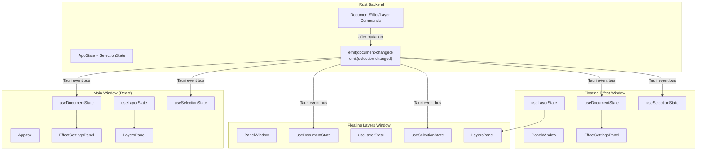
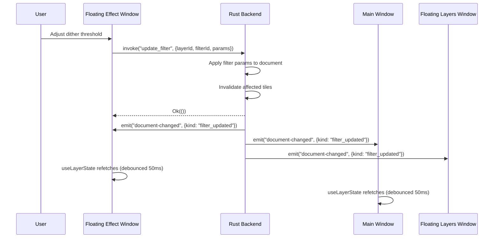
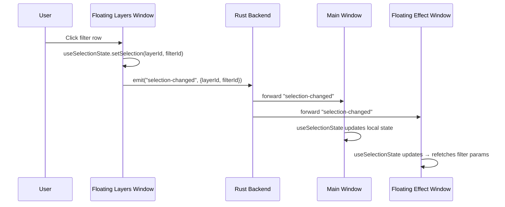
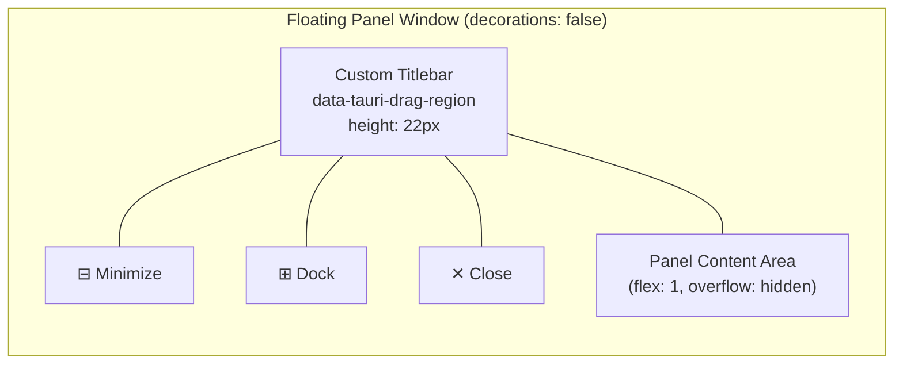

# Design Document: Floating Panel Content and Custom Chrome

## Overview

This design addresses two remaining gaps in the multi-window panel system: (1) floating panel windows currently render placeholder text instead of real interactive content, and (2) they display native OS window decorations alongside a custom titlebar, creating visual inconsistency.

The solution introduces:
- **IPC data hooks** (`useDocumentState`, `useLayerState`, `useSelectionState`) that decouple panel components from the App.tsx prop tree, enabling them to function identically whether docked or floating.
- **Custom chrome** via `decorations: false` in Tauri, with a CSS-drawn titlebar using `data-tauri-drag-region` for window dragging, styled to match the retro Mac OS aesthetic.
- **Cross-window events** (`selection-changed`, `document-changed`) emitted by the Rust backend so floating panels stay synchronized with the main window.
- **Backend `document-changed` emission** after every document mutation, enabling all windows to reactively refetch state.

### Key Design Decisions

1. **IPC hooks over prop drilling** — Panels in floating windows have no access to App.tsx's React tree. Each panel gets self-contained hooks that invoke the same IPC commands the docked version uses (via `useDocument`/`useLayers`/`useEffectLayer`), plus event subscriptions for reactivity. This means the same component code runs in both contexts.

2. **Backend-driven events** — The Rust backend emits `document-changed` after mutations (filter updates, layer changes, image loads). This is simpler and more reliable than having the main window's React code broadcast changes, since mutations can also originate from floating panels.

3. **`decorations: false` + CSS titlebar** — Tauri's frameless window mode removes the OS chrome entirely. A custom `<div data-tauri-drag-region>` titlebar renders the retro Mac OS striped pattern with close/minimize buttons, consistent with the docked panel titlebars.

4. **Selection as a shared event** — Layer/filter selection is inherently cross-window state. Rather than storing it in Rust `AppState` (adding complexity), selection is broadcast via a lightweight `selection-changed` Tauri event. Each window maintains local selection state and updates from this event.

5. **Reuse existing panel components** — `EffectSettingsPanel`, `LayersPanel`, and `ColorLabWindow` stay largely unchanged. The new hooks provide the same prop shapes they already expect. A thin adapter in `PanelWindow` maps hook output → component props.

---

## Architecture

### High-Level System Diagram



### Data Flow: Filter Parameter Update from Floating Window



### Data Flow: Selection Change from Floating Layers Window



### Custom Chrome Architecture



---

## Components and Interfaces

### Rust Backend Changes

#### 1. Selection State in AppState (`src-tauri/src/commands.rs`)

```rust
/// Cross-window selection state. Updated via selection-changed events.
#[derive(Debug, Clone, Serialize, Deserialize, Default)]
pub struct SelectionState {
    pub selected_layer_id: Option<u32>,
    pub selected_filter_id: Option<String>,
}

// Addition to AppState:
pub struct AppState {
    // ... existing fields ...
    pub selection: Mutex<SelectionState>,
}
```

#### 2. Document-Changed Event Emission

Every document-mutating command (`update_filter`, `add_filter`, `remove_filter`, `reorder_filter`, `set_layer_props`, `load_image`, `add_layer`, `remove_layer`, `reorder_layer`) must emit a `document-changed` event after successful mutation.

```rust
/// Payload for the document-changed event.
#[derive(Debug, Clone, Serialize)]
pub struct DocumentChangedPayload {
    /// Discriminator for what changed: "filter_updated", "filter_added",
    /// "filter_removed", "layer_changed", "image_loaded", etc.
    pub kind: String,
    /// Optional affected layer ID for targeted refetch optimization.
    pub layer_id: Option<u32>,
}

/// Helper to emit document-changed to all windows.
fn emit_document_changed(app_handle: &AppHandle, kind: &str, layer_id: Option<u32>) {
    let _ = app_handle.emit("document-changed", DocumentChangedPayload {
        kind: kind.to_string(),
        layer_id,
    });
}
```

Example integration in `update_filter`:

```rust
#[tauri::command]
pub fn update_filter(
    req: UpdateFilterRequest,
    app_handle: AppHandle,
    state: State<Arc<AppState>>,
) -> Result<(), String> {
    // ... existing mutation logic ...
    
    // NEW: emit document-changed event
    emit_document_changed(&app_handle, "filter_updated", Some(req.layer_id));
    
    Ok(())
}
```

#### 3. Selection-Changed Command (`src-tauri/src/commands.rs`)

```rust
/// Update selection state and broadcast to all windows.
#[tauri::command]
pub fn set_selection(
    layer_id: Option<u32>,
    filter_id: Option<String>,
    app_handle: AppHandle,
    state: State<Arc<AppState>>,
) -> Result<(), String> {
    // Update stored selection
    let mut sel = state.selection.lock().map_err(|e| e.to_string())?;
    sel.selected_layer_id = layer_id;
    sel.selected_filter_id = filter_id.clone();
    drop(sel);

    // Broadcast to all windows
    let _ = app_handle.emit("selection-changed", SelectionChangedPayload {
        selected_layer_id: layer_id,
        selected_filter_id: filter_id,
    });
    
    Ok(())
}

/// Get current selection state (for initial fetch on window mount).
#[tauri::command]
pub fn get_selection(state: State<Arc<AppState>>) -> Result<SelectionState, String> {
    let sel = state.selection.lock().map_err(|e| e.to_string())?;
    Ok(sel.clone())
}

#[derive(Debug, Clone, Serialize, Deserialize)]
pub struct SelectionChangedPayload {
    pub selected_layer_id: Option<u32>,
    pub selected_filter_id: Option<String>,
}
```

#### 4. Window Creation Changes (Custom Chrome)

In `panel_commands.rs`, the `undock_panel` command and startup restoration code change `decorations(true)` to `decorations(false)` and add minimum size:

```rust
// In undock_panel:
let mut builder = WebviewWindowBuilder::new(&app_handle, &result.window_label, url)
    .title(&title)
    .inner_size(width, height)
    .resizable(true)
    .decorations(false)          // ← Changed from true
    .min_inner_size(280.0, 200.0); // ← NEW: minimum window size
```

### Frontend: IPC Data Hooks

#### 5. `useDocumentState` Hook (`frontend/src/hooks/useDocumentState.ts`)

```typescript
import { useState, useEffect, useRef, useCallback } from 'react';
import { invoke } from '@tauri-apps/api/core';
import { listen } from '@tauri-apps/api/event';

export interface DocumentState {
  docId: number | null;
  width: number;
  height: number;
  hasDocument: boolean;
}

interface DocumentSnapshotResponse {
  snapshot: {
    id: number;
    width: number;
    height: number;
    layers: unknown[];
  };
}

/**
 * Self-contained hook for document metadata. Fetches initial state via IPC
 * and subscribes to `document-changed` events for reactivity.
 * Usable in both the main window and floating panel windows.
 */
export function useDocumentState(): DocumentState & { error: string | null } {
  const [state, setState] = useState<DocumentState>({
    docId: null, width: 0, height: 0, hasDocument: false,
  });
  const [error, setError] = useState<string | null>(null);
  const debounceRef = useRef<ReturnType<typeof setTimeout>>();

  const fetchState = useCallback(async () => {
    try {
      const response = await invoke<DocumentSnapshotResponse>('get_document_snapshot');
      const snap = response.snapshot;
      setState({
        docId: snap.id,
        width: snap.width,
        height: snap.height,
        hasDocument: snap.layers.length > 0,
      });
      setError(null);
    } catch (err) {
      // No document loaded yet — not an error state
      setState({ docId: null, width: 0, height: 0, hasDocument: false });
    }
  }, []);

  useEffect(() => {
    fetchState();

    let cancelled = false;
    let unlisten: (() => void) | null = null;

    listen<{ kind: string }>('document-changed', () => {
      if (cancelled) return;
      // Debounce refetch by 50ms
      if (debounceRef.current) clearTimeout(debounceRef.current);
      debounceRef.current = setTimeout(fetchState, 50);
    }).then((fn) => {
      if (cancelled) fn(); else unlisten = fn;
    });

    return () => {
      cancelled = true;
      if (unlisten) unlisten();
      if (debounceRef.current) clearTimeout(debounceRef.current);
    };
  }, [fetchState]);

  return { ...state, error };
}
```

#### 6. `useLayerState` Hook (`frontend/src/hooks/useLayerState.ts`)

```typescript
import { useState, useEffect, useRef, useCallback } from 'react';
import { invoke } from '@tauri-apps/api/core';
import { listen } from '@tauri-apps/api/event';
import type { LayerNodeDto } from '../components/LayerPanel';
import type { FilterInfo } from '../types';

export interface LayerState {
  layers: LayerNodeDto[];
  allFilters: FilterInfo[];
  error: string | null;
}

/**
 * Self-contained hook for layer tree and filter data. Fetches via IPC
 * and subscribes to `document-changed` events for reactivity.
 * Designed for use in floating panels that lack access to App.tsx state.
 */
export function useLayerState(): LayerState & {
  refreshLayers: () => Promise<void>;
} {
  const [layers, setLayers] = useState<LayerNodeDto[]>([]);
  const [allFilters, setAllFilters] = useState<FilterInfo[]>([]);
  const [error, setError] = useState<string | null>(null);
  const debounceRef = useRef<ReturnType<typeof setTimeout>>();

  const fetchLayers = useCallback(async () => {
    try {
      const tree = await invoke<LayerNodeDto[]>('get_layer_tree');
      setLayers(tree);

      // Also fetch filters from snapshot
      const response = await invoke<{
        snapshot: { layers: { id: number; filters: FilterInfo[] }[] };
      }>('get_document_snapshot');
      const imageLayer = response.snapshot.layers[0];
      if (imageLayer?.filters) {
        setAllFilters(imageLayer.filters.map((f: any) => ({
          id: typeof f.id === 'string' ? f.id : String(f.id),
          kind: f.kind,
          params: f.params,
          enabled: f.enabled ?? true,
        })));
      } else {
        setAllFilters([]);
      }
      setError(null);
    } catch (err) {
      setError(typeof err === 'string' ? err : String(err));
    }
  }, []);

  useEffect(() => {
    fetchLayers();

    let cancelled = false;
    let unlisten: (() => void) | null = null;

    listen<{ kind: string }>('document-changed', () => {
      if (cancelled) return;
      if (debounceRef.current) clearTimeout(debounceRef.current);
      debounceRef.current = setTimeout(fetchLayers, 50);
    }).then((fn) => {
      if (cancelled) fn(); else unlisten = fn;
    });

    return () => {
      cancelled = true;
      if (unlisten) unlisten();
      if (debounceRef.current) clearTimeout(debounceRef.current);
    };
  }, [fetchLayers]);

  return { layers, allFilters, error, refreshLayers: fetchLayers };
}
```

#### 7. `useSelectionState` Hook (`frontend/src/hooks/useSelectionState.ts`)

```typescript
import { useState, useEffect, useRef, useCallback } from 'react';
import { invoke } from '@tauri-apps/api/core';
import { listen } from '@tauri-apps/api/event';

export interface SelectionState {
  selectedLayerId: number | null;
  selectedFilterId: string | null;
}

interface SelectionChangedPayload {
  selected_layer_id: number | null;
  selected_filter_id: string | null;
}

/**
 * Cross-window selection synchronization hook.
 * Fetches initial selection from backend, listens for selection-changed events,
 * and provides a setSelection function that broadcasts changes.
 */
export function useSelectionState(): SelectionState & {
  setSelection: (layerId: number | null, filterId: string | null) => void;
  error: string | null;
} {
  const [selectedLayerId, setSelectedLayerId] = useState<number | null>(null);
  const [selectedFilterId, setSelectedFilterId] = useState<string | null>(null);
  const [error, setError] = useState<string | null>(null);
  const isLocalUpdate = useRef(false);

  // Fetch initial selection on mount
  useEffect(() => {
    let cancelled = false;

    invoke<{ selected_layer_id: number | null; selected_filter_id: string | null }>('get_selection')
      .then((sel) => {
        if (!cancelled) {
          setSelectedLayerId(sel.selected_layer_id);
          setSelectedFilterId(sel.selected_filter_id);
        }
      })
      .catch((err) => {
        if (!cancelled) setError(String(err));
      });

    return () => { cancelled = true; };
  }, []);

  // Listen for selection-changed events from other windows
  useEffect(() => {
    let cancelled = false;
    let unlisten: (() => void) | null = null;

    listen<SelectionChangedPayload>('selection-changed', (event) => {
      if (cancelled || isLocalUpdate.current) return;
      setSelectedLayerId(event.payload.selected_layer_id);
      setSelectedFilterId(event.payload.selected_filter_id);
    }).then((fn) => {
      if (cancelled) fn(); else unlisten = fn;
    });

    return () => {
      cancelled = true;
      if (unlisten) unlisten();
    };
  }, []);

  // Broadcast selection change to all windows
  const setSelection = useCallback((layerId: number | null, filterId: string | null) => {
    isLocalUpdate.current = true;
    setSelectedLayerId(layerId);
    setSelectedFilterId(filterId);

    invoke('set_selection', {
      layerId,
      filterId,
    }).catch((err) => {
      setError(String(err));
    }).finally(() => {
      // Reset flag after event propagation cycle
      setTimeout(() => { isLocalUpdate.current = false; }, 0);
    });
  }, []);

  return { selectedLayerId, selectedFilterId, setSelection, error };
}
```

### Frontend: PanelWindow Refactoring

#### 8. Updated PanelWindow Component (`frontend/src/components/PanelWindow.tsx`)

The existing PanelWindow receives a complete overhaul:

```typescript
interface PanelWindowProps {
  panelId: string; // "effect" | "layers" | "colorlab"
}

/**
 * Standalone floating panel window with custom chrome.
 * Uses IPC hooks for data rather than props from App.tsx.
 */
function PanelWindow({ panelId }: PanelWindowProps): JSX.Element;
```

Key changes:
- Replace placeholder `<div>` with actual panel components
- Use `useDocumentState()`, `useLayerState()`, `useSelectionState()` for data
- Render a custom titlebar with `data-tauri-drag-region` (no native decorations)
- Title bar includes: drag region with panel name, minimize button, dock button, close button
- Buttons do NOT have `data-tauri-drag-region` attribute

#### 9. Custom Chrome CSS (`frontend/src/components/PanelWindow.css`)

```css
/* Custom chrome for frameless floating panel windows */
.panel-window {
  display: flex;
  flex-direction: column;
  height: 100vh;
  width: 100vw;
  overflow: hidden;
  background: var(--bg-window);
  border: 1.5px solid var(--border-color);
}

.panel-window-titlebar {
  flex-shrink: 0;
  height: 22px;
  display: flex;
  align-items: center;
  padding: 0 4px;
  background: var(--bg-titlebar);
  border-bottom: 1.5px solid var(--border-color);
  user-select: none;
  gap: 4px;
}

.panel-window-titlebar-drag {
  flex: 1;
  display: flex;
  align-items: center;
  height: 100%;
  min-width: 0;
  gap: 4px;
}

.panel-window-titlebar-lines {
  flex: 1;
  min-width: 8px;
  height: 14px;
  background: repeating-linear-gradient(
    to bottom,
    transparent 0px,
    transparent 1px,
    var(--color-black) 1px,
    var(--color-black) 2px,
    transparent 2px,
    transparent 3px
  );
}

.panel-window-title {
  font-family: var(--font-family);
  font-size: 12px;
  color: var(--text-color);
  white-space: nowrap;
  flex-shrink: 0;
  padding: 0 6px;
}

.panel-window-titlebar-actions {
  display: flex;
  align-items: center;
  gap: 2px;
  flex-shrink: 0;
}

.panel-window-btn {
  width: 14px;
  height: 14px;
  border: 1px solid var(--border-color);
  background: var(--bg-window);
  box-shadow: inset -1px -1px 0 var(--color-black),
              inset 1px 1px 0 var(--color-white);
  cursor: pointer;
  display: flex;
  align-items: center;
  justify-content: center;
  font-size: 8px;
  font-family: var(--font-family);
  padding: 0;
  line-height: 1;
}

.panel-window-btn:active {
  box-shadow: inset 1px 1px 0 var(--color-black),
              inset -1px -1px 0 var(--color-white);
}

.panel-window-content {
  flex: 1;
  overflow: hidden;
  min-height: 0;
  display: flex;
  flex-direction: column;
}
```

### Frontend: Panel Component Adaptations

#### 10. EffectSettingsPanel — Floating Adapter

Rather than modifying `EffectSettingsPanel` internals, `PanelWindow` uses the new hooks to construct the props the component already expects:

```typescript
// Inside PanelWindow, for panelId === "effect":
function FloatingEffectAdapter() {
  const { hasDocument } = useDocumentState();
  const { layers, allFilters } = useLayerState();
  const { selectedLayerId, selectedFilterId, setSelection } = useSelectionState();

  // Build LayerWithFilters from hook data (same logic as App.tsx)
  const selectedLayerWithFilters = useMemo(() => {
    if (!selectedFilterId || !hasDocument) return null;
    const imageLayer = layers[0];
    if (!imageLayer) return null;
    const filter = allFilters.find(f => f.id === selectedFilterId);
    if (!filter) return null;
    return {
      id: imageLayer.id,
      name: imageLayer.name,
      filters: [filter],
    };
  }, [selectedFilterId, layers, allFilters, hasDocument]);

  const handleUpdateParams = useCallback(
    (layerId: number, filterId: string, params: Record<string, unknown>) => {
      updateFilter(layerId, filterId, params);
    }, []
  );

  const handleSelectEffect = useCallback((effectType: EffectType) => {
    // Add filter to image source layer
    const imageLayer = layers[0];
    if (!imageLayer) return;
    addFilter(imageLayer.id, EFFECT_TO_FILTER_KIND[effectType], EFFECT_DEFAULTS[effectType]);
  }, [layers]);

  return (
    <EffectSettingsPanel
      selectedLayer={selectedLayerWithFilters}
      onUpdateParams={handleUpdateParams}
      onSelectEffect={handleSelectEffect}
      paletteRefreshKey={0}
    />
  );
}
```

#### 11. LayersPanel — Floating Adapter

```typescript
// Inside PanelWindow, for panelId === "layers":
function FloatingLayersAdapter() {
  const { layers, allFilters, refreshLayers } = useLayerState();
  const { selectedLayerId, selectedFilterId, setSelection } = useSelectionState();

  const handleSelect = useCallback((id: number) => {
    setSelection(id, null);
  }, [setSelection]);

  const handleSelectFilter = useCallback((filterId: string | null) => {
    const imageLayer = layers[0];
    setSelection(imageLayer?.id ?? null, filterId);
  }, [layers, setSelection]);

  const handleRemoveFilter = useCallback(async (filterId: string) => {
    const imageLayer = layers[0];
    if (!imageLayer) return;
    await removeFilter(imageLayer.id, filterId);
  }, [layers]);

  const handleReorderFilter = useCallback(async (filterId: string, newIndex: number) => {
    const imageLayer = layers[0];
    if (!imageLayer) return;
    await reorderFilter(imageLayer.id, filterId, newIndex);
  }, [layers]);

  // ... other callbacks mapped to IPC ...

  return (
    <LayersPanel
      layers={layers}
      selectedLayerId={selectedLayerId}
      filters={allFilters}
      selectedFilterId={selectedFilterId}
      onSelect={handleSelect}
      onSelectFilter={handleSelectFilter}
      onAddLayer={() => setSelection(null, null)}
      onRemoveFilter={handleRemoveFilter}
      onReorderFilter={handleReorderFilter}
      onToggleVisibility={handleToggleVisibility}
      onBlendModeChange={handleBlendModeChange}
      onOpacityChange={handleOpacityChange}
    />
  );
}
```

#### 12. ColorLabWindow — Floating Adapter

The floating Color Lab renders `ColorLabWindow` in an always-open mode:

```typescript
// Inside PanelWindow, for panelId === "colorlab":
function FloatingColorLabAdapter() {
  const { hasDocument } = useDocumentState();
  const { selectedLayerId } = useSelectionState();

  const handleApply = useCallback(async (palette: PaletteData) => {
    await addPalette(palette.name, palette.colors);
    // Emit palette-changed event so other windows refresh
    emit('palette-changed', {});
  }, []);

  const handleCancel = useCallback(() => {
    // In floating mode, "cancel" resets the form rather than closing
  }, []);

  return (
    <ColorLabWindow
      isOpen={true}
      hasDocument={hasDocument}
      layerId={selectedLayerId}
      onApply={handleApply}
      onCancel={handleCancel}
    />
  );
}
```

Note: `ColorLabWindow` will need a minor adaptation — when `isOpen` is always `true` in floating mode, the overlay/modal wrapper should not render. This is handled by a `floating` prop or detecting the window context.

---

## Data Models

### New Tauri Event Payloads

#### `document-changed` Event

```typescript
interface DocumentChangedPayload {
  kind: 'filter_updated' | 'filter_added' | 'filter_removed'
       | 'layer_changed' | 'image_loaded' | 'layer_added'
       | 'layer_removed' | 'layer_reordered';
  layer_id: number | null;
}
```

#### `selection-changed` Event

```typescript
interface SelectionChangedPayload {
  selected_layer_id: number | null;
  selected_filter_id: string | null;
}
```

#### `palette-changed` Event

```typescript
interface PaletteChangedPayload {
  // Lightweight signal — receivers refetch their palette list
}
```

### Rust: SelectionState (new field in AppState)

```rust
#[derive(Debug, Clone, Serialize, Deserialize, Default)]
pub struct SelectionState {
    pub selected_layer_id: Option<u32>,
    pub selected_filter_id: Option<String>,
}
```

### Updated PanelWindow CSS class structure

```
.panel-window                       (root, flex column, 100vh)
├── .panel-window-titlebar          (flex row, height: 22px)
│   ├── .panel-window-titlebar-drag [data-tauri-drag-region] (flex: 1)
│   │   ├── .panel-window-titlebar-lines
│   │   ├── .panel-window-title
│   │   └── .panel-window-titlebar-lines
│   └── .panel-window-titlebar-actions
│       ├── .panel-window-btn (minimize)
│       ├── .panel-window-btn (dock)
│       └── .panel-window-btn (close)
└── .panel-window-content           (flex: 1, overflow hidden)
    └── [Panel Component]
```

---


## Correctness Properties

*A property is a characteristic or behavior that should hold true across all valid executions of a system — essentially, a formal statement about what the system should do. Properties serve as the bridge between human-readable specifications and machine-verifiable correctness guarantees.*

### Property 1: Panel Display Name Mapping

*For any* valid panel ID in the set {"effect", "layers", "colorlab"}, rendering a PanelWindow with that ID SHALL produce a custom chrome titlebar containing the corresponding display name ("Effect Settings", "Layers", "Color Lab").

**Validates: Requirements 1.4**

### Property 2: Drag Region Exclusion on Buttons

*For any* interactive element (button) rendered within the PanelWindow titlebar actions area, that element SHALL NOT have the `data-tauri-drag-region` attribute present.

**Validates: Requirements 1.7**

### Property 3: Effect Type Rendering Completeness

*For any* valid effect type in the set {Dithering, Curves, Levels, Glitch}, when the floating EffectSettingsPanel is provided with a filter of that type, the panel SHALL render the corresponding settings sub-component (DitherSettings, CurvesSettings, RGBSettings, GlitchSettings).

**Validates: Requirements 2.5**

### Property 4: Selection Broadcast Correctness

*For any* combination of layer ID (number or null) and filter ID (string or null), calling `setSelection` in the useSelectionState hook SHALL invoke the `set_selection` IPC command with payload containing those exact values and emit a `selection-changed` event to all windows.

**Validates: Requirements 5.1, 5.3**

### Property 5: Document Mutation Event Emission

*For any* document-mutating IPC command (update_filter, add_filter, remove_filter, reorder_filter, set_layer_props, load_image, add_layer, remove_layer, reorder_layer), successful execution SHALL emit a `document-changed` Tauri event to all windows with a `kind` field identifying the mutation type.

**Validates: Requirements 6.4**

### Property 6: Event Debounce Coalescing

*For any* number N > 1 of `document-changed` events arriving within a 50ms window, the IPC data hooks (useDocumentState, useLayerState) SHALL issue exactly 1 IPC refetch call rather than N calls.

**Validates: Requirements 6.5**

### Property 7: Graceful IPC Error Handling

*For any* IPC failure encountered by useDocumentState, useLayerState, or useSelectionState, the hook SHALL set an error field with a descriptive message and return null/empty data for all other fields, without throwing an unhandled exception that would crash the panel component.

**Validates: Requirements 6.6**

### Property 8: Selection Payload Round-Trip

*For any* SelectionState containing arbitrary layer_id (Option<u32>) and filter_id (Option<String>) values, serializing the state to the `selection-changed` event payload and deserializing on the receiving end SHALL produce an equivalent SelectionState with both field values preserved.

**Validates: Requirements 5.2, 5.3**

---

## Error Handling

### Rust Backend Errors

| Error Condition | Response | Recovery |
|----------------|----------|----------|
| `document-changed` emit fails | Silently ignored (fire-and-forget) | Stale UI until next successful event |
| `set_selection` with poisoned mutex | Return error string | Frontend shows error in hook |
| `get_selection` before any selection set | Return default (null, null) | Panel shows empty/chooser state |
| IPC failure in any document command | Return error string via Result | Frontend hook sets error field |

### Frontend Errors

| Error Condition | Response | Recovery |
|----------------|----------|----------|
| `useDocumentState` IPC failure | Sets `error` field, returns empty state | Panel renders empty state (chooser/placeholder) |
| `useLayerState` IPC failure | Sets `error` field, returns empty arrays | Panel renders empty layer list |
| `useSelectionState` IPC failure | Sets `error` field, preserves last good selection | Selection stays at previous value |
| Stale filter ID in selection-changed event | Ignored; filter selection set to null | Panel shows effect chooser |
| Event listener setup failure | Logs to console, no event-driven updates | User must manually trigger refresh (e.g., click) |
| `getCurrentWindow().minimize()` fails | Logs error, no further action | Window stays in current state |
| `dockPanel` fails on close button click | Logs error, falls back to direct `window.close()` | Window closes, panel state may be inconsistent until next event |

### Error Propagation Strategy

1. **Backend → Frontend**: All commands return `Result<T, String>`. Event emissions are fire-and-forget.
2. **Cross-window resilience**: Each window is independently resilient. If one window's IPC fails, other windows continue functioning normally.
3. **Debounce prevents cascade**: The 50ms debounce prevents error storms from rapidly-fired events.
4. **Stale state detection**: When a selection-changed event references a filter ID not in the current snapshot, the hook discards the invalid ID rather than displaying a broken state.

---

## Testing Strategy

### Unit Tests (Frontend — Vitest)

Focus on hook behavior and component rendering:
- `useDocumentState`: returns correct state after IPC mock, subscribes/unsubscribes events
- `useLayerState`: fetches layers and filters, refreshes on document-changed
- `useSelectionState`: manages selection, broadcasts changes, handles incoming events
- `PanelWindow`: renders correct panel component per panelId, titlebar structure correct
- Custom chrome: `data-tauri-drag-region` present on drag area, absent on buttons
- Floating adapters: correct props passed to panel components

### Property-Based Tests (Frontend — fast-check)

Property-based testing is appropriate here because the hooks and adapters have clear input/output behavior with universal properties that should hold across all valid inputs (panel IDs, selection combinations, event payloads).

**Library**: `fast-check` (already in project dependencies)
**Configuration**: Minimum 100 iterations per property

Each property test will:
- Generate random valid inputs (panel IDs, layer IDs, filter IDs, error states)
- Exercise the system under test
- Assert the property holds

**Tag format**: `Feature: floating-panel-content-and-custom-chrome, Property {N}: {property_text}`

Property test targets:
- Property 1: Panel display name mapping (generate from valid panel IDs)
- Property 2: Drag region exclusion (render all panel variants, check all buttons)
- Property 4: Selection broadcast (generate random layer/filter ID combos)
- Property 6: Event debounce (generate random N>1 event counts within 50ms)
- Property 7: Graceful error handling (generate random IPC errors)
- Property 8: Selection payload round-trip (generate random SelectionState values)

### Unit Tests (Rust)

Focus on backend event emission:
- Each mutating command emits `document-changed` with correct `kind`
- `set_selection` stores state correctly and emits event
- `get_selection` returns current stored state
- Selection state defaults to (None, None)

### Integration Tests

- Full flow: change filter param in floating window → document-changed emitted → main window updates
- Full flow: select layer in floating layers → selection-changed emitted → floating effect updates
- Window creation with `decorations: false` and `min_inner_size(280, 200)`
- ColorLab palette creation → palette-changed event → other windows refresh palette list
- Debounce verification: rapid document-changed events coalesce to single refetch
