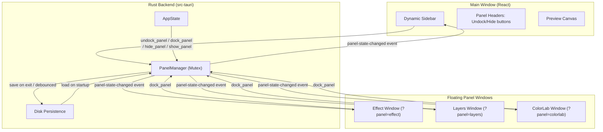
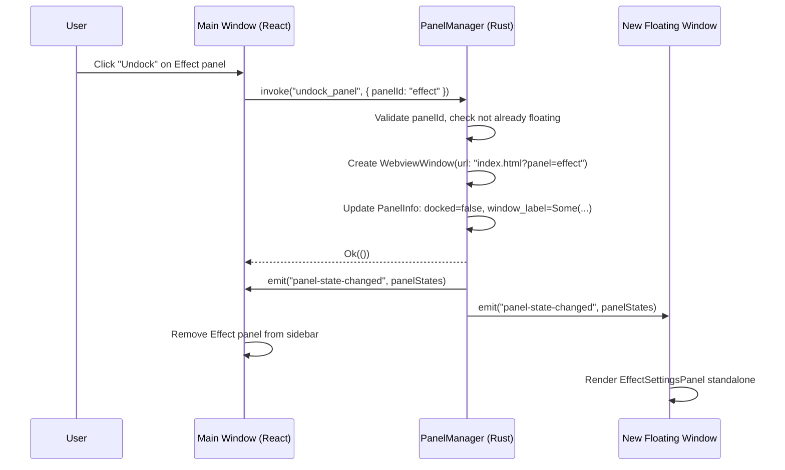
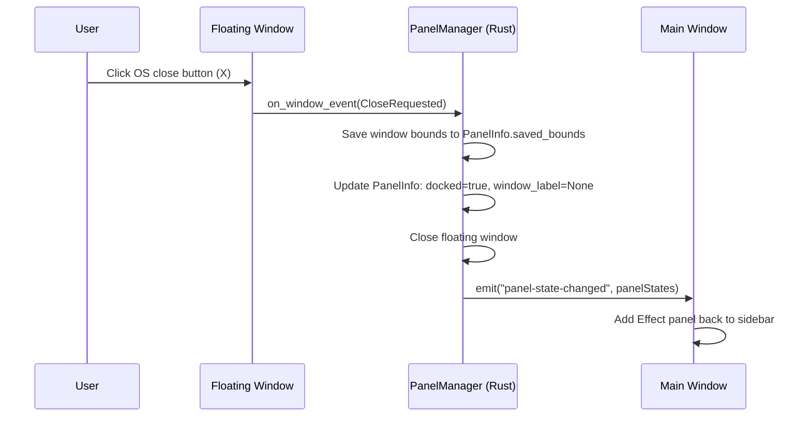

# Design Document: Multi-Window Dockable Panels

## Overview

This feature adds a multi-window panel system to Dither Yuki 2, allowing the Effect Settings, Layers, and Color Lab panels to be undocked from the main window sidebar into independent OS-level windows (Tauri WebViews). Each panel can be freely positioned across monitors, docked back into the sidebar, or hidden without losing state. A centralized Rust-side `PanelManager` holds the single source of truth for all panel configuration, synchronized across windows via Tauri events and persisted to disk for session restoration.

### Key Design Decisions

1. **PanelManager in Rust** — Panel state lives in `AppState` behind a `Mutex<PanelManager>`, ensuring atomic reads/writes and preventing race conditions between concurrent window operations.
2. **Real OS windows** — Floating panels are native Tauri WebView windows created via `WebviewWindowBuilder`, not CSS-based overlays. This gives true multi-monitor support with OS-level window management.
3. **Query-parameter routing** — Floating windows load the same `index.html` with `?panel=effect` (etc.), and the frontend renders only the panel component. No separate HTML files or build targets needed.
4. **Event-based sync** — All windows listen to `panel-state-changed` Tauri events carrying the full panel state snapshot. This fan-out approach is simple, consistent, and avoids differential sync bugs.
5. **Disk persistence** — Panel state (including window bounds) is serialized to a JSON file in the app data directory, restored on startup. Graceful fallback to defaults on corruption or missing file.

---

## Architecture

### System-Level Diagram



### Data Flow: Undock Operation



### Data Flow: Dock Operation (via OS close button)



---

## Components and Interfaces

### Rust Components

#### 1. PanelManager (`src-tauri/src/panel_manager.rs`)

The core state manager for all panel operations.

```rust
use serde::{Serialize, Deserialize};
use std::collections::HashMap;

/// Fixed panel identifiers.
pub type PanelId = String; // "effect" | "layers" | "colorlab"

/// Saved window position and size in screen pixels.
#[derive(Debug, Clone, Serialize, Deserialize)]
pub struct SavedBounds {
    pub x: i32,
    pub y: i32,
    pub width: u32,
    pub height: u32,
}

/// Complete state for a single panel.
#[derive(Debug, Clone, Serialize, Deserialize)]
pub struct PanelInfo {
    pub id: PanelId,
    pub docked: bool,
    pub visible: bool,
    pub window_label: Option<String>,
    pub saved_bounds: Option<SavedBounds>,
}

/// The panel manager holding state for all panels.
/// Lives inside AppState as Mutex<PanelManager>.
pub struct PanelManager {
    panels: HashMap<PanelId, PanelInfo>,
}

impl PanelManager {
    /// Initialize with all panels in docked + visible state.
    pub fn new() -> Self;

    /// Initialize from persisted state (loaded from disk).
    pub fn from_persisted(panels: Vec<PanelInfo>) -> Self;

    /// Get a snapshot of all panel states.
    pub fn get_state(&self) -> Vec<PanelInfo>;

    /// Validate that a panel ID is in the known set.
    pub fn validate_panel_id(&self, id: &str) -> Result<(), PanelError>;

    /// Undock a panel: sets docked=false, assigns window_label.
    /// Returns the window configuration needed to create the WebView.
    pub fn undock(&mut self, id: &str) -> Result<UndockResult, PanelError>;

    /// Dock a panel: sets docked=true, clears window_label.
    /// Returns the window label to close (if any).
    pub fn dock(&mut self, id: &str) -> Result<Option<String>, PanelError>;

    /// Hide a panel: sets visible=false.
    pub fn hide(&mut self, id: &str) -> Result<bool, PanelError>;

    /// Show a panel: sets visible=true.
    pub fn show(&mut self, id: &str) -> Result<bool, PanelError>;

    /// Update saved bounds for a panel (called on window move/resize).
    pub fn update_bounds(&mut self, id: &str, bounds: SavedBounds) -> Result<(), PanelError>;

    /// Serialize panel state for disk persistence.
    pub fn serialize(&self) -> Vec<PanelInfo>;
}

/// Result of an undock operation, providing info to create the window.
#[derive(Debug)]
pub struct UndockResult {
    pub window_label: String,
    pub url: String,             // "index.html?panel=effect"
    pub bounds: Option<SavedBounds>,
    pub already_floating: bool,  // true if we should just focus existing window
}

/// Errors that can occur in panel operations.
#[derive(Debug, thiserror::Error)]
pub enum PanelError {
    #[error("Unknown panel identifier: {0}")]
    UnknownPanel(String),
    #[error("Window creation failed: {0}")]
    WindowCreationFailed(String),
}
```

#### 2. Panel IPC Commands (`src-tauri/src/panel_commands.rs`)

Tauri command handlers that acquire `Mutex<PanelManager>`, perform the operation, emit events, and return results.

```rust
use tauri::{AppHandle, State, Manager, Emitter};
use tauri::webview::WebviewWindowBuilder;
use std::sync::{Arc, Mutex};

use crate::commands::AppState;
use crate::panel_manager::{PanelManager, PanelInfo, SavedBounds, PanelError};

/// Get all panel states.
#[tauri::command]
pub fn get_panels_state(
    state: State<Arc<AppState>>,
) -> Result<Vec<PanelInfo>, String>;

/// Undock a panel into a floating window.
#[tauri::command]
pub fn undock_panel(
    panel_id: String,
    app_handle: AppHandle,
    state: State<Arc<AppState>>,
) -> Result<(), String>;

/// Dock a floating panel back into the sidebar.
#[tauri::command]
pub fn dock_panel(
    panel_id: String,
    app_handle: AppHandle,
    state: State<Arc<AppState>>,
) -> Result<(), String>;

/// Hide a panel without destroying it.
#[tauri::command]
pub fn hide_panel(
    panel_id: String,
    app_handle: AppHandle,
    state: State<Arc<AppState>>,
) -> Result<(), String>;

/// Show a hidden panel.
#[tauri::command]
pub fn show_panel(
    panel_id: String,
    app_handle: AppHandle,
    state: State<Arc<AppState>>,
) -> Result<(), String>;

/// Save panel bounds (called from frontend on window move/resize).
#[tauri::command]
pub fn save_panel_bounds(
    panel_id: String,
    x: i32,
    y: i32,
    width: u32,
    height: u32,
    state: State<Arc<AppState>>,
) -> Result<(), String>;
```

#### 3. Panel State Persistence (`src-tauri/src/panel_persistence.rs`)

Handles loading/saving panel state to disk.

```rust
use std::path::PathBuf;
use crate::panel_manager::PanelInfo;

/// Get the path to the panel state file.
/// Located at: {app_data_dir}/panel_state.json
pub fn panel_state_path(app_handle: &tauri::AppHandle) -> PathBuf;

/// Load panel state from disk. Returns None if file is missing or invalid.
pub fn load_panel_state(app_handle: &tauri::AppHandle) -> Option<Vec<PanelInfo>>;

/// Save panel state to disk. Silently fails (logs warning).
pub fn save_panel_state(app_handle: &tauri::AppHandle, panels: &[PanelInfo]);
```

#### 4. AppState Extension

```rust
// In commands.rs — extend existing AppState:
pub struct AppState {
    pub document_handle: DocumentHandle,
    pub tile_cache: TileCache,
    pub scheduler: Scheduler,
    pub viewport: Mutex<ViewportState>,
    pub worker_wake: WorkerWake,
    pub palette_cache: PaletteKdCache,
    pub threshold_cache: ThresholdMapCache,
    pub error_residuals: ErrorResidualsStore,
    // NEW:
    pub panel_manager: Mutex<PanelManager>,
}
```

### Frontend Components

#### 5. Entry Point Router (`frontend/src/main.tsx`)

```typescript
import React from 'react';
import ReactDOM from 'react-dom/client';
import App from './App';
import PanelWindow from './components/PanelWindow';
import './index.css';

// Determine if this is a floating panel window
const params = new URLSearchParams(window.location.search);
const panelId = params.get('panel');
const KNOWN_PANELS = ['effect', 'layers', 'colorlab'];

const isPanel = panelId !== null && KNOWN_PANELS.includes(panelId);

ReactDOM.createRoot(document.getElementById('root')!).render(
  <React.StrictMode>
    {isPanel ? <PanelWindow panelId={panelId!} /> : <App />}
  </React.StrictMode>,
);
```

#### 6. PanelWindow Component (`frontend/src/components/PanelWindow.tsx`)

A minimal wrapper that renders a single panel with a title bar.

```typescript
interface PanelWindowProps {
  panelId: string; // "effect" | "layers" | "colorlab"
}

function PanelWindow({ panelId }: PanelWindowProps): JSX.Element;
```

Contains:
- Title bar with panel name, Dock button, Close button
- Renders the appropriate panel component based on `panelId`
- Listens to `panel-state-changed` events — closes self if panel becomes docked
- Reports window move/resize back to Rust via `save_panel_bounds`

#### 7. usePanels Hook (`frontend/src/hooks/usePanels.ts`)

Manages panel state on the frontend side.

```typescript
interface PanelInfo {
  id: string;
  docked: boolean;
  visible: boolean;
  windowLabel: string | null;
  savedBounds: { x: number; y: number; width: number; height: number } | null;
}

interface UsePanelsReturn {
  panels: PanelInfo[];
  undock: (panelId: string) => Promise<void>;
  dock: (panelId: string) => Promise<void>;
  hide: (panelId: string) => Promise<void>;
  show: (panelId: string) => Promise<void>;
  error: string | null;
}

function usePanels(): UsePanelsReturn;
```

- Fetches initial state via `get_panels_state` on mount
- Subscribes to `panel-state-changed` events for real-time updates
- Provides typed wrappers for all panel commands

#### 8. Dynamic Sidebar (updated `App.tsx`)

The sidebar section is refactored to:
- Use `usePanels()` hook to determine which panels to render
- Render only panels where `docked === true && visible === true`
- Distribute available height equally among visible docked panels
- Add Undock button to each panel header
- Collapse sidebar (width: 0) when no panels are docked and visible

#### 9. IPC Panel Commands (`frontend/src/ipc/panelCommands.ts`)

```typescript
import { invoke } from '@tauri-apps/api/core';
import type { PanelInfo } from '../types/panels';

export async function getPanelsState(): Promise<PanelInfo[]> {
  return invoke<PanelInfo[]>('get_panels_state');
}

export async function undockPanel(panelId: string): Promise<void> {
  return invoke<void>('undock_panel', { panelId });
}

export async function dockPanel(panelId: string): Promise<void> {
  return invoke<void>('dock_panel', { panelId });
}

export async function hidePanel(panelId: string): Promise<void> {
  return invoke<void>('hide_panel', { panelId });
}

export async function showPanel(panelId: string): Promise<void> {
  return invoke<void>('show_panel', { panelId });
}

export async function savePanelBounds(
  panelId: string,
  x: number,
  y: number,
  width: number,
  height: number,
): Promise<void> {
  return invoke<void>('save_panel_bounds', { panelId, x, y, width, height });
}
```

---

## Data Models

### Rust Data Structures

#### PanelInfo (shared between Rust and Frontend)

```rust
#[derive(Debug, Clone, Serialize, Deserialize)]
pub struct PanelInfo {
    pub id: String,                      // "effect" | "layers" | "colorlab"
    pub docked: bool,                    // true = in sidebar, false = floating
    pub visible: bool,                   // false = hidden (not rendered/shown)
    pub window_label: Option<String>,    // Tauri window label when floating
    pub saved_bounds: Option<SavedBounds>, // Last window position/size
}

#[derive(Debug, Clone, Serialize, Deserialize)]
pub struct SavedBounds {
    pub x: i32,      // Screen x coordinate
    pub y: i32,      // Screen y coordinate
    pub width: u32,  // Window width in pixels
    pub height: u32, // Window height in pixels
}
```

#### Persistence File Format (`panel_state.json`)

```json
{
  "version": 1,
  "panels": [
    {
      "id": "effect",
      "docked": false,
      "visible": true,
      "window_label": "panel-effect",
      "saved_bounds": { "x": 1920, "y": 100, "width": 400, "height": 600 }
    },
    {
      "id": "layers",
      "docked": true,
      "visible": true,
      "window_label": null,
      "saved_bounds": null
    },
    {
      "id": "colorlab",
      "docked": true,
      "visible": false,
      "window_label": null,
      "saved_bounds": { "x": 500, "y": 200, "width": 450, "height": 700 }
    }
  ]
}
```

### TypeScript Types

```typescript
// frontend/src/types/panels.ts

export interface SavedBounds {
  x: number;
  y: number;
  width: number;
  height: number;
}

export interface PanelInfo {
  id: string;
  docked: boolean;
  visible: boolean;
  window_label: string | null;
  saved_bounds: SavedBounds | null;
}

export type PanelId = 'effect' | 'layers' | 'colorlab';

export const PANEL_IDS: PanelId[] = ['effect', 'layers', 'colorlab'];

export const PANEL_DISPLAY_NAMES: Record<PanelId, string> = {
  effect: 'Effect Settings',
  layers: 'Layers',
  colorlab: 'Color Lab',
};

export const PANEL_DEFAULT_BOUNDS: Record<PanelId, { width: number; height: number }> = {
  effect: { width: 400, height: 600 },
  layers: { width: 350, height: 500 },
  colorlab: { width: 450, height: 700 },
};
```

### Event Payload

The `panel-state-changed` event carries:

```typescript
// Emitted from Rust to all windows
interface PanelStateChangedPayload {
  panels: PanelInfo[];
}
```

### Window Creation Parameters

When `undock_panel` is called, the Rust side creates a window with:

| Parameter | Value |
|-----------|-------|
| label | `"panel-{id}"` (e.g., `"panel-effect"`) |
| url | `"index.html?panel={id}"` (in production) or `"http://localhost:5173?panel={id}"` (dev) |
| width | `saved_bounds.width` or default (400) |
| height | `saved_bounds.height` or default (600) |
| x | `saved_bounds.x` or centered on main window's monitor |
| y | `saved_bounds.y` or centered on main window's monitor |
| title | Panel display name (e.g., "Dither – Effect Settings") |
| resizable | `true` |
| decorations | `true` |
| always_on_top | `false` |

---


## Correctness Properties

*A property is a characteristic or behavior that should hold true across all valid executions of a system — essentially, a formal statement about what the system should do. Properties serve as the bridge between human-readable specifications and machine-verifiable correctness guarantees.*

### Property 1: Panel Set Invariant

*For any* sequence of valid panel operations (undock, dock, show, hide, update_bounds), the PanelManager SHALL always contain exactly three panels with IDs "effect", "layers", and "colorlab", each having all required fields (id, docked, visible, window_label, saved_bounds) present and well-typed.

**Validates: Requirements 1.1**

### Property 2: Invalid Panel ID Rejection

*For any* string that is not in the set {"effect", "layers", "colorlab"}, invoking any PanelManager method (undock, dock, hide, show, update_bounds) with that string SHALL return an `UnknownPanel` error and leave the PanelManager state unchanged.

**Validates: Requirements 1.4, 2.7, 3.5, 4.6**

### Property 3: State Serialization Round-Trip

*For any* valid PanelManager state, serializing to JSON via `get_state()` and then deserializing back SHALL produce a list of PanelInfo records equivalent to the original state (all field values preserved).

**Validates: Requirements 1.3, 5.4**

### Property 4: Undock State Transition

*For any* panel in docked state (docked=true), calling `undock` SHALL result in docked=false, window_label=Some(label) where label matches the pattern "panel-{id}", and if saved_bounds was previously set, the UndockResult SHALL carry those saved_bounds unchanged.

**Validates: Requirements 2.2, 2.3**

### Property 5: Dock State Transition

*For any* panel in floating state (docked=false, window_label=Some), calling `dock` SHALL result in docked=true, window_label=None, while preserving the panel's visible flag and saved_bounds unchanged.

**Validates: Requirements 3.1, 3.2**

### Property 6: Visibility Toggle Transitions

*For any* visible panel (visible=true), calling `hide` SHALL set visible=false. *For any* hidden panel (visible=false), calling `show` SHALL set visible=true. In both cases, the docked flag, window_label, and saved_bounds SHALL remain unchanged.

**Validates: Requirements 4.1, 4.4**

### Property 7: Operation Idempotency

*For any* panel already in floating state, calling `undock` again SHALL return `already_floating=true` and not modify the panel state. *For any* panel already in docked state, calling `dock` SHALL be a no-op. *For any* panel already hidden, calling `hide` SHALL not emit an event or change state. *For any* panel already visible, calling `show` SHALL not emit an event or change state.

**Validates: Requirements 2.5, 3.6, 4.7**

### Property 8: Persistence Round-Trip

*For any* valid PanelManager state (with arbitrary combinations of docked/floating, visible/hidden, and saved_bounds values), saving to disk via `save_panel_state` and then loading via `load_panel_state` SHALL produce an equivalent set of PanelInfo records.

**Validates: Requirements 8.3**

### Property 9: Off-Screen Bounds Correction

*For any* SavedBounds where the window rectangle (x, y, width, height) falls entirely outside all available monitor boundaries, the bounds correction logic SHALL reposition the window to the center of the primary monitor while preserving the original width and height values.

**Validates: Requirements 8.5**

### Property 10: Sidebar Rendering Filter

*For any* combination of panel states (each panel independently docked/floating and visible/hidden), the set of panels rendered in the sidebar SHALL be exactly the subset where `docked=true AND visible=true`, displayed in the fixed order [effect, layers, colorlab].

**Validates: Requirements 7.1**

### Property 11: Unknown Panel Param Routing Fallback

*For any* string value of the `panel` query parameter that is not in {"effect", "layers", "colorlab"}, the frontend router SHALL render the standard application layout (App component) rather than a PanelWindow.

**Validates: Requirements 6.5**

---

## Error Handling

### Rust Backend Errors

| Error Condition | Response | Recovery |
|----------------|----------|----------|
| Unknown panel ID | Return `PanelError::UnknownPanel(id)` → IPC error string | Frontend shows notification, no state change |
| Window creation fails | Return `PanelError::WindowCreationFailed(reason)` → IPC error string | Panel stays docked, no event emitted |
| Persistence file missing | Log warning, initialize defaults | Silent — user sees fresh default state |
| Persistence file corrupt | Log warning, initialize defaults | Silent — corrupt file is overwritten on next save |
| Save fails on exit | Log error, continue shutdown | Silent — app closes normally |
| Floating window destroyed externally | Auto-dock panel, emit event | Transparent to user — panel returns to sidebar |
| Mutex poisoned (panic in other thread) | Propagate panic (unrecoverable) | Application crash — acceptable for data corruption scenario |

### Frontend Errors

| Error Condition | Response | Recovery |
|----------------|----------|----------|
| IPC command rejection | Show error notification with operation name and reason | Panel stays in current state |
| Event listener fails to parse payload | Log console error, ignore event | Next valid event will correct state |
| Panel window fails to close on dock event | Window stays open; user can manually close | Next panel-state-changed event retries |

### Error Propagation Strategy

1. **Rust → Frontend**: All panel commands return `Result<T, String>`. Errors are serialized as user-facing messages.
2. **Event delivery failure**: Tauri's `emit` is fire-and-forget. If a window is already closed, the event is silently dropped (no error).
3. **Concurrent access**: `Mutex<PanelManager>` ensures serialized access. Lock acquisition is expected to be sub-millisecond (no heavy computation under lock).

---

## Testing Strategy

### Unit Tests (Rust)

Focus on `PanelManager` pure logic:
- Initialization defaults
- State transitions (undock, dock, show, hide)
- Error cases (invalid IDs, already-in-state)
- Bounds update and preservation
- Serialization/deserialization round-trips

### Property-Based Tests (Rust — proptest)

Property-based testing is appropriate here because the `PanelManager` has clear input/output behavior with state transitions that should satisfy universal invariants regardless of operation sequence.

**Library**: `proptest` (already in dev-dependencies)
**Configuration**: Minimum 100 iterations per property

Each property test will:
- Generate random sequences of valid operations (undock, dock, show, hide, update_bounds with random values)
- Apply them to a fresh PanelManager
- Assert the property holds after each operation

**Tag format**: `Feature: multi-window-dockable-panels, Property {N}: {property_text}`

### Integration Tests

- Window creation/destruction lifecycle
- Event delivery across multiple windows
- Persistence save/load with real filesystem
- OS close button triggers dock
- Startup restoration of floating windows
- Main window close cascades to all floating windows

### Frontend Tests (Vitest + fast-check)

- `usePanels` hook: state management, event handling
- `PanelWindow` component: renders correct panel, title bar buttons work
- Router logic: query param parsing and fallback behavior
- Sidebar dynamic rendering: correct panels shown based on state
- Property tests for sidebar filter logic and routing logic

**Property test library**: `fast-check` (already in project dependencies)
**Configuration**: Minimum 100 iterations per property

