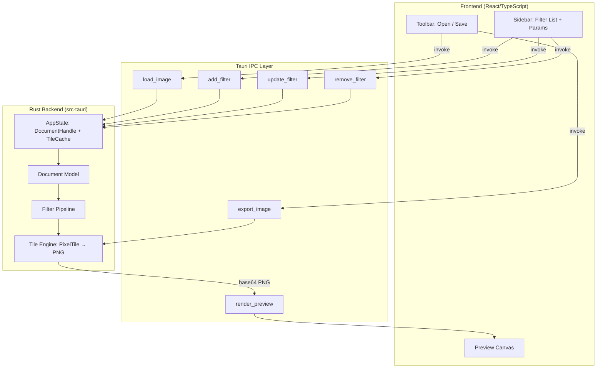
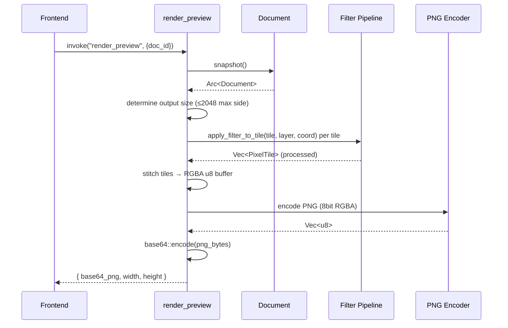
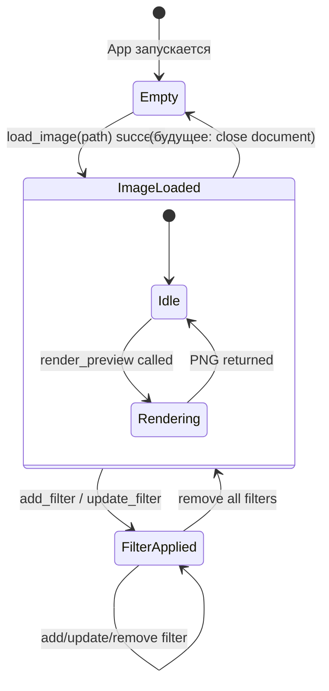

# Design Document: MVP Frontend

## Overview

Дизайн MVP-интерфейса для Dither Engine — минимальный полноценный фронтенд, связывающий React/TypeScript UI с Rust-движком через Tauri IPC. Основная задача: загрузка изображения, применение фильтров (Dither, Curves, Levels, Glitch), отображение превью на Canvas, экспорт результата.

### Ключевые решения

1. **Tauri Managed State** — `AppState` (содержащий `DocumentHandle` + `TileCache`) хранится через `tauri::manage()` и доступен всем IPC-командам.
2. **Base64 PNG для превью** — рендеринг тайлов → сборка в единый RGBA-буфер → кодирование в PNG → base64 строка через IPC → отображение на `` / Canvas.
3. **Расширение FilterKind** — добавление `Dither` и `Glitch` вариантов в enum `FilterKind` и `FilterParams` (engine-project).
4. **Однонаправленный поток данных** — Frontend вызывает IPC-команду → Engine мутирует Document → Engine рендерит → Frontend получает base64 PNG и обновляет Canvas.

## Architecture

### Общая диаграмма



### Поток данных

1. Пользователь нажимает «Открыть» → Frontend вызывает `tauri::dialog::open()` → получает путь → `invoke("load_image", { path })`.
2. Backend декодирует изображение (image crate), раскладывает RGBA f32 данные по `PixelTile` (256×256 + halo) в `TileCache`, создаёт `Document` с правильными размерами.
3. Frontend автоматически вызывает `invoke("render_preview", { doc_id })` → Backend собирает тайлы, применяет фильтры, склеивает RGBA-буфер, кодирует в PNG, возвращает base64-строку.
4. Frontend устанавливает `src` на `` / рисует на Canvas через `Image` API.
5. Изменение фильтра: Frontend → `invoke("update_filter", {...})` → Backend мутирует Document, инвалидирует кэш → Frontend повторно вызывает `render_preview`.

## Components and Interfaces

### Backend (src-tauri)

#### AppState

```rust
pub struct AppState {
    pub document_handle: DocumentHandle,
    pub tile_cache: TileCache,
    /// Raw pixel data per document (loaded image tiles)
    pub image_data: Mutex<Option<ImageData>>,
}

/// Loaded image raw data (before filter processing)
pub struct ImageData {
    pub width: u32,
    pub height: u32,
    pub tiles: Vec<Vec<Arc<PixelTile>>>, // grid[row][col]
}
```

#### IPC Commands (Tauri)

| Команда | Аргументы | Возвращает |
|---------|-----------|-----------|
| `load_image` | `path: String` | `LoadImageResponse { doc_id, width, height, tile_count }` |
| `render_preview` | `doc_id: u32` | `RenderPreviewResponse { base64_png: String, width: u32, height: u32 }` |
| `add_filter` | `{ layer_id, kind, params }` | `FilterIdResponse { filter_id: String }` |
| `update_filter` | `{ layer_id, filter_id, params }` | `()` |
| `remove_filter` | `{ layer_id, filter_id }` | `()` |
| `export_image` | `{ doc_id, path, format, quality? }` | `()` |

#### Сигнатуры IPC-команд

```rust
#[tauri::command]
pub async fn load_image(
    path: String,
    state: State<'_, AppState>,
) -> Result<LoadImageResponse, String>;

#[tauri::command]
pub fn render_preview(
    doc_id: u32,
    state: State<'_, AppState>,
) -> Result<RenderPreviewResponse, String>;

#[tauri::command]
pub fn add_filter(
    req: AddFilterRequest,
    state: State<'_, AppState>,
) -> Result<FilterIdResponse, String>;

#[tauri::command]
pub fn update_filter(
    req: UpdateFilterRequest,
    state: State<'_, AppState>,
) -> Result<(), String>;

#[tauri::command]
pub fn remove_filter(
    req: RemoveFilterRequest,
    state: State<'_, AppState>,
) -> Result<(), String>;

#[tauri::command]
pub async fn export_image(
    req: ExportImageRequest,
    state: State<'_, AppState>,
) -> Result<(), String>;
```

#### Процесс render_preview



#### Расширение FilterKind и FilterParams

Текущий `FilterKind` содержит только `Curves`, `Levels`, `Placeholder`. Для MVP необходимо добавить:

```rust
#[derive(Debug, Clone, Copy, PartialEq, Eq, Serialize, Deserialize)]
pub enum FilterKind {
    Curves,
    Levels,
    Dither,
    Glitch,
}

#[derive(Debug, Clone, Serialize, Deserialize)]
pub enum FilterParams {
    Curves {
        curve: Vec<(f32, f32)>,
        channel: CurveChannel, // Red, Green, Blue, All, Luminance
    },
    Levels {
        input_black: f32,
        input_white: f32,
        gamma: f32,
        output_black: f32,
        output_white: f32,
    },
    Dither {
        algorithm: DitherAlgorithm, // FloydSteinberg, Ordered, Threshold
        color_depth: u8,            // 1..=8
    },
    Glitch {
        glitch_type: GlitchType,    // RGBShift, BlockDisplace
        intensity: f32,             // 0.0..=1.0
        seed: u64,
    },
}
```

### Frontend (React/TypeScript)

#### Структура компонентов

```
frontend/src/
├── App.tsx                   # Main layout (grid: toolbar + canvas + sidebar)
├── components/
│   ├── Toolbar.tsx           # Open / Save buttons
│   ├── PreviewCanvas.tsx     # Canvas/Img for rendered image + loading overlay
│   ├── Sidebar.tsx           # Filter list + active filter params
│   ├── FilterList.tsx        # List of applied filters with add/remove
│   ├── FilterPanel.tsx       # Parameter editors per filter type
│   ├── filters/
│   │   ├── DitherParams.tsx  # Algorithm select + color_depth slider
│   │   ├── CurvesParams.tsx  # Curve editor (points) + channel select
│   │   ├── LevelsParams.tsx  # 5 sliders
│   │   └── GlitchParams.tsx  # Type select + intensity slider
│   └── common/
│       ├── Slider.tsx        # Reusable slider with label + numeric display
│       └── Notification.tsx  # Toast notification (auto-hide 5s)
├── hooks/
│   ├── useDocument.ts        # State: docId, width, height, loading
│   ├── useFilters.ts         # State: filter list, active filter, CRUD operations
│   └── usePreview.ts         # State: previewSrc (base64 data URL), render trigger
├── ipc/
│   └── commands.ts           # Typed wrappers around invoke()
├── types/
│   └── index.ts              # TypeScript interfaces for IPC DTOs
└── App.css                   # Layout styles (CSS Grid)
```

#### Layout (CSS Grid)

```css
.app-layout {
    display: grid;
    grid-template-rows: 48px 1fr;
    grid-template-columns: 1fr minmax(200px, 320px);
    grid-template-areas:
        "toolbar toolbar"
        "canvas  sidebar";
    height: 100vh;
    min-width: 800px;
    min-height: 600px;
}
```

#### TypeScript Interfaces (IPC DTOs)

```typescript
// types/index.ts

export interface LoadImageResponse {
  doc_id: number;
  width: number;
  height: number;
  tile_count: number;
}

export interface RenderPreviewResponse {
  base64_png: string;
  width: number;
  height: number;
}

export interface FilterInfo {
  id: string;
  kind: FilterKind;
  params: FilterParams;
  enabled: boolean;
}

export type FilterKind = 'Dither' | 'Curves' | 'Levels' | 'Glitch';

export type FilterParams =
  | { type: 'Dither'; algorithm: DitherAlgorithm; color_depth: number }
  | { type: 'Curves'; curve: [number, number][]; channel: CurveChannel }
  | { type: 'Levels'; input_black: number; input_white: number; gamma: number; output_black: number; output_white: number }
  | { type: 'Glitch'; glitch_type: GlitchType; intensity: number; seed: number };

export type DitherAlgorithm = 'FloydSteinberg' | 'Ordered' | 'Threshold';
export type CurveChannel = 'Red' | 'Green' | 'Blue' | 'All' | 'Luminance';
export type GlitchType = 'RGBShift' | 'BlockDisplace';

export interface ExportImageRequest {
  doc_id: number;
  path: string;
  format: 'PNG' | 'JPEG';
  quality?: number;
}
```

#### IPC Command Wrappers

```typescript
// ipc/commands.ts
import { invoke } from '@tauri-apps/api/core';
import type { LoadImageResponse, RenderPreviewResponse, FilterInfo, ExportImageRequest } from '../types';

export async function loadImage(path: string): Promise<LoadImageResponse> {
  return invoke<LoadImageResponse>('load_image', { path });
}

export async function renderPreview(docId: number): Promise<RenderPreviewResponse> {
  return invoke<RenderPreviewResponse>('render_preview', { docId });
}

export async function addFilter(layerId: number, kind: string, params: object): Promise<{ filter_id: string }> {
  return invoke('add_filter', { req: { layer_id: layerId, kind, params } });
}

export async function updateFilter(layerId: number, filterId: string, params: object): Promise<void> {
  return invoke('update_filter', { req: { layer_id: layerId, filter_id: filterId, params } });
}

export async function removeFilter(layerId: number, filterId: string): Promise<void> {
  return invoke('remove_filter', { req: { layer_id: layerId, filter_id: filterId } });
}

export async function exportImage(req: ExportImageRequest): Promise<void> {
  return invoke('export_image', { req });
}
```

## Data Models

### Backend State Machine



### Document Model (расширение)

Существующая структура `Document` из engine-project используется без изменений:

```rust
pub struct Document {
    pub id: DocumentId,       // u32 wrapper
    pub width: u32,
    pub height: u32,
    pub root: Vec<LayerNode>, // bottom-to-top layers
    pub revision: u64,
    // ...
}
```

При `load_image`:
- Создаётся новый `Document` с размерами загруженного изображения
- Добавляется один `Layer` (kind = Raster) — базовый слой с пиксельными данными
- Пиксельные данные раскладываются по тайлам в `TileCache` / `ImageData`

### Frontend State

```typescript
// Основное состояние приложения (hooks)

interface AppState {
  // Document
  docId: number | null;
  width: number;
  height: number;
  layerId: number | null;   // ID базового raster layer
  
  // Preview
  previewSrc: string | null; // "data:image/png;base64,..."
  isRendering: boolean;
  
  // Filters
  filters: FilterInfo[];
  activeFilterId: string | null;
  
  // UI
  error: string | null;
  notification: string | null;
}
```

### Маппинг фильтров Frontend ↔ Engine

| Frontend FilterKind | Engine FilterKind | Engine FilterParams variant | Defaults |
|---|---|---|---|
| `'Dither'` | `FilterKind::Dither` | `FilterParams::Dither { algorithm, color_depth }` | FloydSteinberg, 4 bit |
| `'Curves'` | `FilterKind::Curves` | `FilterParams::Curves { curve, channel }` | [(0,0),(1,1)], All |
| `'Levels'` | `FilterKind::Levels` | `FilterParams::Levels { input_black, input_white, gamma, output_black, output_white }` | 0.0, 1.0, 1.0, 0.0, 1.0 |
| `'Glitch'` | `FilterKind::Glitch` | `FilterParams::Glitch { glitch_type, intensity, seed }` | RGBShift, 0.5, random |

### Конвертация тайлов в PNG (render pipeline)

```rust
fn render_to_png(doc: &Document, image_data: &ImageData, tile_cache: &TileCache) -> Result<Vec<u8>, String> {
    let (out_w, out_h) = compute_preview_size(doc.width, doc.height, 2048);
    
    // 1. Iterate all tiles covering the document
    let tiles_x = (doc.width as f32 / 256.0).ceil() as usize;
    let tiles_y = (doc.height as f32 / 256.0).ceil() as usize;
    
    // 2. For each tile: get raw pixel data, apply layer filters
    let mut rgba_buffer = vec![0u8; (out_w * out_h * 4) as usize];
    
    for ty in 0..tiles_y {
        for tx in 0..tiles_x {
            let raw_tile = &image_data.tiles[ty][tx];
            let processed_tile = apply_filters_to_tile(raw_tile, &doc.root, coord);
            
            // 3. Convert f32 [0.0-1.0] → u8 [0-255] and copy to buffer
            copy_tile_to_buffer(&processed_tile, &mut rgba_buffer, tx, ty, out_w, out_h);
        }
    }
    
    // 4. Encode to PNG
    let png_bytes = encode_rgba_to_png(&rgba_buffer, out_w, out_h);
    Ok(png_bytes)
}
```

### Дополнительные зависимости (src-tauri/Cargo.toml)

```toml
[dependencies]
# Existing...
image = { version = "0.25", features = ["png", "jpeg", "webp"] }
base64 = "0.22"
```


## Correctness Properties

*A property is a characteristic or behavior that should hold true across all valid executions of a system — essentially, a formal statement about what the system should do. Properties serve as the bridge between human-readable specifications and machine-verifiable correctness guarantees.*

### Property 1: Load image metadata correctness

*For any* valid image file of dimensions (W, H) within [1, 8192] × [1, 8192], calling `load_image` SHALL return a response where `width == W`, `height == H`, and `tile_count == ceil(W/256) × ceil(H/256)`.

**Validates: Requirements 1.3, 9.2, 9.3**

### Property 2: Dimension boundary validation

*For any* pair of dimensions (W, H) where both `1 ≤ W ≤ 8192` and `1 ≤ H ≤ 8192`, `load_image` SHALL succeed; and *for any* (W, H) where `W > 8192` or `H > 8192`, `load_image` SHALL return an InvalidState error.

**Validates: Requirements 1.6, 1.7, 9.6**

### Property 3: Invalid path and corrupt data error handling

*For any* file path that does not exist or points to a file containing non-image data (random bytes), `load_image` SHALL return an IoError with a non-empty descriptive message.

**Validates: Requirements 1.5, 9.4, 9.5**

### Property 4: Fit-to-view preserves aspect ratio

*For any* image dimensions (img_w, img_h) and viewport dimensions (vp_w, vp_h) where all are positive, the computed display dimensions (disp_w, disp_h) SHALL satisfy: (1) `disp_w ≤ vp_w` and `disp_h ≤ vp_h`, (2) `|disp_w/disp_h - img_w/img_h| < ε` (aspect ratio preserved within rounding), (3) at least one of `disp_w == vp_w` or `disp_h == vp_h` (maximally fills one axis).

**Validates: Requirements 2.1**

### Property 5: Filter list ordering invariant

*For any* sequence of N `add_filter` operations with kinds [K1, K2, ..., KN], the resulting filter list SHALL contain exactly N filters in the same order. Furthermore, removing the filter at index i SHALL result in a list of N-1 filters with order preserved for the remaining elements.

**Validates: Requirements 3.2, 3.3, 3.6**

### Property 6: Dither color_depth range validation

*For any* integer value V where `V < 1` or `V > 8`, attempting to create or update a Dither filter with `color_depth = V` SHALL be rejected (return error or be clamped by the frontend), and the previous valid value SHALL be preserved.

**Validates: Requirements 4.6**

### Property 7: Float display precision

*For any* float value V in the range [0.0, 10.0], the formatted display string SHALL contain exactly 2 digits after the decimal point (i.e., match the regex `^\d+\.\d{2}$`).

**Validates: Requirements 5.4, 6.4**

### Property 8: Glitch zero-intensity no-op

*For any* input PixelTile with arbitrary pixel data, applying the Glitch filter with `intensity = 0.0` SHALL produce an output tile where every pixel value equals the corresponding input pixel value.

**Validates: Requirements 6.6**

### Property 9: Preview output is valid decodable PNG

*For any* valid document with at least one visible layer containing pixel data, `render_preview` SHALL return a string that is valid base64, and when decoded, produces a valid PNG image with RGBA color type and 8 bits per channel.

**Validates: Requirements 10.3**

### Property 10: Preview downscale respects 2048 limit with aspect ratio preservation

*For any* document where `max(width, height) > 2048`, the `render_preview` output dimensions (out_w, out_h) SHALL satisfy: (1) `max(out_w, out_h) ≤ 2048`, (2) `|out_w/out_h - width/height| < ε` (aspect ratio preserved within rounding error).

**Validates: Requirements 10.4**

### Property 11: Invalid export format rejection

*For any* format string that is not "PNG" and not "JPEG", calling `export_image` with that format SHALL return an InvalidFilterParams error without creating any file on disk.

**Validates: Requirements 11.5**

## Error Handling

### Стратегия обработки ошибок

Ошибки классифицируются по источнику и тяжести:

| Тип ошибки | Источник | Поведение Frontend | Поведение Backend |
|---|---|---|---|
| IoError | Файловая система | Показать toast с описанием причины | Вернуть `Err(String)` через IPC |
| InvalidState | Невалидное состояние документа | Показать toast + сохранить предыдущее состояние | Вернуть `Err(String)` |
| InvalidFilterParams | Неверные параметры фильтра | Откатить UI к предыдущим значениям + показать toast | Вернуть `Err(String)` |
| DocumentNotFound | Неверный doc_id | Показать toast + перейти в empty state | Вернуть `Err(String)` |
| RenderError | Ошибка рендеринга | Показать toast + сохранить последнее успешное превью | Вернуть `Err(String)` |

### Frontend error flow

```typescript
// Общий паттерн обработки ошибок в IPC-вызовах
async function safeInvoke<T>(fn: () => Promise<T>, onError: (msg: string) => void): Promise<T | null> {
  try {
    return await fn();
  } catch (error) {
    const message = typeof error === 'string' ? error : String(error);
    onError(message);
    return null;
  }
}
```

### Backend error mapping

Ошибки из `EngineError` (engine-project) маппятся в строки для IPC:

```rust
fn engine_error_to_string(e: EngineError) -> String {
    match e {
        EngineError::InvalidFilterParams { reason } => format!("Invalid parameters: {}", reason),
        EngineError::InvalidState { reason } => format!("Invalid state: {}", reason),
        EngineError::IoError { reason } => format!("IO error: {}", reason),
        // ...
    }
}
```

### Принципы

1. **Не терять данные** — при ошибке рендеринга сохраняется последнее успешное превью.
2. **Rollback UI** — при ошибке update_filter UI откатывается к предыдущим значениям.
3. **Информативные сообщения** — пользователь видит причину ошибки (не "Unknown error").
4. **Graceful degradation** — приложение остаётся функциональным после ошибки.

## Testing Strategy

### Обзор

Тестирование разделено на три уровня:

1. **Property-Based Tests** — проверка универсальных свойств (Rust + TypeScript)
2. **Unit / Example Tests** — конкретные сценарии и edge cases
3. **Integration Tests** — полный цикл через IPC

### Property-Based Tests (PBT)

**Библиотека (Rust):** `proptest` (стандарт для Rust PBT)
**Библиотека (TypeScript):** `fast-check`

**Конфигурация:** минимум 100 итераций на каждый property test.

Каждый тест помечен тегом: `Feature: mvp-frontend, Property N: <text>`

#### Rust PBT (src-tauri/tests/ или crates)

| Property | Модуль | Что тестируется |
|---|---|---|
| 1 (metadata) | engine-project / src-tauri | load_image returns correct width, height, tile_count |
| 2 (dimensions) | engine-project / src-tauri | Dimension [1,8192] accepted, > 8192 rejected |
| 3 (error) | src-tauri | Invalid paths/data return IoError |
| 5 (filter order) | engine-project | Filter list CRUD preserves ordering |
| 6 (color_depth) | engine-project | DitherFilter rejects depth outside [1,8] |
| 8 (glitch no-op) | engine-project | Glitch intensity=0 preserves tile data |
| 9 (valid PNG) | src-tauri | render_preview output is decodable PNG |
| 10 (downscale) | src-tauri | Preview ≤ 2048 with correct aspect ratio |
| 11 (format) | src-tauri | Invalid export format rejected |

#### TypeScript PBT (frontend)

| Property | Модуль | Что тестируется |
|---|---|---|
| 4 (fit-to-view) | hooks/usePreview | computeFitToView preserves aspect ratio |
| 7 (formatting) | components/common/Slider | formatValue produces 2 decimal places |

### Unit / Example Tests

- Toolbar рендерит 2 кнопки (Open, Save)
- Save disabled когда нет документа
- FilterList отображает 4 типа фильтров
- DitherParams defaults: Floyd-Steinberg, color_depth=4
- CurvesParams показывает channel selector
- LevelsParams рендерит 5 слайдеров
- GlitchParams defaults: RGBShift, intensity=0.5
- Debounce 200ms при resize
- Debounce 100ms при изменении параметров
- Notification auto-hide через 5 секунд
- Empty state placeholder text

### Integration Tests

- Полный цикл: load_image → render_preview → verify PNG
- add_filter → render_preview → verify image changed
- export_image → verify file written to disk
- Error propagation: engine error → frontend toast

### Зависимости для тестирования

```toml
# src-tauri/Cargo.toml [dev-dependencies]
proptest = "1.4"
tempfile = "3.10"
```

```json
// frontend/package.json devDependencies
{
  "vitest": "^1.0",
  "fast-check": "^3.15",
  "@testing-library/react": "^14.0",
  "jsdom": "^24.0"
}
```
