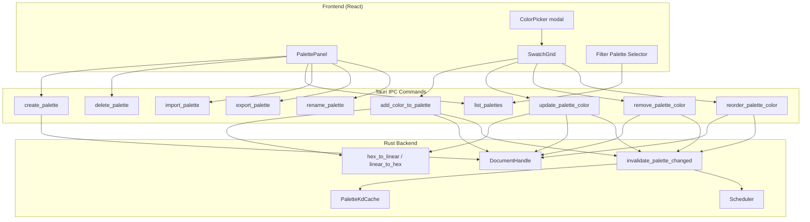
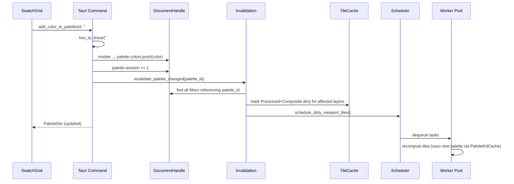

 # Design Document: Palette Management

## Overview

This design covers the implementation of palette management Tauri commands, tile invalidation on palette modification, UI components (enhanced PalettePanel, SwatchGrid, color picker integration, palette-filter binding), and the hex↔linear color conversion utilities. It builds on top of the existing `engine-color` palette data model, format parsers, and the partially implemented Tauri commands (`list_palettes`, `import_palette`, `add_palette`, `generate_palette`, `remove_palette`).

**What already exists:**
- `Document.add_palette()`, `modify_palette()`, `remove_palette()`, `get_palette()` in engine-project
- `list_palettes`, `import_palette`, `add_palette`, `generate_palette`, `remove_palette` Tauri commands
- Basic `PalettePanel.tsx` with import/generate/remove
- `PaletteDto` type and `palette_to_dto()` helper in src-tauri
- `srgb_to_linear()` and `linear_to_srgb()` in engine-color

**What this feature adds:**
- New Tauri commands: `create_palette`, `add_color_to_palette`, `update_palette_color`, `remove_palette_color`, `reorder_palette_color`, `rename_palette`, `export_palette`
- Invalidation cascade on any palette color modification
- Enhanced PalettePanel with create/export buttons and inline editing
- SwatchGrid component with drag-and-drop reordering
- Color picker integration for add/edit color workflows
- Palette selector dropdown in DitherV2/PaletteQuantize filter panels

## Architecture

### System Context



### Data Flow for Color Modification



## Components and Interfaces

### 1. Hex Color Conversion Utilities (`src-tauri/src/commands.rs`)

```rust
/// Parse a 6-character hex string to LinearColor.
/// Case-insensitive. Returns Err for invalid format.
fn hex_to_linear(hex: &str) -> Result<LinearColor, String> {
    if hex.len() != 6 {
        return Err("Hex color must be exactly 6 characters".to_string());
    }
    let r = u8::from_str_radix(&hex[0..2], 16)
        .map_err(|_| "Invalid hex character in red channel")?;
    let g = u8::from_str_radix(&hex[2..4], 16)
        .map_err(|_| "Invalid hex character in green channel")?;
    let b = u8::from_str_radix(&hex[4..6], 16)
        .map_err(|_| "Invalid hex character in blue channel")?;
    Ok(LinearColor {
        r: srgb_to_linear(r),
        g: srgb_to_linear(g),
        b: srgb_to_linear(b),
    })
}

/// Convert LinearColor to 6-character uppercase hex string.
fn linear_to_hex(color: &LinearColor) -> String {
    let r = linear_to_srgb(color.r);
    let g = linear_to_srgb(color.g);
    let b = linear_to_srgb(color.b);
    format!("{:02X}{:02X}{:02X}", r, g, b)
}
```

### 2. Palette Invalidation Helper (`src-tauri/src/commands.rs`)

```rust
/// Invalidate all layers whose filters reference the given palette_id.
/// Steps:
/// 1. Snapshot document
/// 2. Walk layer tree, find filters with matching palette_id
/// 3. For each affected layer, fire InvalidationEvent::LayerFilterChanged
/// 4. Schedule dirty viewport tiles
fn invalidate_palette_changed(palette_id: PaletteId, state: &AppState) {
    let snapshot = state.document_handle.snapshot();
    let affected_layers = find_layers_referencing_palette(&snapshot.root, palette_id);
    
    for layer_id in &affected_layers {
        engine_tiles::invalidation::invalidate(
            &state.tile_cache,
            engine_tiles::invalidation::InvalidationEvent::LayerFilterChanged {
                layer: layer_id.0,
            },
        );
    }
    
    if !affected_layers.is_empty() {
        schedule_dirty_viewport_tiles(state);
    }
}

/// Recursively find all layer IDs whose filters reference the given palette.
fn find_layers_referencing_palette(
    nodes: &[LayerNode],
    palette_id: PaletteId,
) -> Vec<LayerId> { /* recursive walk */ }
```

### 3. New Tauri Commands

#### 3.1 `create_palette`

```rust
#[derive(Deserialize)]
pub struct CreatePaletteRequest {
    pub name: String,
}

#[tauri::command]
pub fn create_palette(
    req: CreatePaletteRequest,
    state: State<'_, Arc<AppState>>,
) -> Result<PaletteDto, String> {
    // Validate name: 1–255 chars
    // mutate doc → add_palette(name, vec![])
    // increment generation
    // return PaletteDto
}
```

#### 3.2 `delete_palette` (enhanced)

The existing `remove_palette` is strict (fails if referenced). The new `delete_palette` will force-remove by clearing references first:

```rust
#[tauri::command]
pub fn delete_palette(
    palette_id: u32,
    state: State<'_, Arc<AppState>>,
) -> Result<DeletePaletteResponse, String> {
    // 1. Find all filter references to this palette
    // 2. Clear references (DitherV2 → set palette_id=None, PaletteQuantize → remove filter)
    // 3. Remove palette from document
    // 4. Evict from PaletteKdCache
    // 5. Invalidate affected layers
    // 6. Return list of affected filter IDs
}

#[derive(Serialize)]
pub struct DeletePaletteResponse {
    pub affected_filter_ids: Vec<String>,
}
```

#### 3.3 `add_color_to_palette`

```rust
#[derive(Deserialize)]
pub struct AddColorRequest {
    pub palette_id: u32,
    pub hex: String,  // 6-char hex, e.g. "FF0000"
}

#[tauri::command]
pub fn add_color_to_palette(
    req: AddColorRequest,
    state: State<'_, Arc<AppState>>,
) -> Result<PaletteDto, String> {
    // 1. hex_to_linear(req.hex)
    // 2. Validate palette exists, size < 65536
    // 3. mutate doc → palette.colors.push(color), palette.revision += 1
    // 4. invalidate_palette_changed(palette_id, state)
    // 5. Return updated PaletteDto
}
```

#### 3.4 `update_palette_color`

```rust
#[derive(Deserialize)]
pub struct UpdateColorRequest {
    pub palette_id: u32,
    pub index: usize,
    pub hex: String,
}

#[tauri::command]
pub fn update_palette_color(
    req: UpdateColorRequest,
    state: State<'_, Arc<AppState>>,
) -> Result<PaletteDto, String> {
    // 1. hex_to_linear(req.hex)
    // 2. Validate palette exists, index in bounds
    // 3. mutate doc → palette.colors[index] = color, palette.revision += 1
    // 4. invalidate_palette_changed(palette_id, state)
    // 5. Return updated PaletteDto
}
```

#### 3.5 `remove_palette_color`

```rust
#[derive(Deserialize)]
pub struct RemoveColorRequest {
    pub palette_id: u32,
    pub index: usize,
}

#[tauri::command]
pub fn remove_palette_color(
    req: RemoveColorRequest,
    state: State<'_, Arc<AppState>>,
) -> Result<PaletteDto, String> {
    // 1. Validate palette exists, index in bounds
    // 2. Check: if removal would leave 0 colors AND palette is referenced → error
    // 3. mutate doc → palette.colors.remove(index), palette.revision += 1
    // 4. invalidate_palette_changed(palette_id, state)
    // 5. Return updated PaletteDto
}
```

#### 3.6 `reorder_palette_color`

```rust
#[derive(Deserialize)]
pub struct ReorderColorRequest {
    pub palette_id: u32,
    pub from_index: usize,
    pub to_index: usize,
}

#[tauri::command]
pub fn reorder_palette_color(
    req: ReorderColorRequest,
    state: State<'_, Arc<AppState>>,
) -> Result<PaletteDto, String> {
    // 1. Validate palette exists, both indices in bounds
    // 2. If from == to → return current PaletteDto (no-op)
    // 3. mutate doc → remove at from_index, insert at to_index, palette.revision += 1
    // 4. invalidate_palette_changed(palette_id, state)
    // 5. Return updated PaletteDto
}
```

#### 3.7 `rename_palette`

```rust
#[derive(Deserialize)]
pub struct RenamePaletteRequest {
    pub palette_id: u32,
    pub name: String,
}

#[tauri::command]
pub fn rename_palette(
    req: RenamePaletteRequest,
    state: State<'_, Arc<AppState>>,
) -> Result<PaletteDto, String> {
    // 1. Validate name: 1–255 chars
    // 2. Validate palette exists
    // 3. mutate doc → palette.name = name
    // 4. NO invalidation (name doesn't affect rendering)
    // 5. Return updated PaletteDto
}
```

#### 3.8 `export_palette`

```rust
#[derive(Deserialize)]
pub struct ExportPaletteRequest {
    pub palette_id: u32,
    pub path: String,
    pub format: String,  // "ase", "gpl", "json", "aco", "pal", "csv"
}

#[tauri::command]
pub fn export_palette(
    req: ExportPaletteRequest,
    state: State<'_, Arc<AppState>>,
) -> Result<(), String> {
    // 1. Validate palette exists
    // 2. Parse format string → PaletteFormat enum
    // 3. engine_color::palette::export_palette(palette, format) → bytes
    // 4. std::fs::write(path, bytes)
    // 5. Return Ok(())
}
```

### 4. Updated PaletteDto Format

The existing `PaletteDto` uses `colors: [number, number, number][]` (sRGB u8 triplets). We'll extend it to also include hex colors for the UI:

```rust
#[derive(Serialize)]
pub struct PaletteDto {
    pub id: u32,
    pub name: String,
    pub colors: Vec<[u8; 3]>,       // sRGB u8 for backward compatibility
    pub hex_colors: Vec<String>,     // Hex strings for new UI
    pub color_count: usize,
}
```

### 5. Frontend Components

#### 5.1 Enhanced PalettePanel

Extends the existing `PalettePanel.tsx`:
- Add "Create Palette" button with name input
- Add "Export" button per palette (opens save dialog)
- Add inline rename (click on name → editable text field)
- Integrate SwatchGrid for selected palette

#### 5.2 SwatchGrid Component

New component: `frontend/src/components/SwatchGrid.tsx`

```typescript
interface SwatchGridProps {
  paletteId: number;
  colors: string[];  // hex colors
  onColorAdded: () => void;
  onColorUpdated: () => void;
  onColorRemoved: () => void;
  onColorReordered: () => void;
}
```

Features:
- Grid of square swatches (CSS Grid, responsive)
- Click to select, double-click to edit
- "+" button to add new color
- "−" button to remove selected color
- Drag-and-drop reordering (HTML5 DnD API or @dnd-kit)
- Hex tooltip on hover

#### 5.3 ColorPicker Component

New component: `frontend/src/components/ColorPicker.tsx`

```typescript
interface ColorPickerProps {
  initialColor?: string;  // hex, e.g. "FF0000"
  onConfirm: (hex: string) => void;
  onCancel: () => void;
}
```

Uses `react-colorful` (HexColorPicker) for the picker interface.
Emits 6-char hex string on confirm.

#### 5.4 Palette Selector in Filter Panel

In the DitherV2 and PaletteQuantize filter parameter components:
- Dropdown listing all document palettes by name
- "None" option for DitherV2 (disables palette)
- On selection change → calls `updateFilter` with updated palette_id

### 6. IPC Command Wrappers

New functions in `frontend/src/ipc/commands.ts`:

```typescript
export async function createPalette(name: string): Promise<PaletteDto>;
export async function deletePalette(paletteId: number): Promise<DeletePaletteResponse>;
export async function addColorToPalette(paletteId: number, hex: string): Promise<PaletteDto>;
export async function updatePaletteColor(paletteId: number, index: number, hex: string): Promise<PaletteDto>;
export async function removePaletteColor(paletteId: number, index: number): Promise<PaletteDto>;
export async function reorderPaletteColor(paletteId: number, fromIndex: number, toIndex: number): Promise<PaletteDto>;
export async function renamePalette(paletteId: number, name: string): Promise<PaletteDto>;
export async function exportPalette(paletteId: number, path: string, format: string): Promise<void>;
```

## Data Models

### PaletteDto (TypeScript)

```typescript
interface PaletteDto {
  id: number;
  name: string;
  colors: [number, number, number][];  // sRGB u8 triplets
  hex_colors: string[];                 // 6-char hex strings
  color_count: number;
}

interface DeletePaletteResponse {
  affected_filter_ids: string[];
}
```

### Command Request Types (Rust)

```rust
struct CreatePaletteRequest { name: String }
struct AddColorRequest { palette_id: u32, hex: String }
struct UpdateColorRequest { palette_id: u32, index: usize, hex: String }
struct RemoveColorRequest { palette_id: u32, index: usize }
struct ReorderColorRequest { palette_id: u32, from_index: usize, to_index: usize }
struct RenamePaletteRequest { palette_id: u32, name: String }
struct ExportPaletteRequest { palette_id: u32, path: String, format: String }
```

## Correctness Properties

### Property 1: Hex Round-Trip

*For any* valid 6-character hexadecimal string (each pair in [00–FF]), converting via `hex_to_linear` and then `linear_to_hex` SHALL produce the original string (case-normalized to uppercase).

**Validates: Requirements 16.1, 16.2, 16.3**

### Property 2: Palette Revision Monotonicity on Color Operations

*For any* sequence of color operations (add, remove, update, reorder) on a palette, the palette's revision counter SHALL strictly increase after each operation.

**Validates: Requirements 3.1, 4.1, 5.1, 6.1**

### Property 3: Reorder Preserves Collection

*For any* palette with N colors and any valid reorder operation (from_index, to_index both in [0, N)), the set of colors after reorder SHALL be identical to the set before (same elements, possibly different order), and the element originally at from_index SHALL appear at to_index.

**Validates: Requirements 6.1**

### Property 4: Add-then-Remove is Identity

*For any* palette and any valid hex color, adding a color and then removing the last color SHALL return the palette to its original color list (modulo revision increment).

**Validates: Requirements 3.1, 5.1**

### Property 5: Invalidation Coverage

*For any* Document containing palettes and filters, after a palette color modification, every FilterInstance referencing that palette's ID SHALL have its layer's Processed and Composite tiles marked dirty.

**Validates: Requirements 11.1, 11.2**

### Property 6: No Invalidation on Rename

*For any* palette rename operation, no tiles SHALL be marked dirty in the TileCache.

**Validates: Requirements 7.4**

### Property 7: Delete Clears All References

*For any* palette deletion via `delete_palette`, after the operation completes, no FilterInstance in the Document SHALL reference the deleted PaletteId.

**Validates: Requirements 2.2**

## Testing Strategy

### Unit Tests (Rust)
- `hex_to_linear` / `linear_to_hex` round-trip and edge cases
- `find_layers_referencing_palette` with various layer tree structures
- Individual command logic (create, add color, update, remove, reorder, rename)
- Validation edge cases (empty name, out-of-bounds index, invalid hex)

### Property-Based Tests (Rust, proptest)
- Hex round-trip: `∀ hex ∈ [000000..FFFFFF]: linear_to_hex(hex_to_linear(hex)) == hex.to_uppercase()`
- Reorder preserves collection: `∀ palette, (from, to): set(colors_after) == set(colors_before)`
- Revision monotonicity: `∀ sequence of color ops: revision always increases`

### Integration Tests (Rust)
- Full CRUD lifecycle through Tauri command functions (without app handle, direct function calls)
- Invalidation cascade: modify palette → verify tile cache dirty flags
- Delete with references: verify filter params cleared and palette removed

### Frontend Component Tests (Vitest + Testing Library)
- SwatchGrid: renders correct number of swatches, click selection, remove button
- ColorPicker: renders, emits hex on confirm, cancel closes
- PalettePanel: create/import/delete flows

## Error Handling

| Command | Error Condition | Response |
|---------|----------------|----------|
| `create_palette` | Name empty or >255 chars | `"Name must be 1–255 characters"` |
| `add_color_to_palette` | Invalid hex format | `"Invalid hex color format"` |
| `add_color_to_palette` | Palette not found | `"Palette {id} not found"` |
| `add_color_to_palette` | 65536 colors limit | `"Palette has reached maximum size (65536 colors)"` |
| `update_palette_color` | Index out of bounds | `"Color index {n} out of bounds (palette has {m} colors)"` |
| `remove_palette_color` | Would empty referenced palette | `"Cannot remove last color from a palette referenced by filters"` |
| `reorder_palette_color` | Index out of bounds | `"Index out of bounds"` |
| `rename_palette` | Palette not found | `"Palette {id} not found"` |
| `export_palette` | Unsupported format | `"Unsupported export format: {fmt}"` |
| `export_palette` | Write failure | `"Failed to write file: {reason}"` |
| `delete_palette` | Palette not found | `"Palette {id} not found"` |

All errors are returned as `Result<T, String>` from Tauri commands, matching the existing error pattern in the codebase.
