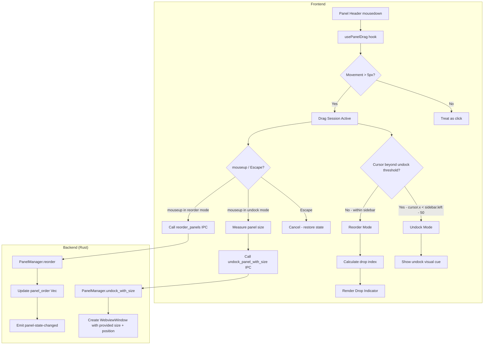

# Design Document: Panel Drag Undock & Reorder

## Overview

This feature adds drag-based interactions to the sidebar's docked panels, allowing users to:
1. **Reorder** panels by dragging within the sidebar (vertical reposition)
2. **Undock** panels into floating windows by dragging horizontally away from the sidebar

The implementation introduces a `usePanelDrag` custom hook that manages the complete drag lifecycle (mousedown → mousemove → mouseup), determines whether the drag intent is "reorder" or "undock" based on cursor position relative to the sidebar edge, and dispatches the appropriate IPC command on release. Two new backend commands (`undock_panel_with_size` and `reorder_panels`) support the new interactions, and `PanelManager` gains a `panel_order: Vec<String>` field to persist custom ordering.

## Architecture



### Key Architectural Decisions

1. **Single custom hook (`usePanelDrag`)**: Encapsulates all drag state and logic, keeping App.tsx clean. The hook attaches `mousemove`/`mouseup` listeners to `document` (not individual panels) so the drag continues even if the cursor leaves the sidebar.

2. **Mode detection via horizontal distance**: A simple threshold check (cursor.x vs sidebar left edge - 50px) cleanly separates undock from reorder intent. This avoids complex gesture recognition.

3. **Backend-owned panel order**: The `panel_order` field lives in `PanelManager` (Rust), ensuring persistence and single source of truth. The frontend receives order via the existing `panel-state-changed` event.

4. **New IPC command for sized undock**: Rather than modifying the existing `undock_panel` command (which other code depends on), a new `undock_panel_with_size` command accepts explicit dimensions and position. The button-based undock continues using the original command with default sizes.

## Components and Interfaces

### Frontend: `usePanelDrag` Hook

```typescript
// frontend/src/hooks/usePanelDrag.ts

interface DragState {
  active: boolean;
  panelId: PanelId | null;
  mode: 'idle' | 'reorder' | 'undock';
  startX: number;
  startY: number;
  currentX: number;
  currentY: number;
  dropIndex: number | null;       // target index for reorder
  sourceIndex: number;            // original index of dragged panel
}

interface UsePanelDragOptions {
  sidebarRef: React.RefObject<HTMLDivElement>;
  panelOrder: PanelId[];
  onReorder: (newOrder: PanelId[]) => void;
  onUndock: (panelId: PanelId, width: number, height: number, screenX: number, screenY: number) => void;
}

interface UsePanelDragReturn {
  dragState: DragState;
  handleMouseDown: (panelId: PanelId, event: React.MouseEvent) => void;
  getPanelStyle: (panelId: PanelId) => React.CSSProperties;
  dropIndicatorIndex: number | null;
}
```

**Responsibilities:**
- Track mousedown → 5px threshold → drag session activation
- Attach document-level `mousemove` and `mouseup` listeners during drag
- Compute drag mode (undock vs reorder) from cursor position vs sidebar bounds
- Calculate drop index based on cursor Y relative to panel midpoints
- On mouseup: measure panel DOM element, call appropriate callback
- On Escape: cancel and reset all state
- Return styling info (opacity for dragged panel) and drop indicator position

### Frontend: IPC Functions

```typescript
// frontend/src/ipc/panelCommands.ts (additions)

export async function undockPanelWithSize(
  panelId: string,
  width: number,
  height: number,
  x: number,
  y: number,
): Promise<void> {
  return invoke<void>('undock_panel_with_size', { panelId, width, height, x, y });
}

export async function reorderPanels(order: string[]): Promise<void> {
  return invoke<void>('reorder_panels', { order });
}
```

### Frontend: Updated Panel Types

```typescript
// frontend/src/types/panels.ts (additions)

export interface PanelStateSnapshot {
  panels: PanelInfo[];
  panel_order: PanelId[];
}
```

The `panel-state-changed` event payload will be extended to include `panel_order` alongside the panel info array.

### Backend: New IPC Commands

```rust
// src-tauri/src/panel_commands.rs (additions)

#[tauri::command]
pub fn undock_panel_with_size(
    panel_id: String,
    width: u32,
    height: u32,
    x: i32,
    y: i32,
    app_handle: AppHandle,
    state: State<Arc<AppState>>,
) -> Result<(), String> { ... }

#[tauri::command]
pub fn reorder_panels(
    order: Vec<String>,
    app_handle: AppHandle,
    state: State<Arc<AppState>>,
) -> Result<(), String> { ... }
```

### Backend: PanelManager Changes

```rust
// src-tauri/src/panel_manager.rs (additions)

pub struct PanelManager {
    panels: HashMap<PanelId, PanelInfo>,
    panel_order: Vec<String>,  // NEW: ordered list of panel IDs
}

impl PanelManager {
    /// Reorder panels. Validates all IDs are known and the list is complete.
    pub fn reorder(&mut self, order: Vec<String>) -> Result<(), PanelError> { ... }

    /// Get the current panel order.
    pub fn get_order(&self) -> &[String] { ... }

    /// Get state snapshot including order.
    pub fn get_state_with_order(&self) -> (Vec<PanelInfo>, Vec<String>) { ... }
}
```

### CSS Additions

```css
/* Drag feedback classes */
.docked-panel-header--dragging { cursor: grabbing; }
.docked-panel--dragging { opacity: 0.4; pointer-events: none; }
.docked-panel--undock-preview { opacity: 0.3; border: 1px dashed var(--border-color); }

/* Drop indicator */
.panel-drop-indicator {
  height: 2px;
  background: var(--color-highlight, #4a90d9);
  margin: 0 4px;
  border-radius: 1px;
  flex-shrink: 0;
}
```

## Data Models

### DragState (Frontend)

| Field | Type | Description |
|-------|------|-------------|
| active | boolean | Whether a drag session is in progress |
| panelId | PanelId \| null | The panel being dragged |
| mode | 'idle' \| 'reorder' \| 'undock' | Current drag intent based on cursor position |
| startX, startY | number | Screen coordinates of initial mousedown |
| currentX, currentY | number | Current cursor screen coordinates |
| dropIndex | number \| null | Calculated insertion index for reorder |
| sourceIndex | number | Original index of the dragged panel in the order array |

### PanelManager State (Backend)

| Field | Type | Description |
|-------|------|-------------|
| panels | HashMap\<PanelId, PanelInfo\> | Existing panel state map |
| panel_order | Vec\<String\> | Ordered list of panel IDs determining sidebar render order |

### panel-state-changed Event Payload (Updated)

```typescript
interface PanelStateChangedPayload {
  panels: PanelInfo[];
  panel_order: string[];  // NEW
}
```

### Drop Index Calculation

The drop index is computed from the cursor's Y position relative to panel midpoints:

```
For each panel i at position panels[i]:
  midpoint_i = panel_top_i + panel_height_i / 2
  
If cursor_y < midpoint_0 → dropIndex = 0
If cursor_y >= midpoint_i and cursor_y < midpoint_(i+1) → dropIndex = i + 1
If cursor_y >= midpoint_last → dropIndex = panel_count
```

The source panel is excluded from midpoint calculations (it's "removed" from flow during drag).

### Reorder Array Operation

Given `panelOrder = [A, B, C]`, dragging panel at `sourceIndex=2` (C) to `dropIndex=0`:
1. Remove item at sourceIndex: `[A, B]`
2. Insert at dropIndex: `[C, A, B]`

If `dropIndex > sourceIndex`, adjust: `insertAt = dropIndex - 1` (since removal shifts indices).

## Correctness Properties

*A property is a characteristic or behavior that should hold true across all valid executions of a system — essentially, a formal statement about what the system should do. Properties serve as the bridge between human-readable specifications and machine-verifiable correctness guarantees.*

### Property 1: Drag Threshold Detection

*For any* mousedown starting position and any subsequent mouse position, a drag session SHALL be initiated if and only if the Euclidean distance between the start and current position is greater than or equal to 5 pixels.

**Validates: Requirements 1.1, 1.4**

### Property 2: Mode Detection — Undock vs Reorder

*For any* active drag session and any cursor position, the drag mode SHALL be "undock" if and only if the cursor's X coordinate is less than the sidebar's left edge minus 50 pixels; otherwise the mode SHALL be "reorder".

**Validates: Requirements 2.1, 5.1**

### Property 3: Drop Index Calculation

*For any* set of panel positions (defined by top offsets and heights) and any cursor Y coordinate within the sidebar, the computed drop index SHALL equal the number of panel midpoints that are less than or equal to the cursor Y coordinate, excluding the source panel's midpoint.

**Validates: Requirements 5.2, 6.2**

### Property 4: Array Reorder Preserves Elements

*For any* ordered list of panel IDs and any valid (sourceIndex, dropIndex) pair, the reorder operation SHALL produce a list that contains exactly the same elements as the original, with the source element at the target position and all other elements maintaining their relative order.

**Validates: Requirements 5.3**

### Property 5: Panel ID Validation

*For any* list of strings provided as a reorder command, the PanelManager SHALL accept the command if and only if the list is a permutation of the known panel IDs (same elements, same count, no duplicates, no unknowns).

**Validates: Requirements 9.2, 9.4**

### Property 6: Undock Window Position Matches Release Point

*For any* screen coordinate (x, y) where the mouse is released during an undock drag, the floating window's initial top-left position SHALL equal (x, y) before any off-screen correction is applied.

**Validates: Requirements 4.1**

## Error Handling

| Scenario | Handler | Behavior |
|----------|---------|----------|
| `undock_panel_with_size` IPC fails | `usePanelDrag` | Cancel drag, restore panel to original state, surface error via `usePanels.error` |
| `reorder_panels` IPC fails | `usePanelDrag` | Revert panel order in UI to pre-drag state, surface error |
| Unknown panel ID in reorder | `PanelManager.reorder()` | Return `PanelError::UnknownPanel`, IPC returns error string |
| Incomplete panel list in reorder | `PanelManager.reorder()` | Return error — all known panels must be present |
| WebviewWindow creation fails | `undock_panel_with_size` command | Revert panel state via `pm.dock()`, return error |
| Drag cancelled via Escape | `usePanelDrag` | Reset all drag state, remove visual feedback, no IPC calls |
| Sidebar ref is null during drag | `usePanelDrag` | Cancel drag immediately (defensive check) |

## Testing Strategy

### Property-Based Tests (Vitest + fast-check)

The feature's core logic — threshold detection, mode determination, drop index calculation, array reorder, and validation — consists of pure functions suitable for property-based testing.

**Library:** `fast-check` (already appropriate for TypeScript/Vitest ecosystem)
**Minimum iterations:** 100 per property

Each property test will:
- Reference its design property via tag comment
- Generate random inputs covering the full domain
- Assert the universal property holds

**Property tests to implement:**
1. Drag threshold (5px Euclidean distance) — pure math function
2. Mode detection (cursor X vs sidebar edge - 50px) — pure comparison
3. Drop index calculation — pure function from panel positions + cursor Y
4. Array reorder correctness — pure array manipulation
5. Panel ID validation — pure set comparison

Tag format: `// Feature: panel-drag-undock-reorder, Property {N}: {title}`

### Unit Tests (Vitest)

- `usePanelDrag` hook: test via `renderHook` with simulated mouse events
- Visual feedback: verify CSS classes applied/removed at correct times
- IPC calls: mock `invoke` and verify correct commands/arguments
- Escape cancellation: verify no IPC calls and state reset
- Error handling: mock IPC rejection and verify recovery

### Rust Unit Tests

- `PanelManager::reorder()`: valid permutation accepted, invalid rejected
- `PanelManager::get_order()`: returns correct order after reorder
- `PanelManager::from_persisted()` with panel_order: restores order
- Serialization round-trip includes panel_order

### Integration Tests

- Full drag-to-undock flow: mousedown → move → release → verify floating window created with correct size
- Full drag-to-reorder flow: mousedown → move within sidebar → release → verify panel order updated
- Persistence: reorder → restart → verify order preserved
