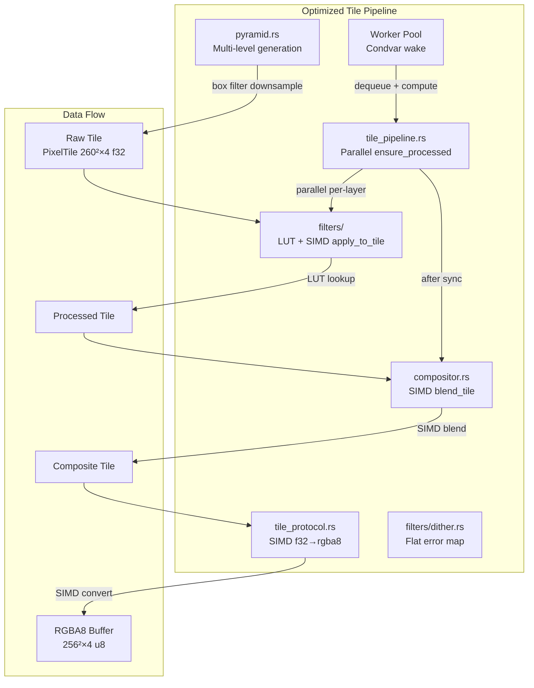
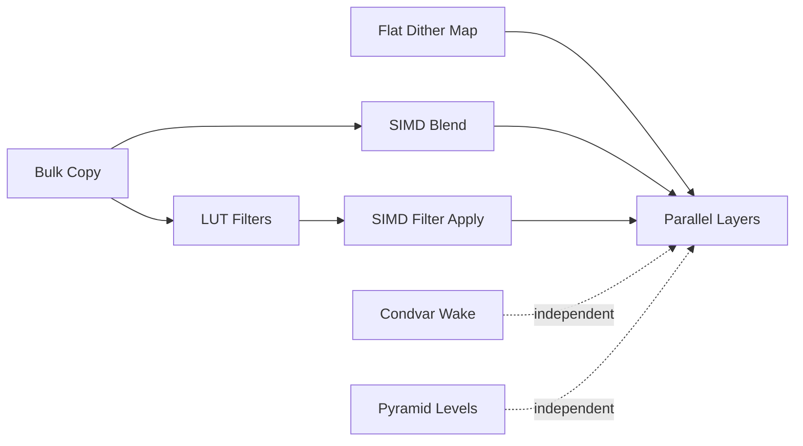

# Design Document: Tile Render Performance

## Overview

This design specifies performance optimizations to the Dither Yuki 2 tile rendering pipeline. The optimizations target six areas: SIMD-accelerated pixel processing, bulk memory copies, LUT pre-computation for filters, parallel multi-layer processing, pyramid-level rendering, and worker wake efficiency. All optimizations are constrained by a strict correctness invariant: pixel-identical RGBA8 output compared to the pre-optimization implementation.

The design follows a layered approach—each optimization is isolated to specific functions and can be enabled/disabled independently via feature flags during development.

**Key Design Decisions:**
- Use the `wide` crate (stable Rust) for portable SIMD rather than nightly `std::simd`, for build stability
- LUTs use 4096 entries with linear interpolation for sub-1/65536 accuracy
- Parallel processing uses `rayon::scope` (already a dependency) for structured concurrency
- Worker wake uses `std::sync::Condvar` (no new dependency needed)
- Flat error map uses simple index arithmetic (no dependency change)

## Architecture

### High-Level Component Interaction



### Optimization Dependency Graph



Optimizations are independent and can be implemented in any order. Bulk copy is a prerequisite for SIMD paths (since SIMD operates on contiguous slices).

## Components and Interfaces

### 1. SIMD Module (`crates/engine-project/src/simd.rs`)

New module providing SIMD-accelerated inner loops. Uses `wide` crate for portable f32x4/f32x8 operations.

```rust
// crates/engine-project/src/simd.rs

use wide::f32x4;

/// SIMD-accelerated Porter-Duff "over" blend for a row of pixels.
/// Processes 4 channels (1 pixel) per f32x4 operation, iterating
/// in chunks of 4 pixels (16 f32s) for optimal throughput.
pub fn blend_row_simd(
    dst: &mut [f32],    // row slice: 256 * 4 = 1024 f32s
    src: &[f32],        // row slice: 256 * 4 = 1024 f32s
    mode: BlendMode,
    opacity: f32,
);

/// SIMD-accelerated Levels LUT application for a row of pixels.
/// Reads 4 f32 values, performs LUT index + lerp, writes 4 f32 results.
pub fn levels_row_simd(
    dst: &mut [f32],
    src: &[f32],
    lut: &[f32; 4096],
);

/// SIMD-accelerated f32 → u8 conversion for a row of pixels.
/// Clamp [0,1], multiply by 255, add 0.5, truncate to u8.
pub fn f32_to_rgba8_row_simd(
    dst: &mut [u8],     // output: 256 * 4 = 1024 bytes
    src: &[f32],        // input: 256 * 4 = 1024 f32s
);
```

**Interface contract:** Every SIMD function has a `_scalar` counterpart with identical signatures. Tests verify `simd_fn(input) == scalar_fn(input)` for all inputs.

### 2. LUT-Enhanced Filters

#### LevelsFilter (modified)

```rust
// crates/engine-project/src/filters/levels.rs

pub struct LevelsFilter {
    pub input_black: f32,
    pub input_white: f32,
    pub gamma: f32,
    pub output_black: f32,
    pub output_white: f32,
    /// Pre-computed LUT: 4096 entries mapping [0.0, 1.0] → output
    lut: [f32; 4096],
}

impl LevelsFilter {
    /// Rebuild LUT from current parameters.
    /// Called on construction and on any parameter change.
    pub fn rebuild_lut(&mut self) {
        for i in 0..4096 {
            let x = i as f32 / 4095.0;
            self.lut[i] = self.apply_to_value(x);
        }
    }

    /// Fast LUT lookup with linear interpolation.
    /// Returns value within ±1/65536 of apply_to_value(x).
    pub fn lut_lookup(&self, x: f32) -> f32 {
        let x = x.clamp(0.0, 1.0);
        let idx_f = x * 4095.0;
        let idx_lo = idx_f as usize;
        let idx_hi = (idx_lo + 1).min(4095);
        let frac = idx_f - idx_lo as f32;
        self.lut[idx_lo] * (1.0 - frac) + self.lut[idx_hi] * frac
    }
}
```

#### CurvesFilter (modified)

```rust
// crates/engine-project/src/filters/curves.rs

pub struct CurvesFilter {
    pub curve: Vec<(f32, f32)>,
    pub channel: CurveChannel,
    /// Pre-computed LUT: 4096 entries of Catmull-Rom interpolated values.
    lut: [f32; 4096],
}

impl CurvesFilter {
    /// Rebuild LUT from current control points.
    pub fn rebuild_lut(&mut self) {
        for i in 0..4096 {
            let x = i as f32 / 4095.0;
            self.lut[i] = self.evaluate(x);  // Catmull-Rom
        }
    }

    /// Fast LUT lookup with linear interpolation.
    pub fn lut_lookup(&self, x: f32) -> f32 {
        let x = x.clamp(0.0, 1.0);
        let idx_f = x * 4095.0;
        let idx_lo = idx_f as usize;
        let idx_hi = (idx_lo + 1).min(4095);
        let frac = idx_f - idx_lo as f32;
        self.lut[idx_lo] * (1.0 - frac) + self.lut[idx_hi] * frac
    }
}
```

### 3. Parallel Processing (`src-tauri/src/tile_pipeline.rs`)

```rust
/// Ensure all visible layers have fresh Processed tiles — in parallel.
fn ensure_processed_tiles_fresh(
    nodes: &[LayerNode],
    coord: TileCoord,
    state: &AppState,
) -> Result<(), EngineError> {
    // Collect all leaf layers needing recomputation
    let needs_compute: Vec<&Layer> = collect_dirty_layers(nodes, coord, state);

    if needs_compute.len() <= 1 {
        // Single layer: compute inline (no rayon overhead)
        for layer in needs_compute {
            compute_processed_tile_for_layer(layer, coord, state)?;
        }
    } else {
        // Multiple layers: parallel via rayon::scope
        rayon::scope(|s| {
            for layer in &needs_compute {
                s.spawn(|_| {
                    let _ = compute_processed_tile_for_layer(layer, coord, state);
                });
            }
        });
    }

    Ok(())
}
```

### 4. Worker Wake Mechanism (`src-tauri/src/worker.rs`)

```rust
use std::sync::{Condvar, Mutex};

pub struct WorkerWake {
    mutex: Mutex<bool>,    // true = tasks available
    condvar: Condvar,
}

impl WorkerWake {
    pub fn new() -> Self {
        Self {
            mutex: Mutex::new(false),
            condvar: Condvar::new(),
        }
    }

    /// Signal workers that tasks are available.
    /// Called from Scheduler::enqueue().
    pub fn notify_one(&self) {
        let mut has_tasks = self.mutex.lock().unwrap();
        *has_tasks = true;
        self.condvar.notify_one();
    }

    /// Wait until tasks are available.
    /// Called from worker loop when dequeue returns None.
    pub fn wait(&self) {
        let mut has_tasks = self.mutex.lock().unwrap();
        while !*has_tasks {
            has_tasks = self.condvar.wait(has_tasks).unwrap();
        }
        *has_tasks = false;
    }
}
```

### 5. Pyramid Level Integration

```rust
// Frontend: computePyramidLevel (TileCanvas.tsx)
export function computePyramidLevel(zoom: number, docWidth: number, docHeight: number): number {
    if (zoom >= 1.0) return 0;
    const level = Math.max(0, Math.floor(Math.log2(1.0 / zoom)));
    const maxLevel = Math.floor(Math.log2(Math.max(docWidth, docHeight) / 256));
    return Math.min(level, maxLevel);
}

// Backend: generate pyramid tile on-demand
// crates/engine-tiles/src/pyramid.rs
pub fn generate_pyramid_tile(
    level: u8,
    coord: TileCoord,
    cache: &TileCache,
) -> Option<PixelTile> {
    // Recursively downsample from level 0
    // Each level N tile is derived from 4 level N-1 tiles
    // using 2×2 box filter
}
```

### 6. Cache-Friendly Dither Error Map

```rust
// crates/engine-project/src/filters/dither.rs

fn apply_floyd_steinberg(&self, tile: &PixelTile) -> PixelTile {
    let mut result = PixelTile::new();
    // Flat array: 260 * 260 * 4 f32 values, row-major
    let mut error_map = vec![0.0f32; 260 * 260 * 4];

    for y in 0u32..260 {
        for x in 0u32..260 {
            for c in 0..3 {
                let idx = (y as usize * 260 + x as usize) * 4 + c;
                let pixel = tile.at(x, y, c as u32) + error_map[idx];
                let quantized = self.quantize(pixel);
                let error = pixel - quantized;
                result.set(x, y, c as u32, quantized);

                // Distribute error using index arithmetic
                if x + 1 < 260 {
                    error_map[(y as usize * 260 + (x + 1) as usize) * 4 + c] += error * 7.0 / 16.0;
                }
                if y + 1 < 260 && x > 0 {
                    error_map[((y + 1) as usize * 260 + (x - 1) as usize) * 4 + c] += error * 3.0 / 16.0;
                }
                if y + 1 < 260 {
                    error_map[((y + 1) as usize * 260 + x as usize) * 4 + c] += error * 5.0 / 16.0;
                }
                if y + 1 < 260 && x + 1 < 260 {
                    error_map[((y + 1) as usize * 260 + (x + 1) as usize) * 4 + c] += error * 1.0 / 16.0;
                }
            }
        }
    }
    // Copy alpha unchanged
    for y in 0u32..260 {
        for x in 0u32..260 {
            result.set(x, y, 3, tile.at(x, y, 3));
        }
    }
    result
}
```

## Data Models

### LUT Storage

```rust
/// Fixed-size LUT for filter pre-computation.
/// 4096 entries provides 12-bit precision (matching common HDR pipelines).
/// Linear interpolation between entries yields sub-1/65536 accuracy.
pub const LUT_SIZE: usize = 4096;

/// LUT stored inline in filter struct (16 KB per LUT — fits L1 cache).
pub type FilterLut = [f32; LUT_SIZE];
```

### WorkerWake Integration into AppState

```rust
pub struct AppState {
    pub document_handle: DocumentHandle,
    pub tile_cache: TileCache,
    pub scheduler: Scheduler,
    pub viewport: Mutex<ViewportState>,
    pub worker_wake: WorkerWake,  // NEW: Condvar-based wake
}
```

### Pyramid Cache Keys

Pyramid tiles use existing `TileKey` with `coord.level > 0`:
```rust
TileKey {
    layer: 0,  // composite layer sentinel
    coord: TileCoord { level: 2, x: 1, y: 0 },
    stage: CacheStage::Composite,
}
```

## Correctness Properties

*A property is a characteristic or behavior that should hold true across all valid executions of a system—essentially, a formal statement about what the system should do. Properties serve as the bridge between human-readable specifications and machine-verifiable correctness guarantees.*

### Property 1: SIMD Blend Equivalence

*For any* two valid PixelTiles (dst, src), any BlendMode, and any opacity in [0.0, 1.0], the SIMD `blend_tile` implementation SHALL produce byte-identical f32 output to the scalar `blend_tile` implementation.

**Validates: Requirements 1.1, 1.5**

### Property 2: SIMD Levels Equivalence

*For any* valid PixelTile and any valid LevelsFilter parameters (input_black < input_white, gamma > 0), the SIMD `levels_apply_to_tile` SHALL produce byte-identical f32 output to the scalar `levels_apply_to_tile`.

**Validates: Requirements 1.2, 1.5**

### Property 3: LUT Curves Equivalence

*For any* valid PixelTile and any valid CurvesFilter (2+ control points, values in [0,1]), the LUT-based `curves_apply_to_tile` SHALL produce RGBA8 output identical to the analytical Catmull-Rom `curves_apply_to_tile` (after rounding to u8).

**Validates: Requirements 1.3, 1.5, 3.3**

### Property 4: SIMD f32-to-RGBA8 Equivalence

*For any* valid PixelTile containing f32 values (including values outside [0,1] that require clamping), the SIMD `f32_tile_to_rgba8` SHALL produce byte-identical u8 output to the scalar `f32_tile_to_rgba8`.

**Validates: Requirements 1.4, 1.5**

### Property 5: Bulk Copy Equivalence

*For any* valid PixelTile, copying via `dst.data.copy_from_slice(&src.data)` SHALL produce a tile where every f32 element is bitwise identical to the source tile.

**Validates: Requirements 2.1, 2.2, 2.3**

### Property 6: LUT Accuracy Bound

*For any* f32 input value x in [0.0, 1.0] and any valid Levels or Curves filter parameters, the LUT lookup with linear interpolation SHALL produce a result within ±1/65536 (≈1.5e-5) of the analytically computed value.

**Validates: Requirements 3.4**

### Property 7: Parallel Composite Equivalence

*For any* document with N visible layers (N ≥ 2), any tile coordinate, and any filter configurations, the parallel `ensure_processed_tiles_fresh` + `composite_tile` SHALL produce byte-identical Composite tile output to the sequential implementation.

**Validates: Requirements 4.1, 4.2**

### Property 8: Pyramid Level Formula

*For any* zoom value z where 0 < z < 1.0, the computed pyramid level SHALL equal `max(0, floor(log2(1.0 / z)))`, and for z ≥ 1.0, the level SHALL be 0.

**Validates: Requirements 5.1**

### Property 9: Box Filter Downsample Correctness

*For any* valid parent PixelTile at level N-1, the downsampled child tile at level N SHALL have each output pixel equal to the arithmetic mean of its corresponding 2×2 input pixel neighborhood (per channel).

**Validates: Requirements 5.2**

### Property 10: Flat Dither Map Equivalence

*For any* valid PixelTile and any valid DitherFilter parameters (FloydSteinberg algorithm, color_depth 1-8), the flat-array error diffusion implementation SHALL produce pixel-identical output to the vec-of-vec reference implementation.

**Validates: Requirements 7.1, 7.2**

### Property 11: End-to-End Pipeline RGBA8 Preservation

*For any* valid document state (layer tree, filter stacks, blend modes, opacities, masks) and any tile coordinate, the optimized pipeline SHALL produce byte-identical RGBA8 output to the pre-optimization pipeline.

**Validates: Requirements 8.1, 8.3**

## Error Handling

### SIMD Fallback

If the `wide` crate detects no SIMD support at runtime (unlikely on x86_64/aarch64), all functions degrade to their scalar implementations transparently. No error is raised — the code paths are compile-time selected via `cfg(target_feature)`.

### LUT Rebuild on Invalid Parameters

If filter parameters are invalid (e.g., `input_black >= input_white`), the LUT rebuild handles the degenerate case identically to the existing `apply_to_value` (returns `output_black` for all inputs). No new error paths are introduced.

### Parallel Processing Panic Safety

`rayon::scope` propagates panics from spawned closures. If `compute_processed_tile` panics for one layer, the panic propagates to the calling thread. This matches existing behavior (a single-threaded panic would also abort). The compositor's existing fallback (use Raw tile if Processed unavailable) provides graceful degradation.

### Pyramid Generation Failures

If a level-0 source tile is missing from cache during pyramid generation, the generator returns `None` and the tile protocol returns HTTP 202 (pending). This triggers the existing retry mechanism in the frontend Web Worker.

### Worker Wake Poisoned Mutex

If the Condvar's internal Mutex is poisoned (due to a panic in another worker), `wait()` will return `Err`. The worker loop catches this and falls back to a 1ms `park_timeout` — maintaining the old behavior as a degraded mode.

## Testing Strategy

### Dual Testing Approach

- **Property-based tests (proptest):** Verify universal correctness properties across randomized inputs. Minimum 100 iterations per property. Each test references its design property.
- **Unit tests:** Verify specific examples, edge cases, and integration points.
- **Criterion benchmarks:** Validate performance targets (Requirement 9).

### Property-Based Testing Configuration

- **Library:** `proptest` 1.4 (already a dev-dependency in `src-tauri` and `engine-tiles`)
- **Iterations:** 256 cases per property (proptest default, exceeds 100 minimum)
- **Tag format:** `// Feature: tile-render-performance, Property N: <description>`

### Test Organization

| Test Type | Location | Purpose |
|-----------|----------|---------|
| Property tests (P1-P4) | `crates/engine-project/tests/simd_equivalence.rs` | SIMD vs scalar equivalence |
| Property tests (P5) | `crates/engine-tiles/tests/copy_equivalence.rs` | Bulk copy correctness |
| Property tests (P6) | `crates/engine-project/tests/lut_accuracy.rs` | LUT precision bounds |
| Property tests (P7) | `src-tauri/tests/parallel_composite.rs` | Parallel vs sequential |
| Property tests (P8-P9) | `crates/engine-tiles/tests/pyramid_properties.rs` | Pyramid computation |
| Property tests (P10) | `crates/engine-project/tests/dither_flat_map.rs` | Flat vs vec-of-vec dither |
| Property tests (P11) | `src-tauri/tests/pipeline_preservation.rs` | End-to-end RGBA8 match |
| Criterion benchmarks | `crates/engine-tiles/benches/`, `crates/engine-project/benches/` | Performance validation |
| Existing unit tests | Unchanged | Regression guard |

### Benchmark Targets (Requirement 9)

| Benchmark | Target | Measurement |
|-----------|--------|-------------|
| single_tile_no_filter | < 1 ms | Raw → Composite → RGBA8 (1 layer) |
| single_tile_levels | < 3 ms | Raw → Processed(Levels) → Composite → RGBA8 |
| composite_5_layers | < 5 ms | 5 layers → Composite → RGBA8 |
| viewport_20_tiles_5_layers | < 100 ms | 20 tiles × 5 layers full pipeline |
| filter_param_to_first_tile | < 50 ms | Parameter change → first RGBA8 available |

### Reference Implementation Preservation

Before implementing any optimization, snapshot the current behavior by:
1. Creating a `reference_` prefixed copy of each function being optimized
2. Property tests compare optimized output against reference
3. Reference functions are `#[cfg(test)]` only — zero production overhead
