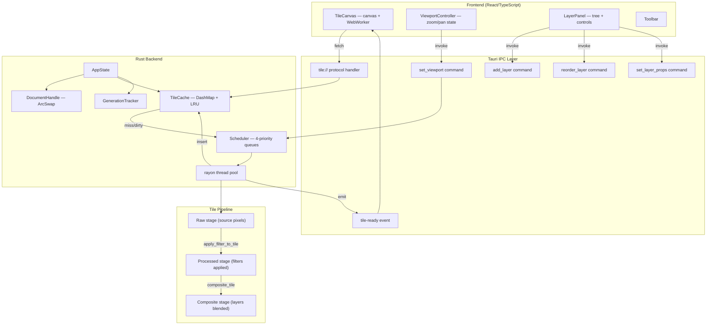
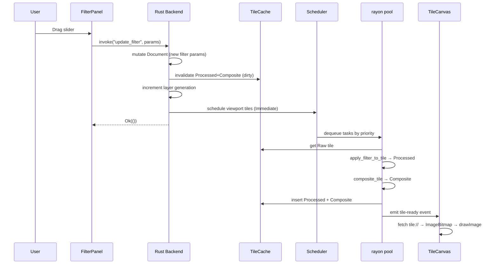

# Design Document: Tile Viewport Rendering

## Overview

This design migrates Dither Yuki 2 from a full-image render pipeline (`render_preview` → PNG → base64 → ``) to a viewport-driven tile rendering architecture. The key architectural shift: instead of recomputing and transmitting the entire image on every change, only the tiles visible in the current viewport are computed on demand, served individually via a `tile://` custom protocol, and drawn to an HTML5 `<canvas>`.

**Design goals:**
- 50–100ms latency from parameter change to visible pixel update
- Zoom/pan support via tile pyramid levels
- Multi-layer compositing with 12 blend modes
- Zero-copy path from TileCache → wire format (f32→u8 conversion at protocol boundary)

**Key decisions:**
1. TileCache becomes the single source of truth (replaces `AppState.image_data`)
2. `render_preview` command is removed; replaced by `set_viewport` + `tile://` protocol
3. Frontend uses Web Worker for tile fetch/decode, canvas for rendering
4. Invalidation flows through GenerationTracker → dirty marking → tile-ready events


## Architecture

### High-Level System Diagram




### Data Flow: Filter Parameter Change



### Removed Components

- `AppState.image_data: Mutex<Option<ImageData>>` — removed, TileCache is sole source
- `render_preview` IPC command — removed entirely
- `usePreview` hook — removed
- `PreviewCanvas` component (img-based) — replaced by TileCanvas

### New AppState Structure

```rust
pub struct AppState {
    pub document_handle: DocumentHandle,
    pub tile_cache: TileCache,       // sole source of pixel data
    pub scheduler: Scheduler,         // priority task queues
    pub viewport: Mutex<ViewportState>, // current viewport for priority decisions
}
```


## Components and Interfaces

### Backend Components

#### 1. Image Decomposer (`load_image` rewrite)

Decomposes loaded images into Raw-stage tiles in TileCache.

```rust
/// Decompose an image buffer into Raw tiles at pyramid level 0.
/// Tiles the image left-to-right, top-to-bottom in 256×256 blocks.
/// Edge tiles are zero-filled for regions beyond image bounds.
pub fn decompose_image_to_tiles(
    rgba_f32: &[f32],   // RGBA f32 pixel buffer, row-major
    width: u32,
    height: u32,
    layer_id: LayerId,
    cache: &TileCache,
) -> Result<TileGrid, EngineError> {
    let cols = (width + 255) / 256;   // ceil division
    let rows = (height + 255) / 256;
    
    for row in 0..rows {
        for col in 0..cols {
            let tile = extract_tile(rgba_f32, width, height, col, row);
            let key = TileKey {
                layer: layer_id.0,
                coord: TileCoord { level: 0, x: col, y: row },
                stage: CacheStage::Raw,
            };
            cache.get_or_insert(key, Arc::new(tile));
        }
    }
    Ok(TileGrid { cols, rows })
}

/// Extract a single 256×256 tile from the image buffer.
/// Handles edge tiles by zero-filling beyond image bounds.
/// Populates the 2px halo region from adjacent pixels.
fn extract_tile(
    buffer: &[f32],
    img_width: u32,
    img_height: u32,
    tile_col: u32,
    tile_row: u32,
) -> PixelTile { /* ... */ }
```

#### 2. Tile Protocol Handler

Registered as Tauri custom protocol at `tile://` scheme.

```rust
/// URL format: tile://doc/{doc_id}/layer/{layer_id}/stage/{stage}/l/{level}/{x}/{y}
/// 
/// Returns:
/// - 200 + 262,144 bytes (RGBA8, row-major) if tile is cached and clean
/// - 202 + empty body if tile needs recomputation (schedules Immediate task)
/// - 400 if URL is malformed
/// - 404 if doc/layer/coord is invalid
pub fn tile_protocol_handler(
    request: &tauri::http::Request,
    state: &AppState,
) -> tauri::http::Response {
    let parsed = parse_tile_url(request.uri())?;
    
    // Validate document, layer, coordinate bounds
    validate_tile_request(&parsed, state)?;
    
    let key = TileKey {
        layer: parsed.layer_id,
        coord: TileCoord { level: parsed.level, x: parsed.x, y: parsed.y },
        stage: parsed.stage,
    };
    
    match state.tile_cache.entries.get(&key) {
        Some(entry) if !entry.dirty.load(Ordering::Acquire) => {
            // Cache hit, not dirty → serve immediately
            let rgba8 = f32_tile_to_rgba8(&entry.tile);
            Response::new(200, rgba8) // 256*256*4 = 262,144 bytes
        }
        _ => {
            // Cache miss or dirty → schedule and return 202
            schedule_immediate(state, key);
            Response::new(202, vec![])
        }
    }
}


/// Convert f32 tile main region to u8 RGBA buffer for wire transfer.
/// Only the 256×256 main region is transferred (not halo).
fn f32_tile_to_rgba8(tile: &PixelTile) -> Vec<u8> {
    let mut buf = Vec::with_capacity(256 * 256 * 4);
    for y in HALO..(HALO + TILE_SIZE) {
        for x in HALO..(HALO + TILE_SIZE) {
            for c in 0..4 {
                buf.push((tile.at(x, y, c).clamp(0.0, 1.0) * 255.0 + 0.5) as u8);
            }
        }
    }
    buf
}
```

#### 3. Viewport Manager (`set_viewport` command)

```rust
#[derive(Debug, Clone)]
pub struct ViewportState {
    pub zoom: f64,
    pub x: f64,       // document-space X of viewport top-left
    pub y: f64,       // document-space Y of viewport top-left
    pub width: f64,   // viewport width in screen pixels
    pub height: f64,  // viewport height in screen pixels
    pub level: u8,    // computed pyramid level
    pub visible_tiles: Vec<TileCoord>,
    pub prefetch_tiles: Vec<TileCoord>,
}

#[tauri::command]
pub fn set_viewport(
    zoom: f64, x: f64, y: f64, width: f64, height: f64,
    state: State<'_, AppState>,
) -> Result<SetViewportResponse, String> {
    let level = compute_pyramid_level(zoom, max_level);
    let visible = compute_visible_tiles(zoom, x, y, width, height, level, doc_width, doc_height);
    let prefetch = compute_prefetch_ring(&visible, level, doc_width, doc_height);
    
    // Cancel stale tasks no longer in viewport+prefetch
    cancel_stale_tasks(&state.scheduler, &old_viewport, &visible, &prefetch);
    
    // Schedule missing/dirty tiles
    for coord in &visible {
        let key = TileKey { layer: COMPOSITE_LAYER, coord: *coord, stage: CacheStage::Composite };
        if needs_recompute(&state.tile_cache, &key) {
            let priority = classify_priority(coord, &visible);
            state.scheduler.enqueue(RecomputeTask { key, generation, layer_generation, priority });
        }
    }
    for coord in &prefetch {
        // ... similar with Priority::Prefetch
    }
    
    // Store viewport state
    *state.viewport.lock().unwrap() = new_viewport;
    Ok(SetViewportResponse { level, tile_count: visible.len() })
}

/// Compute pyramid level: max(0, floor(log2(1.0 / zoom))), clamped to max_level.
pub fn compute_pyramid_level(zoom: f64, max_level: u8) -> u8 {
    if zoom >= 1.0 { return 0; }
    let level = (1.0 / zoom).log2().floor() as u8;
    level.min(max_level)
}

/// Compute visible tile coordinates for a viewport at a given pyramid level.
/// Divides viewport rect (in document pixels) by tile size, clamps to grid bounds.
pub fn compute_visible_tiles(
    zoom: f64, x: f64, y: f64, width: f64, height: f64,
    level: u8, doc_width: u32, doc_height: u32,
) -> Vec<TileCoord> {
    let scale = 1u32 << level; // pixels per tile-pixel at this level
    let tile_size_at_level = (TILE_SIZE * scale) as f64;
    
    // Viewport in document pixels
    let vp_left = x;
    let vp_top = y;
    let vp_right = x + width / zoom;
    let vp_bottom = y + height / zoom;
    
    // Convert to tile indices at this level
    let min_tx = (vp_left / tile_size_at_level).floor().max(0.0) as u32;
    let min_ty = (vp_top / tile_size_at_level).floor().max(0.0) as u32;
    let max_tx = (vp_right / tile_size_at_level).ceil() as u32;
    let max_ty = (vp_bottom / tile_size_at_level).ceil() as u32;
    
    // Clamp to grid bounds at this level
    let grid_cols = ((doc_width + TILE_SIZE * scale - 1) / (TILE_SIZE * scale));
    let grid_rows = ((doc_height + TILE_SIZE * scale - 1) / (TILE_SIZE * scale));
    
    let mut tiles = Vec::new();
    for ty in min_ty..max_ty.min(grid_rows) {
        for tx in min_tx..max_tx.min(grid_cols) {
            tiles.push(TileCoord { level, x: tx, y: ty });
        }
    }
    tiles
}

/// Classify tile priority based on position relative to viewport center.
/// Inner 50% of viewport area → ViewportCenter, outer 50% → ViewportEdge.
pub fn classify_priority(coord: &TileCoord, visible: &[TileCoord]) -> Priority {
    // Compute viewport center tile
    let (cx, cy) = viewport_center(visible);
    let half_w = (viewport_width(visible) as f64 * 0.25) as u32; // inner 50% = 25% on each side
    let half_h = (viewport_height(visible) as f64 * 0.25) as u32;
    
    let dx = (coord.x as i64 - cx as i64).unsigned_abs() as u32;
    let dy = (coord.y as i64 - cy as i64).unsigned_abs() as u32;
    
    if dx <= half_w && dy <= half_h {
        Priority::ViewportCenter
    } else {
        Priority::ViewportEdge
    }
}
```


#### 4. Compositor (`composite_tile`)

Blends all visible layers bottom-to-top for a single tile coordinate.

```rust
/// Composite all visible layers at a tile coordinate.
/// Walks the layer tree bottom-to-top, blending each visible layer's
/// Processed tile into the running composite using its blend mode and opacity.
pub fn composite_tile(
    doc: &Document,
    coord: TileCoord,
    cache: &TileCache,
) -> Result<PixelTile, EngineError> {
    let mut composite = PixelTile::new(); // starts fully transparent
    
    for layer_ref in walk_bottom_to_top(&doc.root) {
        match layer_ref {
            LayerRef::Leaf(layer) => {
                if !layer.visible { continue; }
                
                // Get Processed tile for this layer
                let processed_key = TileKey {
                    layer: layer.id.0,
                    coord,
                    stage: CacheStage::Processed,
                };
                let processed = get_or_compute_processed(layer, coord, cache)?;
                
                // Apply mask if present
                let masked = apply_layer_mask(layer, &processed, coord, cache)?;
                
                // Blend into composite
                blend_tile(&mut composite, &masked, layer.blend_mode, layer.opacity);
            }
            LayerRef::GroupStart(group) => {
                if !group.visible { /* skip group via iterator */ }
                // Push composite stack for group isolation
            }
            LayerRef::GroupEnd(group) => {
                // Pop group composite, blend into parent with group's blend mode/opacity
            }
        }
    }
    Ok(composite)
}

/// Per-pixel blending of src tile onto dst tile using blend mode and opacity.
/// Operates in linear f32 RGBA color space.
pub fn blend_tile(
    dst: &mut PixelTile,
    src: &PixelTile,
    mode: BlendMode,
    opacity: f32,
) {
    for y in HALO..(HALO + TILE_SIZE) {
        for x in HALO..(HALO + TILE_SIZE) {
            let src_a = src.at(x, y, 3) * opacity;
            if src_a < 1e-6 { continue; } // fully transparent, skip
            
            for c in 0..3 { // RGB channels
                let s = src.at(x, y, c);
                let d = dst.at(x, y, c);
                let blended = apply_blend_mode(mode, s, d);
                // Porter-Duff "over" with premultiplied alpha
                let out = blended * src_a + d * dst.at(x, y, 3) * (1.0 - src_a);
                dst.set(x, y, c, out);
            }
            // Alpha channel: standard over
            let dst_a = dst.at(x, y, 3);
            dst.set(x, y, 3, src_a + dst_a * (1.0 - src_a));
        }
    }
}

/// Apply a single blend mode formula per channel.
/// All formulas operate on linear f32 values in [0, 1].
fn apply_blend_mode(mode: BlendMode, src: f32, dst: f32) -> f32 {
    match mode {
        BlendMode::Normal     => src,
        BlendMode::Multiply   => src * dst,
        BlendMode::Screen     => src + dst - src * dst,
        BlendMode::Overlay    => if dst < 0.5 { 2.0 * src * dst } else { 1.0 - 2.0 * (1.0 - src) * (1.0 - dst) },
        BlendMode::Darken     => src.min(dst),
        BlendMode::Lighten    => src.max(dst),
        BlendMode::ColorDodge => if src >= 1.0 { 1.0 } else { (dst / (1.0 - src)).min(1.0) },
        BlendMode::ColorBurn  => if src <= 0.0 { 0.0 } else { 1.0 - ((1.0 - dst) / src).min(1.0) },
        BlendMode::HardLight  => if src < 0.5 { 2.0 * src * dst } else { 1.0 - 2.0 * (1.0 - src) * (1.0 - dst) },
        BlendMode::SoftLight  => { let d = if dst <= 0.25 { ((16.0*dst - 12.0)*dst + 4.0)*dst } else { dst.sqrt() };
                                   if src <= 0.5 { dst - (1.0 - 2.0*src) * dst * (1.0 - dst) } else { dst + (2.0*src - 1.0) * (d - dst) } },
        BlendMode::Difference => (src - dst).abs(),
        BlendMode::Exclusion  => src + dst - 2.0 * src * dst,
        _ => src, // reserved modes default to Normal
    }
}

/// Apply layer mask: multiply layer alpha by mask luminance.
/// If mask is inverted, use (1.0 - luminance) instead.
fn apply_layer_mask(
    layer: &Layer,
    tile: &PixelTile,
    coord: TileCoord,
    cache: &TileCache,
) -> Result<PixelTile, EngineError> {
    let mask_ref = match &layer.mask {
        Some(m) if m.enabled => m,
        _ => return Ok(tile.clone_data()),
    };
    
    let mask_tile = get_mask_tile(mask_ref, coord, cache)?;
    let mut result = tile.clone_data();
    
    for y in HALO..(HALO + TILE_SIZE) {
        for x in HALO..(HALO + TILE_SIZE) {
            // Luminance = 0.2126*R + 0.7152*G + 0.0722*B
            let lum = 0.2126 * mask_tile.at(x, y, 0)
                    + 0.7152 * mask_tile.at(x, y, 1)
                    + 0.0722 * mask_tile.at(x, y, 2);
            let mask_value = if mask_ref.inverted { 1.0 - lum } else { lum };
            let alpha = result.at(x, y, 3) * mask_value;
            result.set(x, y, 3, alpha);
        }
    }
    Ok(result)
}
```


#### 5. Worker Pool (rayon integration)

```rust
/// Process recomputation tasks from the scheduler using rayon.
/// Called on a dedicated thread; loops continuously.
pub fn tile_worker_loop(state: Arc<AppState>, app_handle: AppHandle) {
    loop {
        if let Some(task) = state.scheduler.dequeue() {
            // Staleness check
            let doc_gen = state.tile_cache.generations().document_gen.load(Ordering::Acquire);
            let layer_gen = state.tile_cache.generations().get_layer_gen(task.key.layer);
            
            if task.generation != doc_gen || task.layer_generation != layer_gen {
                continue; // Stale task, discard
            }
            
            // Execute task
            let result = match task.key.stage {
                CacheStage::Raw => load_raw_tile(task.key, &state),
                CacheStage::Processed => compute_processed_tile(task.key, &state),
                CacheStage::Composite => compute_composite_tile(task.key, &state),
            };
            
            if let Ok(tile) = result {
                state.tile_cache.insert_fresh(task.key, Arc::new(tile));
                // Emit tile-ready event
                app_handle.emit("tile-ready", TileReadyPayload {
                    doc_id: parsed_doc_id,
                    layer_id: task.key.layer,
                    stage: task.key.stage,
                    level: task.key.coord.level,
                    x: task.key.coord.x,
                    y: task.key.coord.y,
                }).ok();
            }
        } else {
            std::thread::park_timeout(Duration::from_millis(1));
        }
    }
}
```

#### 6. New Tauri Commands

```rust
#[tauri::command]
pub fn set_viewport(zoom: f64, x: f64, y: f64, width: f64, height: f64,
                    state: State<'_, AppState>) -> Result<SetViewportResponse, String>;

#[tauri::command]
pub fn add_layer(kind: String, parent_group: Option<u32>, index: usize,
                 state: State<'_, AppState>) -> Result<AddLayerResponse, String>;

#[tauri::command]
pub fn reorder_layer(layer_id: u32, new_parent: Option<u32>, new_index: usize,
                     state: State<'_, AppState>) -> Result<(), String>;

#[tauri::command]
pub fn set_layer_props(layer_id: u32, patch: LayerPropsPatchDto,
                       state: State<'_, AppState>) -> Result<(), String>;
```


### Frontend Components

#### 7. TileCanvas Component

Replaces `PreviewCanvas`. Manages an HTML5 `<canvas>` and a Web Worker for tile fetching.

```typescript
interface TileCanvasProps {
  docId: number;
  docWidth: number;
  docHeight: number;
  viewport: ViewportState;
  onViewportChange: (vp: ViewportState) => void;
}

// TileCanvas.tsx
function TileCanvas({ docId, docWidth, docHeight, viewport, onViewportChange }: TileCanvasProps) {
  const canvasRef = useRef<HTMLCanvasElement>(null);
  const workerRef = useRef<Worker>(null);
  const tileMapRef = useRef<Map<string, ImageBitmap>>(new Map());

  // Initialize Web Worker
  useEffect(() => {
    workerRef.current = new Worker(new URL('../workers/tileWorker.ts', import.meta.url));
    workerRef.current.onmessage = handleWorkerMessage;
    return () => workerRef.current?.terminate();
  }, []);

  // When viewport changes, compute visible tiles and request them
  useEffect(() => {
    const visible = computeVisibleTiles(viewport, docWidth, docHeight);
    workerRef.current?.postMessage({ type: 'request-tiles', tiles: visible, docId });
  }, [viewport, docId]);

  // Listen for tile-ready events from Tauri
  useEffect(() => {
    const unlisten = listen<TileReadyPayload>('tile-ready', (event) => {
      const { level, x, y } = event.payload;
      workerRef.current?.postMessage({ type: 'fetch-tile', level, x, y, docId });
    });
    return () => { unlisten.then(fn => fn()); };
  }, [docId]);

  // Draw tiles to canvas
  function drawTiles() {
    const ctx = canvasRef.current?.getContext('2d');
    if (!ctx) return;
    ctx.clearRect(0, 0, ctx.canvas.width, ctx.canvas.height);
    
    for (const [key, bitmap] of tileMapRef.current) {
      const { x, y, level } = parseTileKey(key);
      const screenPos = tileToScreen(x, y, level, viewport);
      const scale = viewport.zoom * (1 << level);
      ctx.drawImage(bitmap, screenPos.x, screenPos.y, 256 * scale, 256 * scale);
    }
  }
}
```


#### 8. Tile Web Worker

```typescript
// workers/tileWorker.ts
self.onmessage = async (e: MessageEvent) => {
  const msg = e.data;
  
  if (msg.type === 'request-tiles') {
    for (const tile of msg.tiles) {
      await fetchAndDecodeTile(msg.docId, tile);
    }
  }
  
  if (msg.type === 'fetch-tile') {
    await fetchAndDecodeTile(msg.docId, msg);
  }
};

async function fetchAndDecodeTile(docId: number, tile: { level: number, x: number, y: number }) {
  const url = `tile://doc/${docId}/layer/composite/stage/composite/l/${tile.level}/${tile.x}/${tile.y}`;
  const response = await fetch(url);
  
  if (response.status === 200) {
    const buffer = await response.arrayBuffer();
    const imageData = new ImageData(new Uint8ClampedArray(buffer), 256, 256);
    const bitmap = await createImageBitmap(imageData);
    self.postMessage({ type: 'tile-decoded', key: `${tile.level}/${tile.x}/${tile.y}`, bitmap }, [bitmap]);
  } else if (response.status === 202) {
    // Tile is being computed; wait for tile-ready event
    self.postMessage({ type: 'tile-pending', key: `${tile.level}/${tile.x}/${tile.y}` });
  }
}
```

#### 9. ViewportController Hook

```typescript
interface ViewportState {
  zoom: number;       // 0.01 to 64.0
  panX: number;       // document-space X of viewport top-left
  panY: number;       // document-space Y of viewport top-left
  canvasWidth: number;
  canvasHeight: number;
}

function useViewport(docWidth: number, docHeight: number) {
  const [viewport, setViewport] = useState<ViewportState>({
    zoom: 1.0, panX: 0, panY: 0, canvasWidth: 0, canvasHeight: 0,
  });

  // Zoom centered on cursor position
  function handleWheel(e: WheelEvent) {
    const factor = e.deltaY < 0 ? 2.0 : 0.5;
    const newZoom = clamp(viewport.zoom * factor, 0.01, 64.0);
    
    // Keep document point under cursor stationary
    const cursorDocX = viewport.panX + e.offsetX / viewport.zoom;
    const cursorDocY = viewport.panY + e.offsetY / viewport.zoom;
    const newPanX = cursorDocX - e.offsetX / newZoom;
    const newPanY = cursorDocY - e.offsetY / newZoom;
    
    setViewport(prev => constrainPan({
      ...prev, zoom: newZoom, panX: newPanX, panY: newPanY,
    }, docWidth, docHeight));
  }

  // Pan with middle mouse or Space+left mouse
  function handlePanDrag(deltaScreenX: number, deltaScreenY: number) {
    setViewport(prev => constrainPan({
      ...prev,
      panX: prev.panX - deltaScreenX / prev.zoom,
      panY: prev.panY - deltaScreenY / prev.zoom,
    }, docWidth, docHeight));
  }

  // Fit to view
  function fitToView() {
    const fitZoom = Math.min(
      viewport.canvasWidth / docWidth,
      viewport.canvasHeight / docHeight,
    );
    const newZoom = clamp(fitZoom, 0.01, 64.0);
    setViewport(prev => ({
      ...prev,
      zoom: newZoom,
      panX: (docWidth - prev.canvasWidth / newZoom) / 2,
      panY: (docHeight - prev.canvasHeight / newZoom) / 2,
    }));
  }

  return { viewport, handleWheel, handlePanDrag, fitToView, setZoom };
}

/// Constrain pan so viewport center stays within 50% beyond document bounds.
function constrainPan(vp: ViewportState, docW: number, docH: number): ViewportState {
  const vpDocW = vp.canvasWidth / vp.zoom;
  const vpDocH = vp.canvasHeight / vp.zoom;
  const centerX = vp.panX + vpDocW / 2;
  const centerY = vp.panY + vpDocH / 2;
  
  const minCenterX = -vpDocW * 0.5;
  const maxCenterX = docW + vpDocW * 0.5;
  const minCenterY = -vpDocH * 0.5;
  const maxCenterY = docH + vpDocH * 0.5;
  
  const clampedCX = clamp(centerX, minCenterX, maxCenterX);
  const clampedCY = clamp(centerY, minCenterY, maxCenterY);
  
  return { ...vp, panX: clampedCX - vpDocW / 2, panY: clampedCY - vpDocH / 2 };
}
```

#### 10. LayerPanel Component

```typescript
interface LayerPanelProps {
  layers: LayerNodeDto[];
  selectedLayerId: number | null;
  onSelect: (id: number) => void;
  onReorder: (layerId: number, newParent: number | null, newIndex: number) => void;
  onPropsChange: (layerId: number, patch: LayerPropsPatch) => void;
  onAddLayer: () => void;
}

// Renders tree with drag-drop, thumbnails, controls
function LayerPanel({ layers, selectedLayerId, onReorder, onPropsChange, onAddLayer }: LayerPanelProps) {
  return (
    <div className="layer-panel">
      <div className="layer-panel-header">
        <button onClick={onAddLayer}>+ Layer</button>
      </div>
      <div className="layer-tree">
        {/* Render bottom-to-top (reversed for visual top-first display) */}
        {[...layers].reverse().map(node => (
          <LayerTreeNode key={node.id} node={node} depth={0}
            selectedId={selectedLayerId}
            onSelect={onSelect} onReorder={onReorder} onPropsChange={onPropsChange}
          />
        ))}
      </div>
    </div>
  );
}
```


## Data Models

### Backend DTOs (over IPC)

```rust
#[derive(Serialize, Deserialize)]
pub struct SetViewportResponse {
    pub level: u8,
    pub tile_count: usize,
}

#[derive(Serialize, Deserialize, Clone)]
pub struct TileReadyPayload {
    pub doc_id: u32,
    pub layer_id: u32,
    pub stage: String, // "raw" | "processed" | "composite"
    pub level: u8,
    pub x: u32,
    pub y: u32,
}

#[derive(Serialize, Deserialize)]
pub struct AddLayerResponse {
    pub layer_id: u32,
}

#[derive(Serialize, Deserialize)]
pub struct LayerPropsPatchDto {
    pub name: Option<String>,
    pub opacity: Option<f32>,
    pub blend_mode: Option<String>,
    pub visible: Option<bool>,
}

#[derive(Serialize, Deserialize)]
pub struct LayerNodeDto {
    pub id: u32,
    pub name: String,
    pub kind: String,         // "raster" | "adjustment" | "group"
    pub blend_mode: String,
    pub opacity: f32,
    pub visible: bool,
    pub children: Option<Vec<LayerNodeDto>>, // present for groups
}
```

### Frontend Types

```typescript
interface ViewportState {
  zoom: number;
  panX: number;
  panY: number;
  canvasWidth: number;
  canvasHeight: number;
}

interface TileReadyPayload {
  doc_id: number;
  layer_id: number;
  stage: 'raw' | 'processed' | 'composite';
  level: number;
  x: number;
  y: number;
}

interface LayerNodeDto {
  id: number;
  name: string;
  kind: 'raster' | 'adjustment' | 'group';
  blend_mode: string;
  opacity: number;
  visible: boolean;
  children?: LayerNodeDto[];
}

interface LayerPropsPatch {
  name?: string;
  opacity?: number;
  blend_mode?: string;
  visible?: boolean;
}
```

### Tile URL Schema

```
tile://doc/{doc_id}/layer/{layer_id}/stage/{stage}/l/{level}/{x}/{y}

Where:
- doc_id: u32 document identifier
- layer_id: u32 layer identifier (or "composite" for final composite)
- stage: "raw" | "processed" | "composite"
- level: u8 pyramid level (0 = full res)
- x: u32 tile column index at this level
- y: u32 tile row index at this level

Response: 262,144 bytes raw RGBA8, row-major 256×256
```


## Correctness Properties

*A property is a characteristic or behavior that should hold true across all valid executions of a system — essentially, a formal statement about what the system should do. Properties serve as the bridge between human-readable specifications and machine-verifiable correctness guarantees.*

### Property 1: Image decomposition produces correct tile grid

*For any* valid image dimensions (width ∈ [1, 8192], height ∈ [1, 8192]), decomposing the image into tiles SHALL produce exactly `ceil(width / 256) × ceil(height / 256)` Raw-stage tiles, each with tile coordinates in the range `[0, ceil(width/256))` × `[0, ceil(height/256))` at pyramid level 0, and edge tiles SHALL have their out-of-bounds region filled with zero (transparent black).

**Validates: Requirements 1.1, 1.2**

### Property 2: Viewport-aware eviction preserves visible tiles

*For any* TileCache state exceeding the memory budget, and *for any* viewport rectangle, after eviction completes, all tiles whose TileCoord overlaps the viewport pixel bounds at the active pyramid level SHALL remain in the cache, and the total cache usage SHALL be at or below the budget (or the minimum required to retain viewport tiles, whichever is larger).

**Validates: Requirements 1.5**

### Property 3: Tile protocol f32→u8 encoding correctness

*For any* PixelTile with arbitrary f32 values in each channel, the tile protocol response SHALL contain exactly 262,144 bytes where each byte at position `(y * 256 + x) * 4 + c` equals `round(clamp(tile.at(x + HALO, y + HALO, c), 0.0, 1.0) * 255.0)`.

**Validates: Requirements 2.2**

### Property 4: Tile protocol error responses

*For any* tile URL with coordinates exceeding the tile grid bounds at the given level, or referencing a nonexistent layer_id or doc_id, the protocol handler SHALL return 404. *For any* URL string that does not match the `tile://doc/{doc_id}/layer/{layer_id}/stage/{stage}/l/{level}/{x}/{y}` pattern, the protocol handler SHALL return 400.

**Validates: Requirements 2.5, 2.6, 2.7**


### Property 5: Viewport-to-tiles computation

*For any* viewport parameters (zoom ∈ [0.01, 64.0], x, y, width, height) and document dimensions (up to 8192×8192), the computed set of visible tile coordinates SHALL equal the set of all TileCoords at the computed pyramid level whose 256×scale pixel region intersects the viewport rectangle in document space, with level computed as `max(0, floor(log2(1.0 / zoom)))` clamped to the maximum available level.

**Validates: Requirements 3.1, 3.2**

### Property 6: Selective scheduling with correct priority assignment

*For any* viewport and cache state, `set_viewport` SHALL schedule recomputation tasks only for tiles that are visible AND (missing from cache OR marked dirty). Tiles within the inner 50% of the viewport area SHALL receive ViewportCenter priority, tiles in the outer 50% SHALL receive ViewportEdge priority, and tiles in the one-tile-wide adjacent ring SHALL receive Prefetch priority. Already-cached clean tiles SHALL NOT be scheduled.

**Validates: Requirements 3.3, 3.4, 3.5**

### Property 7: Lazy filter pipeline equivalence

*For any* Raw-stage PixelTile and *for any* valid filter stack (sequence of enabled FilterInstances with valid parameters), the Processed-stage tile produced by the lazy pipeline SHALL be byte-identical to the result of calling `apply_filter_to_tile(raw_tile, layer, coord)` where `layer.filters` contains the same filter stack.

**Validates: Requirements 4.1**

### Property 8: Invalidation scope correctness

*For any* filter parameter change on layer L, the invalidation SHALL mark dirty: all Processed-stage tiles for layer L, and all Composite-stage tiles for layer L and all layers with ID ≥ L. Raw-stage tiles SHALL NOT be marked dirty. *For any* layer property change (visibility, opacity, blend mode), only Composite-stage tiles for that layer and above SHALL be marked dirty.

**Validates: Requirements 4.3, 10.1, 10.2**


### Property 9: Zoom preserves document point under cursor

*For any* current viewport state and *for any* cursor position within the canvas, applying a zoom operation (factor of 2× or 0.5×) centered on that cursor SHALL produce a new viewport where the document-space point that was under the cursor remains at the same screen position (within ±0.5 pixel tolerance due to floating-point), and the resulting zoom is clamped to [0.01, 64.0].

**Validates: Requirements 6.1, 6.2, 6.7**

### Property 10: Pan transform with boundary constraint

*For any* current viewport state and *for any* screen-space drag delta, the pan operation SHALL update the document-space offset by `delta_screen / zoom`, and the resulting viewport center SHALL be constrained so it does not exceed 50% of the viewport's document-space width beyond the document bounds horizontally (and analogously vertically).

**Validates: Requirements 7.2, 7.4**

### Property 11: Compositor blending correctness

*For any* layer stack (1–8 layers with arbitrary blend modes from the 12 supported variants, arbitrary opacity in [0.0, 1.0], and arbitrary visibility states), and *for any* tile coordinate with arbitrary pixel values, the Composite-stage tile SHALL equal the result of blending all visible layers bottom-to-top using each layer's blend mode formula and opacity with Porter-Duff "over" compositing. Invisible layers and their descendants SHALL contribute nothing to the composite. Groups SHALL be composited internally first, then blended as a unit.

**Validates: Requirements 8.1, 8.2, 8.5, 8.7**

### Property 12: Mask alpha multiplication

*For any* layer with an enabled mask, and *for any* pixel position, the effective alpha after masking SHALL equal `layer_alpha × mask_luminance` where luminance = `0.2126R + 0.7152G + 0.0722B` of the mask pixel. If the mask is inverted, it SHALL equal `layer_alpha × (1.0 - mask_luminance)`.

**Validates: Requirements 8.4**


### Property 13: Structure invalidation marks all Composite tiles dirty

*For any* layer addition, removal, or reorder operation, ALL Composite-stage tiles for every layer in the document SHALL be marked dirty in TileCache. Raw-stage and Processed-stage tiles SHALL remain unchanged.

**Validates: Requirements 10.3**

### Property 14: Stale task discard

*For any* recomputation task whose `generation` field does not match the current `document_gen` in GenerationTracker, OR whose `layer_generation` field does not match the current `layer_gen` for that task's layer, the task SHALL be discarded without writing any result to TileCache and without emitting a `tile-ready` event.

**Validates: Requirements 10.5**

### Property 15: Layer name validation

*For any* string input for layer name editing, the system SHALL trim leading and trailing whitespace before applying. If the trimmed result is empty (zero characters), the edit SHALL be rejected and the previous name retained unchanged. Otherwise, the trimmed name (1–64 characters) SHALL be stored.

**Validates: Requirements 9.7**

## Error Handling

### Backend Errors

| Error Condition | Response | Recovery |
|----------------|----------|----------|
| Image decode failure (corrupt file) | `load_image` returns error string | TileCache unchanged, user retries |
| Tile coord out of bounds | `tile://` returns 404 | Frontend shows error indicator at tile position |
| Document not found | `tile://` returns 404 | Frontend handles as document-closed state |
| Malformed tile URL | `tile://` returns 400 | Frontend logs warning, no retry |
| Filter application panics (requires_full_row) | Caught by worker, tile marked as error | Tile shows error indicator, fallback to Raw |
| TileCache OOM (eviction fails to free enough) | Log warning, continue with reduced cache | Tiles recomputed on demand, slight latency increase |
| Layer not found in tree | Command returns error string | Frontend reverts UI, shows notification |
| Invalid filter parameters | Command returns validation error | Frontend reverts slider to previous value |

### Frontend Errors

| Error Condition | Response | Recovery |
|----------------|----------|----------|
| Tile fetch returns non-200/202 | Show error indicator at tile position | Retry up to 2× with 500ms delay |
| Web Worker crash | Terminate and reinitialize worker | Log error, reload visible tiles |
| IPC command failure | Show error notification, revert UI | User can retry operation |
| Canvas context lost | Listen for `webglcontextlost` | Re-acquire context, redraw all tiles |
| Timeout waiting for tile-ready | After 5s, retry fetch | Schedule at Immediate priority |


### Invalidation Error Scenarios

- **Concurrent mutations during recomputation**: GenerationTracker ensures stale results are discarded. No lock needed — atomic counters provide ordering guarantees.
- **Cache eviction during tile serve**: `Arc<PixelTile>` ensures the tile data survives until the protocol handler finishes encoding, even if evicted from cache.
- **Worker pool saturation**: Scheduler queues are unbounded SegQueues. Backpressure is implicit: older tasks become stale as new mutations arrive, causing them to be discarded at execution time.

## Testing Strategy

### Property-Based Testing (PBT)

This feature is well-suited to PBT because it contains numerous pure functions with clear input/output behavior, universal properties that should hold across large input spaces, and mathematical computations (coordinate transforms, blend formulas, level selection).

**Library**: `proptest` (Rust, version 1.4) and `fast-check` (TypeScript, version 4.9)

**Configuration**: Minimum 100 iterations per property test.

**Tag format**: `Feature: tile-viewport-rendering, Property {N}: {text}`

#### Rust Property Tests (proptest)

| Property | Target Function | Generator Strategy |
|----------|----------------|-------------------|
| P1: Tile decomposition | `decompose_image_to_tiles` | Random (width, height) ∈ [1, 8192] |
| P2: Viewport-aware eviction | `evict_if_over_budget` | Random viewport + cache entries exceeding budget |
| P3: f32→u8 encoding | `f32_tile_to_rgba8` | Random f32 values per channel including edge cases (0.0, 1.0, negatives, >1.0) |
| P4: Error responses | `tile_protocol_handler` | Random OOB coords + random malformed URLs |
| P5: Viewport-to-tiles | `compute_visible_tiles` | Random viewport params + doc dimensions |
| P6: Priority assignment | `classify_priority` | Random viewport + tile positions |
| P7: Filter pipeline | `compute_processed_tile` | Random tile data + random filter stacks (1–4 filters) |
| P8: Invalidation scope | `invalidate` | Random layer IDs + pre-populated cache at all stages |
| P11: Compositor | `composite_tile` | Random 1–8 layer stacks with random blend modes, opacity, pixel values |
| P12: Mask alpha | `apply_layer_mask` | Random mask luminance + layer alpha values |
| P13: Structure invalidation | `invalidate_layer_structure_changed` | Random layer trees + structure mutations |
| P14: Stale discard | `tile_worker_loop` task check | Random generation values (matching/non-matching) |

#### TypeScript Property Tests (fast-check)

| Property | Target Function | Generator Strategy |
|----------|----------------|-------------------|
| P9: Zoom transform | `handleWheel` logic | Random viewport states + cursor positions |
| P10: Pan constraint | `constrainPan` | Random viewport states + drag deltas |
| P15: Layer name | Name trim/validate logic | Random strings including whitespace-only |

### Unit Tests (Example-Based)

- `tile://` returns 202 for missing tile and schedules task
- `tile-ready` event payload contains all required fields
- TileCanvas displays gray placeholder while tile is pending
- TileCanvas retries failed fetch up to 2 times
- LayerPanel renders tree structure correctly
- LayerPanel reverts UI on IPC error
- `set_viewport` cancels stale tasks when viewport changes
- Zoom at 100% selects level 0
- Zoom > 100% uses nearest-neighbor (no interpolation artifacts)
- Pan mode activates on middle mouse or Space+left mouse
- Halo pixels from adjacent tiles are correctly populated

### Integration Tests

- Full pipeline: load image → set viewport → fetch tiles → verify pixel accuracy
- Filter change → invalidate → recompute → tile-ready → fetch updated tile
- Multi-layer composite matches reference rendering
- 8192×8192 document stays within 256MB cache budget for 40-tile viewport
- First visible tile updates within 100ms of parameter change (benchmark)

### Performance Benchmarks (criterion)

- `apply_filter_to_tile` single filter, single tile: target ≤5ms
- `composite_tile` with 4 layers: target ≤2ms
- `f32_tile_to_rgba8` encoding: target ≤1ms
- `compute_visible_tiles`: target ≤0.1ms
- Full viewport recompute (20 tiles, 4 filters): target ≤100ms
