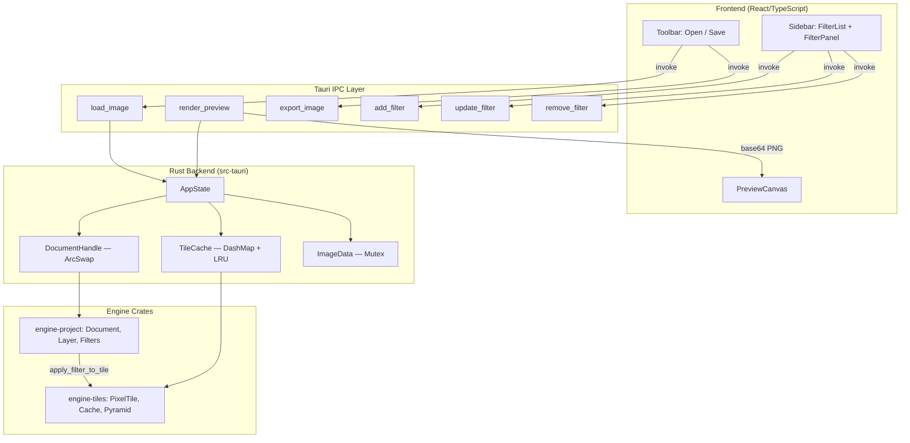
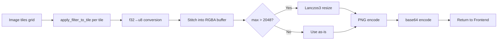
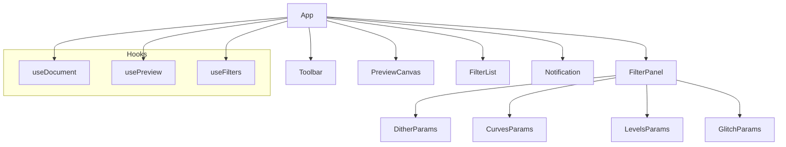
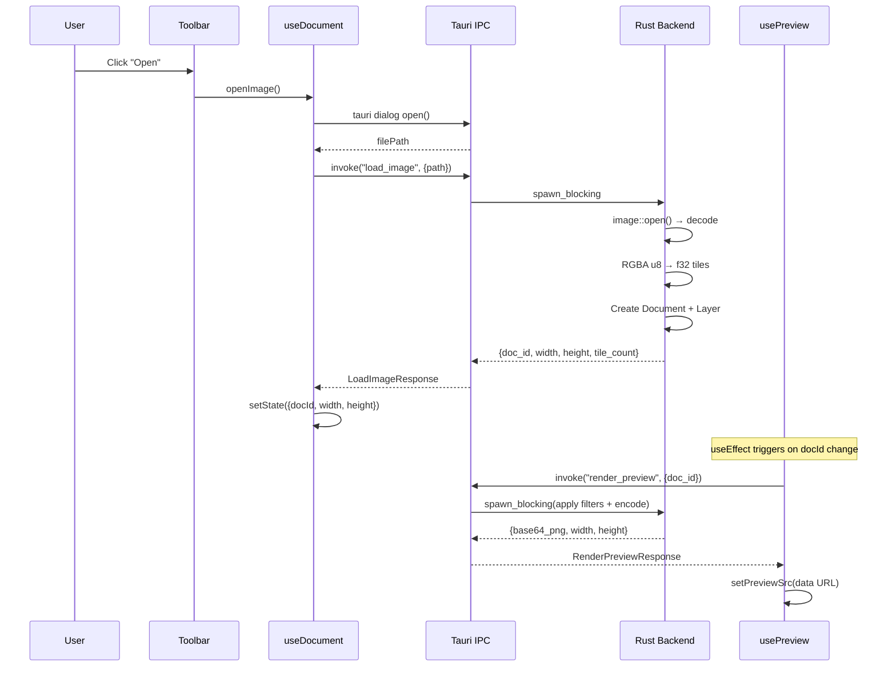
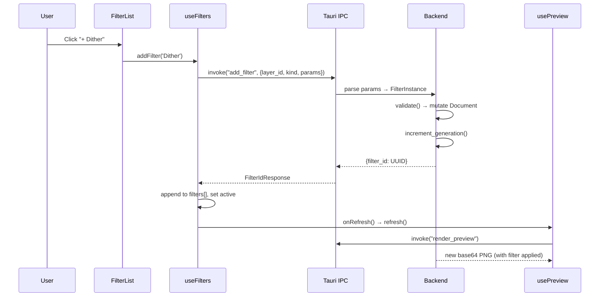
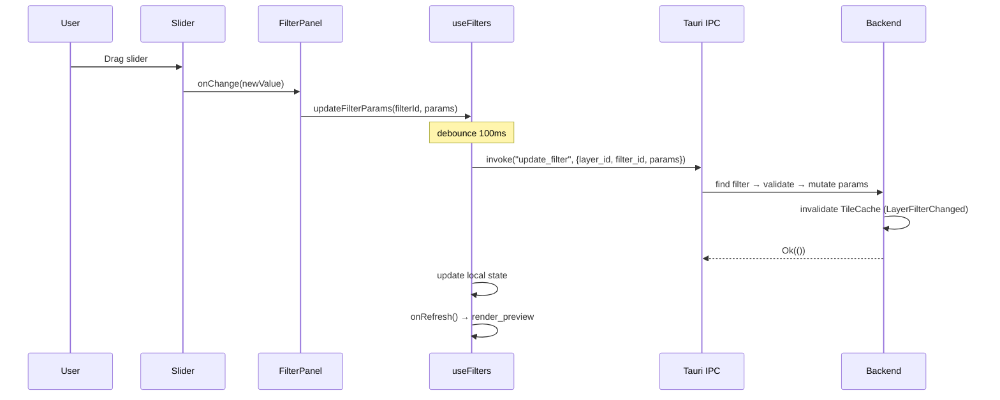
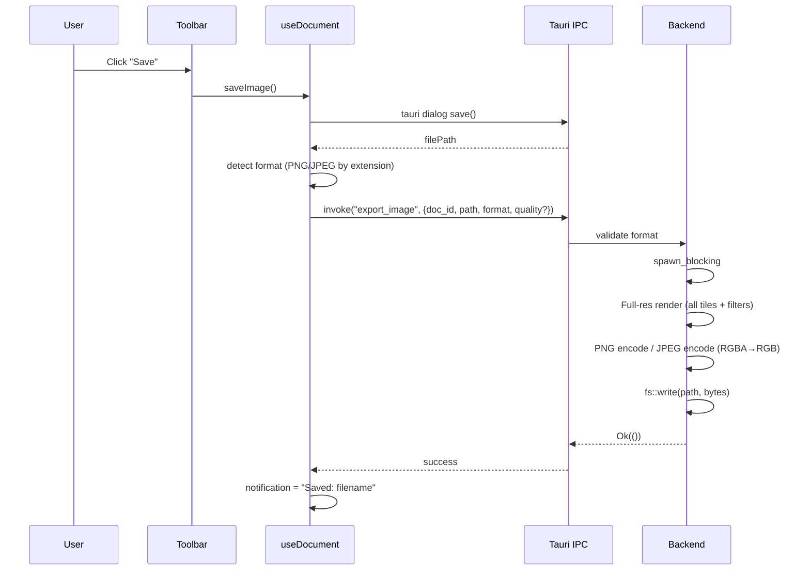
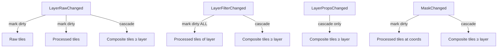

# Архитектура Dither Yuki 2

> Комплексный архитектурный отчёт для software architect.
> Технические термины приведены на английском языке.

---

## 1. Общий обзор проекта

**Dither Yuki 2** — десктопное приложение для неразрушающей обработки изображений с акцентом на художественные эффекты: дизеринг, цветовые кривые, уровни и глитч-эффекты.

### 1.1 Стек технологий

| Слой | Технология | Версия |
|------|-----------|--------|
| Desktop runtime | Tauri 2 | ^2 |
| Backend language | Rust (edition 2021) | stable |
| Frontend framework | React | ^18.2 |
| Frontend language | TypeScript | ^5.0 |
| Build tool | Vite | ^4.4 |
| Test (frontend) | Vitest + fast-check | ^4.1 / ^4.9 |
| Test (backend) | proptest + built-in #[test] | 1.4 |

### 1.2 Структура репозитория

```
dither-yuki-2/
├── Cargo.toml                  # Workspace root (resolver = "2")
├── src-tauri/                  # Tauri backend (IPC commands, AppState)
│   ├── Cargo.toml
│   └── src/
│       ├── main.rs             # Точка входа, конфигурация Tauri
│       └── commands.rs         # IPC-команды (load_image, render_preview, etc.)
├── crates/
│   ├── engine-core/            # Базовые типы (Phase 0 stub)
│   ├── engine-tiles/           # Тайловый кэш, пирамида, scheduler
│   ├── engine-project/         # Document model, layers, filters
│   ├── engine-color/           # Цветовые пространства (Phase 0 stub)
│   └── engine-io/              # Файловый I/O (Phase 0 stub)
├── frontend/
│   ├── package.json
│   └── src/
│       ├── App.tsx             # Root layout
│       ├── App.css             # CSS Grid layout
│       ├── components/         # React-компоненты
│       ├── hooks/              # Custom hooks (useDocument, usePreview, useFilters)
│       ├── ipc/                # Typed Tauri invoke wrappers
│       └── types/              # TypeScript interfaces для IPC DTO
└── docs/
    └── CONTRIBUTING.md
```

### 1.3 Workspace members

```toml
[workspace]
members = [
    "src-tauri",
    "crates/engine-core",
    "crates/engine-tiles",
    "crates/engine-color",
    "crates/engine-io",
    "crates/engine-project",
]
resolver = "2"
```

---

## 2. Архитектура системы

### 2.1 Высокоуровневая диаграмма



### 2.2 Однонаправленный поток данных

Архитектура следует принципу **unidirectional data flow**:

1. Frontend вызывает IPC-команду (mutation)
2. Rust backend мутирует `Document` через `DocumentHandle`
3. Backend инвалидирует кэш (если нужно)
4. Frontend вызывает `render_preview` для получения обновлённого изображения
5. Backend собирает тайлы → применяет фильтры → кодирует PNG → base64
6. Frontend отображает результат на ``

---

## 3. Rust Backend (src-tauri)

### 3.1 AppState

```rust
pub struct AppState {
    pub document_handle: DocumentHandle,  // Lock-free доступ к Document
    pub tile_cache: TileCache,            // LRU кэш тайлов (256 MB бюджет)
    pub image_data: Mutex<Option<ImageData>>,  // Сырые пиксели загруженного изображения
}

pub struct ImageData {
    pub doc_id: u32,
    pub width: u32,
    pub height: u32,
    pub tiles: Vec<Vec<Arc<PixelTile>>>,  // grid[row][col]
}
```

**Инициализация** (в `main.rs`):
- Создаётся пустой `Document` (800×600)
- `TileCache` с бюджетом 256 MB
- `image_data` = `None` (пока изображение не загружено)
- State регистрируется через `tauri::Builder::manage(app_state)`

### 3.2 DocumentHandle

```rust
pub struct DocumentHandle {
    current: ArcSwap<Document>,
}
```

**Ключевые свойства:**

| Операция | Сложность | Блокировка |
|----------|-----------|-----------|
| `snapshot()` | O(1) | Lock-free (ArcSwap::load_full) |
| `mutate(closure)` | O(n) clone | Атомарный swap, без lock |

**Механизм:**
- `snapshot()` — возвращает `Arc<Document>`, дешёвая атомарная операция
- `mutate(f)` — клонирует текущий `Document`, применяет замыкание `f(&mut Document)`, атомарно подменяет через `ArcSwap::store`
- Гарантирует, что читатели всегда видят consistent snapshot
- Нет deadlock: нет Mutex/RwLock для основного доступа

### 3.3 IPC-команды

#### 3.3.1 `load_image`

```rust
#[tauri::command]
pub async fn load_image(path: String, state: State<'_, AppState>) -> Result<LoadImageResponse, String>
```

**Что делает:**
1. Выносит I/O в `spawn_blocking` (не блокирует UI thread)
2. Декодирует PNG/JPEG/WebP через `image` crate
3. Валидирует размеры: max 8192×8192, min 1×1
4. Разбивает RGBA u8 → f32 [0.0–1.0] по тайлам 256×256 (с учётом HALO=2)
5. Сохраняет в `AppState.image_data` (Mutex)
6. Создаёт новый `Document` с одним raster `Layer`
7. Атомарно подменяет через `document_handle.mutate()`

**Возвращает:** `{ doc_id, width, height, tile_count }`

**Ошибки:** `"IO error: ..."` (файл не найден/повреждён), `"Invalid state: ..."` (размеры вне допустимых)

#### 3.3.2 `render_preview`

```rust
#[tauri::command]
pub async fn render_preview(doc_id: u32, state: State<'_, AppState>) -> Result<RenderPreviewResponse, String>
```

**Что делает:**
1. Получает клон тайлов из `image_data` (Mutex lock → copy → unlock)
2. Берёт snapshot документа для чтения фильтров
3. Клонирует first visible layer (для перемещения в blocking thread)
4. `spawn_blocking`:
   - Для каждого тайла: `apply_filter_to_tile(tile, layer, coord)`
   - Конвертация f32 → u8, сборка RGBA buffer
   - `compute_preview_size()`: если max(w,h) > 2048 — Lanczos3 resize
   - PNG encode → base64

**Возвращает:** `{ base64_png, width, height }`

**Ошибки:** `"Document not found"`, `"Render error: ..."`

#### 3.3.3 `add_filter`

```rust
#[tauri::command]
pub fn add_filter(req: AddFilterRequest, state: State<AppState>) -> Result<FilterIdResponse, String>
```

**Что делает:**
1. Парсит `kind` строку → `FilterKind` enum
2. Парсит `params` (serde_json::Value) → `FilterParams` variant
3. Создаёт `FilterInstance` с UUID v4 идентификатором
4. Валидирует параметры через `filter.validate()`
5. `document_handle.mutate()`: находит layer по ID (рекурсивно по дереву), добавляет filter в `layer.filters`
6. Инкрементирует generation документа

**Возвращает:** `{ filter_id: String }` (UUID)

**Ошибки:** `"Invalid filter kind"`, `"Invalid parameters: ..."`, `"Layer N not found"`

#### 3.3.4 `update_filter`

```rust
#[tauri::command]
pub fn update_filter(req: UpdateFilterRequest, state: State<AppState>) -> Result<(), String>
```

**Что делает:**
1. Парсит `filter_id` строку → UUID
2. Берёт snapshot для определения `FilterKind` текущего фильтра
3. Парсит новые params в соответствии с kind
4. Валидирует через temp `FilterInstance`
5. `document_handle.mutate()`: находит filter, обновляет `filter.params`
6. Инвалидирует tile cache: `InvalidationEvent::LayerFilterChanged`

**Ошибки:** `"Invalid filter_id: ..."`, `"Filter not found on layer ..."`, `"Invalid parameters: ..."`

#### 3.3.5 `remove_filter`

```rust
#[tauri::command]
pub fn remove_filter(req: RemoveFilterRequest, state: State<AppState>) -> Result<(), String>
```

**Что делает:**
1. `document_handle.mutate()`: находит layer → `layer.filters.remove(idx)`
2. Инкрементирует generation
3. Инвалидирует tile cache: `InvalidationEvent::LayerFilterChanged`

**Ошибки:** `"Filter 'X' not found on layer Y"`

#### 3.3.6 `export_image`

```rust
#[tauri::command]
pub async fn export_image(req: ExportImageRequest, state: State<'_, AppState>) -> Result<(), String>
```

**Что делает:**
1. Валидирует формат: только "PNG" или "JPEG"
2. Получает тайлы и snapshot (аналогично render_preview)
3. `spawn_blocking`:
   - Рендер в полном разрешении (без downscale)
   - Для каждого тайла: apply filters → f32→u8
   - PNG: `PngEncoder::write_image(RGBA8)`
   - JPEG: RGBA→RGB конверсия, `JpegEncoder::new_with_quality(quality)`
   - `fs::write()` на диск

**Ошибки:** `"Invalid parameters: format must be PNG or JPEG"`, `"Document not found"`, `"IO error: ..."`

### 3.4 Async / spawn_blocking

Все тяжёлые операции (decode, render, encode, file write) выполняются в `tauri::async_runtime::spawn_blocking()`:

```rust
tauri::async_runtime::spawn_blocking(move || {
    // CPU-intensive work here
    // Не блокирует Tauri event loop и UI thread
}).await
```

Это предотвращает зависание интерфейса при обработке больших изображений.

---

## 4. Engine Crates

### 4.1 engine-tiles

Ядро тайловой системы. Обеспечивает разбиение изображения на фрагменты для параллельной обработки.

#### 4.1.1 PixelTile

```rust
pub struct PixelTile {
    pub data: Box<[f32]>,  // 270,400 элементов = (260)² × 4 каналов
}
```

| Параметр | Значение |
|----------|---------|
| TILE_SIZE | 256 px |
| HALO | 2 px (overlap для error diffusion) |
| Полный размер | (256 + 2×2)² = 260² = 67,600 пикселей |
| Каналы | 4 (RGBA, f32) |
| Память | 270,400 × 4 bytes = **~1.03 MB** на тайл |
| Порядок хранения | Row-major (left→right, top→bottom) |
| Индексация | `(y * 260 + x) * 4 + channel` |

**API:**
- `PixelTile::new()` — zero-initialized
- `at(x, y, channel) -> f32` — чтение
- `set(x, y, channel, value)` — запись

**Halo region** (2px с каждой стороны) — необходим для фильтров с error diffusion (Floyd-Steinberg), чтобы границы тайлов не создавали артефакты.

#### 4.1.2 TileCache

```rust
pub struct TileCache {
    pub entries: DashMap<TileKey, CacheEntry>,
    lru_queue: SegQueue<TileKey>,
    budget_bytes: AtomicUsize,
    used_bytes: AtomicUsize,
}
```

| Свойство | Реализация |
|----------|-----------|
| Concurrent reads | DashMap (lock-free шардированная хеш-таблица) |
| Eviction policy | LRU через SegQueue (FIFO, приближённый LRU) |
| Memory budget | По умолчанию 256 MB |
| Dirty marking | AtomicBool в CacheEntry (mark, не delete) |
| Tile size constant | `TILE_BYTES = 1,081,600` |

**Операции:**
- `get_or_insert(key, tile)` — вставка или возврат существующего
- `mark_dirty(key)` — помечает грязным без удаления
- `evict_if_over_budget()` — вытесняет LRU-записи

#### 4.1.3 TileCoord и TileKey

```rust
pub struct TileCoord {
    pub level: MipLevel,  // u8: 0 = full res, 1 = 1:2, 2 = 1:4 ...
    pub x: u32,
    pub y: u32,
}

pub struct TileKey {
    pub layer: LayerId,       // u32
    pub coord: TileCoord,
    pub stage: CacheStage,    // Raw | Processed | Composite
}
```

**CacheStage** — три стадии жизненного цикла тайла:
- `Raw` — исходные пиксели слоя, до фильтров
- `Processed` — после применения фильтров и масок
- `Composite` — после blending со слоями ниже

#### 4.1.4 Pyramid / MipLevel

```rust
pub fn downsample_tile(parent: &PixelTile) -> PixelTile
```

Lazy пирамида для быстрого preview при zoom-out:
- Level 0: полное разрешение (256×256 main)
- Level 1: 1:2 box filter (128×128 main)
- Level 2: 1:4 (64×64 main)

Алгоритм: 2×2 box filter (среднее 4 пикселей). Каждый выходной пиксель = `(p00 + p10 + p01 + p11) × 0.25`.

#### 4.1.5 GenerationTracker

```rust
pub struct GenerationTracker {
    pub document_gen: AtomicU64,         // Глобальный счётчик
    pub layer_gen: DashMap<LayerId, u64>, // Per-layer счётчики
}
```

Двухуровневая система версионирования:
- `document_gen` — инкрементируется при любом изменении
- `layer_gen[layer_id]` — инкрементируется при изменении конкретного слоя
- Устаревшие задачи (stale tasks) отбрасываются при выполнении

---

### 4.2 engine-project

Модель документа, слои, фильтры — бизнес-логика приложения.

#### 4.2.1 Document

```rust
pub struct Document {
    pub id: DocumentId,                   // u32 wrapper
    pub width: u32,
    pub height: u32,
    pub color_profile: ColorProfileRef,   // SRgb | Other(String)
    pub root: Vec<LayerNode>,             // bottom-to-top layer tree
    pub palettes: Vec<PaletteId>,
    pub revision: u64,                    // инкрементируется при каждом изменении
    pub generations: GenerationTracker,   // для selective invalidation
}
```

#### 4.2.2 Layer и LayerNode

```rust
pub enum LayerNode {
    Leaf(Layer),
    Group(LayerGroup),
}

pub struct Layer {
    pub id: LayerId,
    pub name: String,
    pub kind: LayerKind,        // Raster | Adjustment
    pub blend_mode: BlendMode,  // Normal, Multiply, Screen... (12 modes)
    pub opacity: f32,           // 0.0–1.0
    pub visible: bool,
    pub offset: (i32, i32),
    pub mask: Option<MaskRef>,
    pub filters: Vec<FilterInstance>,  // Стек фильтров
    pub bounds_l0: TileBounds,
}

pub struct LayerGroup {
    pub id: LayerId,
    pub name: String,
    pub blend_mode: BlendMode,
    pub opacity: f32,
    pub visible: bool,
    pub mask: Option<MaskRef>,
    pub children: Vec<LayerNode>,  // Рекурсивная структура
}
```

Обход дерева: `walk_bottom_to_top(nodes)` — lazy iterator, emit `Leaf`, `GroupStart`, `GroupEnd`.

#### 4.2.3 FilterInstance

```rust
pub struct FilterInstance {
    pub id: FilterInstanceId,     // UUID v4
    pub kind: FilterKind,
    pub params: FilterParams,
    pub enabled: bool,
    pub requires_full_row: bool,  // Если true — нельзя обрабатывать по тайлам
}
```

- `validate()` — проверяет корректность параметров
- `id` — генерируется при создании (UUID v4, stable identifier)

#### 4.2.4 FilterKind и FilterParams

```rust
pub enum FilterKind {
    Curves,
    Levels,
    Dither,
    Glitch,
    Placeholder,
}

pub enum FilterParams {
    Curves { curve: Vec<(f32, f32)>, channel: CurveChannel },
    Levels { input_black: f32, input_white: f32, gamma: f32, output_black: f32, output_white: f32 },
    Dither { algorithm: DitherAlgorithm, color_depth: u8 },
    Glitch { glitch_type: GlitchType, intensity: f32, seed: u64 },
    Placeholder(String),
}
```

### 4.3 engine-core (Phase 0 — stub)

Базовые типы-заглушки (`Layer`, `Document`, `FilterInstance`, `BlendMode`). В текущей реализации не используются — реальные типы живут в `engine-project`. Будет заполнен в Phase 2.

### 4.4 engine-color (Phase 0 — stub)

Цветовые пространства (linear/sRGB, ICC profiles, LUT). Placeholder для Phase 5.

### 4.5 engine-io (Phase 0 — stub)

Файловый I/O (PNG, JPEG, WebP, FFmpeg video). Placeholder для Phase 4.
В текущей реализации кодирование/декодирование выполняется непосредственно в `src-tauri/commands.rs` через `image` crate.

---

## 5. Система фильтров

### 5.1 Dispatcher: apply_filter_to_tile

```rust
// crates/engine-project/src/filters/apply.rs
pub fn apply_filter_to_tile(
    tile: &PixelTile,
    layer: &Layer,
    coord: TileCoord,
) -> Result<PixelTile, EngineError>
```

**Алгоритм:**
1. Копирует source tile → result
2. Итерирует `layer.filters` в порядке добавления
3. Для каждого enabled фильтра: `result = apply_single_filter(&result, filter, coord)?`
4. Disabled фильтры пропускаются (`continue`)

**Routing к реализации:**

```rust
fn apply_single_filter(tile, filter, coord) -> Result<PixelTile, EngineError> {
    match filter.kind {
        FilterKind::Curves => apply_curves_filter(tile, &filter.params),
        FilterKind::Levels => apply_levels_filter(tile, &filter.params),
        FilterKind::Dither => apply_dither_filter(tile, &filter.params, coord),
        FilterKind::Glitch => apply_glitch_filter(tile, &filter.params, coord),
        FilterKind::Placeholder => /* copy as-is */,
    }
}
```

### 5.2 Curves Filter

**Файл:** `crates/engine-project/src/filters/curves.rs`

```rust
pub struct CurvesFilter {
    pub curve: Vec<(f32, f32)>,  // Control points [0.0–1.0]
    pub channel: CurveChannel,   // Red | Green | Blue | Luminance | All
}
```

**Интерполяция:** Catmull-Rom spline

```
Для 4 control points P0, P1, P2, P3 и параметра t ∈ [0,1]:
a0 = -0.5·P0 + 1.5·P1 - 1.5·P2 + 0.5·P3
a1 =  P0 - 2.5·P1 + 2.0·P2 - 0.5·P3
a2 = -0.5·P0 + 0.5·P2
a3 =  P1
result = a0·t³ + a1·t² + a2·t + a3
```

**Обработка каналов:**
- `CurveChannel::All` — apply to R, G, B independently
- `CurveChannel::Red/Green/Blue` — apply only to specified channel
- `CurveChannel::Luminance` — упрощённо применяется к Green channel

**Граничные условия:**
- Точки за пределами [0,1] — clamp
- Виртуальные крайние точки: экстраполяция по первому/последнему сегменту

### 5.3 Levels Filter

**Файл:** `crates/engine-project/src/filters/levels.rs`

```rust
pub struct LevelsFilter {
    pub input_black: f32,   // default 0.0
    pub input_white: f32,   // default 1.0
    pub gamma: f32,         // default 1.0
    pub output_black: f32,  // default 0.0
    pub output_white: f32,  // default 1.0
}
```

**Алгоритм (per pixel, per RGB channel):**

```
1. Input remapping: remapped = (pixel - input_black) / (input_white - input_black)
   → clamp [0, 1]
2. Gamma correction: gamma_corrected = remapped^(1/gamma)
3. Output remapping: output = output_black + gamma_corrected × (output_white - output_black)
   → clamp [0, 1]
```

**Degenerate case:** если `input_white - input_black < 0.001` → возвращает `output_black`

**Валидация:** `input_black < input_white`, `output_black < output_white`, `gamma ∈ [0.1, 10.0]`

### 5.4 Dither Filter

**Файл:** `crates/engine-project/src/filters/dither.rs`

```rust
pub struct DitherFilter {
    pub algorithm: DitherAlgorithm,  // FloydSteinberg | Ordered | Threshold
    pub color_depth: u8,             // 1–8 bits per channel
}
```

#### 5.4.1 Floyd-Steinberg Error Diffusion

Классический алгоритм рассеивания ошибки квантования:

```
Для каждого пикселя (x, y):
  1. pixel = source + accumulated_error
  2. quantized = round(pixel × levels) / levels
  3. error = pixel - quantized
  4. Распределение ошибки:
     Right  (x+1, y):   error × 7/16
     Below-left (x-1, y+1): error × 3/16
     Below  (x, y+1):   error × 5/16
     Below-right (x+1, y+1): error × 1/16
```

`levels = (1 << color_depth) - 1` (для 1 bit = 1 уровень, для 4 bit = 15 уровней)

#### 5.4.2 Ordered (Bayer Matrix)

Используется 2×2 Bayer matrix (упрощённый вариант):

```
[[0.0,  0.5 ],
 [0.75, 0.25]]
```

XOR с координатами тайла для предотвращения паттернов на границах.
Сравнение: `pixel × levels`.fract() < threshold → floor, иначе → ceil.

#### 5.4.3 Threshold

Простой бинарный порог: `if pixel < 0.5 → 0.0 else → 1.0`

**Валидация:** `color_depth ∈ [1, 8]`

### 5.5 Glitch Filter

**Файл:** `crates/engine-project/src/filters/glitch.rs`

```rust
pub struct GlitchFilter {
    pub glitch_type: GlitchType,  // RGBShift | BlockDisplace
    pub intensity: f32,           // 0.0–1.0
    pub seed: u64,
}
```

#### 5.5.1 XorShift64 PRNG

Детерминистический генератор псевдослучайных чисел для воспроизводимости:

```rust
struct XorShift64 { state: u64 }

fn next(&mut self) -> u32 {
    self.state ^= self.state << 13;
    self.state ^= self.state >> 7;
    self.state ^= self.state << 17;
    (self.state >> 32) as u32
}
```

**Seed-based reproducibility:** seed XOR'ится с координатами тайла:
```rust
let prng_seed = self.seed ^ (coord.level as u64) ^ ((coord.x as u64) << 16) ^ ((coord.y as u64) << 32);
```

Одинаковый seed + одинаковые координаты = одинаковый результат.

#### 5.5.2 RGB Shift (хроматическая аберрация)

- `max_shift = 20 × intensity` пикселей
- Для каждого пикселя: случайные смещения R, G, B каналов по оси X
- Каждый канал читается из смещённой позиции
- Alpha копируется без изменений

#### 5.5.3 Block Displacement

- `block_size = 16 px`
- `max_displacement = 20 × intensity` пикселей
- Тайл разбивается на блоки 16×16
- Каждый блок смещается на random (dx, dy)
- Все 4 канала блока перемещаются вместе

#### 5.5.4 Zero Intensity

При `intensity < 0.001` — no-op: возвращает копию source tile.

**Валидация:** `intensity ∈ [0.0, 1.0]`

---

## 6. Render Pipeline

### 6.1 Общая схема



### 6.2 compute_preview_size

```rust
fn compute_preview_size(width: u32, height: u32, max_side: u32) -> (u32, u32) {
    let max_dim = width.max(height);
    if max_dim <= max_side { return (width, height); }
    let scale = max_side as f64 / max_dim as f64;
    let out_w = (width as f64 * scale).round().max(1.0) as u32;
    let out_h = (height as f64 * scale).round().max(1.0) as u32;
    (out_w, out_h)
}
```

- Limit: 2048px на длинную сторону
- Aspect ratio сохраняется
- Если изображение ≤ 2048 — без resize

### 6.3 Tile → Buffer Mapping

```
Для тайла (row, col):
  tile_origin_x = col × TILE_SIZE
  tile_origin_y = row × TILE_SIZE
  
  Для пикселя (tx, ty) внутри тайла:
    img_x = tile_origin_x + tx
    img_y = tile_origin_y + ty
    tile_x = tx + HALO  // Offset в main region тайла
    tile_y = ty + HALO
    buf_idx = (img_y × width + img_x) × 4
    
    buffer[buf_idx + 0] = f32_to_u8(tile.at(tile_x, tile_y, 0))  // R
    buffer[buf_idx + 1] = f32_to_u8(tile.at(tile_x, tile_y, 1))  // G
    buffer[buf_idx + 2] = f32_to_u8(tile.at(tile_x, tile_y, 2))  // B
    buffer[buf_idx + 3] = f32_to_u8(tile.at(tile_x, tile_y, 3))  // A
```

### 6.4 Export Pipeline

Отличие от preview:
- **Без downscale** — полноразмерный рендер
- **Формат:** PNG (RGBA8) или JPEG (RGB8, quality 1–100)
- JPEG: конверсия RGBA → RGB (drop alpha)
- Результат записывается на диск через `fs::write()`

---

## 7. Frontend (React/TypeScript)

### 7.1 Компонентная архитектура



### 7.2 Компоненты

| Компонент | Ответственность |
|-----------|----------------|
| `App` | Root layout (CSS Grid), оркестрация hooks, error aggregation |
| `Toolbar` | Кнопки Open / Save |
| `PreviewCanvas` | Отображение base64 PNG, ResizeObserver + debounce, loading spinner |
| `FilterList` | Список фильтров + кнопки добавления (4 типа) + удаление |
| `FilterPanel` | Switch по `filter.kind` → соответствующий editor |
| `DitherParams` | Select algorithm + Slider color_depth |
| `CurvesParams` | Channel select + control points editor |
| `LevelsParams` | 5 Slider'ов (input_black/white, gamma, output_black/white) |
| `GlitchParams` | Select type + Slider intensity + input seed |
| `Notification` | Toast (error=red / success=green), auto-hide 5s |
| `Slider` | Reusable: label + numeric display + `<input type="range">` |
| `EmptyState` | Placeholder при отсутствии загруженного документа |

### 7.3 Custom Hooks

#### useDocument

```typescript
interface DocumentState {
  docId: number | null;
  width: number;
  height: number;
  layerId: number | null;
  loading: boolean;
  error: string | null;
  notification: string | null;
}
```

**Операции:**
- `openImage()` — Tauri file dialog → `loadImage(path)` IPC → обновление state
- `saveImage()` — Tauri save dialog → определение формата → `exportImage(req)` IPC
- `clearNotification()`
- `hasDocument` — computed (docId !== null)

#### usePreview

```typescript
function usePreview(docId: number | null) {
  // State: previewSrc (data URL), isRendering, error
  // Auto-refresh при изменении docId
  // refresh() — вызывает renderPreview IPC
}
```

**Операции:**
- `refresh()` — `renderPreview(docId)` → `setPreviewSrc("data:image/png;base64,...")`
- Auto-trigger при смене `docId` (useEffect)
- При ошибке: сохраняет последнее успешное превью

**Utility function:**
```typescript
export function computeFitToView(imgW, imgH, vpW, vpH): { width, height }
// Вычисляет display dimensions, fit в viewport с сохранением aspect ratio
// min(scaleX, scaleY) → round
```

#### useFilters

```typescript
function useFilters(layerId: number | null, onRefresh: () => void) {
  // State: filters[], activeFilterId, error
  // Debounce ref для updateFilterParams
}
```

**Операции:**
- `addFilter(kind)` — default params → `addFilterIPC` → append to state → refresh
- `updateFilterParams(filterId, params)` — **debounce 100ms** → `updateFilterIPC` → refresh
- `removeFilter(filterId)` — `removeFilterIPC` → remove from state → refresh
- `setActiveFilterId(id)` — выбор фильтра для отображения параметров

**Default params при создании:**
| Kind | Defaults |
|------|---------|
| Dither | FloydSteinberg, color_depth: 1 (максимально заметный) |
| Curves | [[0,0], [1,1]], channel: All |
| Levels | gamma: 2.0 (заметное осветление) |
| Glitch | RGBShift, intensity: 0.5, seed: random |

### 7.4 IPC Layer

```typescript
// ipc/commands.ts — typed wrappers вокруг Tauri invoke()
export async function loadImage(path: string): Promise<LoadImageResponse>
export async function renderPreview(docId: number): Promise<RenderPreviewResponse>
export async function addFilter(layerId, kind, params): Promise<{ filter_id: string }>
export async function updateFilter(layerId, filterId, params): Promise<void>
export async function removeFilter(layerId, filterId): Promise<void>
export async function exportImage(req: ExportImageRequest): Promise<void>
```

Все функции — тонкие обёртки над `invoke<T>(command, args)`.

### 7.5 CSS Grid Layout

```css
.app-layout {
    display: grid;
    grid-template-rows: 48px 1fr;
    grid-template-columns: 1fr minmax(200px, 320px);
    grid-template-areas:
        "toolbar toolbar"
        "canvas  sidebar";
    height: 100vh;
    min-width: 800px;
    min-height: 600px;
}
```

**Three-zone architecture:**
1. **Toolbar** (top, full width, 48px) — actions
2. **Canvas** (main area) — image preview, centered, overflow: hidden
3. **Sidebar** (right, 200–320px) — filters, scrollable

**Тема:** Dark theme (backgrounds #2c2c2c – #3a3a3a, text #e0e0e0)

### 7.6 Обработка ошибок

**Стратегия:**
- Ошибки из всех hooks агрегируются: `doc.error || preview.error || filters.error`
- Отображаются как Notification toast (красный)
- Dismiss → ошибка скрывается (не блокирует работу)

**Rollback:**
- `useFilters.updateFilterParams()`: при ошибке — `setFilters(prevFilters)` (откат к предыдущему состоянию)
- `useFilters.removeFilter()`: при ошибке — откат к предыдущему списку
- `usePreview`: при ошибке render — сохраняет последнее успешное изображение

### 7.7 Debouncing

| Действие | Debounce | Причина |
|----------|---------|---------|
| Resize observer | 200ms | Частые events при drag resize |
| Filter params update | 100ms | Предотвращение flood IPC при движении slider |

---

## 8. Потоки данных (Data Flows)

### 8.1 Загрузка изображения



### 8.2 Добавление фильтра



### 8.3 Обновление параметров фильтра



### 8.4 Экспорт



---

## 9. Concurrency & Thread Safety

### 9.1 Модель конкурентного доступа

```
┌──────────────────────────────────────────────────┐
│  Tauri Main Thread (UI event loop)               │
│  ├── IPC command handlers (sync commands)        │
│  └── Async commands → spawn_blocking             │
├──────────────────────────────────────────────────┤
│  Blocking Thread Pool (tokio)                    │
│  ├── Image decode                                │
│  ├── Tile rendering + filter application         │
│  ├── PNG/JPEG encoding                           │
│  └── File I/O                                    │
└──────────────────────────────────────────────────┘
```

### 9.2 Механизмы синхронизации

| Ресурс | Механизм | Характеристика |
|--------|----------|---------------|
| Document | `ArcSwap<Document>` | Lock-free reads, atomic swap на write |
| ImageData | `Mutex<Option<ImageData>>` | Короткий lock (copy tiles → unlock) |
| TileCache entries | `DashMap<TileKey, CacheEntry>` | Sharded lock-free concurrent map |
| Generation counters | `AtomicU64` | Lock-free atomic increments |
| Dirty flags | `AtomicBool` | Lock-free atomic store/load |
| LRU queue | `SegQueue<TileKey>` | Lock-free concurrent FIFO |

### 9.3 Паттерны безопасности

1. **Clone tiles before processing:**
   ```rust
   let tiles = image_data.tiles.clone();  // Arc<PixelTile> — дешёвый clone
   drop(mutex_guard);                     // Освобождаем Mutex сразу
   // ... heavy processing on cloned data ...
   ```

2. **Snapshot для reads:**
   ```rust
   let snapshot = state.document_handle.snapshot();  // Arc<Document>
   let layer = find_first_visible_layer(&snapshot.root).cloned();
   drop(snapshot);  // Явное освобождение
   ```

3. **Invalidation через mark (не delete):**
   - Dirty тайлы остаются в кэше для instant feedback
   - Перерасчёт происходит при следующем `render_preview`

---

## 10. Тестирование

### 10.1 Обзор покрытия

| Модуль | Unit tests | Тип |
|--------|-----------|-----|
| engine-tiles (tile) | 7 | Allocation, at/set, halo access, channels |
| engine-tiles (cache) | 10 | Insert, LRU eviction, dirty marking, budget |
| engine-tiles (pyramid) | 5 | Downsample correctness, uniform, pattern |
| engine-tiles (generation) | 4 | Increment, independence, get |
| engine-tiles (invalidation) | 9 | Cascade, stage-specific marking |
| engine-tiles (types) | 4 | Hashable, copyable, constants |
| engine-project (document) | 5 | New, mutate, snapshot, concurrent reads |
| engine-project (layer) | 4 | Defaults, walk tree, find filter |
| engine-project (filter) | 7 | Validate curves/levels/dither/glitch, disabled |
| engine-project (filters/curves) | 5 | Linear identity, inverse, S-curve, clamp |
| engine-project (filters/levels) | 6 | Identity, input/output remap, gamma, clamp |
| engine-project (filters/dither) | 6 | Floyd-Steinberg, Ordered, Threshold, quantize |
| engine-project (filters/glitch) | 7 | RGB shift, block displace, zero intensity, reproducibility |
| engine-project (filters/apply) | 6 | Dispatch to each kind, skip disabled, multiple |
| engine-project (commands) | 2 | Generate ID, patch defaults |
| engine-project (error) | 2 | Serialization, display |
| src-tauri (commands) | 5 | Preview size, f32→u8, PNG encode |
| src-tauri (main) | 1 | Compiles |
| **Итого** | **~95** | |

### 10.2 Frontend тесты

- **Framework:** Vitest + @testing-library/react + jsdom
- **PBT:** fast-check (property-based testing)
- Ключевые тесты:
  - `computeFitToView` — aspect ratio preservation (PBT)
  - Component rendering (Toolbar, FilterList, etc.)
  - Debounce behavior

### 10.3 Integration тесты

**Файлы:**
- `crates/engine-project/tests/integration_test.rs`
- `crates/engine-project/tests/phase3_filters_integration.rs`
- `crates/engine-tiles/tests/integration_test.rs`

---

## 11. Зависимости

### 11.1 Rust Crates (ключевые)

| Crate | Версия | Назначение |
|-------|--------|-----------|
| tauri | 2 | Desktop runtime, IPC |
| tauri-plugin-dialog | 2 | File open/save dialogs |
| tokio | 1 (full) | Async runtime, spawn_blocking |
| image | 0.25 | PNG/JPEG/WebP decode/encode |
| base64 | 0.22 | PNG → base64 для IPC |
| arc-swap | 1.6 | Lock-free Document access |
| dashmap | 5.5 | Concurrent HashMap (TileCache, GenerationTracker) |
| crossbeam | 0.8 | Lock-free SegQueue (LRU) |
| crossbeam-channel | 0.5 | Task scheduling channels |
| rayon | 1.7 | Parallel iteration (engine-tiles) |
| serde / serde_json | 1.0 | Serialization |
| uuid | 1.0 (v4, serde) | FilterInstanceId generation |
| thiserror | 1.0 | Error derive macros |

**Dev dependencies:**
| Crate | Версия | Назначение |
|-------|--------|-----------|
| proptest | 1.4 | Property-based testing |
| tempfile | 3.10 | Temp files for export tests |
| criterion | 0.5 | Benchmarks (cache, pyramid) |

### 11.2 NPM Packages (frontend)

| Package | Версия | Назначение |
|---------|--------|-----------|
| react | ^18.2 | UI framework |
| react-dom | ^18.2 | DOM rendering |
| @tauri-apps/api | ^2.11 | Tauri IPC invoke() |
| @tauri-apps/plugin-dialog | ^2.7 | File dialogs |
| typescript | ^5.0 | Type checking |
| vite | ^4.4 | Build/dev server |
| @vitejs/plugin-react | ^4.0 | React HMR |
| vitest | ^4.1 | Test runner |
| fast-check | ^4.9 | Property-based testing |
| @testing-library/react | ^16.3 | Component testing |
| jsdom | ^30.0 | DOM environment for tests |
| terser | ^5.19 | Production minification |

---

## 12. Известные ограничения и TODO

### 12.1 Текущие ограничения

| Ограничение | Описание |
|-------------|---------|
| Single document | Одновременно поддерживается только один документ (doc_id=1 hardcoded) |
| Max 8192×8192 | Изображения больше 8192px по любой стороне отклоняются |
| No undo/redo | revision инкрементируется, но undo stack не реализован |
| Preview always full render | Каждый render_preview пересчитывает все тайлы (нет incremental) |
| Floyd-Steinberg halo artifacts | Error diffusion на границах тайлов может давать мелкие артефакты (HALO=2 смягчает, но не устраняет полностью) |
| Bayer matrix 2×2 | Используется упрощённая 2×2 матрица вместо стандартной 8×8 |
| Luminance = Green proxy | CurveChannel::Luminance применяется только к Green каналу |
| No layer blending | Композитинг слоёв не реализован — используется только первый visible layer |
| Single layer workflow | MVP работает с одним raster layer |
| No mask application | MaskRef определён, но apply_mask не интегрирован в render pipeline |

### 12.2 Phase 0 Stubs (не реализовано)

- **engine-core** — типы-заглушки, будут заполнены в Phase 2
- **engine-color** — ICC profiles, sRGB/linear conversions (Phase 5)
- **engine-io** — standalone codec module (Phase 4, сейчас кодирование в src-tauri)

### 12.3 Будущие улучшения (TODO)

- [ ] Incremental render (rerender only dirty tiles)
- [ ] Multi-layer compositing with blend modes
- [ ] Undo/redo stack
- [ ] Tile scheduler with priority queue and task cancellation
- [ ] 8×8 Bayer matrix for ordered dithering
- [ ] Proper Luminance via Lab color space
- [ ] Zoom/pan controls в frontend
- [ ] Video frame support (FFmpeg integration)
- [ ] Color profile management (ICC)
- [ ] Batch export
- [ ] Layer groups with pass-through blending
- [ ] Mask editing tools
- [ ] WebGPU-accelerated filters

---

## Приложение A: Invalidation Cascade Logic



**Ключевой принцип:** Composite зависит от всех слоёв ниже. При изменении слоя N — все Composite тайлы слоёв ≥ N инвалидируются.

---

## Приложение B: TypeScript Interfaces (IPC DTO)

```typescript
export interface LoadImageResponse {
  doc_id: number;
  width: number;
  height: number;
  tile_count: number;
}

export interface RenderPreviewResponse {
  base64_png: string;
  width: number;
  height: number;
}

export interface FilterInfo {
  id: string;
  kind: FilterKind;
  params: FilterParams;
  enabled: boolean;
}

export type FilterKind = 'Dither' | 'Curves' | 'Levels' | 'Glitch';

export type DitherAlgorithm = 'FloydSteinberg' | 'Ordered' | 'Threshold';
export type CurveChannel = 'Red' | 'Green' | 'Blue' | 'All' | 'Luminance';
export type GlitchType = 'RGBShift' | 'BlockDisplace';

export interface ExportImageRequest {
  doc_id: number;
  path: string;
  format: 'PNG' | 'JPEG';
  quality?: number;
}
```
