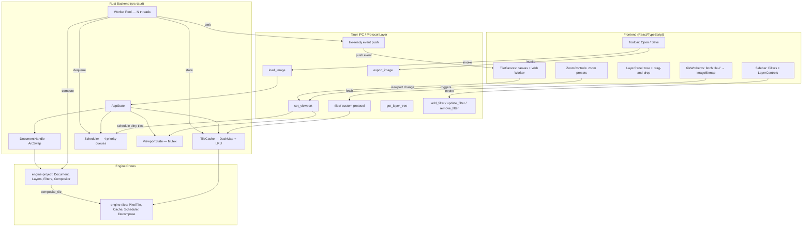
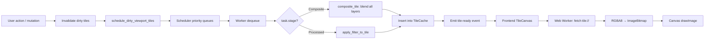
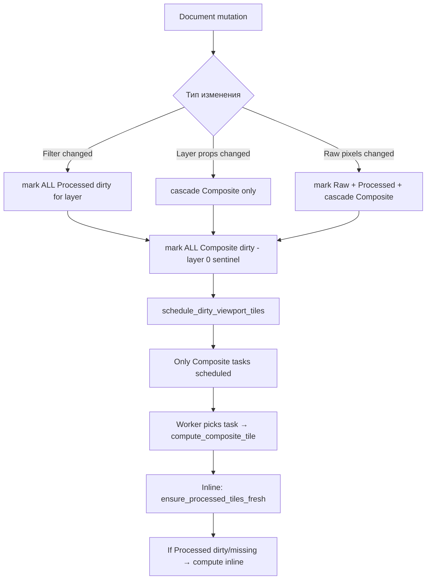
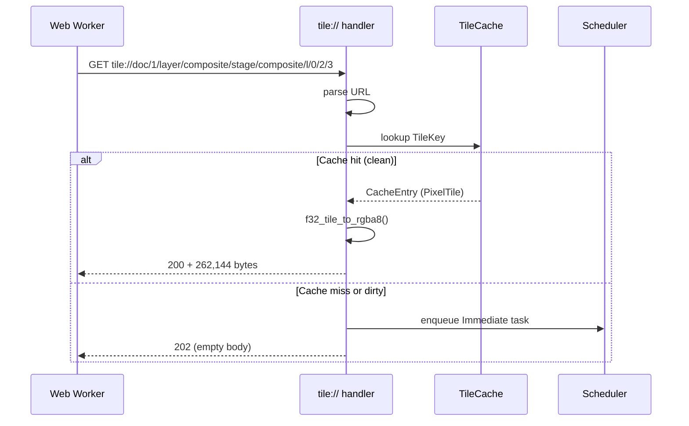
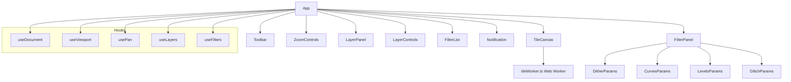
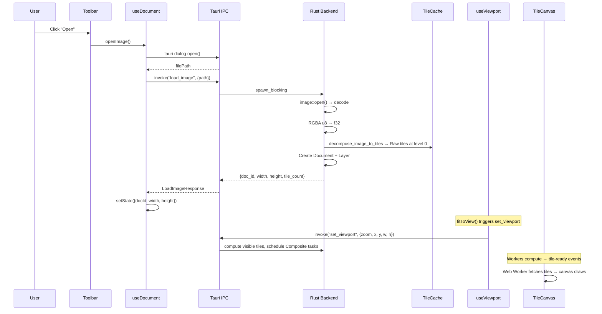
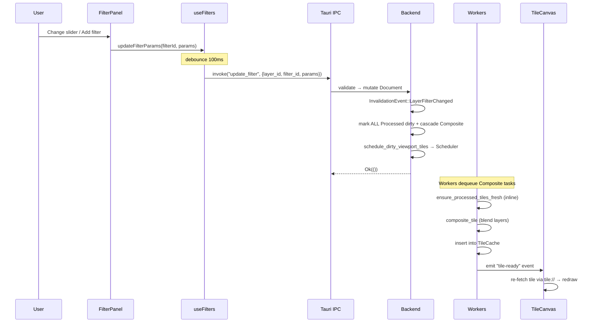
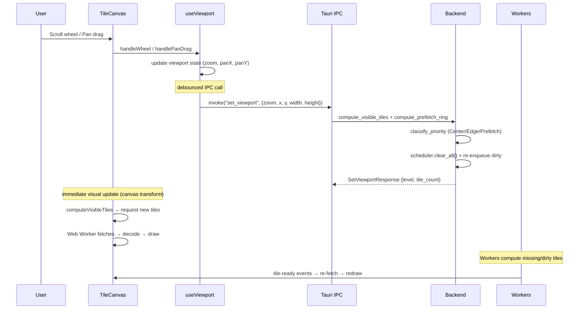
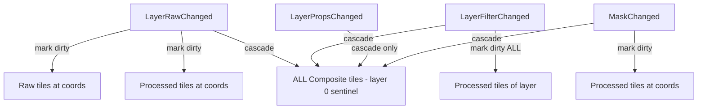

# Архитектура Dither Yuki 2

> Комплексный архитектурный отчёт для software architect.
> Технические термины приведены на английском языке.

---

## 1. Общий обзор проекта

**Dither Yuki 2** — десктопное приложение для неразрушающей обработки изображений с акцентом на художественные эффекты: дизеринг, цветовые кривые, уровни и глитч-эффекты.

### 1.1 Стек технологий

| Слой | Технология | Версия |
|------|-----------|--------|
| Desktop runtime | Tauri 2 | ^2 |
| Backend language | Rust (edition 2021) | stable |
| Frontend framework | React | ^18.2 |
| Frontend language | TypeScript | ^5.0 |
| Build tool | Vite | ^4.4 |
| Test (frontend) | Vitest + fast-check | ^4.1 / ^4.9 |
| Test (backend) | proptest + built-in #[test] | 1.4 |

### 1.2 Структура репозитория

```
dither-yuki-2/
├── Cargo.toml                  # Workspace root (resolver = "2")
├── src-tauri/                  # Tauri backend (IPC commands, worker pool)
│   ├── Cargo.toml
│   └── src/
│       ├── main.rs             # Точка входа, tile:// protocol, worker spawn
│       ├── commands.rs         # AppState + IPC-команды
│       ├── tile_protocol.rs    # URL parser для tile:// протокола
│       ├── viewport.rs         # set_viewport, compute_visible_tiles
│       ├── tile_pipeline.rs    # compute_processed_tile, compute_composite_tile
│       └── worker.rs           # Background worker loop, tile-ready events
├── crates/
│   ├── engine-core/            # Базовые типы (Phase 0 stub)
│   ├── engine-tiles/           # Тайловый кэш, scheduler, decompose, pyramid
│   ├── engine-project/         # Document model, layers, filters, compositor
│   ├── engine-color/           # Цветовые пространства (Phase 0 stub)
│   └── engine-io/              # Файловый I/O (Phase 0 stub)
├── frontend/
│   ├── package.json
│   └── src/
│       ├── App.tsx             # Root layout
│       ├── App.css             # CSS Grid layout
│       ├── components/         # React-компоненты (TileCanvas, LayerPanel, etc.)
│       ├── hooks/              # Custom hooks (useViewport, usePan, useLayers, etc.)
│       ├── workers/            # Web Worker (tileWorker.ts)
│       ├── ipc/                # Typed Tauri invoke wrappers
│       └── types/              # TypeScript interfaces для IPC DTO
└── docs/
    └── CONTRIBUTING.md
```

### 1.3 Workspace members

```toml
[workspace]
members = [
    "src-tauri",
    "crates/engine-core",
    "crates/engine-tiles",
    "crates/engine-color",
    "crates/engine-io",
    "crates/engine-project",
]
resolver = "2"
```

---

## 2. Архитектура системы

### 2.1 Высокоуровневая диаграмма



### 2.2 Push-based поток данных (tile-viewport rendering)

Архитектура следует принципу **push-based rendering**:

1. Frontend вызывает IPC-команду (mutation — фильтр, слой, загрузка)
2. Rust backend мутирует `Document` через `DocumentHandle`
3. Backend инвалидирует dirty-тайлы в `TileCache`
4. Backend планирует `RecomputeTask` в `Scheduler` для viewport-visible тайлов
5. Worker threads выбирают задачи по приоритету, вычисляют тайлы
6. Worker вставляет готовый тайл в `TileCache`, эмитирует `tile-ready` event
7. Frontend (TileCanvas) получает `tile-ready`, запрашивает тайл через `tile://`
8. Web Worker декодирует RGBA8 → `ImageBitmap`, main thread рисует на `<canvas>`

**Ключевое отличие от старой архитектуры:** нет `render_preview` → PNG → base64 → ``.
Вместо pull-модели (frontend запрашивает полный рендер) используется push-модель
(backend сообщает, когда отдельные тайлы готовы).

---

## 3. Rust Backend (src-tauri)

### 3.1 AppState

```rust
pub struct AppState {
    pub document_handle: DocumentHandle,  // Lock-free доступ к Document
    pub tile_cache: TileCache,            // LRU кэш тайлов (256 MB бюджет)
    pub scheduler: Scheduler,             // Priority task queues для worker pool
    pub viewport: Mutex<ViewportState>,   // Текущий viewport для priority decisions
}
```

**Инициализация** (в `main.rs`):
- Создаётся пустой `Document` (800×600)
- `TileCache` с бюджетом 256 MB
- `Scheduler::new()` — пустые очереди задач
- `ViewportState::default()` — zoom 1.0, pan (0,0), viewport 800×600
- State оборачивается в `Arc<AppState>` для sharing с worker threads
- Регистрируется через `tauri::Builder::manage(state.clone())`

**Worker pool spawn** (в `.setup()` hook):
```rust
let num_workers = std::thread::available_parallelism()
    .map(|n| n.get())
    .unwrap_or(4);
for _ in 0..num_workers {
    let state_clone = state.clone();
    let handle_clone = app_handle.clone();
    std::thread::spawn(move || {
        worker::tile_worker_loop(state_clone, handle_clone);
    });
}
```

### 3.2 DocumentHandle

```rust
pub struct DocumentHandle {
    current: ArcSwap<Document>,
}
```

**Ключевые свойства:**

| Операция | Сложность | Блокировка |
|----------|-----------|-----------|
| `snapshot()` | O(1) | Lock-free (ArcSwap::load_full) |
| `mutate(closure)` | O(n) clone | Атомарный swap, без lock |

**Механизм:**
- `snapshot()` — возвращает `Arc<Document>`, дешёвая атомарная операция
- `mutate(f)` — клонирует текущий `Document`, применяет замыкание `f(&mut Document)`, атомарно подменяет через `ArcSwap::store`
- Гарантирует, что читатели всегда видят consistent snapshot
- Нет deadlock: нет Mutex/RwLock для основного доступа

### 3.3 Tile Protocol Handler (tile://)

Кастомный URI scheme зарегистрированный через `register_uri_scheme_protocol("tile", ...)`.

**URL формат:**
```
tile://doc/{doc_id}/layer/{layer_id|composite}/stage/{raw|processed|composite}/l/{level}/{x}/{y}
```

**Компоненты URL:**
- `doc_id` — u32 document identifier
- `layer_id` — u32 layer ID или "composite" для финального композита
- `stage` — `raw` | `processed` | `composite` (CacheStage)
- `level` — u8 pyramid level (0 = full resolution)
- `x`, `y` — u32 tile column/row index at this level

**HTTP Response codes:**
| Status | Значение |
|--------|---------|
| 200 | Тайл готов: возвращает 262,144 bytes (RGBA8, 256×256×4) |
| 202 | Тайл pending: ставит Immediate task в Scheduler, возвращает empty body |
| 400 | Malformed URL |
| 404 | Document/layer/coordinate не найдены |

**Логика обработки:**
1. Парсинг URL через `parse_tile_url()`
2. Валидация document ID (snapshot)
3. Валидация layer existence в дереве слоёв
4. Проверка coordinate bounds (grid cols/rows at level)
5. Проверка кэша: если entry существует и `!dirty` → 200 + RGBA8 bytes
6. Cache miss / dirty → enqueue Immediate task → 202

**CORS:** Headers `Access-Control-Allow-Origin: *` для dev-mode (localhost:5173).

### 3.4 Viewport Management (viewport.rs)

#### 3.4.1 ViewportState

```rust
pub struct ViewportState {
    pub zoom: f64,                        // 1.0 = 100%
    pub x: f64,                           // Document-space X top-left
    pub y: f64,                           // Document-space Y top-left
    pub width: f64,                       // Viewport width (screen pixels)
    pub height: f64,                      // Viewport height (screen pixels)
    pub level: u8,                        // Computed pyramid level
    pub visible_tiles: Vec<TileCoord>,    // Тайлы видимые в viewport
    pub prefetch_tiles: Vec<TileCoord>,   // Prefetch ring (1 tile wide)
}
```

#### 3.4.2 `set_viewport` IPC command

```rust
#[tauri::command]
pub fn set_viewport(zoom: f64, x: f64, y: f64, width: f64, height: f64,
                    state: State<Arc<AppState>>) -> Result<SetViewportResponse, String>
```

**Что делает:**
1. Вычисляет pyramid level: `max(0, floor(log2(1.0 / zoom)))`, clamped
2. Вычисляет `compute_visible_tiles` — список тайловых координат в viewport
3. Вычисляет `compute_prefetch_ring` — ring 1 tile wide вокруг viewport
4. Классифицирует приоритеты: `classify_priority` → ViewportCenter / ViewportEdge / Prefetch
5. Обновляет `state.viewport` (Mutex lock → write → unlock)
6. Планирует dirty viewport тайлы в Scheduler

**Возвращает:** `SetViewportResponse { level, tile_count }`

#### 3.4.3 Pyramid Level Computation

```
level = max(0, floor(log2(1.0 / zoom))), clamped to max_level
```

- zoom >= 1.0 → level 0 (full resolution)
- zoom 0.5 → level 1 (1:2 downsample)
- zoom 0.25 → level 2 (1:4 downsample)

> **Текущее ограничение:** `computePyramidLevel` в frontend принудительно возвращает 0.
> Pyramid downsample pipeline не интегрирован. Все zoom levels используют level-0 тайлы, масштабированные canvas.

#### 3.4.4 Tile Coordinate Computation

```
tile_size_at_level = TILE_SIZE × (1 << level)
grid_cols = ceil(doc_width / tile_size_at_level)
grid_rows = ceil(doc_height / tile_size_at_level)

viewport bounds in doc-space:
  left   = pan_x
  top    = pan_y
  right  = pan_x + canvas_width / zoom
  bottom = pan_y + canvas_height / zoom

min_tx = max(0, floor(left / tile_size_at_level))
min_ty = max(0, floor(top / tile_size_at_level))
max_tx = min(grid_cols, ceil(right / tile_size_at_level))
max_ty = min(grid_rows, ceil(bottom / tile_size_at_level))
```

### 3.5 Worker Pool (worker.rs)

N потоков (= `available_parallelism` или 4), каждый выполняет `tile_worker_loop`:

```rust
pub fn tile_worker_loop(state: Arc<AppState>, app_handle: tauri::AppHandle) {
    loop {
        // 1. Dequeue task by priority (Immediate > ViewportCenter > ViewportEdge > Prefetch)
        // 2. Staleness check: task.generation vs current document_gen / layer_gen
        //    - Stale → discard, continue
        // 3. Execute computation based on task.key.stage:
        //    - Composite → compute_composite_tile (layer 0 sentinel)
        //    - Processed → compute_processed_tile
        //    - Raw → (уже в кэше, no-op)
        // 4. Insert result in TileCache
        // 5. Emit `tile-ready` event with TileReadyPayload
        // 6. If no tasks available → thread::sleep(1ms)
    }
}
```

**TileReadyPayload:**
```rust
#[derive(Serialize, Clone)]
pub struct TileReadyPayload {
    pub doc_id: u32,
    pub layer_id: u32,
    pub stage: String,      // "raw" | "processed" | "composite"
    pub level: u8,
    pub x: u32,
    pub y: u32,
}
```

**Staleness check:**
- `task.generation < snapshot.generations.document_gen` → stale, discard
- `task.layer_generation < snapshot.generations.get_layer_gen(layer)` → stale, discard
- **Исключение:** Composite layer-0 tasks пропускают staleness check (sentinel layer)

### 3.6 Tile Pipeline (tile_pipeline.rs)

#### 3.6.1 compute_processed_tile

```rust
pub fn compute_processed_tile(key: TileKey, state: &AppState) -> Result<PixelTile, EngineError>
```

**Шаги:**
1. Fetch Raw tile из TileCache (same layer + coord, Raw stage)
2. Получить snapshot документа → найти layer → filter stack
3. `apply_filter_to_tile(raw_tile, layer, coord)` — все enabled фильтры
4. Store result в TileCache (Processed stage)
5. Return processed tile

#### 3.6.2 compute_composite_tile

```rust
pub fn compute_composite_tile(key: TileKey, state: &AppState) -> Result<PixelTile, EngineError>
```

**Шаги:**
1. Snapshot документа → root layer tree
2. Вызывает `composite_tile(root, coord, cache)` из engine-project
3. Store result в TileCache (Composite stage, layer 0)
4. Return composite tile

**Inline Processed:** если при композитинге Processed тайл отсутствует в кэше,
он вычисляется inline (не через Scheduler) — `ensure_processed_tiles_fresh`.

### 3.7 IPC-команды

#### 3.7.1 `load_image`

```rust
#[tauri::command]
pub async fn load_image(path: String, state: State<'_, Arc<AppState>>) -> Result<LoadImageResponse, String>
```

**Что делает:**
1. Выносит I/O в `spawn_blocking` (не блокирует UI thread)
2. Декодирует PNG/JPEG/WebP через `image` crate
3. Валидирует размеры: max 8192×8192, min 1×1
4. Разбивает RGBA u8 → f32 [0.0–1.0] → `decompose_image_to_tiles` → Raw тайлы в TileCache
5. Создаёт новый `Document` с одним raster `Layer`
6. Атомарно подменяет через `document_handle.mutate()`

**Возвращает:** `{ doc_id, width, height, tile_count }`

**Ошибки:** `"IO error: ..."`, `"Invalid state: ..."`

#### 3.7.2 `set_viewport`

(Описан выше в §3.4.2)

#### 3.7.3 `get_layer_tree`

```rust
#[tauri::command]
pub fn get_layer_tree(state: State<Arc<AppState>>) -> Result<Vec<LayerNodeDto>, String>
```

**Что делает:** Snapshot документа → рекурсивный обход дерева → сериализация в `LayerNodeDto[]`.

#### 3.7.4 `add_layer` / `remove_layer` / `set_layer_props` / `reorder_layer`

CRUD-операции для дерева слоёв. Каждая:
1. `document_handle.mutate()` для atomic update
2. Invalidation cascade (LayerPropsChanged / LayerRawChanged)
3. Schedule dirty viewport tiles

#### 3.7.5 `add_filter` / `update_filter` / `remove_filter`

Управление filter stack на слое:
1. Parse kind/params → `FilterInstance`
2. Validate → `document_handle.mutate()`
3. `InvalidationEvent::LayerFilterChanged` → mark Processed dirty + cascade Composite
4. `schedule_dirty_viewport_tiles` → Scheduler

#### 3.7.6 `export_image`

```rust
#[tauri::command]
pub async fn export_image(req: ExportImageRequest, state: State<'_, Arc<AppState>>) -> Result<(), String>
```

**Что делает:**
1. Валидирует формат: "PNG" или "JPEG"
2. Full-resolution render: для каждого тайла composite → f32→u8
3. PNG encode или JPEG encode (RGBA→RGB)
4. `fs::write()` на диск

---

## 4. Engine Crates

### 4.1 engine-tiles

Ядро тайловой системы. Обеспечивает разбиение, кэширование, scheduling и pyramids.

#### 4.1.1 PixelTile

```rust
pub struct PixelTile {
    pub data: Box<[f32]>,  // 270,400 элементов = (260)² × 4 каналов
}
```

| Параметр | Значение |
|----------|---------|
| TILE_SIZE | 256 px |
| HALO | 2 px (overlap для error diffusion) |
| Полный размер | (256 + 2×2)² = 260² = 67,600 пикселей |
| Каналы | 4 (RGBA, f32) |
| Память | 270,400 × 4 bytes = **~1.03 MB** на тайл |
| Порядок хранения | Row-major (left→right, top→bottom) |
| Индексация | `(y * 260 + x) * 4 + channel` |

**API:**
- `PixelTile::new()` — zero-initialized (fully transparent)
- `at(x, y, channel) -> f32` — чтение
- `set(x, y, channel, value)` — запись

**Halo region** (2px с каждой стороны) — необходим для фильтров с error diffusion (Floyd-Steinberg), чтобы границы тайлов не создавали артефакты.

#### 4.1.2 Tile Decomposition (decompose.rs)

```rust
pub fn decompose_image_to_tiles(
    buffer: &[f32],       // RGBA f32, width×height×4
    width: u32,
    height: u32,
    layer_id: u32,
    cache: &TileCache,
) -> Result<TileGrid, TileError>
```

**Что делает:**
- Разбивает полное изображение на Raw-stage тайлы at level 0
- Тайлы расположены left-to-right, top-to-bottom (256×256 блоки)
- Edge tiles zero-filled для regions за пределами image bounds
- Halo region (2px) заполняется данными из adjacent pixels
- Каждый тайл вставляется в TileCache с ключом `TileKey { layer, coord, stage: Raw }`

**Возвращает:** `TileGrid { cols, rows }` — размеры сетки тайлов.

**Заменяет:** старый подход `ImageData { tiles: Vec<Vec<Arc<PixelTile>>> }`.

#### 4.1.3 TileCache

```rust
pub struct TileCache {
    pub entries: DashMap<TileKey, CacheEntry>,
    lru_queue: SegQueue<TileKey>,
    budget_bytes: AtomicUsize,
    used_bytes: AtomicUsize,
}
```

| Свойство | Реализация |
|----------|-----------|
| Concurrent reads | DashMap (lock-free шардированная хеш-таблица) |
| Eviction policy | LRU через SegQueue (FIFO, приближённый LRU) |
| Memory budget | По умолчанию 256 MB |
| Dirty marking | AtomicBool в CacheEntry (mark, не delete) |
| Tile size constant | `TILE_BYTES = 1,081,600` |
| Viewport-aware eviction | `evict_preserving_viewport` protects visible tiles |

**Операции:**
- `get_or_insert(key, tile)` — вставка или возврат существующего
- `mark_dirty(key)` — помечает грязным без удаления
- `evict_if_over_budget()` — вытесняет LRU-записи
- `evict_preserving_viewport(viewport_tiles)` — eviction с защитой viewport-visible тайлов

#### 4.1.4 TileCoord и TileKey

```rust
pub struct TileCoord {
    pub level: MipLevel,  // u8: 0 = full res, 1 = 1:2, 2 = 1:4 ...
    pub x: u32,
    pub y: u32,
}

pub struct TileKey {
    pub layer: LayerId,       // u32
    pub coord: TileCoord,
    pub stage: CacheStage,    // Raw | Processed | Composite
}
```

**CacheStage** — три стадии жизненного цикла тайла:
- `Raw` — исходные пиксели слоя, до фильтров
- `Processed` — после применения фильтров и масок
- `Composite` — после blending со слоями ниже (layer 0 sentinel key)

#### 4.1.5 Scheduler

```rust
pub struct Scheduler {
    immediate_queue: SegQueue<RecomputeTask>,
    viewport_center_queue: SegQueue<RecomputeTask>,
    viewport_edge_queue: SegQueue<RecomputeTask>,
    prefetch_queue: SegQueue<RecomputeTask>,
}
```

**Priority levels (descending):**

| Priority | Назначение | Когда используется |
|----------|-----------|-------------------|
| Immediate | Coarse pyramid / tile:// 202 fallback | Tile protocol cache miss |
| ViewportCenter | High-priority visible tiles (center) | `set_viewport` → dirty visible |
| ViewportEdge | Lower-priority visible tiles (edges) | `set_viewport` → dirty visible |
| Prefetch | Out-of-viewport tiles | Prefetch ring computation |

**API:**
- `enqueue(task)` — routes to priority-specific queue
- `dequeue()` → `Option<RecomputeTask>` — pops from highest non-empty queue
- `clear_all()` — drains all queues (used on viewport change to cancel stale tasks)

**RecomputeTask:**
```rust
pub struct RecomputeTask {
    pub key: TileKey,
    pub generation: u64,         // Doc generation at creation
    pub layer_generation: u64,   // Layer generation at creation
    pub priority: Priority,
}
```

#### 4.1.6 Pyramid / MipLevel

```rust
pub fn downsample_tile(parent: &PixelTile) -> PixelTile
```

Lazy пирамида для быстрого preview при zoom-out:
- Level 0: полное разрешение (256×256 main)
- Level 1: 1:2 box filter (128×128 main)
- Level 2: 1:4 (64×64 main)

Алгоритм: 2×2 box filter (среднее 4 пикселей). Каждый выходной пиксель = `(p00 + p10 + p01 + p11) × 0.25`.

> **Текущее ограничение:** pyramid downsample pipeline не интегрирован.
> Frontend принудительно использует level 0. Планируется к интеграции.

#### 4.1.7 GenerationTracker

```rust
pub struct GenerationTracker {
    pub document_gen: AtomicU64,         // Глобальный счётчик
    pub layer_gen: DashMap<LayerId, u64>, // Per-layer счётчики
}
```

Двухуровневая система версионирования:
- `document_gen` — инкрементируется при любом изменении
- `layer_gen[layer_id]` — инкрементируется при изменении конкретного слоя
- Worker сравнивает task.generation с текущим значением для staleness check

---

### 4.2 engine-project

Модель документа, слои, фильтры, compositor — бизнес-логика приложения.

#### 4.2.1 Document

```rust
pub struct Document {
    pub id: DocumentId,                   // u32 wrapper
    pub width: u32,
    pub height: u32,
    pub color_profile: ColorProfileRef,   // SRgb | Other(String)
    pub root: Vec<LayerNode>,             // bottom-to-top layer tree
    pub palettes: Vec<PaletteId>,
    pub revision: u64,                    // инкрементируется при каждом изменении
    pub generations: GenerationTracker,   // для selective invalidation
}
```

#### 4.2.2 Layer и LayerNode

```rust
pub enum LayerNode {
    Leaf(Layer),
    Group(LayerGroup),
}

pub struct Layer {
    pub id: LayerId,
    pub name: String,
    pub kind: LayerKind,        // Raster | Adjustment
    pub blend_mode: BlendMode,  // Normal, Multiply, Screen... (12 modes)
    pub opacity: f32,           // 0.0–1.0
    pub visible: bool,
    pub offset: (i32, i32),
    pub mask: Option<MaskRef>,
    pub filters: Vec<FilterInstance>,  // Стек фильтров
    pub bounds_l0: TileBounds,
}

pub struct LayerGroup {
    pub id: LayerId,
    pub name: String,
    pub blend_mode: BlendMode,
    pub opacity: f32,
    pub visible: bool,
    pub mask: Option<MaskRef>,
    pub children: Vec<LayerNode>,  // Рекурсивная структура
}
```

Обход дерева: `walk_bottom_to_top(nodes)` — lazy iterator, emit `Leaf`, `GroupStart`, `GroupEnd`.

#### 4.2.3 Compositor (compositor.rs)

```rust
pub fn composite_tile(
    root: &[LayerNode],
    coord: TileCoord,
    cache: &TileCache,
) -> Result<PixelTile, EngineError>
```

**Алгоритм композитинга:**
1. Создаёт пустой (fully transparent) composite tile
2. Рекурсивно обходит layer tree bottom-to-top
3. Для каждого visible leaf layer:
   - Fetch Processed tile из TileCache
   - Apply layer mask (luminance-based alpha masking)
   - Blend into composite: `blend_tile(dst, src, blend_mode, opacity)`
4. Для groups — isolation:
   - Push: начать новый composite stack для children
   - Pop: blend group result into parent composite с group opacity/blend

**blend_tile(dst, src, mode, opacity):**
- Porter-Duff "over" composition
- 12 blend modes: Normal, Multiply, Screen, Overlay, Darken, Lighten,
  ColorDodge, ColorBurn, HardLight, SoftLight, Difference, Exclusion
- Per-pixel: `result = blend(src_rgb, dst_rgb)`, затем alpha compositing с opacity

**apply_layer_mask:**
- Luminance-based: `mask_alpha = 0.299*R + 0.587*G + 0.114*B` из mask tile
- Модулирует alpha канал source tile: `src_alpha *= mask_alpha`

#### 4.2.4 FilterInstance

```rust
pub struct FilterInstance {
    pub id: FilterInstanceId,     // UUID v4
    pub kind: FilterKind,
    pub params: FilterParams,
    pub enabled: bool,
    pub requires_full_row: bool,  // Если true — нельзя обрабатывать по тайлам
}
```

#### 4.2.5 FilterKind и FilterParams

```rust
pub enum FilterKind {
    Curves,
    Levels,
    Dither,
    Glitch,
    Placeholder,
}

pub enum FilterParams {
    Curves { curve: Vec<(f32, f32)>, channel: CurveChannel },
    Levels { input_black: f32, input_white: f32, gamma: f32, output_black: f32, output_white: f32 },
    Dither { algorithm: DitherAlgorithm, color_depth: u8 },
    Glitch { glitch_type: GlitchType, intensity: f32, seed: u64 },
    Placeholder(String),
}
```

### 4.3 engine-core (Phase 0 — stub)

Базовые типы-заглушки. В текущей реализации не используются — реальные типы живут в `engine-project`. Будет заполнен в Phase 2.

### 4.4 engine-color (Phase 0 — stub)

Цветовые пространства (linear/sRGB, ICC profiles, LUT). Placeholder для Phase 5.

### 4.5 engine-io (Phase 0 — stub)

Файловый I/O (PNG, JPEG, WebP, FFmpeg video). Placeholder для Phase 4.
В текущей реализации кодирование/декодирование выполняется непосредственно в `src-tauri/commands.rs` через `image` crate.

---

## 5. Система фильтров

### 5.1 Dispatcher: apply_filter_to_tile

```rust
// crates/engine-project/src/filters/apply.rs
pub fn apply_filter_to_tile(
    tile: &PixelTile,
    layer: &Layer,
    coord: TileCoord,
) -> Result<PixelTile, EngineError>
```

**Алгоритм:**
1. Копирует source tile → result
2. Итерирует `layer.filters` в порядке добавления
3. Для каждого enabled фильтра: `result = apply_single_filter(&result, filter, coord)?`
4. Disabled фильтры пропускаются (`continue`)

**Вызывается из:** `compute_processed_tile` (worker) и `ensure_processed_tiles_fresh` (inline).

### 5.2 Curves Filter

**Файл:** `crates/engine-project/src/filters/curves.rs`

```rust
pub struct CurvesFilter {
    pub curve: Vec<(f32, f32)>,  // Control points [0.0–1.0]
    pub channel: CurveChannel,   // Red | Green | Blue | Luminance | All
}
```

**Интерполяция:** Catmull-Rom spline

**Обработка каналов:**
- `CurveChannel::All` — apply to R, G, B independently
- `CurveChannel::Red/Green/Blue` — apply only to specified channel
- `CurveChannel::Luminance` — упрощённо применяется к Green channel

### 5.3 Levels Filter

**Файл:** `crates/engine-project/src/filters/levels.rs`

**Алгоритм (per pixel, per RGB channel):**
```
1. Input remapping: remapped = (pixel - input_black) / (input_white - input_black) → clamp [0, 1]
2. Gamma correction: gamma_corrected = remapped^(1/gamma)
3. Output remapping: output = output_black + gamma_corrected × (output_white - output_black) → clamp [0, 1]
```

### 5.4 Dither Filter

**Файл:** `crates/engine-project/src/filters/dither.rs`

Алгоритмы: Floyd-Steinberg (error diffusion), Ordered (Bayer 2×2), Threshold (binary).

### 5.5 Glitch Filter

**Файл:** `crates/engine-project/src/filters/glitch.rs`

Типы: RGBShift (хроматическая аберрация), BlockDisplace (блочное смещение).
Детерминистический XorShift64 PRNG для воспроизводимости (seed XOR'ится с tile coords).

---

## 6. Render Pipeline (Tile-Viewport)

### 6.1 Общая схема



### 6.2 Data Flow (новая push-модель)

```
Old: mutation → render_preview (pull) → base64 PNG → 
New: mutation → invalidate → schedule → worker computes → tile-ready (push) → fetch tile:// → canvas redraws
```

**Преимущества новой модели:**
- Инкрементальное обновление: перерисовываются только dirty тайлы
- Приоритизация: видимые тайлы рендерятся первыми
- Параллелизм: N workers обрабатывают разные тайлы одновременно
- Отзывчивость: partial results отображаются по мере готовности
- Нет bottleneck на PNG encode/decode

### 6.3 Invalidation → Scheduling Flow



**Ключевое решение:** `schedule_dirty_viewport_tiles` ставит **только** Composite tasks.
Processed tiles вычисляются inline внутри `compute_composite_tile` если отсутствуют.
Это упрощает scheduling и гарантирует, что каждый тайл рендерится один раз.

### 6.4 Tile Serving (tile:// protocol)



### 6.5 Export Pipeline

Отличие от viewport render:
- **Без viewport ограничений** — рендерит все тайлы документа
- **Полноразмерный** — без downscale
- **Формат:** PNG (RGBA8) или JPEG (RGB8, quality 1–100)
- JPEG: конверсия RGBA → RGB (drop alpha)
- Результат записывается на диск через `fs::write()`

---

## 7. Frontend (React/TypeScript)

### 7.1 Компонентная архитектура



### 7.2 Компоненты

| Компонент | Ответственность |
|-----------|----------------|
| `App` | Root layout (CSS Grid), оркестрация hooks, error aggregation |
| `Toolbar` | Кнопки Open / Save |
| `TileCanvas` | HTML5 `<canvas>` + Web Worker, tile fetch/decode/render |
| `ZoomControls` | Zoom presets + editable zoom input |
| `LayerPanel` | Tree view слоёв + drag-and-drop reorder |
| `LayerControls` | Visibility, opacity slider, blend mode select, name edit |
| `FilterList` | Список фильтров + кнопки добавления (4 типа) + удаление |
| `FilterPanel` | Switch по `filter.kind` → соответствующий editor |
| `EmptyState` | Placeholder при отсутствии загруженного документа |
| `Notification` | Toast (error=red / success=green), auto-hide 5s |

### 7.3 TileCanvas Component

```typescript
interface TileCanvasProps {
  docId: number;
  docWidth: number;
  docHeight: number;
  viewport: ViewportState;
  onViewportChange: (vp: ViewportState) => void;
}

interface ViewportState {
  zoom: number;
  panX: number;
  panY: number;
  canvasWidth: number;
  canvasHeight: number;
}
```

**Механизм работы:**
1. Компонент создаёт `<canvas>` element и Web Worker (`tileWorker.ts`)
2. При изменении viewport вычисляет `computeVisibleTiles()` — список видимых тайлов
3. Отправляет `{ type: 'request-tiles', tiles, docId }` в Worker
4. Слушает `tile-ready` Tauri events → при совпадении координат re-fetch тайл
5. Worker отвечает `{ type: 'tile-decoded', key, bitmap: ImageBitmap }` (zero-copy transfer)
6. Main thread рисует `ctx.drawImage(bitmap, screenX, screenY, scaledW, scaledH)`

**computeVisibleTiles:**
```typescript
function computeVisibleTiles(viewport, docWidth, docHeight): TileCoord[] {
  const level = computePyramidLevel(viewport.zoom);  // currently forced to 0
  const scale = 1 << level;
  const tileSizeAtLevel = TILE_SIZE * scale;
  // Convert viewport bounds to tile indices, clamp to grid
}
```

### 7.4 Web Worker (tileWorker.ts)

**Messages IN:**
- `{ type: 'request-tiles', tiles: TileRequest[], docId }` — batch fetch
- `{ type: 'fetch-tile', level, x, y, docId }` — single tile fetch

**Messages OUT:**
- `{ type: 'tile-decoded', key: string, bitmap: ImageBitmap }` — success (transferred)
- `{ type: 'tile-pending', key }` — tile computation in progress (202 response)
- `{ type: 'tile-error', key, error }` — fetch/decode failure

**Fetch flow:**
1. Build URL: `tile://localhost/doc/{docId}/layer/composite/stage/composite/l/{level}/{x}/{y}`
2. `fetch(url)` → check status
3. Status 200: `arrayBuffer()` → `new ImageData(Uint8ClampedArray, 256, 256)` → `createImageBitmap` → transfer
4. Status 202: post `tile-pending` (main thread will re-request on `tile-ready` event)
5. Other: post `tile-error`

### 7.5 Custom Hooks

#### useViewport

```typescript
function useViewport(docWidth: number, docHeight: number): UseViewportReturn {
  // State: ViewportState (zoom, panX, panY, canvasWidth, canvasHeight)
  // Debounced set_viewport IPC call on state changes
  // Pan constraints: center stays within 50% of viewport beyond doc bounds
}
```

**Операции:**
- `handleWheel(e)` — zoom at cursor position
- `handlePanDrag(deltaX, deltaY)` — pan by screen-space delta
- `fitToView()` — compute zoom to fit document in canvas
- `setZoom(zoom)` — direct zoom value set
- `setCanvasSize(w, h)` — update canvas dimensions (from ResizeObserver)

**Debounce:** `set_viewport` IPC вызывается с debounce при изменении viewport state.

#### usePan

```typescript
function usePan({ onPanDrag }): { containerRef }
```

**Активация pan mode:**
- Middle mouse button hold (button === 1)
- Space + left mouse button (Space held, then left click)

**Поведение:**
- Cursor changes to 'grabbing' during drag
- Mouse move deltas reported via `onPanDrag(deltaX, deltaY)`
- On release → restore previous cursor
- Space held (no drag) → cursor 'grab' (readiness indicator)

#### useLayers

```typescript
function useLayers({ docId }): UseLayersReturn {
  // State: layers[], selectedLayerId, error
  // Fetches get_layer_tree on mount / docId change
}
```

**Операции:**
- `addLayer()` — `invoke('add_layer', ...)` → refresh tree
- `reorderLayer(layerId, newParent, newIndex)` — `invoke('reorder_layer', ...)`
- `setLayerProps(layerId, patch)` — `invoke('set_layer_props', ...)`
- `setSelectedLayerId(id)` — local selection state

#### useDocument

```typescript
interface DocumentState {
  docId: number | null;
  width: number;
  height: number;
  layerId: number | null;
  loading: boolean;
  error: string | null;
  notification: string | null;
}
```

**Операции:**
- `openImage()` — Tauri file dialog → `load_image(path)` IPC → update state
- `saveImage()` — Tauri save dialog → `export_image(req)` IPC
- `clearNotification()`
- `hasDocument` — computed (docId !== null)

#### useFilters

```typescript
function useFilters(layerId: number | null, onRefresh: () => void) {
  // State: filters[], activeFilterId, error
  // Debounce ref для updateFilterParams
}
```

**Операции:**
- `addFilter(kind)` — default params → `add_filter` IPC → append to state
- `updateFilterParams(filterId, params)` — **debounce 100ms** → `update_filter` IPC
- `removeFilter(filterId)` — `remove_filter` IPC → remove from state
- `setActiveFilterId(id)` — выбор фильтра для отображения параметров

### 7.6 CSS Grid Layout

```css
.app-layout {
    display: grid;
    grid-template-rows: 48px 1fr;
    grid-template-columns: 1fr minmax(200px, 320px);
    grid-template-areas:
        "toolbar toolbar"
        "canvas  sidebar";
    height: 100vh;
    min-width: 800px;
    min-height: 600px;
}
```

**Three-zone architecture:**
1. **Toolbar** (top, full width, 48px) — actions + ZoomControls
2. **Canvas** (main area) — TileCanvas, pan container, overflow: hidden
3. **Sidebar** (right, 200–320px) — LayerPanel + LayerControls + Filters, scrollable

**Тема:** Dark theme (backgrounds #2c2c2c – #3a3a3a, text #e0e0e0)

### 7.7 Обработка ошибок

**Стратегия:**
- Ошибки из всех hooks агрегируются: `doc.error || filters.error || layerState.error`
- Отображаются как Notification toast (красный)
- Dismiss → ошибка скрывается (не блокирует работу)

**Rollback:**
- `useFilters.updateFilterParams()`: при ошибке — `setFilters(prevFilters)` (откат)
- `useFilters.removeFilter()`: при ошибке — откат к предыдущему списку

### 7.8 Debouncing

| Действие | Debounce | Причина |
|----------|---------|---------|
| Resize observer | immediate + set_viewport | Canvas dimensions update |
| set_viewport IPC | debounced | Предотвращение flood при pan/zoom |
| Filter params update | 100ms | Предотвращение flood IPC при slider drag |

---

## 8. Потоки данных (Data Flows)

### 8.1 Загрузка изображения



### 8.2 Добавление/обновление фильтра



### 8.3 Viewport change (zoom/pan)



### 8.4 Экспорт


---

## 9. Concurrency & Thread Safety

### 9.1 Модель конкурентного доступа

```
┌──────────────────────────────────────────────────┐
│  Tauri Main Thread (UI event loop)               │
│  ├── IPC command handlers                        │
│  ├── tile:// protocol handler (synchronous)      │
│  └── Async commands → spawn_blocking             │
├──────────────────────────────────────────────────┤
│  Worker Thread Pool (N = available_parallelism)  │
│  ├── tile_worker_loop per thread                 │
│  ├── Dequeue tasks from Scheduler by priority    │
│  ├── compute_processed_tile / composite_tile     │
│  ├── Insert results into TileCache               │
│  └── Emit tile-ready events to frontend          │
├──────────────────────────────────────────────────┤
│  Blocking Thread Pool (tokio)                    │
│  ├── Image decode (load_image)                   │
│  ├── Image export (PNG/JPEG encoding)            │
│  └── File I/O                                    │
└──────────────────────────────────────────────────┘
```

### 9.2 Механизмы синхронизации

| Ресурс | Механизм | Характеристика |
|--------|----------|---------------|
| Document | `ArcSwap<Document>` | Lock-free reads, atomic swap на write |
| ViewportState | `Mutex<ViewportState>` | Short lock (update viewport params) |
| TileCache entries | `DashMap<TileKey, CacheEntry>` | Sharded lock-free concurrent map |
| Scheduler queues | `SegQueue<RecomputeTask>` × 4 | Lock-free concurrent FIFO per priority |
| Generation counters | `AtomicU64` | Lock-free atomic increments |
| Dirty flags | `AtomicBool` | Lock-free atomic store/load |
| AppState sharing | `Arc<AppState>` | Shared between main + N worker threads |

### 9.3 Паттерны безопасности

1. **Arc<AppState> для worker threads:**
   ```rust
   let state = Arc::new(app_state);
   // Main thread: tauri::Builder::manage(state.clone())
   // Each worker: state.clone() → tile_worker_loop(state_clone, ...)
   ```

2. **Snapshot для reads (lock-free):**
   ```rust
   let snapshot = state.document_handle.snapshot();  // Arc<Document>
   // Workers read document state without blocking IPC handlers
   ```

3. **Staleness check (abandon stale tasks):**
   ```rust
   let current_gen = snapshot.generations.document_gen.load(Ordering::Acquire);
   if task.generation < current_gen {
       continue;  // Discard stale task — user changed params
   }
   ```

4. **Dirty marking (не delete):**
   - Dirty тайлы остаются в кэше для instant tile:// 200 response (stale data)
   - Worker перезаписывает dirty entry с fresh result
   - Frontend получает `tile-ready` event и re-fetches clean data

5. **Viewport-aware eviction:**
   - `evict_preserving_viewport(viewport_tiles)` — never evicts tiles visible in current viewport
   - Ensures smooth viewport interaction even under memory pressure

---

## 10. Тестирование

### 10.1 Обзор покрытия

| Модуль | Unit tests | Тип |
|--------|-----------|-----|
| engine-tiles (tile) | 7 | Allocation, at/set, halo access, channels |
| engine-tiles (cache) | 10+ | Insert, LRU eviction, dirty marking, budget, viewport-preserving eviction |
| engine-tiles (pyramid) | 5 | Downsample correctness, uniform, pattern |
| engine-tiles (generation) | 4 | Increment, independence, get |
| engine-tiles (invalidation) | 9 | Cascade, stage-specific marking |
| engine-tiles (scheduler) | 10 | Priority ordering, enqueue/dequeue, clear_all, FIFO within priority |
| engine-tiles (decompose) | tests | Image decomposition, edge tiles, halo fill |
| engine-tiles (types) | 4 | Hashable, copyable, constants |
| engine-project (document) | 5 | New, mutate, snapshot, concurrent reads |
| engine-project (layer) | 4 | Defaults, walk tree, find filter |
| engine-project (compositor) | tests | Blend modes, layer visibility, group isolation |
| engine-project (filter) | 7 | Validate curves/levels/dither/glitch, disabled |
| engine-project (filters/*) | 24+ | Each filter algorithm correctness |
| engine-project (commands) | 2 | Generate ID, patch defaults |
| src-tauri (tile_protocol) | tests | URL parsing, error cases |
| src-tauri (main) | 1 | Compiles |

### 10.2 Frontend тесты

- **Framework:** Vitest + @testing-library/react + jsdom
- **PBT:** fast-check (property-based testing)
- Ключевые тесты:
  - `computeVisibleTiles` — viewport coverage (PBT)
  - `computePyramidLevel` — zoom→level mapping
  - Component rendering (TileCanvas, LayerPanel, ZoomControls, etc.)
  - Viewport constraint logic

### 10.3 Integration тесты

**Файлы:**
- `crates/engine-project/tests/integration_test.rs`
- `crates/engine-project/tests/phase3_filters_integration.rs`
- `crates/engine-tiles/tests/integration_test.rs`

---

## 11. Зависимости

### 11.1 Rust Crates (ключевые)

| Crate | Версия | Назначение |
|-------|--------|-----------|
| tauri | 2 | Desktop runtime, IPC, custom protocol |
| tauri-plugin-dialog | 2 | File open/save dialogs |
| tokio | 1 (full) | Async runtime, spawn_blocking |
| image | 0.25 | PNG/JPEG/WebP decode/encode |
| arc-swap | 1.6 | Lock-free Document access |
| dashmap | 5.5 | Concurrent HashMap (TileCache, GenerationTracker) |
| crossbeam | 0.8 | Lock-free SegQueue (Scheduler, LRU) |
| crossbeam-channel | 0.5 | Task scheduling channels |
| rayon | 1.7 | Parallel iteration (engine-tiles) |
| serde / serde_json | 1.0 | Serialization |
| uuid | 1.0 (v4, serde) | FilterInstanceId generation |
| thiserror | 1.0 | Error derive macros |
| http | 1.0 | HTTP types for tile:// protocol responses |

**Dev dependencies:**
| Crate | Версия | Назначение |
|-------|--------|-----------|
| proptest | 1.4 | Property-based testing |
| tempfile | 3.10 | Temp files for export tests |
| criterion | 0.5 | Benchmarks (cache, pyramid) |

### 11.2 NPM Packages (frontend)

| Package | Версия | Назначение |
|---------|--------|-----------|
| react | ^18.2 | UI framework |
| react-dom | ^18.2 | DOM rendering |
| @tauri-apps/api | ^2.11 | Tauri IPC invoke() + event listen |
| @tauri-apps/plugin-dialog | ^2.7 | File dialogs |
| typescript | ^5.0 | Type checking |
| vite | ^4.4 | Build/dev server |
| @vitejs/plugin-react | ^4.0 | React HMR |
| vitest | ^4.1 | Test runner |
| fast-check | ^4.9 | Property-based testing |
| @testing-library/react | ^16.3 | Component testing |
| jsdom | ^30.0 | DOM environment for tests |
| terser | ^5.19 | Production minification |

---

## 12. Известные ограничения и TODO

### 12.1 Текущие ограничения

| Ограничение | Описание |
|-------------|---------|
| Single document | Одновременно поддерживается только один документ (doc_id=1 hardcoded) |
| Max 8192×8192 | Изображения больше 8192px по любой стороне отклоняются |
| No undo/redo | revision инкрементируется, но undo stack не реализован |
| Pyramid forced level 0 | `computePyramidLevel` всегда возвращает 0; zoom-out масштабирует level-0 tiles на canvas |
| Floyd-Steinberg halo artifacts | Error diffusion на границах тайлов может давать мелкие артефакты (HALO=2 смягчает) |
| Bayer matrix 2×2 | Используется упрощённая 2×2 матрица вместо стандартной 8×8 |
| Luminance = Green proxy | CurveChannel::Luminance применяется только к Green каналу |
| No mask editing | MaskRef определён, apply_layer_mask работает, но UI для маск не реализован |

### 12.2 Phase 0 Stubs (не реализовано)

- **engine-core** — типы-заглушки, будут заполнены в Phase 2
- **engine-color** — ICC profiles, sRGB/linear conversions (Phase 5)
- **engine-io** — standalone codec module (Phase 4, сейчас кодирование в src-tauri)

### 12.3 Будущие улучшения (TODO)

- [ ] Pyramid downsample pipeline integration (level > 0 tile generation)
- [ ] Undo/redo stack
- [ ] 8×8 Bayer matrix for ordered dithering
- [ ] Proper Luminance via Lab color space
- [ ] Mask editing tools UI
- [ ] Video frame support (FFmpeg integration)
- [ ] Color profile management (ICC)
- [ ] Batch export
- [ ] WebGPU-accelerated filters
- [ ] Multi-document support

---

## Приложение A: Invalidation Cascade Logic



**Ключевой принцип:** Composite cascade теперь помечает ВСЕ composite тайлы dirty (layer 0 sentinel key).
`schedule_dirty_viewport_tiles` ставит только Composite tasks. Processed вычисляется inline.

---

## Приложение B: TypeScript Interfaces (IPC DTO)

```typescript
export interface LoadImageResponse {
  doc_id: number;
  width: number;
  height: number;
  tile_count: number;
}

export interface SetViewportResponse {
  level: number;
  tile_count: number;
}

export interface LayerNodeDto {
  id: number;
  name: string;
  kind: string;           // "raster" | "adjustment" | "group"
  blend_mode: string;
  opacity: number;
  visible: boolean;
  children?: LayerNodeDto[];
}

export interface LayerPropsPatch {
  name?: string;
  opacity?: number;
  blend_mode?: string;
  visible?: boolean;
}

export interface FilterInfo {
  id: string;
  kind: FilterKind;
  params: FilterParams;
  enabled: boolean;
}

export type FilterKind = 'Dither' | 'Curves' | 'Levels' | 'Glitch';
export type DitherAlgorithm = 'FloydSteinberg' | 'Ordered' | 'Threshold';
export type CurveChannel = 'Red' | 'Green' | 'Blue' | 'All' | 'Luminance';
export type GlitchType = 'RGBShift' | 'BlockDisplace';

export interface ExportImageRequest {
  doc_id: number;
  path: string;
  format: 'PNG' | 'JPEG';
  quality?: number;
}

export interface TileReadyPayload {
  doc_id: number;
  layer_id: number;
  stage: string;
  level: number;
  x: number;
  y: number;
}

export interface ViewportState {
  zoom: number;
  panX: number;
  panY: number;
  canvasWidth: number;
  canvasHeight: number;
}
```

---

## Приложение C: Tile Protocol URL Examples

```
# Composite tile at level 0, position (2, 3) of document 1
tile://localhost/doc/1/layer/composite/stage/composite/l/0/2/3

# Raw tile for layer 5 at level 0, position (0, 0)
tile://localhost/doc/1/layer/5/stage/raw/l/0/0/0

# Processed tile for layer 2 at pyramid level 1, position (1, 1)
tile://localhost/doc/1/layer/2/stage/processed/l/1/1/1
```
