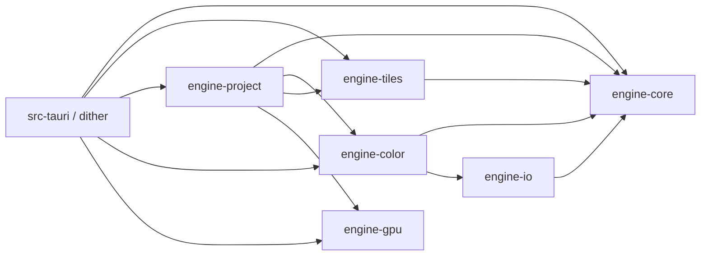
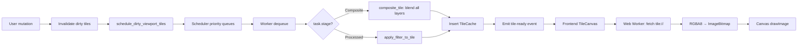
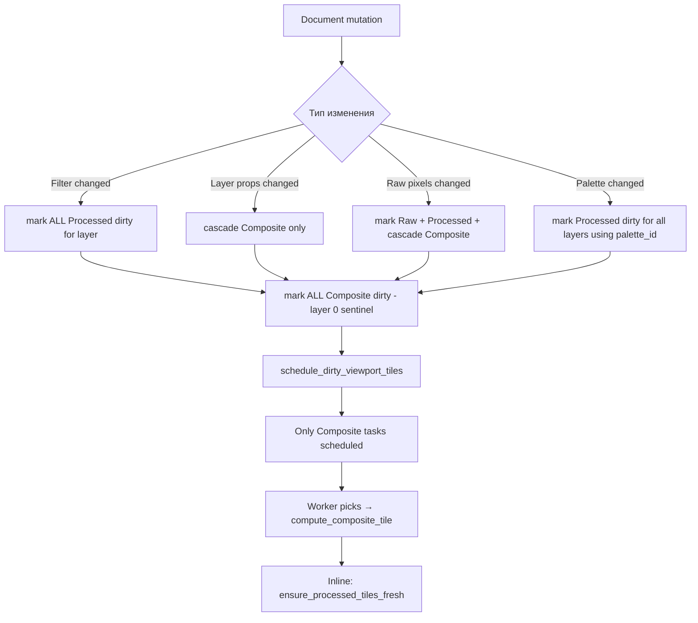
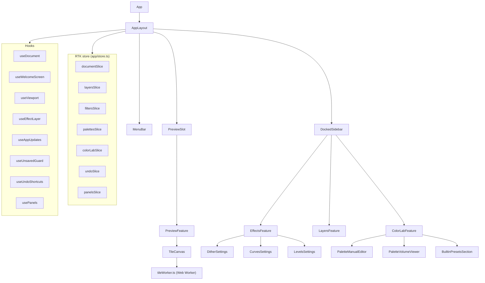
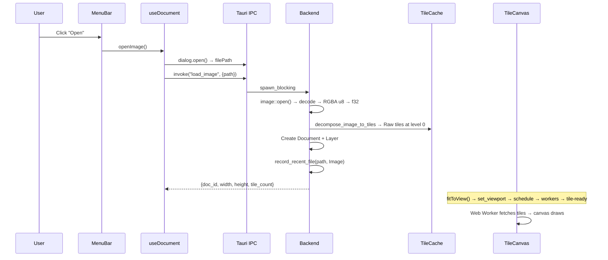
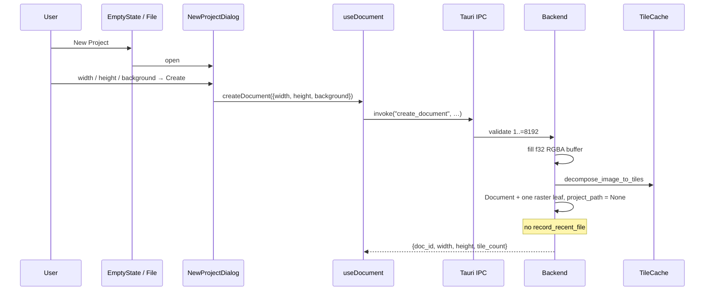
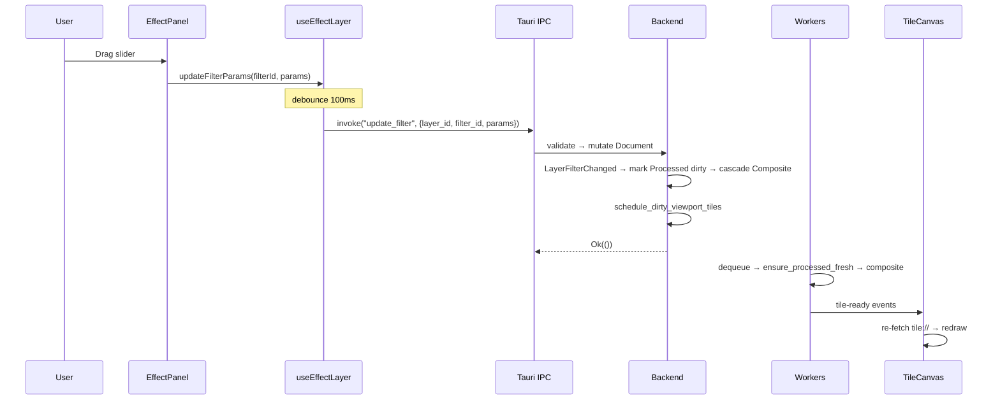
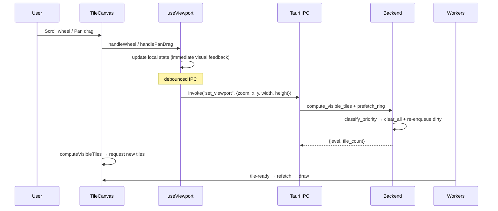
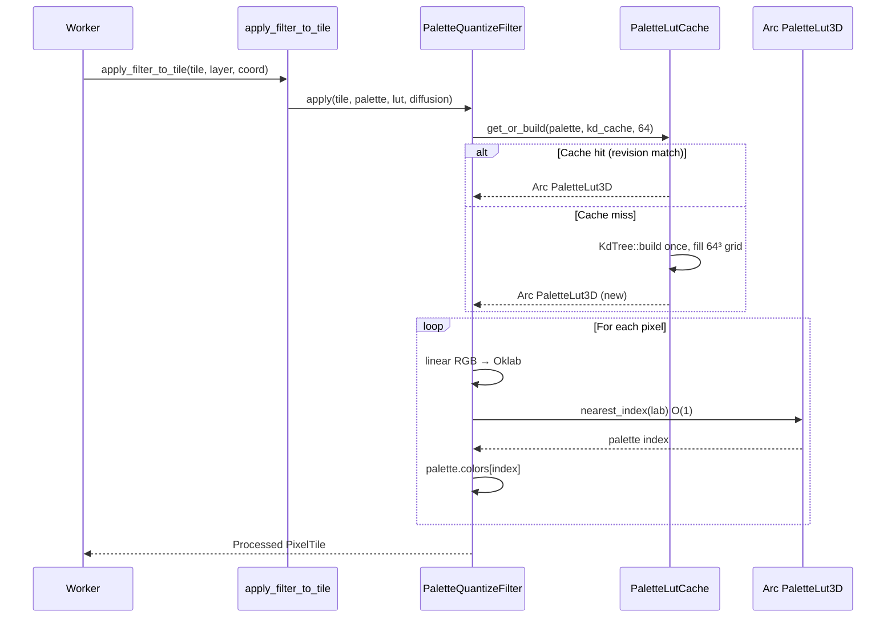

# Архитектура Dither Yuki 2

> Комплексный архитектурный документ. As-built **0.2.0**.
> Последнее обновление: 14 августа 2026.
>
> Оптимизация: начинать с **§13** (стоимость тайла / где теряется время) и
> [TILE_PIPELINE.md](./TILE_PIPELINE.md) §11. Не трогать фильтры, пока не ясно,
> какой участок реально в профиле.
>
> **См. также:**
> - [TILE_PIPELINE.md](./TILE_PIPELINE.md) — тайловый pipeline, координаты, ED, GPU, стоимость тайла
> - [COLOR_AND_COLOR_LAB.md](./COLOR_AND_COLOR_LAB.md) — цвет, палитры, Color Lab
> - [.cursor-spec/track-d-gpu/](./.cursor-spec/track-d-gpu/) — `engine-gpu`
> - [.cursor-spec/track-e-dyproj/](./.cursor-spec/track-e-dyproj/) — `.dyproj` (`engine-project::serialize`)
> - [.cursor-spec/track-f-dyuki/](./.cursor-spec/track-f-dyuki/) — `.dyuki`
> - [.cursor-spec/track-g-welcome/](./.cursor-spec/track-g-welcome/) — Welcome / Recent
> - [.cursor-spec/track-o-updates/](./.cursor-spec/track-o-updates/) — in-app updates
> - [.cursor-spec/track-p-beta/](./.cursor-spec/track-p-beta/) — dirty / Guard / Import Layer

---

## 1. Общий обзор проекта

**Dither Yuki 2** — десктопное приложение для неразрушающей обработки изображений с акцентом на художественные эффекты: дизеринг (ordered, error diffusion, custom threshold maps), палитровая квантизация (Oklab + KD-tree), цветовые кривые, уровни и глитч-эффекты.

Ключевые архитектурные принципы:
- **Push-based tile rendering** — backend вычисляет тайлы инкрементально и уведомляет frontend о готовности
- **Lock-free конкурентность** — ArcSwap для документа, DashMap для кэшей, SegQueue для scheduling
- **Perceptually-uniform color** — Oklab space для палитровой квантизации, linear RGB f32 как внутреннее представление
- **Multi-window UI** — панели могут быть undocked в отдельные OS-окна (Tauri WebView)

### 1.1 Стек технологий

| Слой | Технология | Версия |
|------|-----------|--------|
| Desktop runtime | Tauri 2 | ^2.11 |
| Backend language | Rust (edition 2021) | stable |
| Frontend framework | React + Redux Toolkit | ^18.2 / ^2.12 |
| Frontend language | TypeScript | ^5.0 |
| Build tool | Vite | ^4.4 |
| Test (frontend) | Vitest + fast-check | ^4.1 / ^4.9 |
| Test (backend) | proptest + criterion + built-in #[test] | 1.4 / 0.5 |
| Color dialogs | react-colorful | ^5.8 |
| Custom scrollbars | simplebar-react | ^3.3 |
| Oklab volume (Color Lab) | three | ^0.185 |
| In-app updates | tauri-plugin-updater + process | 2 |

### 1.2 Структура репозитория

```
dither-yuki-2/
├── Cargo.toml                  # Workspace root (resolver = "2")
├── src-tauri/                  # Tauri backend (IPC, workers, panels, tile protocol)
│   ├── tauri.conf.json         # version 0.2.0, updater pubkey, icons, file assoc
│   └── src/
│       ├── main.rs             # Entry, tile://, GpuContext, worker spawn
│       ├── commands.rs         # AppState + IPC (document / filters / palettes / dirty)
│       ├── tile_protocol.rs    # tile:// URL → RGBA8
│       ├── tile_pipeline.rs    # compute_processed_tile / compute_composite_tile
│       ├── viewport.rs         # set_viewport, visible + prefetch
│       ├── worker.rs           # WorkerWake (Condvar) + tile_worker_loop
│       ├── undo.rs             # UndoManager (Arc<Document> stacks)
│       ├── diffusion_waiters.rs
│       ├── dock_affinity.rs / global_mouseup.rs
│       ├── panel_*.rs          # dock/undock/persist
│       └── recent_files.rs
├── crates/
│   ├── engine-core/            # Phase 0 stub (не используется)
│   ├── engine-tiles/           # PixelTile, cache, scheduler, coords, pyramid, BRC
│   ├── engine-project/         # Document, layers, filters, compositor, serialize
│   │   └── src/
│   │       ├── filter.rs       # DitherParamsV2 (bias/angle/serpentine/dither_alpha)
│   │       ├── compositor.rs / simd.rs
│   │       ├── serialize/      # .dyproj / .dyuki (zip + assets + migrate)
│   │       └── filters/
│   │           ├── apply.rs            # stack + Full_Then_Blend + GPU try
│   │           ├── gpu_bridge.rs       # extract_core / write_core / eligibility
│   │           ├── dither_ordered.rs   # Bayer, CustomPng, Halftone, Wave
│   │           ├── dither_diffusion.rs # FS, Atkinson, JJN, Stucki, Burkes, Sierra
│   │           ├── dither_residuals.rs
│   │           ├── palette_quantize.rs # LUT nearest (не KD на hot path)
│   │           └── curves / levels / glow / crt / glitch
│   ├── engine-gpu/             # wgpu compute (Bayer / Halftone / CRT), opt-in
│   │   └── src/dispatch.rs     # upload → dispatch → map; submit_lock; no buffer pool
│   ├── engine-color/           # Oklab, KdTree (build LUT), PaletteLut3D 64³
│   └── engine-io/              # sandbox + svg_export (meshing / contour)
├── frontend/
│   └── src/
│       ├── main.tsx / App.tsx
│       ├── app/                # AppLayout, RTK store, slices
│       ├── features/           # preview, effects, layers, color-lab, panels, document
│       ├── components/         # MenuBar, dialogs, shared widgets
│       ├── hooks/              # useDocument, useViewport, useAppUpdates, …
│       ├── workers/tileWorker.ts
│       └── shared/ipc/         # canonical invoke wrappers
└── .cursor-spec/               # tracks A–P
```

### 1.3 Workspace members

```toml
[workspace]
members = [
    "src-tauri",
    "crates/engine-core",
    "crates/engine-tiles",
    "crates/engine-color",
    "crates/engine-io",
    "crates/engine-project",
    "crates/engine-gpu",
]
resolver = "2"
```

### 1.4 Граф зависимостей между крейтами



---

## 2. Архитектура системы

### 2.1 Высокоуровневая диаграмма

```mermaid
graph TB
    subgraph Frontend ["Frontend (React + RTK)"]
        AppLayout[AppLayout: dual sidebar + preview]
        MenuBar[MenuBar: File / Edit / Help]
        TileCanvas[TileCanvas: canvas + Web Worker]
        EffectPanel[EffectsFeature]
        LayerPanel[LayersFeature]
        ColorLab[ColorLabFeature]
        TileWorker[tileWorker.ts: fetch tile:// → ImageBitmap]
    end

    subgraph TauriIPC ["Tauri IPC / Protocol Layer"]
        set_viewport[set_viewport]
        tile_proto[tile:// custom protocol]
        tile_ready[tile-ready event push]
        load_image[load_image]
        create_document[create_document]
        get_recent_files[get_recent_files]
        get_layer_tree[get_layer_tree]
        filter_cmds[add_filter / update_filter / remove_filter]
        palette_cmds[add_palette / remove_palette / import_palette]
        panel_cmds[undock_panel / dock_panel / show_panel / hide_panel]
        export_image[export_image]
    end

    subgraph Backend ["Rust Backend (src-tauri)"]
        AppState[AppState]
        DocHandle[DocumentHandle — ArcSwap]
        TileCache[TileCache — DashMap + LRU]
        SchedulerQ[Scheduler — 4 priority queues]
        ViewportSt[ViewportState — Mutex]
        PalCache[PaletteKdCache — DashMap]
        GpuCtx[GpuContext — Option Arc]
        PanelMgr[PanelManager — Mutex]
        WorkerWake[WorkerWake — Condvar]
        WorkerPool[Worker Pool — N threads]
    end

    subgraph Engine ["Engine Crates"]
        EngProject[engine-project: Document, Layers, Filters, Compositor]
        EngTiles[engine-tiles: PixelTile, Cache, Scheduler, Decompose]
        EngColor[engine-color: Oklab, KD-tree, Palette, ThresholdMap]
        EngGpu[engine-gpu: wgpu Bayer / Halftone / CRT]
    end

    MenuBar -->|invoke| load_image
    MenuBar -->|invoke| create_document
    MenuBar -->|invoke| get_recent_files
    MenuBar -->|invoke| export_image
    EffectPanel -->|invoke| filter_cmds
    ColorLab -->|invoke| palette_cmds
    TileCanvas -->|viewport change| set_viewport
    TileWorker -->|fetch| tile_proto
    tile_ready -->|push event| TileCanvas
    panel_cmds --> PanelMgr

    load_image --> AppState
    create_document --> AppState
    get_recent_files --> AppState
    set_viewport --> ViewportSt
    set_viewport -->|schedule dirty tiles| SchedulerQ
    tile_proto --> TileCache

    AppState --> DocHandle
    AppState --> TileCache
    AppState --> SchedulerQ
    AppState --> ViewportSt
    AppState --> PalCache
    AppState --> GpuCtx
    AppState --> PanelMgr

    WorkerPool -->|dequeue| SchedulerQ
    WorkerPool -->|compute| EngProject
    WorkerPool -->|optional GPU| EngGpu
    WorkerPool -->|store| TileCache
    WorkerPool -->|emit| tile_ready
    WorkerPool -->|palette lookup| PalCache

    DocHandle --> EngProject
    EngProject -->|GpuEligible| EngGpu
    TileCache --> EngTiles
    PalCache --> EngColor
    EngProject --> EngTiles
    EngProject --> EngColor
```



### 2.2 Push-based поток данных (tile-viewport rendering)

Архитектура следует принципу **push-based rendering**:

1. Frontend вызывает IPC-команду (mutation — фильтр, слой, загрузка, палитра)
2. Rust backend мутирует `Document` через `DocumentHandle` (ArcSwap atomic swap)
3. Backend инвалидирует dirty-тайлы в `TileCache` (cascade по типу изменения)
4. Backend планирует `RecomputeTask` в `Scheduler` для viewport-visible тайлов
5. Worker threads выбирают задачи по приоритету, вычисляют тайлы (filter pipeline + compositor)
6. Worker вставляет готовый тайл в `TileCache`, эмитирует `tile-ready` event
7. Frontend (TileCanvas) получает `tile-ready`, запрашивает тайл через `tile://`
8. Web Worker декодирует RGBA8 → `ImageBitmap`, main thread рисует на `<canvas>`

**Ключевое отличие от pull-модели:** нет `render_preview` → PNG → base64 → ``.
Вместо pull (frontend запрашивает полный рендер) — push (backend сообщает, когда отдельные тайлы готовы).

### 2.3 Два цветовых пространства

| Пространство | Где живёт | Зачем |
|---|---|---|
| **Linear RGB f32** | `PixelTile` во всех стадиях (Raw/Processed/Composite) | Все фильтры (Curves, Levels, blend) работают тут. Внутреннее представление. |
| **Oklab f32** | Временный буфер **только внутри** PaletteQuantize | Перцептивно равномерное пространство для nearest-color search и error diffusion |

**Критическое правило:** `PixelTile` хранит **уже линейный RGB**. При переходе в Oklab шаг `linearize()` (sRGB→linear) **не** нужен — данные уже линейны. LMS-матрица применяется напрямую.

---

## 3. Rust Backend (src-tauri)

### 3.1 AppState

```rust
pub struct AppState {
    pub document_handle: DocumentHandle,     // Lock-free доступ к Document
    pub tile_cache: TileCache,               // LRU кэш тайлов (256 MB бюджет) + evict_layer
    pub scheduler: Scheduler,                // Priority task queues для worker pool
    pub viewport: Mutex<ViewportState>,      // Текущий viewport для priority decisions
    pub palette_cache: PaletteKdCache,       // Concurrent KD-tree кэш палитр
    pub palette_lut_cache: PaletteLutCache,  // O(1) LUT nearest-color
    pub threshold_cache: ThresholdMapCache,
    pub error_residuals: ErrorResidualsStore,
    pub block_representatives: BlockRepresentativeCache,
    pub diffusion_skip_counter: DiffusionSkipCounter,
    pub pending_diffusion_waiters: PendingDiffusionWaiters,
    /// Track D: optional wgpu device (None = CPU-only / no adapter)
    pub gpu: Option<Arc<engine_gpu::GpuContext>>,
    pub panel_manager: Mutex<PanelManager>,  // Multi-window panel state
    pub undo_manager: Mutex<UndoManager>,    // Track N: snapshot Arc<Document> stacks, max_depth=50
    pub saved_snapshot: Mutex<Option<Arc<Document>>>, // Track P: Saved_Mark; dirty = !ptr_eq(live, mark)
    pub worker_wake: WorkerWake,             // Condvar; notify_one on enqueue
    // … selection, dock_affinity, float-drag hooks …
}
```

**Инициализация** (в `main.rs`):
- Создаётся пустой `Document` (800×600)
- `TileCache` с бюджетом 256 MB
- `Scheduler::new()` — пустые очереди задач
- `ViewportState::default()` — zoom 1.0, pan (0,0)
- Palette / threshold / residuals caches — empty
- **GPU:** `GpuContext::try_new_blocking()` unless `DITHER_FORCE_CPU=1`; on failure → `gpu = None` + one warn (app continues CPU-only)
- `PanelManager` — загрузка persisted state или defaults
- State оборачивается в `Arc<AppState>` для sharing с worker threads
- Worker pool spawn: N = `available_parallelism` или 4
- `WorkerWake` Condvar: enqueue → `notify_one`; idle worker → `wait()` (не sleep 1ms)
- Workers call `apply_filter_to_tile_with_caches(..., state.gpu.as_deref())`

### 3.2 DocumentHandle

```rust
pub struct DocumentHandle {
    current: ArcSwap<Document>,
}
```

| Операция | Сложность | Блокировка |
|----------|-----------|-----------|
| `snapshot()` | O(1) | Lock-free (ArcSwap::load_full) |
| `store(arc)` | O(1) | Атомарный swap, без lock |
| `mutate(closure)` | O(n) clone | Атомарный swap, без lock |

- `snapshot()` — возвращает `Arc<Document>`, дешёвая атомарная операция
- `store(arc)` — атомарно подменяет live-указатель без deep-clone (undo/redo)
- `mutate(f)` — клонирует текущий `Document`, применяет `f(&mut Document)`, атомарно подменяет
- Гарантирует consistent snapshot для читателей, нет deadlock

### 3.2.1 Undo / Redo (Track N)

`UndoManager` живёт на `AppState` (`src-tauri/src/undo.rs`), не внутри `DocumentHandle`.
История — bounded стек `Arc<Document>` (`max_depth = 50`), не command/diff.

- Все document-мутации Tauri идут через `with_document_undo`: снимок `before` до mutate, push на успех, на `Err` стеки не трогаются.
- `load_image` / `open_project` / `create_document` / `new_document` вызывают `clear_history` (не undo-шаг).
- `undo` / `redo` делают `DocumentHandle::store(Arc)` + `increment_document_gen` на live-снимке, затем тот же путь, что replace: `invalidate_after_document_replace` + `schedule_dirty_viewport_tiles` + `document-changed` (`document_undone` / `document_redone`).
- Orphan_GC: `TileCache::evict_layer` / `ErrorResidualsStore::evict_layer` / `BlockRepresentativeCache::evict_layer` для `LayerId`, которых нет ни в live, ни в undo, ни в redo. Пиксельный paint в модели нет — snapshot структуры достаточен.
- Фронт: событие `undo-state-changed`, кастомный MenuBar, window `keydown` (⌘Z / Ctrl+Z), без второго debounce (граница шага = Track K 100ms в `useEffectLayer`).

### 3.2.2 Dirty flag (Track P)

`saved_snapshot` is the live `Arc<Document>` at the last clean point (successful save, or `clear_history` after open / load / create). Dirty is `!Arc::ptr_eq(live, saved_mark)` — not `Document.revision`. Empty / welcome (no layers) is not dirty. Frontend title: `{• }{basename | Untitled} — Dither Engine`. One Unsaved_Guard (Save / Don’t Save / Cancel) on main-window close and File New/Open. GPU filters stay opt-in (`DITHER_GPU=1`). In-app updates start at **0.2.0** (`tauri-plugin-updater` + GitHub `latest.json`); **0.1.0 cannot self-update** — install the 0.2.0 DMG once. Minisign pubkey is in `tauri.conf.json`; the private key is a CI secret, never git. Apple notarization is optional (Gatekeeper warning on first DMG open is a known beta limit). File → Import Image as Layer places at origin, clips, no scale.

### 3.3 Tile Protocol Handler (tile://)

Кастомный URI scheme: `register_uri_scheme_protocol("tile", ...)`.

**URL формат:**
```
tile://localhost/doc/{doc_id}/layer/{layer_id|composite}/stage/{raw|processed|composite}/l/{level}/{x}/{y}
```

**HTTP Response codes:**
| Status | Значение |
|--------|---------|
| 200 | Тайл готов: 262,144 bytes (RGBA8, 256×256×4) |
| 202 | Тайл pending: enqueue Immediate task, empty body |
| 400 | Malformed URL |
| 404 | Document/layer/coordinate не найдены |

**Логика:**
1. Парсинг URL → валидация document/layer/bounds
2. Cache hit (clean) → f32 tile → RGBA8 → 200
3. Cache miss/dirty → enqueue Immediate → 202

### 3.4 Viewport Management

```rust
pub struct ViewportState {
    pub zoom: f64,
    pub x: f64, pub y: f64,           // Document-space top-left
    pub width: f64, pub height: f64,   // Screen pixels
    pub level: u8,                     // Computed pyramid level
    pub visible_tiles: Vec<TileCoord>,
    pub prefetch_tiles: Vec<TileCoord>,
}
```

**set_viewport IPC:**
1. Pyramid level: `max(0, floor(log2(1.0 / zoom)))`, clamped
2. `compute_visible_tiles` → tile coordinates in viewport
3. `compute_prefetch_ring` → 1-tile ring вокруг viewport
4. `classify_priority` → ViewportCenter / ViewportEdge / Prefetch
5. `scheduler.clear_all()` + re-enqueue dirty tiles

### 3.5 Worker Pool

N потоков (= `available_parallelism`), каждый выполняет `tile_worker_loop`:

```
loop {
    1. Dequeue task by priority (Immediate > ViewportCenter > ViewportEdge > Prefetch)
    2. Staleness:
       - Processed/Raw: task.generation vs current gen → discard if stale
       - Composite (layer 0): **не** discard — всегда считает свежий snapshot
         (слайдер: Processed-задачи отбрасываются, Composite догоняет последний кадр)
    3. Execute: Composite → composite_tile / Processed → apply_filter_to_tile
    4. Insert result в TileCache
    5. Raw insert → wake pending_diffusion_waiters (Track A)
    6. Emit tile-ready event
    7. No tasks → WorkerWake.wait() (Condvar; poisoned mutex → park 1ms)
}
```

**TileReadyPayload:** `{ doc_id, layer_id, stage, level, x, y }`

### 3.6 Tile Pipeline

> **Детальное описание:** см. [TILE_PIPELINE.md](./TILE_PIPELINE.md).

**compute_processed_tile:**
1. Fetch Raw tile из cache
2. Snapshot → find layer → filter stack
3. **Dependency enforcement:** если слой содержит error diffusion (`requires_full_row`),
   рекурсивно вычислить dirty/missing соседей (left, top) для row-major ordering
4. `apply_filter_to_tile_with_residuals(raw, layer, coord, residuals_store)` — все enabled фильтры
5. Store Processed в cache

**compute_composite_tile:**
1. Snapshot → root layer tree
2. `ensure_processed_tiles_fresh` — inline вычисление dirty Processed тайлов
3. `composite_tile(root, coord, cache)` — blend all visible layers
4. Store Composite в cache (layer 0 sentinel key)

**Inline Processed:** если при композитинге Processed тайл отсутствует — вычисляется inline.

### 3.7 Panel Manager (multi-window)

```rust
pub struct PanelManager {
    panels: Vec<PanelInfo>,          // effect, layers, colorlab, preview
    panel_order: Vec<PanelId>,       // Sidebar order (docked panels)
}
```

- IPC commands: `undock_panel`, `dock_panel`, `show_panel`, `hide_panel`, `reorder_panels`
- Floating panels → отдельные Tauri WebviewWindow (`index.html?panel=<id>`)
- Синхронизация через `panel-state-changed` Tauri event (fan-out ко всем окнам)
- Persistence → JSON в app data directory, загружается при старте
  (`panel_state.json`; рядом — `recent_files.json`, см. §3.9)

### 3.8 IPC-команды (сводка)

| Команда | Назначение |
|---------|-----------|
| `load_image` | Decode image → decompose to tiles → create Document; record Recent (Image) |
| `create_document` | In-memory blank raster (same decompose/replace as `load_image`; **not** recorded in Recent) |
| `get_recent_files` | Load `{app_data_dir}/recent_files.json`, prune missing paths, rewrite if dropped |
| `open_project` | Open `.dyproj` → replace document; record Recent (Project) |
| `save_project` / `save_project_as` | Write `.dyproj`; record Recent (Project) |
| `export_pattern` / `import_pattern` | `.dyuki` pack/unpack (Track F) |
| `export_image` | Full-res composite → PNG/JPEG encode → fs::write |
| `set_viewport` | Update viewport → schedule dirty tiles |
| `get_layer_tree` | Snapshot → serialize LayerNodeDto[] |
| `add_layer` / `remove_layer` / `reorder_layer` | Layer CRUD + invalidation |
| `set_layer_props` | Opacity/blend/visibility/name patch |
| `add_filter` / `update_filter` / `remove_filter` / `reorder_filter` | Filter stack CRUD |
| `undo` / `redo` | Snapshot restore + invalidate + schedule |
| `is_document_dirty` | Track P: `!ptr_eq(live, saved_mark)` |
| `import_image_layer` | Decode → raster leaf at origin, clip, no scale |
| `replace_palette` | Color Lab Apply (mutate existing PaletteId) |
| `add_palette` / `remove_palette` / `import_palette` / `export_palette` | Palette CRUD |
| `generate_palette` | Async MedianCut/KMeans from layer tiles → new Palette |
| `list_builtin_palettes` / `import_builtin_palette` | Built-in retro presets → Document palette |
| `generate_ramp_palette` / `generate_harmony_palette` | Draft-only color lists (no Document write) |
| `undock_panel` / `dock_panel` / `show_panel` / `hide_panel` / `reorder_panels` | Panel management |

### 3.9 Welcome Screen и Recent Files (Track G)

При `!hasDocument` слот preview (`PreviewFeature`, включая `fill` / floating window) рендерит **Welcome** в существующем `EmptyState.tsx` — не отдельный competing component.

**Blank document — `create_document(width, height, background)`:**
- Bounds: `1..=MAX_DOCUMENT_DIMENSION` (8192), та же константа, что `load_image`
- Buffer: f32 RGBA в numeric space `load_image` (`u8/255.0`). Transparent = zeros; White = `1,1,1,1`
- Дальше тот же путь, что `load_image`: `decompose_image_to_tiles` → один raster leaf (`LayerId::new(1)`) → `project_path = None` → invalidate + schedule + `document-changed` (`document_created`)
- **Не** вызывает `record_recent_file` (нет пути на диске, пока пользователь не Save Project)

**Recent Files — `src-tauri/src/recent_files.rs`:**
- JSON `{app_data_dir}/recent_files.json` (рядом с `panel_state.json`); `MAX_RECENT = 10`
- Запись `{ path, kind: image|project, display_name, opened_at }` (ISO-8601 UTC; relative time считается на фронте)
- `record_recent_file` после **успеха** `load_image` (Image), `open_project` / `save_project` / `save_project_as` (Project). Ошибка записи логируется и **не** валит user command
- `get_recent_files`: `exists()` prune; если что-то выкинули — rewrite; rewrite fail → всё равно вернуть отфильтрованный список
- Missing/corrupt JSON → пустой список, не IPC error

**Frontend wiring:** один `useWelcomeScreen()` на окно (`AppLayout` / floating Preview) поднимает `useRecentFiles` + `useDocument` (`openImageAt` / `openProjectAt` / `createDocument`). Welcome и File-меню получают одни и те же `entries` и колбэки. `NewProjectDialog` один на окно (defaults 1920×1080 Transparent). File: **New Project…** (всегда enabled) + **Open Recent** (скрыт, если список пуст).

---

## 4. Engine Crates

### 4.1 engine-tiles

Ядро тайловой системы. Обеспечивает разбиение, кэширование, scheduling и pyramids.

#### PixelTile

```rust
pub struct PixelTile {
    pub data: Box<[f32]>,  // 270,400 элементов = (260)² × 4 каналов
}
```

| Параметр | Значение |
|----------|---------|
| TILE_SIZE | 256 px |
| HALO | 2 px (overlap для error diffusion) |
| Полный размер | (256 + 2×2)² = 260² = 67,600 пикселей |
| Каналы | 4 (RGBA, linear f32) |
| Память | 270,400 × 4 bytes ≈ **1.03 MB** на тайл |
| Порядок | Row-major, индексация: `(y * 260 + x) * 4 + channel` |

Halo region (2px) нужен error diffusion и Glow. Это **главный множитель памяти**:
каждый тайл ≈ **1.03 MB** f32. Один `PixelTile::new()` + `copy_from_slice` — это уже
мегабайт. Стек из N фильтров без in-place apply делает N таких аллокаций.
См. §13.

#### GlobalCoord / GlobalCoordSigned (coords.rs)

Единый примитив для перевода локальных координат в глобальные координаты документа.
Подробное описание — в [TILE_PIPELINE.md](./TILE_PIPELINE.md) §2.

```rust
pub struct GlobalCoord { pub x: u32, pub y: u32 }        // Core area
pub struct GlobalCoordSigned { pub x: i32, pub y: i32 }  // С halo (может быть < 0)
```

#### TileCache

```rust
pub struct TileCache {
    pub entries: DashMap<TileKey, CacheEntry>,
    lru_queue: SegQueue<TileKey>,
    budget_bytes: AtomicUsize,
    used_bytes: AtomicUsize,
}
```

- **Concurrent reads:** DashMap (lock-free шардированная хеш-таблица)
- **Eviction:** LRU через SegQueue, budget 256 MB по умолчанию
- **Dirty marking:** AtomicBool (mark, не delete — stale data доступна для instant 200 response)
- **Viewport-aware eviction:** `evict_preserving_viewport` защищает visible tiles

#### TileCoord и TileKey

```rust
pub struct TileCoord { pub level: u8, pub x: u32, pub y: u32 }
pub struct TileKey { pub layer: u32, pub coord: TileCoord, pub stage: CacheStage }
pub enum CacheStage { Raw, Processed, Composite }
```

- `Raw` — исходные пиксели слоя (до фильтров)
- `Processed` — после filter stack
- `Composite` — после blending со всеми видимыми слоями (layer 0 sentinel)

#### Scheduler

```rust
pub struct Scheduler {
    immediate_queue: SegQueue<RecomputeTask>,
    viewport_center_queue: SegQueue<RecomputeTask>,
    viewport_edge_queue: SegQueue<RecomputeTask>,
    prefetch_queue: SegQueue<RecomputeTask>,
}
```

| Priority | Назначение | Когда |
|----------|-----------|-------|
| Immediate | tile:// 202 fallback, coarse pyramid | Cache miss в protocol handler |
| ViewportCenter | Высокоприоритетные visible tiles (центр viewport) | set_viewport → dirty |
| ViewportEdge | Visible tiles (края viewport) | set_viewport → dirty |
| Prefetch | Тайлы за пределами viewport | Prefetch ring computation |

#### GenerationTracker

```rust
pub struct GenerationTracker {
    pub document_gen: AtomicU64,
    pub layer_gen: DashMap<LayerId, u64>,
}
```

Двухуровневая система: `document_gen` (любое изменение) + `layer_gen` (per-layer).
Worker сравнивает `task.generation` с текущим значением для staleness check.

#### Decompose

`decompose_image_to_tiles(buffer, width, height, layer_id, cache)` — разбивает полное изображение на Raw тайлы at level 0 с zero-fill для edge tiles и halo fill из adjacent pixels.

#### Pyramid

Lazy пирамида для zoom-out: 2×2 box filter downsample.
- Level 0: full resolution (256×256 main)
- Level 1: 1:2 (128×128), Level 2: 1:4 (64×64), ...

> **Текущее поведение:** preview выбирает pyramid level по zoom
> (`floor(log2(1/zoom))`). Level>0 — **только** 2×2 box-filter уже посчитанных
> Composite L0 (тот же дизер, меньше тайлов на canvas). Фильтры всегда на L0.
> После insert L0/L1 worker будит родителя (`level+1`), иначе zoom-out display
> tile может остаться на старом эффекте. Canvas меняет кадр атомарно, когда
> все видимые тайлы новой генерации готовы. Export всегда L0.

---

### 4.2 engine-project

Модель документа, слои, фильтры, compositor — бизнес-логика приложения.

#### Document

```rust
pub struct Document {
    pub id: DocumentId,
    pub width: u32,
    pub height: u32,
    pub color_profile: ColorProfileRef,   // SRgb | Other(String)
    pub root: Vec<LayerNode>,             // bottom-to-top layer tree
    pub palettes: Vec<Palette>,           // Palette entities (linear RGB)
    pub revision: u64,
    pub generations: GenerationTracker,
}
```

#### Layer и LayerNode

```rust
pub enum LayerNode { Leaf(Layer), Group(LayerGroup) }

pub struct Layer {
    pub id: LayerId,
    pub name: String,
    pub kind: LayerKind,           // Raster | Adjustment
    pub blend_mode: BlendMode,     // Normal, Multiply, Screen... (12 modes + 4 reserved)
    pub opacity: f32,              // 0.0–1.0
    pub visible: bool,
    pub offset: (i32, i32),
    pub mask: Option<MaskRef>,
    pub filters: Vec<FilterInstance>,
    pub bounds_l0: TileBounds,
}

pub struct LayerGroup {
    pub id: LayerId,
    pub name: String,
    pub blend_mode: BlendMode,
    pub opacity: f32,
    pub visible: bool,
    pub mask: Option<MaskRef>,
    pub children: Vec<LayerNode>,  // Рекурсивная структура
}
```

Обход дерева: `walk_bottom_to_top(nodes)` — lazy iterator с `LayerRef::Leaf`, `GroupStart`, `GroupEnd`.

#### Compositor

```rust
pub fn composite_tile(root: &[LayerNode], coord: TileCoord, cache: &TileCache)
    -> Result<PixelTile, EngineError>
```

Алгоритм:
1. Пустой (fully transparent) composite tile
2. Рекурсивный обход bottom-to-top
3. Для leaf: fetch Processed → apply mask → blend into composite
4. Для groups (isolation): push fresh tile → composite children → blend result into parent

**Blend modes (12):** Normal, Multiply, Screen, Overlay, Darken, Lighten, ColorDodge, ColorBurn, HardLight, SoftLight, Difference, Exclusion.

**Mask:** luminance-based (`0.299*R + 0.587*G + 0.114*B`) → модулирует alpha source tile.

**SIMD-ускорение:** `blend_row_simd` (wide f32x4) для Porter-Duff "over" composition.

#### FilterInstance

```rust
pub struct FilterInstance {
    pub id: FilterInstanceId,     // UUID v4
    pub kind: FilterKind,         // Curves | Levels | Dither | PaletteQuantize | Glitch | Glow | Crt | Placeholder
    pub params: FilterParams,
    pub enabled: bool,
    pub requires_full_row: bool,  // ED → row-major dependency enforcement
    pub opacity: f32,             // Track I: default 1.0; Full_Then_Blend
    pub blend_mode: BlendMode,    // Track I: default Normal
}
```

#### FilterParams (все варианты)

```rust
pub enum FilterParams {
    Curves { curve: Vec<(f32, f32)>, channel: CurveChannel },
    Levels { input_black, input_white, gamma, output_black, output_white },
    Dither { mode: DitherMode, color_depth: u8 },           // Legacy V1 → From into V2
    DitherV2(DitherParamsV2),
    PaletteQuantize { palette_id: PaletteId, diffusion: Option<DiffusionKernel> },
    Glitch { glitch_type: GlitchType, intensity: f32, seed: u64 },
    Glow { radius: f32, intensity: f32, threshold: f32 },
    Crt { period: f32, strength: f32, mask_strength: f32 },
    Placeholder(String),
}
```

**DitherParamsV2** (as-built):
```rust
pub struct DitherParamsV2 {
    pub mode: DitherModeV2,
    // Bayer2/4/8 | CustomPng | FloydSteinberg | Atkinson |
    // JarvisJudiceNinke | Stucki | Burkes | Sierra | CmykHalftone | Wave
    pub levels: u16,                 // 2–256
    pub threshold_scale: f32,        // 0.1–4.0
    pub pixel_size: u8,              // 1–32
    pub color_mode: DitherColorMode, // Rgb | Grayscale
    pub palette_id: Option<PaletteId>,
    pub halftone_cell_size: u8,      // CmykHalftone
    pub wave_wavelength / amplitude / phase / angle,
    pub threshold_bias: f32,         // Track H, ordered only; GPU skip if ≠ 0
    pub pattern_angle: f32,          // Track H, Bayer/CustomPng; Block_Then_Rotate
    pub serpentine: bool,            // Track M, ED odd global rows R→L
    pub dither_alpha: bool,          // default true: alpha → 0/1 per pixel_size block
}
```

Legacy `(DitherMode, color_depth)` автоматически мигрирует в V2 через `From` impl.

---

### 4.3 engine-color

Цвет, палитры, KD-tree, threshold maps, OkLCH-генераторы. Подробный as-built flow UI — `COLOR_AND_COLOR_LAB.md`.

#### Oklab (oklab.rs)

```rust
pub struct LinRgb { pub r: f32, pub g: f32, pub b: f32 }
pub struct OkLab { pub l: f32, pub a: f32, pub b: f32 }

pub fn linear_to_oklab(c: LinRgb) -> OkLab;  // NO linearize step — input is already linear!
pub fn oklab_to_linear(c: OkLab) -> LinRgb;
pub fn oklab_to_linear_unclamped(c: OkLab) -> LinRgb; // для gamut checks
```

**Критически важно:** матрица RGB→LMS откалибрована под sRGB/Rec.709 primaries. Если рабочее пространство документа — не sRGB, нужна промежуточная конвертация (осознанное ограничение MVP).

#### OkLCH / ramps / harmony

- `oklch.rs` — цилиндрическая форма Oklab; hue в радианах; `clip_to_srgb_gamut` / `is_out_of_srgb_gamut`
- `ramps.rs` — `generate_ramp(from, to, steps)` lerp в Oklab + clip на шаг
- `harmony.rs` — Monochromatic, Analogous, Complementary, Triadic, SplitComplementary

Tauri: `generate_ramp_palette` / `generate_harmony_palette` возвращают цвета в UI-драфт и **не** вызывают `add_palette`.

#### KD-tree (kdtree.rs)

3D дерево для nearest-neighbor search в Oklab-space. API:
- `KdTree::build(points: &[OkLab]) -> Option<KdTree>`
- `KdTree::nearest(&self, query: &OkLab) -> (usize, f32)` — индекс + расстояние

#### PaletteKdCache (palette_cache.rs)

```rust
pub struct PaletteKdCache {
    entries: DashMap<PaletteId, (u64 /* revision */, Arc<KdTree>)>,
}
```

- `get_or_build(palette)` → `Arc<KdTree>` — lock-free read из DashMap shards
- Revision-based invalidation (не hash палитры — дешевле)
- Один физический KD-tree на палитру для всех worker threads
- Last-writer-wins на concurrent builds

#### PaletteLut3D / PaletteLutCache (palette_lut.rs)

O(1) nearest-color lookup for palette hot paths (quantize / ordered / diffusion).

```rust
pub struct PaletteLut3D {
    grid: Vec<u16>, // size³, row-major L,a,b
    size: u32,      // default DEFAULT_LUT_SIZE = 64
    l_range: (f32, f32), // [0, 1]
    a_range: (f32, f32), // [-0.4, 0.4]
    b_range: (f32, f32), // [-0.4, 0.4]
}

pub struct PaletteLutCache {
    entries: DashMap<PaletteId, (u64 /* revision */, Arc<PaletteLut3D>)>,
}
```

- `PaletteLut3D::build` queries `KdTree::nearest` at each cell center (once per revision)
- `nearest_index(lab)` — clamp into ranges, flat index, no tree walk
- `PaletteLutCache::get_or_build(palette, kd_cache, size)` — same revision invalidation as KD cache
- Held beside `PaletteKdCache` in `AppState`; both evicted on palette remove
- Default `size = 64` (512 KiB): lookup ~23× faster than KD; 32³ had ~29% boundary disagreement on dense K=64 palettes
- Fallback policy: always LUT in production hot paths (no K-threshold); KD remains for build + tests

#### Palette (palette/mod.rs)

```rust
pub struct Palette {
    pub id: PaletteId,       // u32
    pub name: String,
    pub colors: Vec<LinearColor>,  // Linear RGB f32 (same space as PixelTile)
    pub revision: u64,
}

pub struct LinearColor { pub r: f32, pub g: f32, pub b: f32 }
```

**Import/Export форматы:** ASE, ACO, GPL, PAL, CSV, JSON.
Парсеры в `palette/formats/` конвертируют sRGB u8 → linear f32 при импорте.

**Generation:** Median cut / K-means в `palette/generate.rs` с subsample до `MAX_GENERATION_SAMPLES` (200 000) и HashSet-дедупом. Команда `generate_palette` — async + stride по тайлам.

**Builtins:** `palette/presets.rs` (`gameboy`, `apple2`, …) → `list_builtin_palettes` / `import_builtin_palette`.

#### ThresholdMap (threshold_map.rs)

Загрузка custom PNG threshold maps для ordered dithering.
- Path validation через `engine_io::sandbox::resolve_user_path`
- Grayscale → f32 normalized sampling
- Cache по (path, mtime) для hot-reload

---

### 4.4 engine-io

Sandbox path validation для безопасного доступа к файлам пользователя.

```rust
// engine-io/src/sandbox.rs
pub fn resolve_user_path(raw: &str, allowed_ext: &[&str]) -> Result<PathBuf, SandboxError>;
```

- `canonicalize()` для разрешения symlink-побега
- Проверка: путь обязан быть под `$HOME`
- Whitelist расширений (`.png`, `.ase`, `.aco`, `.gpl`, `.pal`, `.csv`, `.json`)

### 4.5 engine-gpu

Optional **wgpu** compute path for per-tile pattern filters (Track D). Preview remains Canvas2D; GPU accelerates **backend apply**, not display.

```rust
pub struct GpuContext {
    pub device: wgpu::Device,
    pub queue: wgpu::Queue,
    pub map_timeout_counter: AtomicU64,  // silent-path observability
    // cached compute pipelines: Bayer2/4/8, Halftone, CRT
    // submit_lock: Mutex<()> — serialize encode/submit/map across workers
}
```

| Concern | Detail |
|---------|--------|
| Init | `GpuContext::try_new()` → `None` on no adapter (no panic) |
| Hold | `AppState.gpu: Option<Arc<GpuContext>>` |
| I/O | **RGBA32 float** core `256×256` only (locked; not RGBA8) |
| Uniform | `tile_offset = (tile.x×256, tile.y×256)` ≡ `GlobalCoord::from_local` |
| Workgroup | `16×16` → dispatch `(16,16,1)` |
| Sync | upload → dispatch → staging → `map_async` + poll w/ timeout |
| Timeout | inc `map_timeout_counter` → caller CPU-fallback |
| Env | `DITHER_FORCE_CPU=1` skip/force CPU; `DITHER_GPU=1` prefer GPU when available |

**GpuEligible (v1, CPU = source of truth):**
- Bayer2/4/8: `pixel_size==1`, no palette, `threshold_bias==0`, `pattern_angle==0`
- CMYK Halftone: `pixel_size==1`, no palette, `threshold_bias==0`
- CRT (period / strength / mask)
- `dither_alpha` **не** снимает eligibility: шейдер кодирует mode 0–3 (rgb/gray ± alpha)

**Never GPU:** Error Diffusion (все ядра Track M), CustomPng, Wave, Glow, `pixel_size>1`, palette.

**Стоимость GPU-пути (важно для оптимизации):**
`dispatch_rgba32` держит `submit_lock` на весь encode/submit/`map_async`. Нет пула буферов —
каждый тайл создаёт input/output/uniform/staging. `extract_core` / `write_core` — скалярные
`at()`/`set()` по 256², не memcpy. Итог: GPU часто **не** быстрее CPU на одном Bayer-тайле;
N воркеров сериализуются в одну очередь. По умолчанию GPU **выключен** (`DITHER_GPU` не задан).
Подробности — §13.4 и TILE_PIPELINE.md §10–11.

Bridge: `filters/gpu_bridge.rs` extracts/writes core; `apply.rs` tries GPU then CPU.

**Parity:** Bayer exact (`f32 ==`); Halftone/CRT max abs ≤ `1/255` per channel.  
Full contract: [TILE_PIPELINE.md](./TILE_PIPELINE.md) §10 · [.cursor-spec/track-d-gpu/](./.cursor-spec/track-d-gpu/).

### 4.6 engine-core (Phase 0 stub)

Базовые типы-заглушки. В текущей реализации **не используются** — реальные типы живут в `engine-project/src/types.rs`. Сохранён для обратной совместимости workspace.

---

## 5. Система фильтров

### 5.1 Dispatcher: apply_filter_to_tile

```rust
pub fn apply_filter_to_tile(tile: &PixelTile, layer: &Layer, coord: TileCoord)
    -> Result<PixelTile, EngineError>
```

1. Копирует source tile → result (`PixelTile::new` + `copy_from_slice`, ~1.03 MB)
2. Итерирует `layer.filters` в порядке добавления
3. Для каждого enabled: `apply_filter_with_blend` → `apply_single_filter` на 100%, затем
   если `opacity < 1` или `blend_mode != Normal` — ещё один тайл + `blend_tile`
4. Disabled пропускаются
5. Optional `gpu` — Bayer/Halftone/CRT when `DITHER_GPU=1` **и** eligibility

Вызывается из: `compute_processed_tile` (worker, passes `state.gpu`) и export paths (`gpu = None` OK).

Вариант с error residuals + caches:
```rust
pub fn apply_filter_to_tile_with_caches(
    tile, layer, coord, palette_cache, lut_cache, threshold_cache,
    document, residuals_store, block_cache, gpu,
)
```

### 5.2 Curves

- Catmull-Rom spline интерполяция по control points [0.0–1.0]
- Каналы: Red, Green, Blue, Luminance, All
- SIMD не применяется (few control points, spline eval)

### 5.3 Levels

Per-pixel, per-channel:
```
1. remapped = (pixel - input_black) / (input_white - input_black) → clamp [0,1]
2. gamma_corrected = remapped^(1/gamma)
3. output = output_black + gamma_corrected × (output_white - output_black) → clamp [0,1]
```

SIMD-ускорение: `levels_row_simd` (wide f32x4) для batch processing строк.

### 5.4 Dither (V2 redesign)

> **Детальное описание:** см. [TILE_PIPELINE.md](./TILE_PIPELINE.md) §5–6.

**Ordered dithering (Bayer + Custom PNG):**
- Глобальные координаты через `GlobalCoordSigned::from_local_with_halo()` — бесшовность между тайлами
- `rem_euclid` для индексации в threshold матрицу (корректно при отрицательных halo-координатах)
- `div_euclid` для pixel_size alignment
- `threshold_scale` модулирует амплитуду порога
- `pixel_size > 1` → mega-pixel blocks через global coordinate alignment
- **Не имеет зависимостей между тайлами** — можно обрабатывать параллельно

**Error diffusion (FS, Atkinson, JJN, Stucki, Burkes, Sierra):**
- Processing L→R, T→B internal to tile; `serpentine` → odd **global** Y rows R→L, kernel mirrored X
- `ErrorResidualsStore` (DashMap per LayerId+TileCoord) для cross-tile:
  - После тайла: store right-edge, bottom-edge, **corner** (IncomingErrorBuffer)
  - Перед: seed от left/top/diag neighbors
- **Row-major dependency:** `compute_processed_tile` рекурсивно считает left/top/diag
  если dirty/missing (на всех pyramid levels)
- `requires_full_row = true`
- При смене params: `error_residuals.clear()`
- **Не GPU.** Wavefront сериализует тайлы — главный анти-параллелизм viewport'а

**Color modes:** RGB per-channel / Grayscale luminance.

**Palette-constrained dithering:**
- `palette_id: Some(id)` → `PaletteLut3D::nearest_index` в Oklab (не `KdTree::nearest` на пикселе)
- Без палитры → uniform quantize к `levels`
- Palette + Bayer → GPU skip, CPU path

**dither_alpha (default true):** альфа квантуется в 0/1 по тому же `pixel_size` блоку.
`false` — исходная альфа копируется (гладкий край PNG).

### 5.5 PaletteQuantize

- Pixel → Oklab (временно, на каждый пиксель — это **оставшийся** CPU cost после LUT)
- Nearest: `PaletteLutCache::get_or_build` → `PaletteLut3D::nearest_index` (O(1))
- `KdTree` строится один раз при miss LUT и **не** ходит на пиксель в production
- Optional error diffusion kernel
- Результат = `palette.colors[index]` (linear RGB)
- Alpha копируется как есть (не `dither_alpha`; это параметр DitherV2)

### 5.6 Glitch

- **RGBShift:** хроматическая аберрация (X-only channel shift)
- **BlockDisplace:** блочное смещение (16px, origin = `floor(gx/16)*16` в глобальных пикселях)
- Детерминистический XorShift64; ключ PRNG = `seed XOR f(global_x, global_y, level)` для dest-пикселя (RGB) или dest-block origin (Block Displace) — не `TileCoord`
- Координаты через `GlobalCoordSigned`; v1 `|offset| ≤ HALO` (как Glow radius)
- Спека correctness: [track-j-glitch](.cursor-spec/track-j-glitch/)

### 5.7 CRT / Glow

- **CRT:** scanlines + optional RGB triad mask; phase from `GlobalCoordSigned` (global Y/X). CPU always; GPU when `DITHER_GPU=1` + adapter.
- **Glow:** soft bloom, radius ≤ HALO — **CPU-only** in Track D (GPU deferred).

### 5.8 SIMD Module (simd.rs)

Portable SIMD через `wide` crate (stable Rust):
- `blend_row_simd` — Porter-Duff "over" blend, f32x4 per pixel
- `levels_row_simd` — Levels filter batch processing
- `f32_to_rgba8_row_simd` — tile→protocol conversion

### 5.9 GPU path (optional)

See §4.5 `engine-gpu`. Pattern filters only; same cache keys / generations as CPU.
**Default routing is CPU.** GPU is opt-in (`DITHER_GPU=1`) and serialized (`submit_lock`).

---

## 6. Render Pipeline (Data Flow)

### 6.1 Полная схема



### 6.2 Invalidation → Scheduling



**Ключевое решение:** `schedule_dirty_viewport_tiles` ставит **только** Composite tasks.
Processed tiles вычисляются inline внутри `compute_composite_tile` если dirty/missing.

### 6.3 Export Pipeline

- Без viewport ограничений — рендерит все тайлы документа
- Full-resolution, no downscale
- PNG (RGBA8) или JPEG (RGB8, quality 1–100)
- JPEG: конверсия RGBA → RGB (drop alpha)
- Результат → `fs::write(path)`

---

## 7. Frontend (React/TypeScript)

### 7.1 Entry Point и маршрутизация

```tsx
// main.tsx
const panelId = new URLSearchParams(window.location.search).get('panel')
const isPanel = panelId !== null && KNOWN_PANELS.includes(panelId)

// Main window → <App />
// Floating panel → <PanelWindow panelId={panelId} />
```

### 7.2 Компонентная архитектура



### 7.3 Компоненты

| Компонент | Ответственность |
|-----------|----------------|
| `App` / `AppLayout` | Root: dual sidebars, preview slot, title dirty-dot, Guard, updates |
| `MenuBar` | File / Edit / Help: New, Open, Recent, Save, Import Layer, Undo, Check for Updates |
| `PreviewSlot` / `PreviewFeature` | Viewport wrapper + zoom (integer/free) |
| `TileCanvas` | HTML5 `<canvas>` + Web Worker, tile fetch/decode/render |
| `EffectsFeature` | Filter stack UI; editors в `features/effects/editors/` |
| `LayersFeature` | Layer tree + DnD + visibility/opacity |
| `ColorLabFeature` | Draft palette, extract, builtins, ramps, volume viewer |
| `UnsavedGuardDialog` | Save / Don’t Save / Cancel |
| `UpdateAvailableDialog` / `FileTooNewDialog` | Track O |
| `EmptyState` | Welcome при отсутствии документа |
| `common/*` | Slider, NumberInput, DropdownMenu, ResizeHandle, Notification |

### 7.4 TileCanvas + Web Worker

**TileCanvas:**
1. Создаёт `<canvas>` + Web Worker (`tileWorker.ts`)
2. При viewport change: `computeVisibleTiles()` → batch request в Worker
3. Слушает `tile-ready` Tauri events → re-fetch при совпадении координат
4. Worker отвечает `{ type: 'tile-decoded', key, bitmap: ImageBitmap }` (zero-copy transfer)
5. Main thread: `ctx.drawImage(bitmap, screenX, screenY, scaledW, scaledH)`

**tileWorker.ts:**
- Build URL: `tile://localhost/doc/{docId}/layer/composite/stage/composite/l/{level}/{x}/{y}`
- `fetch(url)` → 200: arrayBuffer → ImageData → `createImageBitmap` → transfer
- 202: post `tile-pending` (re-request on tile-ready)
- Retry logic: `tileRetry.ts` (exponential backoff)
- Fallback: `tileFallback.ts` (placeholder tile on failure)

### 7.5 Custom Hooks

| Hook | Назначение |
|------|-----------|
| `useDocument` | Open/save/export/create; `openImageAt` / `openProjectAt` for Recent; docId/width/height/loading/error |
| `useRecentFiles` | `get_recent_files` on mount; `{ entries, refresh }` |
| `useWelcomeScreen` | One Recent source + New Project dialog + refresh-after-open/save (per window) |
| `useViewport` | Zoom/pan state, debounced set_viewport IPC, fitToView |
| `usePan` | Middle-mouse / Space+click panning, cursor management |
| `useLayers` | Layer CRUD, selection, get_layer_tree refresh |
| `useEffectLayer` | Filter CRUD, active filter, debounced param updates (100ms) |
| `usePanels` | Panel state subscription (panel-state-changed event) |
| `usePanelDrag` | Panel header drag → reorder in sidebar |
| `useSelectionState` | Layer/filter selection coordination |
| `useAppUpdates` | Track O: launch check, Help/About, download+relaunch + Restart_Guard |
| `useUnsavedGuard` | Track P: one modal for close / New / Open / updates |
| `useUndoShortcuts` | ⌘Z / Ctrl+Z → undo/redo IPC |
| `useCloseRequested` | Window close handling (floating panels) |

### 7.6 Multi-Window Panel System

- Panels: `effect`, `layers`, `colorlab`, `preview`
- Docked: rendered in main window sidebar (dynamic order)
- Floating: separate Tauri WebviewWindow (`index.html?panel=<id>`)
- Sync: `panel-state-changed` event fan-out to all windows
- State: PanelManager (Rust) → persisted to JSON → restored on startup
- UI: undock button on panel headers, dock via OS window close / explicit dock command

#### Dock Affinity (drag-to-redock)

- Rust `DockAffinityController` owns hit-test + float-drag session (`dock_affinity.rs`)
- Main reports sidebar zone + slot midpoints via `update_dock_zone` (rAF-coalesced)
- Float titlebar calls `begin_float_drag` before `startDragging()`; session ends on
  polled left-button release (`global_mouseup.rs`) or `cancel_float_drag`
- Armed release → atomic `dock_panel_at` (insert index + dock); UI listens to
  edge-triggered `dock-affinity` for sidebar highlight / float chrome cue
- `preview` / `preferences` are floating-only (affinity never arms)

### 7.7 Обработка ошибок и debouncing

- Ошибки из всех hooks агрегируются → Notification toast (красный, auto-dismiss 5s)
- Filter param updates: **100ms debounce** (предотвращает flood IPC при slider drag)
- set_viewport: **debounced** (pan/zoom flooding)
- Rollback: при ошибке update_filter → `setFilters(prevFilters)`

---

## 8. Concurrency & Thread Safety

### 8.1 Модель потоков

```
┌──────────────────────────────────────────────────┐
│  Tauri Main Thread (UI event loop)               │
│  ├── IPC command handlers                        │
│  ├── tile:// protocol handler (synchronous)      │
│  └── Async commands → spawn_blocking             │
├──────────────────────────────────────────────────┤
│  Worker Thread Pool (N = available_parallelism)  │
│  ├── tile_worker_loop per thread                 │
│  ├── Dequeue tasks from Scheduler by priority    │
│  ├── Idle: WorkerWake Condvar (not 1ms sleep)    │
│  ├── compute_processed_tile / composite_tile     │
│  ├── PaletteLutCache lookups (lock-free)         │
│  ├── GPU: serialized on GpuContext.submit_lock   │
│  └── Emit tile-ready events to frontend          │
├──────────────────────────────────────────────────┤
│  Blocking Thread Pool (tokio)                    │
│  ├── Image decode (load_image)                   │
│  ├── Blank buffer fill (create_document)         │
│  ├── Image export (PNG/JPEG encoding)            │
│  └── File I/O (palette import/export)            │
└──────────────────────────────────────────────────┘
```

### 8.2 Механизмы синхронизации

| Ресурс | Механизм | Характеристика |
|--------|----------|---------------|
| Document | `ArcSwap<Document>` | Lock-free reads, atomic swap на write |
| ViewportState | `Mutex<ViewportState>` | Short lock (update viewport params) |
| TileCache entries | `DashMap<TileKey, CacheEntry>` | Sharded lock-free concurrent map |
| Scheduler queues | `SegQueue<RecomputeTask>` × 4 | Lock-free concurrent FIFO |
| PaletteLutCache | `DashMap<PaletteId, (u64, Arc<PaletteLut3D>)>` | Lock-free, 64³ grid |
| PaletteKdCache | `DashMap<PaletteId, (u64, Arc<KdTree>)>` | Build LUT + tests |
| GpuContext.submit_lock | `Mutex<()>` | Serializes all GPU tiles across workers |
| WorkerWake | `Mutex<bool> + Condvar` | Idle wait / enqueue notify |
| ErrorResiduals | `DashMap<(LayerId, TileCoord), ErrorResiduals>` | Per-tile error buffers |
| Generation counters | `AtomicU64` / `AtomicBool` | Lock-free increments/flags |
| PanelManager | `Mutex<PanelManager>` | Short lock (panel state updates) |
| AppState sharing | `Arc<AppState>` | Shared between main + N workers |

### 8.3 Паттерны безопасности

1. **Snapshot для reads (lock-free):** workers читают `snapshot()` без блокировки IPC handlers
2. **Staleness check:** `task.generation < current_gen` → discard stale task
3. **Dirty marking (не delete):** stale data остаётся для instant 200 response, worker overwrite
4. **Viewport-aware eviction:** visible tiles protected from LRU eviction
5. **PaletteKdCache lock-free sharing:** `Arc<KdTree>` shared across all workers

---

## 9. Palette Architecture

### 9.1 Палитра как сущность документа

Палитра хранится в `Document::palettes: Vec<Palette>` (не внутри фильтра). Фильтр PaletteQuantize/DitherV2 **явно ссылается** на `PaletteId`.

```
Document.palettes  ←─references─  FilterParams::PaletteQuantize { palette_id }
                   ←─references─  DitherParamsV2 { palette_id: Some(id) }
```

### 9.2 LUT lifecycle (hot path) + KD-tree (build only)

```
1. Palette added/updated → Document.palettes[i].revision++
2. Worker processes tile with PaletteQuantize / Dither+palette
3. PaletteLutCache::get_or_build(palette, kd_cache, 64)
4. Hit (revision match) → Arc<PaletteLut3D>
5. Miss → KdTree::build → fill 64³ → insert LUT
6. Per pixel: linear RGB → Oklab → lut.nearest_index (O(1), no tree walk)
```

KdTree остаётся в `PaletteKdCache` для построения LUT и тестов. Production hot path
не вызывает `KdTree::nearest`.

### 9.3 Import flow

```
User picks file → invoke("import_palette", {path, format})
  → sandbox::resolve_user_path(path, allowed_ext)
  → formats::parse_{format}(bytes) → Vec<(u8,u8,u8)>
  → srgb_to_linear() for each color → LinearColor
  → Create Palette { id, name, colors, revision: 1 }
  → document_handle.mutate(|doc| doc.palettes.push(palette))
  → invalidate all layers using this palette_id (if replacement)
```

Builtin: `import_builtin_palette(id)` → `find_preset` → тот же sRGB→linear → `add_palette` path.

### 9.4 Color Lab / auto-extract (frontend)

- Color Lab правит **драфт** (`colorLabSlice`); Document получает палитру на Apply / Import / Extract / builtin.
- `palettesSlice.lastCreatedId` — «активная» свежая палитра для новых фильтров и sync Dither UI.
- Pref `autoExtractPalettes` (default on): после Open Image → `maybeAutoExtractPalette` → тот же `generate_palette`, что ручной Extract.
- Ramps / harmony: Insert только в драфт.

Полный as-built: `COLOR_AND_COLOR_LAB.md`. План расширений: `.cursor-spec/`.

---

## 10. Тестирование

### 10.1 Backend (Rust)

| Модуль | Тесты | Тип |
|--------|-------|-----|
| engine-tiles/tile | Unit | Allocation, at/set, halo access |
| engine-tiles/cache | Unit + PBT | Insert, LRU eviction, dirty marking, budget |
| engine-tiles/pyramid | Unit | Downsample correctness |
| engine-tiles/generation | Unit | Increment, independence |
| engine-tiles/invalidation | Unit | Cascade logic, stage marking |
| engine-tiles/scheduler | Unit | Priority ordering, clear_all |
| engine-tiles/decompose | Unit | Image→tiles, edge, halo fill |
| engine-project/document | Unit | New, mutate, snapshot, concurrent reads |
| engine-project/layer | Unit | Defaults, walk tree, find filter |
| engine-project/compositor | Unit + Integration | Blend modes, visibility, group isolation |
| engine-project/filters/* | Unit (24+) | Each algorithm correctness |
| engine-project/dither_* | PBT (proptest) | Determinism, alpha, color mode, pixel size, palette |
| engine-project/simd | Unit | Scalar vs SIMD equivalence |
| engine-color/oklab | Unit | Round-trip conversion accuracy |
| engine-color/oklch | Unit | Conversions, gamut clip |
| engine-color/ramps | Unit | L monotonicity, no NaN near gamut |
| engine-color/harmony | Unit | Angle rules / counts |
| engine-color/palette/presets | Unit | find_preset known/unknown |
| engine-color/palette/generate | Unit | MedianCut/KMeans, empty input |
| engine-color/kdtree | Unit | Build, nearest, edge cases |
| engine-color/palette_cache | Unit | Get_or_build, revision invalidation |
| engine-color/palette/formats | Unit | Parse each format (ASE, ACO, GPL, PAL, CSV, JSON) |
| engine-gpu | Unit + `#[ignore]` GPU | Context/counter; Bayer exact parity+seam; Halftone/CRT ≤1/255; map timeout |
| src-tauri/tile_protocol | Unit | URL parsing, error cases |

GPU adapter tests: `cargo test -p engine-gpu -- --ignored` (Metal/Vulkan/DX12). CPU-only CI compiles `engine-gpu` and runs non-ignored tests.
### 10.2 Frontend (TypeScript)

- **Framework:** Vitest + @testing-library/react + jsdom
- **PBT:** fast-check (property-based testing)
- Tests: computeVisibleTiles, computePyramidLevel, tileRetry, tileFallback, component renders

### 10.3 Benchmarks (criterion)

- `compositor_bench.rs` — blend_tile throughput
- `filter_bench.rs` — individual filter performance

---

## 11. Зависимости

### 11.1 Rust (ключевые)

| Crate | Версия | Назначение |
|-------|--------|-----------|
| tauri | 2 | Desktop runtime, IPC, custom protocol |
| tauri-plugin-dialog | 2 | File open/save dialogs |
| tauri-plugin-os | 2 | OS detection |
| tauri-plugin-updater / process | 2 | In-app updates (Track O) |
| tokio | 1 (full) | Async runtime, spawn_blocking |
| image | 0.25 | PNG/JPEG/WebP decode/encode |
| arc-swap | 1.6 | Lock-free Document access |
| dashmap | 5.5 | Concurrent HashMap (TileCache, PaletteKdCache, generations) |
| crossbeam | 0.8 | Lock-free SegQueue (Scheduler, LRU) |
| rayon | 1.7 | Parallel iteration |
| wide | 0.7 | Portable SIMD (f32x4/f32x8) |
| wgpu | 24 | Optional GPU compute (`engine-gpu`) |
| bytemuck | 1 | GPU buffer cast (Pod uniforms / f32 slices) |
| pollster | 0.4 | Block on `GpuContext::try_new` at app setup |
| serde / serde_json | 1.0 | Serialization |
| uuid | 1.0 (v4) | FilterInstanceId |
| thiserror | 1.0 | Error derive |
| png | 0.17 | Threshold map loading |
| dirs | 5 | Home directory for sandbox |
| http | 1.0 | Tile protocol HTTP types |

**Dev:** proptest 1.4, criterion 0.5, tempfile 3.10

### 11.2 NPM (frontend)

| Package | Версия | Назначение |
|---------|--------|-----------|
| react / react-dom | ^18.2 | UI framework |
| @reduxjs/toolkit / react-redux | ^2.12 / ^9.3 | App store (slices) |
| @tauri-apps/api | ^2.11 | Tauri IPC invoke + event listen |
| @tauri-apps/plugin-dialog | ^2.7 | File dialogs |
| @tauri-apps/plugin-os | ^2.2 | OS detection |
| @tauri-apps/plugin-updater / process | ^2.10 / ^2.3 | Check / download / relaunch |
| three | ^0.185 | Color Lab Oklab volume |
| react-colorful | ^5.8 | Color picker |
| simplebar-react | ^3.3 | Custom scrollbars |
| typescript | ^5.0 | Type checking |
| vite | ^4.4 | Build/dev server |
| vitest | ^4.1 | Test runner |
| fast-check | ^4.9 | Property-based testing |

---

## 12. Потоки данных (Sequence Diagrams)

### 12.1 Загрузка изображения



### 12.1b New Project (blank document)



### 12.2 Обновление параметров фильтра



### 12.3 Viewport change (zoom/pan)



### 12.4 Palette quantization flow



---

## 13. Performance Architecture (стоимость тайла)

Это карта **где реально уходит время**, а не список «хотелок». Любая оптимизация
должна сначала попасть в профиль на этом пути. Пиксельная идентичность RGBA8
(для CPU path) — инвариант: ускорение, которое меняет швы ED / Bayer, не принимается.

Деталь по координатам и ED: [TILE_PIPELINE.md](./TILE_PIPELINE.md) §11.

### 13.1 Что происходит при движении слайдера

```
UI slider  ──100ms debounce──►  update_filter IPC
                                    │
                                    ├─ DocumentHandle.mutate (clone Document)
                                    ├─ mark ALL Processed dirty (layer)
                                    ├─ mark ALL Composite dirty
                                    ├─ error_residuals.clear()   (если DitherV2 ED)
                                    └─ schedule_dirty_viewport_tiles
                                         │
                                         └─ только Composite-задачи в Scheduler
                                              │
Worker ── dequeue Composite ──► compute_composite_tile
                                    │
                                    ├─ ensure_processed_tiles_fresh
                                    │     (inline: Raw → filter stack → Processed)
                                    └─ composite_tile (blend visible layers)
                                              │
                                    insert Composite + emit tile-ready
                                              │
Frontend Web Worker ── fetch tile:// ──► f32→RGBA8 256² ──► ImageBitmap ──► canvas
```

На 1920×1080 при zoom 100% это **~8×5 = 40** visible тайлов + prefetch-кольцо.
На 3000×3000 fit-to-view (~25%) canvas запрашивает **9** display-тайлов level 2;
воркеры всё равно считают **144 L0** (корректный дизер), затем box-filter.
Каждый dirty Composite = полный filter stack слоя + blend. 100ms debounce режет
IPC flood, но **не** режет работу: после отпускания слайдера очередь — весь viewport.

Composite-задачи **не** stale-discard (см. §3.5). Processed-задачи discard'атся.
При быстром drag воркеры могут досчитать устаревший Composite; следующий кадр
перекроет. Это сознательный trade-off «последний кадр важнее, чем не считать лишнее».

### 13.2 Память и копии одного тайла

| Буфер | Размер | Когда |
|-------|--------|--------|
| `PixelTile` (260²×4 f32) | **1.03 MB** | Raw / Processed / Composite в кэше |
| GPU core (256²×4 f32) | 1.00 MB | `extract_core` / `write_core` |
| Protocol RGBA8 (256²×4 u8) | 256 KB | `tile://` 200 |

Кэш 256 MB ≈ **~250 тайлов** всех стадий. Viewport 40 Composite + 40 Processed + 40 Raw
уже ~120 MB на один слой без пирамиды.

**Аллокации на один Processed (один Dither, opacity=1, Normal, CPU):**

1. `get_entry` Raw → часто `copy_tile` (~1.03 MB)
2. `apply_filter_to_tile_with_caches`: `PixelTile::new` + `copy_from_slice`
3. `apply_ordered` / `apply_error_diffusion`: ещё один `PixelTile::new` + запись пикселей
4. `insert_fresh(Arc::new(tile))` — move, без лишней копии если единственный owner
5. Composite: пустой тайл + `blend_tile` (SIMD over)
6. Protocol: SIMD `f32_to_rgba8` core 256² (halo отбрасывается)

Каждый extra filter в стеке = ещё один полный тайл, если apply не in-place.
`opacity < 1` или `blend_mode != Normal` (Track I) = **ещё** тайл + `blend_tile`.

`PixelTile::at` / `set` — индексная арифметика на каждый канал. GPU bridge
(`extract_core` / `write_core`) делает это скалярно по 256²×4 — отдельный CPU
tax **до и после** шейдера.

### 13.3 Где CPU (типичный preview)

Порядок по ожидаемому весу, не по микробенчу (профилировать `criterion` + Instruments):

| Участок | Почему дорого | Уже сделано | Рычаг |
|---------|---------------|-------------|--------|
| **Error diffusion** | Последовательный L→R T→B; cross-tile wavefront (left/top/diag recurse); не SIMD | IncomingErrorBuffer, LUT nearest | Не GPU. Можно: меньше работы на halo, block `pixel_size`, не считать за viewport |
| **Oklab на пиксель** | `linear_to_oklab` до LUT, даже когда nearest O(1) | LUT 64³ (~23× vs KD) | Квантовать в linear RGB без Oklab, когда палитра маленькая; SIMD Oklab |
| **Ordered dither 260²** | Полный halo, per-pixel GlobalCoord + threshold | GlobalCoord helpers | SIMD Bayer; не ходить halo если фильтр его не читает |
| **Копии PixelTile** | 1.03 MB × (1 + N filters + blend) | `copy_from_slice` (не поэлементно) | In-place apply; ping-pong двух буферов на воркер |
| **Composite blend** | Все видимые слои × 260² | `blend_row_simd` | Пропускать fully-transparent; не blend'ить halo для preview |
| **Protocol f32→u8** | Каждый tile-ready | `f32_to_rgba8_row_simd` | Кэшировать RGBA8 рядом с f32 (память ×) |
| **Frontend decode** | Web Worker: ArrayBuffer → ImageData → ImageBitmap | parallel fetch (не sequential await) | SharedArrayBuffer / skip ImageBitmap |
| **Pyramid display** | Zoom-out: box-filter L0 Composite; фильтры всегда L0 | 9 canvas-тайлов вместо 144 fetch | Не считать фильтры на downsampled Raw |
| **Worker idle** | — | **Condvar `WorkerWake`** (не 1ms sleep) | Готово |

**Что уже не является главным bottleneck'ом:** KD-tree на пиксель (заменён LUT);
busy-wait воркеров; отсутствие SIMD на blend/levels/u8.

### 13.4 GPU path: почему «включить GPU» ≠ быстрее

GPU **opt-in** (`DITHER_GPU=1`). Eligible: Bayer ps=1 без палитры/bias/angle;
Halftone ps=1 без bias; CRT. ED / Wave / CustomPng / Glow / `pixel_size>1` / palette — CPU.

`engine-gpu::dispatch_rgba32` на **каждый** тайл:

1. Берёт `submit_lock` (все воркеры стоят в одной очереди)
2. Создаёт 4 буфера (input, output, uniform, staging) — **нет пула**
3. Upload 1 MB RGBA32 → compute 16×16 → copy → `map_async` + poll (timeout 2s)
4. Download 1 MB
5. `write_core` скалярно обратно в PixelTile; halo = копия source

Track D bench (debug, Metal, Bayer8, один core 256²): GPU **~1.5–2×** vs скалярный
CPU-loop. Это **не** сравнимо с preview: preview гоняет N тайлов параллельно на CPU,
а GPU сериализует их. На viewport из 40 тайлов CPU-пул часто выигрывает.

Имеет смысл трогать GPU, только если менять контракт v1: persistent buffers,
убрать lock или batched dispatch нескольких тайлов, memcpy core вместо `at()`/`set()`,
и/или считать на GPU весь стек, а не один Bayer. Иначе рычаг — CPU (§13.3).

### 13.5 Параллелизм и что его ломает

```
Immediate > ViewportCenter > ViewportEdge > Prefetch
```

- Ordered / Curves / Levels / Glitch / PaletteQuantize без diffusion: тайлы независимы,
  N воркеров = почти линейный speedup.
- **ED (`requires_full_row`):** тайл (x,y) ждёт (x-1,y), (x,y-1), (x-1,y-1).
  Рекурсия в `compute_processed_tile` на одном воркере. Соседние воркеры могут
  дублировать работу или стоять. Viewport «заливается» с угла, не от центра.
- GPU `submit_lock`: тот же эффект даже для Bayer.
- `scheduler.clear_all()` на `set_viewport` выкидывает prefetch; pan/zoom дешёвый
  только пока тайлы ещё в кэше (dirty=false).

### 13.6 Кэш

- Budget 256 MB, approximate LRU (`SegQueue`), `evict_preserving_viewport`
- Dirty = mark, не delete (stale-while-revalidate → instant 200 на `tile://`)
- `schedule_dirty_viewport_tiles` ставит **только Composite**; Processed — inline
- Orphan GC: `evict_layer` при undo/redo для LayerId, которых нет ни в live, ни в стеках

### 13.7 SIMD (wide, stable)

| Function | Где |
|----------|-----|
| `blend_row_simd` | compositor + filter opacity/blend |
| `levels_row_simd` | Levels |
| `f32_to_rgba8_row_simd` | tile protocol |

Нет SIMD на: Bayer/threshold, Oklab, ED distribute, `extract_core`.

### 13.8 Как профилировать, прежде чем менять код

1. Один слой, один Bayer, ps=1, без палитры, zoom 100% — baseline ordered.
2. Тот же кадр + `DITHER_GPU=1` — сравнить wall-clock viewport, не один тайл.
3. Переключить на FS — увидеть wavefront (это не «медленный CPU», это зависимость).
4. `cargo bench -p engine-project` (`filter_bench`, `compositor_bench`) + Instruments
   time profiler на `tile_worker_loop`.
5. Не оптимизировать Color Lab / IPC / React, пока профиль не сидит во фронте.

Инварианты, которые нельзя ломать ради скорости: `GlobalCoord` / `rem_euclid`,
ED residuals+corner, LUT vs KD только на границах ячеек, GPU parity (Bayer exact;
Halftone/CRT ≤ 1/255), debounce undo = 100ms в `useEffectLayer`.

---

## 14. Известные ограничения и TODO

### 14.1 Текущие ограничения

| Ограничение | Описание |
|-------------|---------|
| Single document | Один документ (doc_id=1) |
| Max 8192×8192 | Больше — reject |
| GPU opt-in + serialized | `DITHER_GPU=1`; `submit_lock`; нет buffer pool. Default = CPU |
| ED wavefront | Рекурсия left/top/diag на воркере; нет отдельного row-major scheduler |
| Oklab = sRGB primaries | RGB→LMS под Rec.709 |
| No mask editing UI | `MaskRef` + `apply_mask` есть, UI нет |
| Luminance simplified | `CurveChannel::Luminance` ≠ Oklab L* |
| Paint-aware undo | Snapshot структуры; пиксельный paint в модели нет |
| Apple notarization | Optional; Gatekeeper warning на первом DMG — известный beta limit |

### 14.2 Будущие улучшения

- [x] Pyramid display (level > 0) — box-filter of L0 Composite; filters always L0
- [ ] In-place / ping-pong `PixelTile` в filter stack (убрать N×1.03 MB alloc)
- [ ] GPU v2: buffer pool, batched tiles, без глобального `submit_lock`, memcpy core
- [ ] SIMD Bayer / Oklab; LUT для Curves
- [ ] Не blend'ить halo в preview composite
- [x] Undo/redo snapshot (Track N); paint-aware out of scope
- [x] WorkerWake Condvar (не sleep 1ms)
- [x] PaletteLut3D 64³ (Track B1)
- [x] `engine-gpu` Bayer/Halftone/CRT (Track D); ED CPU-only
- [ ] Mask editing UI
- [ ] Video / ICC / batch export / multi-document
- [ ] Proper Luminance via Oklab L*

---

## Приложение A: TypeScript IPC Interfaces

```typescript
// Layer tree DTO
export interface LayerNodeDto {
  id: number;
  name: string;
  kind: string;              // "raster" | "adjustment" | "group"
  blend_mode: string;
  opacity: number;
  visible: boolean;
  children?: LayerNodeDto[];
  filters?: FilterInfo[];
}

// Filter
export interface FilterInfo {
  id: string;
  kind: FilterKind;
  params: FilterParams;
  enabled: boolean;
  opacity: number;           // Track I, default 1
  blend_mode: string;
}
export type FilterKind = 'Dither' | 'DitherV2' | 'Curves' | 'Levels' | 'Glitch' | 'PaletteQuantize' | 'Glow' | 'Crt';

// Viewport
export interface ViewportState {
  zoom: number;
  panX: number;
  panY: number;
  canvasWidth: number;
  canvasHeight: number;
}

// Palette
export interface PaletteData {
  id: number;
  name: string;
  colors: Array<{ r: number; g: number; b: number }>;
}

// Tile event
export interface TileReadyPayload {
  doc_id: number;
  layer_id: number;
  stage: string;
  level: number;
  x: number;
  y: number;
}

// Panel system
export type PanelId = 'effect' | 'layers' | 'colorlab' | 'preview';
export interface PanelState {
  id: PanelId;
  docked: boolean;
  visible: boolean;
}
```

---

## Приложение B: Tile Protocol URL Examples

```
# Composite tile at level 0, position (2, 3)
tile://localhost/doc/1/layer/composite/stage/composite/l/0/2/3

# Raw tile for layer 5
tile://localhost/doc/1/layer/5/stage/raw/l/0/0/0

# Processed tile for layer 2 at pyramid level 1
tile://localhost/doc/1/layer/2/stage/processed/l/1/1/1
```

---

## Приложение C: Build & Development

```bash
# Install deps
npm install

# Development mode (Vite + Tauri)
npm run tauri:dev

# Build all crates
cargo build --all

# Run all tests
cargo test --all

# Frontend tests
npm run test --workspace=frontend

# Production build
npm run tauri:build

# Benchmarks
cargo bench -p engine-project
```

---

**Last Updated:** 14 August 2026
**Version:** 0.2.0
