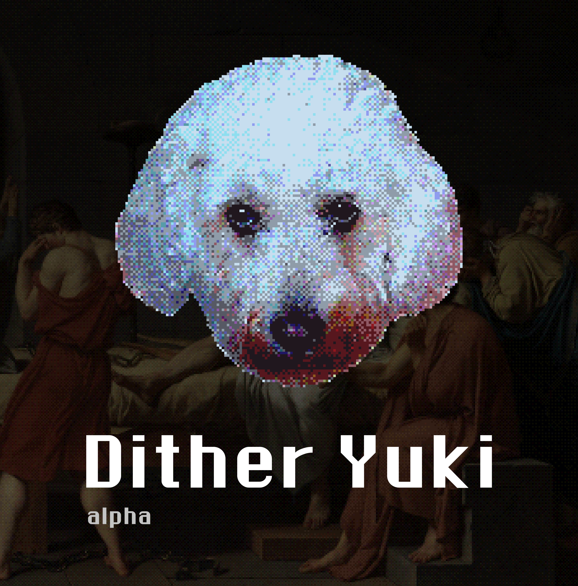

<p align="center">
  
</p>

<h1 align="center">Dither Yuki</h1>

<p align="center">
  Desktop studio for dithering, palettes, and layered pixel-art images.<br />
  Public <strong>alpha</strong> · macOS &amp; Windows
</p>

<p align="center">
  <a href="https://github.com/edrdavid1/dith-yuki/releases/latest"><strong>Download</strong></a>
  ·
  <a href="https://edrdavid1.github.io/dith-yuki/">Download page</a>
  ·
  <a href="https://github.com/edrdavid1/dith-yuki/issues/new?template=bug_report.yml">Report a bug</a>
</p>

---

## What it is

A focused **dither / palette studio** — not a paint app, not a print pipeline.

- Ordered dithering (Bayer, halftone, custom threshold maps) and error diffusion (Floyd–Steinberg, Atkinson, and others)
- Palette quantization with Color Lab (Oklab, ramps, harmony, import ASE / GPL / …)
- Palette dither modes: Strict, Guided, Mixed, Simple
- Non-destructive layers, blend modes, undo / redo
- Projects (`.dyproj`) and shareable patterns (`.dyuki`)
- Dockable panels (Layers, Effect, Color Lab, Preview)
- In-app updates from GitHub Releases (from 0.2.0)

Tile-based preview keeps large documents responsive.

### Alpha scope

No paint tools, ICC / print pipeline, or video / batch export. Linux is not a supported platform.

**UI:** Layers, Effect, Color Lab, and Preview use FlexLayout docking; Preferences remains a dialog.

**Performance (honest):**
- GPU auto-dispatch accelerates warm-viewport pattern dithering and some palette modes. Error Diffusion always runs on CPU; far from the document origin it stays sequential (wavefront fill).
- Riemersma, ASCII, and similar full-document algorithms do not progressive-tile the preview — they show a “Rendering…” state until the whole pass finishes.
- An adaptive RAM tile-cache budget is in the build; it is **not** proven as a 4K/8K fix yet (diagnostics incomplete).

**Platforms:** macOS is the primary QA surface. Windows ships and is usable, but newer and less battle-tested — please file bugs. Alpha DMGs are self-signed (Gatekeeper → Open Anyway) unless Apple Developer ID notarization secrets are present in CI.

### Install

1. Get the latest build from [Releases](https://github.com/edrdavid1/dith-yuki/releases/latest) (macOS DMG, Windows NSIS) or the [download page](https://edrdavid1.github.io/dith-yuki/).
2. After **0.2.0**, use **Help → Check for Updates** (Minisign-verified).

#### macOS Gatekeeper

Alpha DMGs are **self-signed** as **L'eco non di Bergamo** (not Apple Developer ID):

1. Install from the DMG, then **double-click** the app once (macOS blocks it).
2. **System Settings → Privacy & Security** → scroll down → **Open Anyway**.
3. Confirm **Open**.

When Developer ID notarization is wired in CI, this step goes away.

### Feedback

Use the [bug report template](https://github.com/edrdavid1/dith-yuki/issues/new?template=bug_report.yml) — include OS, app version, and steps to reproduce.

---

## For developers

Built with **Rust** (Tauri 2) and **React**. Source is under the L'eco non di Bergamo Software License — see [LICENSE](./LICENSE). The desktop app is governed by [docs/legal/USER_AGREEMENT.txt](./docs/legal/USER_AGREEMENT.txt).

### Run from source

- Rust (stable) via [rustup](https://rustup.rs/)
- Node.js 18+
- macOS 10.15+, Windows 10+, or a recent Linux distro with WebKitGTK (Tauri)

```bash
git clone https://github.com/edrdavid1/dith-yuki.git
cd dith-yuki
npm run setup
npm run tauri:dev
```

Production bundle: `npm run tauri:build` → artifacts under `src-tauri/target/release/bundle/`.

GPU env (no Preferences toggle): `DITHER_GPU_PREVIEW=1` (cold compute), `DITHER_FORCE_CPU=1`. Optional RAM tile-cache override: `DITHER_RAM_BUDGET_MIB`.

### Checks

```bash
npm run tauri:dev          # Vite + Tauri
cargo test --all           # Rust tests
npm test --prefix frontend # Vitest
cargo fmt --all
cargo clippy --all -- -D warnings
npm run release:verify     # updater config + latest.json smoke
```

### Layout

```
src-tauri/     # Tauri app: IPC, workers, tile://, menus, panels
crates/        # engines (project, tiles, color, gpu, io)
frontend/      # React + Redux Toolkit UI
site/          # public download landing (GitHub Pages)
docs/          # as-built architecture & developer guides
```

### Documentation

Start with [docs/README.md](./docs/README.md) (index). Day-to-day: [Dev setup](./docs/dev-setup.md) · [Release](./docs/RELEASE.md) · [Architecture](./docs/architecture.md) · [Crash recovery](./docs/crash-recovery.md).

---

Copyright © 2026 L'eco non di Bergamo.
